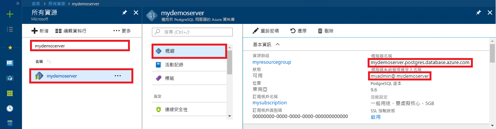

# <a name="azure-database-for-postgresql-use-net-c-to-connect-and-query-data"></a>適用於 PostgreSQL 的 Azure 資料庫：使用 .NET (C#) 連線並查詢資料
本快速入門示範如何使用 C# 應用程式來連線到 Azure Database for PostgreSQL。 它會顯示如何使用 SQL 陳述式來查詢、插入、更新和刪除資料庫中的資料。 本文中的步驟假設您已熟悉使用 C# 進行開發，但不熟悉 Azure Database for PostgreSQL。

## <a name="prerequisites"></a>必要條件
本快速入門使用在以下任一指南中建立的資源作為起點︰
- [建立 DB - 入口網站](quickstart-create-server-database-portal.md)
- [建立 DB - CLI](quickstart-create-server-database-azure-cli.md)

您也需要：
- 安裝 [.NET Framework](https://www.microsoft.com/net/download)。 請依照連結文章中的步驟，特別為您的平台 (Windows、Ubuntu Linux 或 macOS) 安裝 .NET。 
- 安裝 [Visual Studio](https://www.visualstudio.com/downloads/) 或 Visual Studio Code 以輸入及編輯程式碼。
- 將參考新增至 [Npgsql](https://www.nuget.org/packages/Npgsql/) Nuget 套件。

## <a name="get-connection-information"></a>取得連線資訊
取得連線到 Azure Database for PostgreSQL 所需的連線資訊。 您需要完整的伺服器名稱和登入認證。

1. 登入 [Azure 入口網站](https://portal.azure.com/)。
2. 從 Azure 入口網站的左側功能表中，按一下 [所有資源]，然後搜尋您所建立的伺服器 (例如 **mydemoserver**)。
3. 按一下伺服器名稱。
4. 從伺服器的 [概觀] 面板，記下 [伺服器名稱] 和 [伺服器管理員登入名稱]。 如果您忘記密碼，您也可以從此面板重設密碼。
 

## <a name="connect-create-table-and-insert-data"></a>連線、建立資料表及插入資料
使用下列程式碼搭配 **CREATE TABLE** 和 **INSERT INTO** SQL 陳述式來連線和載入資料。 此程式碼使用 NpgsqlCommand 類別搭配 [Open()](https://www.npgsql.org/doc/api/Npgsql.NpgsqlConnection.html#Npgsql_NpgsqlConnection_Open) 方法來對 PostgreSQL 資料庫建立連線。 然後，程式碼會使用 [CreateCommand()](https://www.npgsql.org/doc/api/Npgsql.NpgsqlConnection.html#Npgsql_NpgsqlConnection_CreateCommand) 方法，設定 CommandText 屬性，並呼叫 [ExecuteNonQuery()](https://www.npgsql.org/doc/api/Npgsql.NpgsqlCommand.html#Npgsql_NpgsqlCommand_ExecuteNonQuery) 方法來執行資料庫命令。 

以建立伺服器和資料庫時所指定的值，取代主機、資料庫名稱、使用者和密碼參數。 

```csharp
using System;
using Npgsql;

namespace Driver
{
    public class AzurePostgresCreate
    {
        // Obtain connection string information from the portal
        //
        private static string Host = "mydemoserver.postgres.database.azure.com";
        private static string User = "mylogin@mydemoserver";
        private static string DBname = "mypgsqldb";
        private static string Password = "<server_admin_password>";
        private static string Port = "5432";

        static void Main(string[] args)
        {
            // Build connection string using parameters from portal
            //
            string connString =
                String.Format(
                    "Server={0};Username={1};Database={2};Port={3};Password={4};SSLMode=Prefer",
                    Host,
                    User,
                    DBname,
                    Port,
                    Password);


            using (var conn = new NpgsqlConnection(connString))

            {
                Console.Out.WriteLine("Opening connection");
                conn.Open();

                using (var command = new NpgsqlCommand("DROP TABLE IF EXISTS inventory", conn))
                { 
                    command.ExecuteNonQuery();
                    Console.Out.WriteLine("Finished dropping table (if existed)");

                }

                using (var command = new NpgsqlCommand("CREATE TABLE inventory(id serial PRIMARY KEY, name VARCHAR(50), quantity INTEGER)", conn))
                {
                    command.ExecuteNonQuery();
                    Console.Out.WriteLine("Finished creating table");
                }

                using (var command = new NpgsqlCommand("INSERT INTO inventory (name, quantity) VALUES (@n1, @q1), (@n2, @q2), (@n3, @q3)", conn))
                {
                    command.Parameters.AddWithValue("n1", "banana");
                    command.Parameters.AddWithValue("q1", 150);
                    command.Parameters.AddWithValue("n2", "orange");
                    command.Parameters.AddWithValue("q2", 154);
                    command.Parameters.AddWithValue("n3", "apple");
                    command.Parameters.AddWithValue("q3", 100);
                    
                    int nRows = command.ExecuteNonQuery();
                    Console.Out.WriteLine(String.Format("Number of rows inserted={0}", nRows));
                }
            }

            Console.WriteLine("Press RETURN to exit");
            Console.ReadLine();
        }
    }
}
```

## <a name="read-data"></a>讀取資料
使用下列程式碼搭配 **SELECT** SQL 陳述式來連線和讀取資料。 此程式碼使用 NpgsqlCommand 類別搭配 [Open()](https://www.npgsql.org/doc/api/Npgsql.NpgsqlConnection.html#Npgsql_NpgsqlConnection_Open) 方法來建立 PostgreSQL 連線。 然後，程式碼會使用 [CreateCommand()](https://www.npgsql.org/doc/api/Npgsql.NpgsqlConnection.html#Npgsql_NpgsqlConnection_CreateCommand) 和 [ExecuteReader()](https://www.npgsql.org/doc/api/Npgsql.NpgsqlCommand.html#Npgsql_NpgsqlCommand_ExecuteReader) 來執行資料庫命令。 接下來程式碼會使用 [Read()](https://www.npgsql.org/doc/api/Npgsql.NpgsqlDataReader.html#Npgsql_NpgsqlDataReader_Read) 前往結果中的記錄。 最後，程式碼會使用 [GetInt32()](https://www.npgsql.org/doc/api/Npgsql.NpgsqlDataReader.html#Npgsql_NpgsqlDataReader_GetInt32_System_Int32_) 和 [GetString()](https://www.npgsql.org/doc/api/Npgsql.NpgsqlDataReader.html#Npgsql_NpgsqlDataReader_GetString_System_Int32_) 來剖析記錄中的值。

以建立伺服器和資料庫時所指定的值，取代主機、資料庫名稱、使用者和密碼參數。 

```csharp
using System;
using Npgsql;

namespace Driver
{
    public class AzurePostgresRead
    {
        // Obtain connection string information from the portal
        //
        private static string Host = "mydemoserver.postgres.database.azure.com";
        private static string User = "mylogin@mydemoserver";
        private static string DBname = "mypgsqldb";
        private static string Password = "<server_admin_password>";
        private static string Port = "5432";

        static void Main(string[] args)
        {
            // Build connection string using parameters from portal
            //
            string connString =
                String.Format(
                    "Server={0}; User Id={1}; Database={2}; Port={3}; Password={4};SSLMode=Prefer",
                    Host,
                    User,
                    DBname,
                    Port,
                    Password);

            using (var conn = new NpgsqlConnection(connString))
            {

                Console.Out.WriteLine("Opening connection");
                conn.Open();


                using (var command = new NpgsqlCommand("SELECT * FROM inventory", conn))
                {

                    var reader = command.ExecuteReader();
                    while (reader.Read())
                    {
                        Console.WriteLine(
                            string.Format(
                                "Reading from table=({0}, {1}, {2})",
                                reader.GetInt32(0).ToString(),
                                reader.GetString(1),
                                reader.GetInt32(2).ToString()
                                )
                            );
                    }
                }
            }

            Console.WriteLine("Press RETURN to exit");
            Console.ReadLine();
        }
    }
}
```


## <a name="update-data"></a>更新資料
使用下列程式碼搭配 **UPDATE** SQL 陳述式來連線和更新資料。 此程式碼使用 NpgsqlCommand 類別搭配 [Open()](https://www.npgsql.org/doc/api/Npgsql.NpgsqlConnection.html#Npgsql_NpgsqlConnection_Open) 方法來建立 PostgreSQL 連線。 然後，程式碼會使用 [CreateCommand()](https://www.npgsql.org/doc/api/Npgsql.NpgsqlConnection.html#Npgsql_NpgsqlConnection_CreateCommand) 方法，設定 CommandText 屬性，並呼叫 [ExecuteNonQuery()](https://www.npgsql.org/doc/api/Npgsql.NpgsqlCommand.html#Npgsql_NpgsqlCommand_ExecuteNonQuery) 方法來執行資料庫命令。

以建立伺服器和資料庫時所指定的值，取代主機、資料庫名稱、使用者和密碼參數。 

```csharp
using System;
using Npgsql;

namespace Driver
{
    public class AzurePostgresUpdate
    {
        // Obtain connection string information from the portal
        //
        private static string Host = "mydemoserver.postgres.database.azure.com";
        private static string User = "mylogin@mydemoserver";
        private static string DBname = "mypgsqldb";
        private static string Password = "<server_admin_password>";
        private static string Port = "5432";

        static void Main(string[] args)
        {
            // Build connection string using parameters from portal
            //
            string connString =
                String.Format(
                    "Server={0}; User Id={1}; Database={2}; Port={3}; Password={4};SSLMode=Prefer",
                    Host,
                    User,
                    DBname,
                    Port,
                    Password);

            using (var conn = new NpgsqlConnection(connString))
            {

                Console.Out.WriteLine("Opening connection");
                conn.Open();

                using (var command = new NpgsqlCommand("UPDATE inventory SET quantity = @q WHERE name = @n", conn))
                {
                    command.Parameters.AddWithValue("n", "banana");
                    command.Parameters.AddWithValue("q", 200);
                    
                    int nRows = command.ExecuteNonQuery();
                    Console.Out.WriteLine(String.Format("Number of rows updated={0}", nRows));
                }
            }

            Console.WriteLine("Press RETURN to exit");
            Console.ReadLine();
        }
    }
}


```


## <a name="delete-data"></a>刪除資料
使用下列程式碼搭配 **DELETE** SQL 陳述式來連線和刪除資料。 

此程式碼使用 NpgsqlCommand 類別搭配 [Open()](https://www.npgsql.org/doc/api/Npgsql.NpgsqlConnection.html#Npgsql_NpgsqlConnection_Open) 方法來對 PostgreSQL 資料庫建立連線。 然後，程式碼會使用 [CreateCommand()](https://www.npgsql.org/doc/api/Npgsql.NpgsqlConnection.html#Npgsql_NpgsqlConnection_CreateCommand) 方法，設定 CommandText 屬性，並呼叫 [ExecuteNonQuery()](https://www.npgsql.org/doc/api/Npgsql.NpgsqlCommand.html#Npgsql_NpgsqlCommand_ExecuteNonQuery) 方法來執行資料庫命令。

以建立伺服器和資料庫時所指定的值，取代主機、資料庫名稱、使用者和密碼參數。 

```csharp
using System;
using Npgsql;

namespace Driver
{
    public class AzurePostgresDelete
    {
        // Obtain connection string information from the portal
        //
        private static string Host = "mydemoserver.postgres.database.azure.com";
        private static string User = "mylogin@mydemoserver";
        private static string DBname = "mypgsqldb";
        private static string Password = "<server_admin_password>";
        private static string Port = "5432";

        static void Main(string[] args)
        {
            // Build connection string using parameters from portal
            //
            string connString =
                String.Format(
                    "Server={0}; User Id={1}; Database={2}; Port={3}; Password={4};SSLMode=Prefer",
                    Host,
                    User,
                    DBname,
                    Port,
                    Password);

            using (var conn = new NpgsqlConnection(connString))
            {
                Console.Out.WriteLine("Opening connection");
                conn.Open();

                using (var command = new NpgsqlCommand("DELETE FROM inventory WHERE name = @n", conn))
                {
                    command.Parameters.AddWithValue("n", "orange");

                    int nRows = command.ExecuteNonQuery();
                    Console.Out.WriteLine(String.Format("Number of rows deleted={0}", nRows));
                }
            }

            Console.WriteLine("Press RETURN to exit");
            Console.ReadLine();
        }
    }
}

```

## <a name="next-steps"></a>後續步驟
> [!div class="nextstepaction"]
> [使用匯出和匯入來移轉資料庫](./howto-migrate-using-export-and-import.md)
