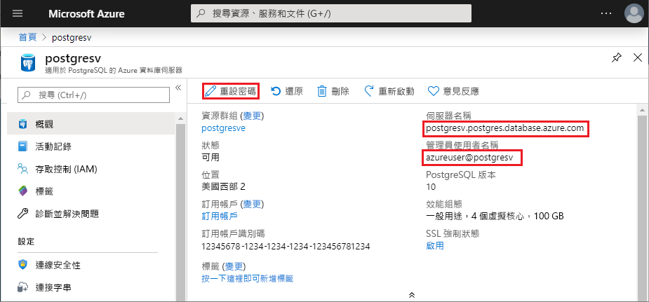

# <a name="use-python-to-connect-and-query-data-in-azure-database-for-postgresql---single-server"></a>使用 Python 來連線和查詢適用於 PostgreSQL 的 Azure 資料庫中的資料 - 單一伺服器
本快速入門示範如何在 macOS、Ubuntu Linux 或 Windows 上搭配 Python 來使用適用於 PostgreSQL 的 Azure 資料庫。 快速入門會說明如何連線到資料庫，以及如何使用 SQL 陳述式來查詢、插入、更新和刪除資料。 本文假設您已熟悉 Python，但還不熟悉適用於 PostgreSQL 的 Azure 資料庫。

## <a name="prerequisites"></a>必要條件
- 適用於 PostgreSQL 的 Azure 資料庫 - 單一伺服器，可透過下列文件中的步驟建立：[快速入門：在 Azure 入口網站中建立適用於 PostgreSQL 的 Azure 資料庫伺服器](quickstart-create-server-database-portal.md)或[快速入門：使用 Azure CLI 建立適用於 PostgreSQL 的 Azure 資料庫](quickstart-create-server-database-azure-cli.md)。 
  
- [Python](https://www.python.org/downloads/) 2.7.9+ 或 3.4+。
  
- [pip](https://pip.pypa.io/en/stable/installing/) 套件安裝程式的最新更新，可使用 `pip install -U pip` 安裝。 

## <a name="install-the-python-libraries-for-postgresql"></a>安裝適用於 PostgreSQL 的 Python =程式庫
[psycopg2](https://pypi.python.org/pypi/psycopg2/) 模組可讓您連線到 PostgreSQL 資料庫並進行查詢，而且可作為 Linux、macOS 或 Windows 的 [Wheel](https://pythonwheels.com/) 套件提供。 安裝模組的二進位版本 (包括所有相依性)。 如需有關 `psycopg2` 安裝和需求的詳細資訊，請參閱[安裝](http://initd.org/psycopg/docs/install.html)。 

若要安裝 `psycopg2`，請開啟終端機或命令提示字元，然後執行 `pip install psycopg2` 命令。

## <a name="get-database-connection-information"></a>取得資料庫連線資訊
連線到適用於 PostgreSQL 的 Azure 資料庫需要完整的伺服器名稱和登入認證。 您可以從 Azure 入口網站中取得此資訊。

1. 在 [Azure 入口網站](https://portal.azure.com/)中，搜尋並選取適用於 PostgreSQL 的 Azure 資料庫伺服器名稱。 
1. 在伺服器的 [概觀]  頁面上，複製完整的**伺服器名稱**和**管理使用者名稱**。 完整**伺服器名稱**的格式一律為 *\<my-server-name>.postgres.database.azure.com*，而**管理使用者名稱**的格式一律為 *\<my-admin-username>@\<my-server-name>* 。 
   
   也需要您的管理員密碼。 如果您忘記密碼，可以在此頁面中重設密碼。 
   
   

## <a name="how-to-run-the-python-examples"></a>如何執行 Python 範例

針對本文中的每個程式碼範例：

1. 在文字編輯器中建立新的檔案。 
   
1. 將程式碼範例新增至檔案。 在程式碼中，取代下列內容：
   - 將 `<server-name>` 和 `<admin-username>` 取代為您從 Azure 入口網站中複製的值。
   - 將 `<admin-password>` 取代為伺服器密碼。
   - 將 `<database-name>` 取代為「適用於 PostgreSQL 的 Azure 資料庫」的名稱。 當您建立伺服器時，系統已自動建立名為 postgres  的預設資料庫。 您可以使用 SQL 命令來重新命名該資料庫或建立新的資料庫。 
   
1. 使用 .py  作為副檔名，將檔案儲存在您的專案資料夾中，例如 postgres-insert.py  。 針對 Windows，請務必在儲存檔案時選取 UTF-8 編碼。 
   
1. 若要執行檔案，請在命令列介面中變更為您的專案資料夾，然後輸入 `python`，並在後方接著檔案名稱，例如 `python postgres-insert.py`。

## <a name="create-a-table-and-insert-data"></a>建立資料表及插入資料
下列程式碼範例會使用 [psycopg2.connect](http://initd.org/psycopg/docs/connection.html) 函式來連線到適用於 PostgreSQL 的 Azure 資料庫，並使用 SQL **INSERT** 語句來載入資料。 [cursor.execute](http://initd.org/psycopg/docs/cursor.html#execute) 函式會針對資料庫執行 SQL 查詢。 

```Python
import psycopg2

# Update connection string information 
host = "<server-name>"
dbname = "<database-name>"
user = "<admin-username>"
password = "<admin-password>"
sslmode = "require"

# Construct connection string
conn_string = "host={0} user={1} dbname={2} password={3} sslmode={4}".format(host, user, dbname, password, sslmode)
conn = psycopg2.connect(conn_string) 
print("Connection established")

cursor = conn.cursor()

# Drop previous table of same name if one exists
cursor.execute("DROP TABLE IF EXISTS inventory;")
print("Finished dropping table (if existed)")

# Create a table
cursor.execute("CREATE TABLE inventory (id serial PRIMARY KEY, name VARCHAR(50), quantity INTEGER);")
print("Finished creating table")

# Insert some data into the table
cursor.execute("INSERT INTO inventory (name, quantity) VALUES (%s, %s);", ("banana", 150))
cursor.execute("INSERT INTO inventory (name, quantity) VALUES (%s, %s);", ("orange", 154))
cursor.execute("INSERT INTO inventory (name, quantity) VALUES (%s, %s);", ("apple", 100))
print("Inserted 3 rows of data")

# Clean up
conn.commit()
cursor.close()
conn.close()
```

程式碼會在成功執行後產生下列輸出：


## <a name="read-data"></a>讀取資料
下列程式碼範例會連線到適用於 PostgreSQL 的 Azure 資料庫，並使用 [cursor.execute](http://initd.org/psycopg/docs/cursor.html#execute) 搭配 SQL **SELECT** 陳述式來讀取資料。 此函式會接受查詢並使用 [cursor.fetchall()](http://initd.org/psycopg/docs/cursor.html#cursor.fetchall) 傳回用於反覆查詢的結果集。 

```Python
import psycopg2

# Update connection string information
host = "<server-name>"
dbname = "<database-name>"
user = "<admin-username>"
password = "<admin-password>"
sslmode = "require"

# Construct connection string
conn_string = "host={0} user={1} dbname={2} password={3} sslmode={4}".format(host, user, dbname, password, sslmode)
conn = psycopg2.connect(conn_string) 
print("Connection established")

cursor = conn.cursor()

# Fetch all rows from table
cursor.execute("SELECT * FROM inventory;")
rows = cursor.fetchall()

# Print all rows
for row in rows:
    print("Data row = (%s, %s, %s)" %(str(row[0]), str(row[1]), str(row[2])))

# Cleanup
conn.commit()
cursor.close()
conn.close()
```

## <a name="update-data"></a>更新資料
下列程式碼範例會連線到適用於 PostgreSQL 的 Azure 資料庫，並使用 [cursor.execute](http://initd.org/psycopg/docs/cursor.html#execute) 搭配 SQL **UPDATE** 陳述式來更新資料。 

```Python
import psycopg2

# Update connection string information
host = "<server-name>"
dbname = "<database-name>"
user = "<admin-username>"
password = "<admin-password>"
sslmode = "require"

# Construct connection string
conn_string = "host={0} user={1} dbname={2} password={3} sslmode={4}".format(host, user, dbname, password, sslmode)
conn = psycopg2.connect(conn_string) 
print("Connection established")

cursor = conn.cursor()

# Update a data row in the table
cursor.execute("UPDATE inventory SET quantity = %s WHERE name = %s;", (200, "banana"))
print("Updated 1 row of data")

# Cleanup
conn.commit()
cursor.close()
conn.close()
```

## <a name="delete-data"></a>刪除資料
下列程式碼範例會連線到適用於 PostgreSQL 的 Azure 資料庫，並使用 [cursor.execute](http://initd.org/psycopg/docs/cursor.html#execute) 搭配 SQL **DELETE** 陳述式來刪除您先前插入的清查項目。 

```Python
import psycopg2

# Update connection string information
host = "<server-name>"
dbname = "<database-name>"
user = "<admin-username>"
password = "<admin-password>"
sslmode = "require"

# Construct connection string
conn_string = "host={0} user={1} dbname={2} password={3} sslmode={4}".format(host, user, dbname, password, sslmode)
conn = psycopg2.connect(conn_string) 
print("Connection established")

cursor = conn.cursor()

# Delete data row from table
cursor.execute("DELETE FROM inventory WHERE name = %s;", ("orange",))
print("Deleted 1 row of data")

# Cleanup
conn.commit()
cursor.close()
conn.close()
```

## <a name="next-steps"></a>後續步驟
> [!div class="nextstepaction"]
> [使用匯出和匯入來移轉資料庫](./howto-migrate-using-export-and-import.md)
