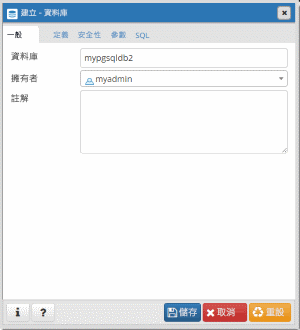

# <a name="quickstart-create-an-azure-database-for-postgresql-using-the-azure-cli"></a>快速入門：使用 Azure CLI 建立適用於 PostgreSQL 的 Azure 資料庫
「適用於 PostgreSQL 的 Azure 資料庫」是一個受控服務，可讓您在雲端執行、管理及調整高可用性 PostgreSQL 資料庫。 Azure CLI 可用來從命令列或在指令碼中建立和管理 Azure 資源。 本快速入門說明如何使用 Azure CLI 在 [Azure 資源群組](https://docs.microsoft.com/azure/azure-resource-manager/resource-group-overview)中建立 Azure Database for PostgreSQL 伺服器。

如果您沒有 Azure 訂用帳戶，請在開始前建立[免費帳戶](https://azure.microsoft.com/free/) 。

[!INCLUDE [cloud-shell-try-it](../../includes/cloud-shell-try-it.md)]

如果您選擇在本機安裝和使用 CLI，本文會要求您執行 Azure CLI 2.0 版或更新版本。 若要查看所安裝的版本，請執行 `az --version` 命令。 如果您需要安裝或升級，請參閱[安裝 Azure CLI 2.0]( /cli/azure/install-azure-cli)。 

若您在本機上執行 CLI，則需要使用 [az login](/cli/azure/authenticate-azure-cli?view=interactive-log-in) 命令登入您的帳戶。 請記下命令輸出中的**識別碼**屬性，以取得對應的訂用帳戶名稱。
```azurecli-interactive
az login
```

如果您有多個訂用帳戶，請選擇資源計費的適當訂用帳戶。 使用 [az account set](/cli/azure/account#az_account_set) 命令來選取您帳戶底下的特定訂用帳戶 ID。 以訂用帳戶之 **az login** 輸出中的**識別碼**屬性，替代訂用帳戶識別碼的預留位置。
```azurecli-interactive
az account set --subscription <subscription id>
```

## <a name="create-a-resource-group"></a>建立資源群組

使用 [az group create](../azure-resource-manager/resource-group-overview.md) 命令建立 [Azure 資源群組](/cli/azure/group#az_group_create)。 資源群組是在其中以群組方式部署與管理 Azure 資源的邏輯容器。 請提供唯一的名稱。 下列範例會在 `westus` 位置建立名為 `myresourcegroup` 的資源群組。
```azurecli-interactive
az group create --name myresourcegroup --location westus
```
## <a name="add-the-extension"></a>新增延伸模組
使用下列命令，新增已更新的適用於 PostgreSQL 的 Azure 資料庫管理擴充功能：
```azurecli-interactive
az extension add --name rdbms
``` 

檢查您是否已安裝正確的擴充功能版本。 
```azurecli-interactive
az extension list
```

傳回 JSON 應該包括下列項目： 
```json
{
    "extensionType": "whl",
    "name": "rdbms",
    "version": "0.0.4"
}
```

如果未傳回 0.0.4 版，請執行下列命令來更新擴充功能： 
```azurecli-interactive
az extension update --name rdbms
```

## <a name="create-an-azure-database-for-postgresql-server"></a>建立適用於 PostgreSQL 的 Azure 資料庫伺服器

使用 [az postgres server create](/cli/azure/postgres/server#az_postgres_server_create) 命令來建立[適用於 PostgreSQL 的 Azure 資料庫伺服器](overview.md)。 一個伺服器會包含一組以群組方式管理的資料庫。 

下列範例會使用伺服器管理員登入 `myadmin` 在 `myresourcegroup` 資源群組中建立名為 `mydemoserver` 的伺服器 (位於美國西部)。 這是**第 4 代****一般用途**伺服器，其具有 2 個**虛擬核心**。 伺服器的名稱會對應至 DNS 名稱，因此必須是 Azure 中全域唯一的。 將 `<server_admin_password>` 替換成您自己的值。
```azurecli-interactive
az postgres server create --resource-group myresourcegroup --name mydemoserver  --location westus --admin-user myadmin --admin-password <server_admin_password> --sku-name GP_Gen4_2 --version 9.6
```

> [!IMPORTANT]
> 必須要有您在此處指定的伺服器系統管理員登入和密碼，稍後在本快速入門中才能登入伺服器及其資料庫。 請記住或記錄此資訊，以供稍後使用。

根據預設，**postgres** 資料庫會建立在您的伺服器底下。 [postgres](https://www.postgresql.org/docs/9.6/static/app-initdb.html) 資料庫是要供使用者、公用程式及第三方應用程式使用的預設資料庫。 


## <a name="configure-a-server-level-firewall-rule"></a>設定伺服器層級防火牆規則

使用 [az postgres server firewall-rule create](/cli/azure/postgres/server/firewall-rule#az_postgres_server_firewall_rule_create) 命令來建立 Azure PostgreSQL 伺服器層級防火牆規則。 伺服器層級防火牆規則可允許外部應用程式 (例如 [psql](https://www.postgresql.org/docs/9.2/static/app-psql.html) 或 [PgAdmin](https://www.pgadmin.org/)) 穿過 Azure PostgreSQL 服務防火牆連線到您的伺服器。 

您可以設定一個防火牆規則，來涵蓋能夠從您網路連線的 IP 範圍。 下列範例使用 [az postgres server firewall-rule create](/cli/azure/postgres/server/firewall-rule#az_postgres_server_firewall_rule_create) 來建立某個 IP 位址範圍的防火牆規則 `AllowAllIps`。 若要開啟所有 IP 位址，請使用 0.0.0.0 作為起始 IP 位址，並使用 255.255.255.255 作為結束位址。
```azurecli-interactive
az postgres server firewall-rule create --resource-group myresourcegroup --server mydemoserver --name AllowAllIps --start-ip-address 0.0.0.0 --end-ip-address 255.255.255.255
```

> [!NOTE]
> Azure PostgreSQL 伺服器會透過連接埠 5432 進行通訊。 當您從公司網路內進行連線時，網路的防火牆可能不允許透過連接埠 5432 的輸出流量。 請要求您的 IT 部門開啟連接埠 5432，以連線至 Azure PostgreSQL 伺服器。

## <a name="get-the-connection-information"></a>取得連線資訊

若要連線到您的伺服器，您必須提供主機資訊和存取認證。
```azurecli-interactive
az postgres server show --resource-group myresourcegroup --name mydemoserver
```

結果會採用 JSON 格式。 請記下 **administratorLogin** 和 **fullyQualifiedDomainName**。
```json
{
  "administratorLogin": "myadmin",
  "earliestRestoreDate": null,
  "fullyQualifiedDomainName": "mydemoserver.postgres.database.azure.com",
  "id": "/subscriptions/00000000-0000-0000-0000-000000000000/resourceGroups/myresourcegroup/providers/Microsoft.DBforPostgreSQL/servers/mydemoserver",
  "location": "westus",
  "name": "mydemoserver",
  "resourceGroup": "myresourcegroup",
  "sku": {
    "capacity": 2,
    "family": "Gen4",
    "name": "GP_Gen4_2",
    "size": null,
    "tier": "GeneralPurpose"
  },
  "sslEnforcement": "Enabled",
  "storageProfile": {
    "backupRetentionDays": 7,
    "geoRedundantBackup": "Disabled",
    "storageMb": 5120
  },
  "tags": null,
  "type": "Microsoft.DBforPostgreSQL/servers",
  "userVisibleState": "Ready",
  "version": "9.6"
}
```

## <a name="connect-to-postgresql-database-using-psql"></a>使用 psql 連線到 PostgreSQL 資料庫

如果您的用戶端電腦已安裝 PostgreSQL，您可以使用 [psql](https://www.postgresql.org/docs/9.6/static/app-psql.html) 的本機執行個體來連線到 Azure PostgreSQL 伺服器。 現在我們將使用 psql 命令列公用程式來連線到 Azure PostgreSQL 伺服器。

1. 執行下列 psql 命令以連線到「適用於 PostgreSQL 的 Azure 資料庫」伺服器
```azurecli-interactive
psql --host=<servername> --port=<port> --username=<user@servername> --dbname=<dbname>
```

  例如，下列命令會使用存取認證，連線到 PostgreSQL 伺服器 **mydemoserver.postgres.database.azure.com** 上名為 **postgres** 的預設資料庫。 系統提示輸入密碼時，請輸入您選擇的 `<server_admin_password>`。
  
  ```azurecli-interactive
psql --host=mydemoserver.postgres.database.azure.com --port=5432 --username=myadmin@mydemoserver --dbname=postgres
```

2.  連線到伺服器後，請在提示字元建立空白資料庫。
```sql
CREATE DATABASE mypgsqldb;
```

3.  在提示字元，執行下列命令以將連線切換到新建立的資料庫 **mypgsqldb**：
```sql
\c mypgsqldb
```

## <a name="connect-to-the-postgresql-server-using-pgadmin"></a>使用 pgAdmin 連線到 PostgreSQL 伺服器

pgAdmin 是搭配 PostgreSQL 使用的開放原始碼工具。 您可以從 [pgAdmin 網站](http://www.pgadmin.org/)安裝 pgAdmin。 您使用的 pgAdmin 版本可能不同於本快速入門中使用的版本。 如果您需要其他指引，請閱讀 pgAdmin 文件。

1. 在您的用戶端電腦上開啟 pgAdmin 應用程式。

2. 移至工具列中的 [物件]，將滑鼠停留在 [建立] 上方，然後選取 [伺服器]。

3. 在 [建立 - 伺服器] 對話方塊的 [一般] 索引標籤上，輸入伺服器的唯一易記名稱，例如 **mydemoserver**。

   ![[一般] 索引標籤](./media/quickstart-create-server-database-azure-cli/9-pgadmin-create-server.png)

4. 在 [建立 - 伺服器] 對話方塊的 [連線] 索引標籤上，填寫設定資料表。

   ![[連線] 索引標籤](./media/quickstart-create-server-database-azure-cli/10-pgadmin-create-server.png)

    pgAdmin 參數 |值|說明
    ---|---|---
    主機名稱/位址 | 伺服器名稱 | 您稍早建立 Azure Database for PostgreSQL 伺服器時所用的伺服器名稱值。 我們的範例伺服器是 **mydemoserver.postgres.database.azure.com**。使用如範例所示的完整網域名稱 (**\*.postgres.database.azure.com**)。 如果您不記得您的伺服器名稱，請依照上一節中的步驟執行，以取得連線資訊。 
    Port | 5432 | 當您連線至 Azure Database for PostgreSQL 伺服器時所要使用的連接埠。 
    維護資料庫 | *postgres* | 系統產生的預設資料庫名稱。
    使用者名稱 | 伺服器管理員登入名稱 | 您稍早建立 Azure Database for PostgreSQL 時所提供的伺服器管理員登入使用者名稱。 如果您不記得使用者名稱，請依照上一節中的步驟執行，以取得連線資訊。 格式為 *username@servername*。
    密碼 | 您的系統管理員密碼 | 您在本快速入門稍早建立伺服器時所選擇的密碼。
    角色 | 保留空白 | 此時不需要提供角色名稱。 將欄位保留空白。
    SSL 模式 | *必要* | 您可以在 pgAdmin 的 [SSL] 索引標籤中設定 SSL 模式。根據預設，所有適用於 PostgreSQL 的 Azure 資料庫伺服器建立時都會開啟強制執行 SSL。 若要關閉強制執行 SSL，請參閱[強制執行 SSL](./concepts-ssl-connection-security.md)。
    
5. 選取 [ **儲存**]。

6. 在左側的 [瀏覽器] 窗格中，展開 [伺服器] 節點。 選取您的伺服器，例如 **mydemoserver**。 按一下以連線到它。

7. 展開伺服器節點，然後展開其下的 [資料庫]。 此清單應包含現有 postgres 資料庫和其他您已建立的資料庫。 您可以使用適用於 PostgreSQL 的 Azure 資料庫，為每一部伺服器建立多個資料庫。

8. 以滑鼠右鍵按一下 [資料庫]，選擇 [建立] 功能表，然後選取 [資料庫]。

9. 在 [資料庫] 欄位中輸入您選擇的資料庫名稱，例如 **mypgsqldb2**。

10. 從清單方塊中選取資料庫的 [擁有者]。 選擇您的伺服器管理員登入名稱，例如範例中的 **my admin**。

   

11. 選取 [儲存] 以建立新的空白資料庫。

12. 在 [瀏覽器] 窗格中，您可以在伺服器名稱之下的 [資料庫] 清單中看到您所建立的資料庫。


## <a name="clean-up-resources"></a>清除資源

刪除 [Azure 資源群組](../azure-resource-manager/resource-group-overview.md)以清除您在快速入門中建立的所有資源。

> [!TIP]
> 此集合中的其他快速入門會以本快速入門為基礎。 若您打算繼續進行後續的快速入門，請勿清除在此快速入門中建立的資源。 如果您不打算繼續，請使用下列步驟，在 Azure CLI 中刪除本快速入門所建立的所有資源。

```azurecli-interactive
az group delete --name myresourcegroup
```

若您只想要刪除一個新建立的伺服器，則可執行 [az postgres server delete](/cli/azure/postgres/server#az_postgres_server_delete) 命令。
```azurecli-interactive
az postgres server delete --resource-group myresourcegroup --name mydemoserver
```

## <a name="next-steps"></a>後續步驟
> [!div class="nextstepaction"]
> [使用匯出和匯入來移轉資料庫](./howto-migrate-using-export-and-import.md)

