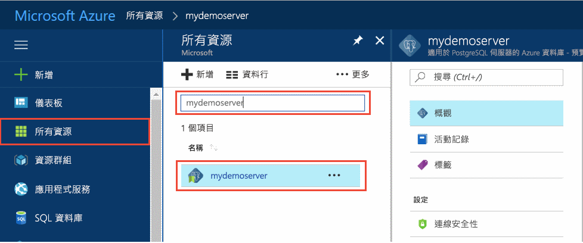
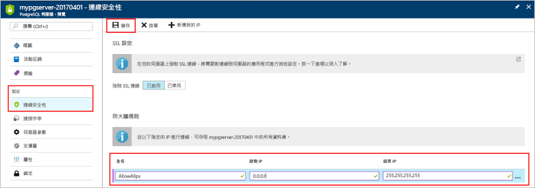
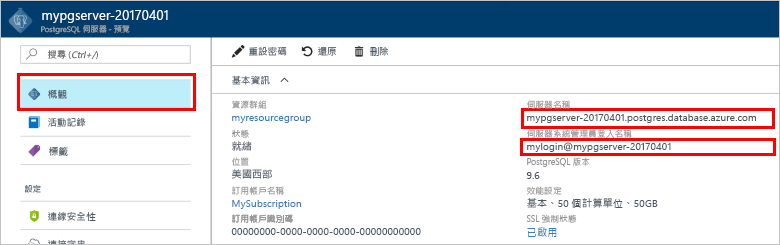
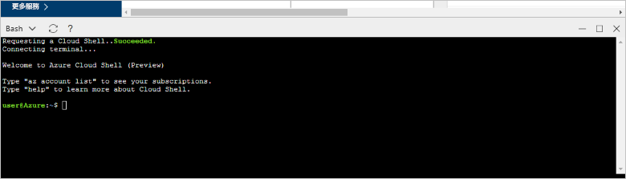

# <a name="tutorial-design-an-azure-database-for-postgresql---single-server-using-the-azure-portal"></a>教學課程：使用 Azure 入口網站設計適用於 PostgreSQL 的 Azure 資料庫 - 單一伺服器

「適用於 PostgreSQL 的 Azure 資料庫」是一個受控服務，可讓您在雲端執行、管理及調整高可用性 PostgreSQL 資料庫。 使用 Azure 入口網站，您可以輕鬆管理伺服器和設計資料庫。

在本教學課程中，您將使用 Azure 入口網站來學習如何：
> [!div class="checklist"]
> * 建立適用於 PostgreSQL 的 Azure 資料庫伺服器
> * 設定伺服器防火牆
> * 使用 [**psql**](https://www.postgresql.org/docs/9.6/static/app-psql.html) 公用程式來建立資料庫
> * 載入範例資料
> * 查詢資料
> * 更新資料
> * 還原資料

## <a name="prerequisites"></a>必要條件
如果您沒有 Azure 訂用帳戶，請在開始前建立[免費帳戶](https://azure.microsoft.com/free/)。

## <a name="create-an-azure-database-for-postgresql"></a>建立適用於 PostgreSQL 的 Azure 資料庫

「適用於 PostgreSQL 的 Azure 資料庫」伺服器是以一組已定義的[計算和儲存體資源](./concepts-compute-unit-and-storage.md)所建立。 伺服器會建立在 [Azure 資源群組](../azure-resource-manager/resource-group-overview.md)內。

請依照下列步驟來建立「適用於 PostgreSQL 的 Azure 資料庫」伺服器：
1. 按一下 Azure 入口網站左上角的 [建立資源]。
2. 從 [新增] 頁面中選取 [資料庫]，然後從 [資料庫] 頁面中選取 [適用於 PostgreSQL 的 Azure 資料庫]。
   

3. 選取 [單一伺服器] 部署選項。

   ![選取 [適用於 PostgreSQL 的 Azure 資料庫 - 單一伺服器] 部署選項](./media/tutorial-design-database-using-azure-portal/select-deployment-option.png)

4. 在 [基本資料] 表單中填寫下列資訊：

    

    設定|建議的值|說明
    ---|---|---
    訂用帳戶|您的訂用帳戶名稱|您要用於伺服器的 Azure 訂用帳戶。 如果您有多個訂用帳戶，請選擇資源計費的訂用帳戶。
    資源群組|*myresourcegroup*| 新的資源群組名稱，或您訂用帳戶中現有的資源群組名稱。
    伺服器名稱 |*mydemoserver*|可識別 Azure Database for PostgreSQL 伺服器的唯一名稱。 網域名稱 postgres.database.azure.com 已附加至您提供的伺服器名稱。 伺服器只能包含小寫字母、數字及連字號 (-) 字元。 它必須包含至少 3 到 63 個字元。
    資料來源 | *None* | 選取 [無] 從頭建立新的伺服器。 (如果您要從現有「適用於 PostgreSQL 的 Azure 資料庫」伺服器的異地備份建立伺服器，可以選取 [備份])。
    系統管理員使用者名稱 |myadmin| 連線至伺服器時所要使用之自己的登入帳戶。 管理員登入名稱不能是 **azure_superuser**、**azure_pg_admin****admin****administrator****root****guest** 或 **public**。 它不能以 **pg_** 開頭。
    密碼 |您的密碼| 伺服器管理帳戶的新密碼。 其必須包含 8 到 128 個字元。 您的密碼必須包含下列類別中三種類別的字元：英文大寫字母、英文小寫字母、數字 (0 到 9) 及非英數字元 (!、$、#、% 等等)。
    位置|最接近使用者的區域| 最靠近您使用者的位置。
    版本|最新的主要版本| 最新 PostgreSQL 主要版本 (除非您有其他特定需求)。
    計算 + 儲存體 | **一般用途**、**Gen 5**、**2 個虛擬核心**、**5 GB**、**7 天**、**異地備援** | 新伺服器的計算、儲存體和備份組態。 選取 [設定伺服器]。 接下來，選取 [一般用途] 索引標籤。Gen 5、4 個虛擬核心、100 GB 和 7 天是 [計算世代]、[虛擬核心]、[儲存體]和 [備份保留期限] 的預設值。 您可以讓這些滑桿保持原狀或加以調整。 若要啟用異地備援儲存體中的伺服器備份，請從 [備份備援選項] 中選取 [異地備援]。 若要儲存此定價層選取項目，請選取 [確定]。 下方螢幕擷取畫面會擷取這些選取項目。

   > [!NOTE]
   > 如果您的工作負載只需要輕量計算和 I/O，請考慮使用基本定價層。 請注意，在基本定價層中建立的伺服器後續無法調整為「一般用途」或「記憶體最佳化」。 如需詳細資訊，請參閱[定價頁面](https://azure.microsoft.com/pricing/details/postgresql/)。
   > 

    ![[定價層] 窗格](./media/quickstart-create-database-portal/2-pricing-tier.png)

5. 選取 [檢閱 + 建立] 以檢閱您的選項。 選取 [建立] 以佈建伺服器。 這項作業可能需要幾分鐘的時間。

6. 在工具列上，選取 [通知] 圖示 (鈴鐺) 以監視部署程序。 完成部署後，您可以選取 [釘選到儀表板]，在 Azure 入口網站儀表板上建立此伺服器的圖格，以作為伺服器 [概觀] 頁面的捷徑。 選取 [移至資源] 會開啟伺服器的 [概觀] 頁面。

    ![[通知] 窗格](./media/quickstart-create-database-portal/3-notifications.png)
   
   根據預設，**postgres** 資料庫會建立在您的伺服器底下。 [postgres](https://www.postgresql.org/docs/9.6/static/app-initdb.html) 資料庫是要供使用者、公用程式及第三方應用程式使用的預設資料庫。 (其他預設資料庫是 **azure_maintenance**。 其功能是分隔受控服務處理程序和使用者動作。 您無法存取此資料庫。)


## <a name="configure-a-server-level-firewall-rule"></a>設定伺服器層級防火牆規則

「適用於 PostgreSQL 的 Azure 資料庫」服務會使用伺服器層級的防火牆。 根據預設，除非已建立防火牆規則來針對特定 IP 位址範圍打開防火牆，否則此防火牆會防止所有外部應用程式和工具連線到伺服器及伺服器上的任何資料庫。 

1. 完成部署之後，從左側功能表中按一下 [所有資源]，然後輸入名稱 **mydemoserver** 來搜尋新建立的伺服器。 按一下搜尋結果中列出的伺服器名稱。 伺服器的 [概觀] 頁面隨即開啟，並提供可進行進一步設定的選項。

   

2. 在伺服器頁面中，選取 [連線安全性]。 

3. 在 [規則名稱] 底下的文字方塊中按一下，然後新增新的防火牆規則，以將 IP 範圍加入允許清單來獲得連線能力。 輸入您的 IP 範圍。 按一下 [檔案] 。

   

4. 按一下 [儲存]，然後按一下 [X]，以關閉 [連線安全性] 頁面。

   > [!NOTE]
   > Azure PostgreSQL 伺服器會透過連接埠 5432 進行通訊。 如果您嘗試從公司網路內進行連線，您網路的防火牆可能不允許透過連接埠 5432 的輸出流量。 若情況如此，除非 IT 部門開啟連接埠 5432，否則您無法連線至 Azure SQL Database 伺服器。
   >

## <a name="get-the-connection-information"></a>取得連線資訊

您建立「適用於 PostgreSQL 的 Azure 資料庫」伺服器時，會一併建立預設的 **postgres** 資料庫。 若要連線到您的資料庫伺服器，您必須提供主機資訊和存取認證。

1. 從 Azure 入口網站的左側功能表中，按一下 [所有資源]，然後搜尋您剛建立的伺服器。

   

2. 按一下伺服器名稱 **mydemoserver**。

3. 選取伺服器的 [概觀] 頁面。 記下 [伺服器名稱] 和 [伺服器管理員登入名稱]。

   


## <a name="connect-to-postgresql-database-using-psql-in-cloud-shell"></a>在 Cloud Shell 中使用 psql 來連線到 PostgreSQL 資料庫

現在，我們將使用 [psql](https://www.postgresql.org/docs/9.6/static/app-psql.html) 命令列公用程式來連線到「適用於 PostgreSQL 的 Azure 資料庫」伺服器。 
1. 透過頂端瀏覽窗格上的終端機圖示啟動 Azure Cloud Shell。

   

2. Azure Cloud Shell 會在您的瀏覽器中開啟，讓您能夠輸入 bash 命令。

   

3. 在 Cloud Shell 提示字元處，使用 psql 命令來連線到「適用於 PostgreSQL 的 Azure 資料庫」伺服器。 下列格式可用來透過 [psql](https://www.postgresql.org/docs/9.6/static/app-psql.html) 公用程式連線到「適用於 PostgreSQL 的 Azure 資料庫」伺服器：
   ```bash
   psql --host=<myserver> --port=<port> --username=<server admin login> --dbname=<database name>
   ```

   例如，下列命令會使用存取認證，連線到 PostgreSQL 伺服器 **mydemoserver.postgres.database.azure.com** 上名為 **postgres** 的預設資料庫。 在系統提示時輸入您的伺服器管理員密碼。

   ```bash
   psql --host=mydemoserver.postgres.database.azure.com --port=5432 --username=myadmin@mydemoserver --dbname=postgres
   ```

## <a name="create-a-new-database"></a>建立新資料庫
連線到伺服器之後，在提示字元建立空白資料庫。
```bash
CREATE DATABASE mypgsqldb;
```

在提示字元，執行下列命令以將連線切換到新建立的資料庫 **mypgsqldb**。
```bash
\c mypgsqldb
```
## <a name="create-tables-in-the-database"></a>在資料庫中建立資料表
既然您已知道如何連線到「適用於 PostgreSQL 的 Azure 資料庫」，您可以了解如何完成一些基本工作：

首先，建立資料表並在其中載入一些資料。 我們將使用下列的 SQL 程式碼建立一個追蹤清查資訊的資料表：
```sql
CREATE TABLE inventory (
    id serial PRIMARY KEY, 
    name VARCHAR(50), 
    quantity INTEGER
);
```

您現在可以輸入下列命令來查看資料表清單中新建立的資料表：
```sql
\dt
```

## <a name="load-data-into-the-tables"></a>將資料載入到資料表
既然您已經有資料表，請在其中插入一些資料。 在開啟的命令提示字元視窗，執行下列查詢以插入幾列資料。
```sql
INSERT INTO inventory (id, name, quantity) VALUES (1, 'banana', 150); 
INSERT INTO inventory (id, name, quantity) VALUES (2, 'orange', 154);
```

您現在已將兩列範例資料插入到先前建立的清查資料表中。

## <a name="query-and-update-the-data-in-the-tables"></a>查詢並更新資料表中的資料
執行下列查詢，以從清查資料庫資料表中擷取資訊。 
```sql
SELECT * FROM inventory;
```

您也可以更新資料表中的資料。
```sql
UPDATE inventory SET quantity = 200 WHERE name = 'banana';
```

當您擷取資料時，可以看到更新的值。
```sql
SELECT * FROM inventory;
```

## <a name="restore-data-to-a-previous-point-in-time"></a>將資料還原到先前的時間點
想像一下您不小心刪除了這個資料表。 這是您無法輕易復原的情況。 適用於 PostgreSQL 的 Azure 資料庫可讓您返回至伺服器上任何有備份的時間點 (取決於您設定的備份保留期限)，並將此時間點還原至新的伺服器。 您可以使用這個新的伺服器來復原已刪除的資料。 下列步驟會將 **mydemoserver** 伺服器還原到新增清查資料表之前的時間點。

1. 在您伺服器之「適用於 PostgreSQL 的 Azure 資料庫」的 [概觀] 頁面上，按一下工具列上的 [還原]。 [還原] 頁面隨即開啟。

   

2. 在 [還原] 表單中填入必要資訊︰

   

   - **還原點**：選取在伺服器發生變更前的時間點
   - **目標伺服器**：提供要作為還原目的地的新伺服器名稱
   - **位置**：您無法選取區域，預設是與來源伺服器相同的區域
   - **定價層**：還原伺服器時，您無法變更此值。 它與來源伺服器相同。 
3. 按一下 [確定] 以[將伺服器還原到刪除資料表之前的時間點](./howto-restore-server-portal.md)。 如果將伺服器還原到不同的時間點，將會從您指定的時間點 (前提是此時間點在您[定價層](./concepts-pricing-tiers.md)的保留期限內) 開始，建立重複的新伺服器作為原始伺服器。

## <a name="next-steps"></a>後續步驟
在本教學課程中，您已了解如何使用 Azure 入口網站和其他公用程式來：
> [!div class="checklist"]
> * 建立適用於 PostgreSQL 的 Azure 資料庫伺服器
> * 設定伺服器防火牆
> * 使用 [**psql**](https://www.postgresql.org/docs/9.6/static/app-psql.html) 公用程式來建立資料庫
> * 載入範例資料
> * 查詢資料
> * 更新資料
> * 還原資料

接著，若要了解如何使用 Azure CLI 來執行類似的工作，請檢閱此教學課程：[使用 Azure CLI 來設計您第一個適用於 PostgreSQL 的 Azure 資料庫](tutorial-design-database-using-azure-cli.md)
