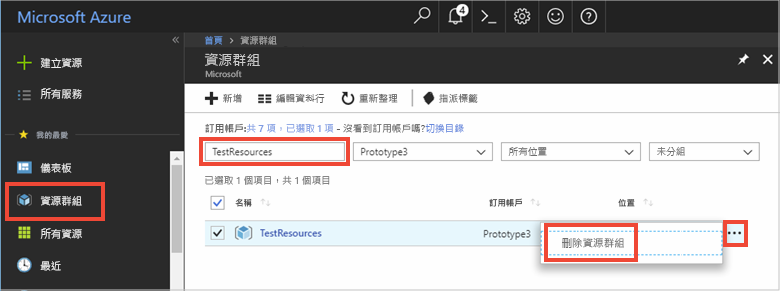

# <a name="quickstart-use-azure-redis-cache-with-a-net-core-app"></a>快速入門：搭配使用 Azure Redis 快取與 .NET Core 應用程式


本快速入門說明如何開始搭配使用 Microsoft Azure Redis 快取與 .NET Core。 Microsoft Azure Redis 快取以廣受使用的開放原始碼 Redis 快取為基礎。 它可讓您存取由 Microsoft 管理的安全、專用 Redis 快取。 使用 Azure Redis 快取建立的快取，可透過 Microsoft Azure 內的任何應用程式加以存取。

在本快速入門中，您會在 .NET Core 主控台應用程式中搭配使用 [StackExchange.Redis](https://github.com/StackExchange/StackExchange.Redis) 用戶端與 C\# 程式碼。 您會建立快取，並設定 .NET Core 用戶端應用程式。 然後，您會在快取中新增並更新物件。 

您可以使用任何程式碼編輯器來完成本快速入門中的步驟。 不過，於 Windows、macOS 和 Linux 平台上所提供的 [Visual Studio Code](https://code.visualstudio.com/) 是項不錯的選擇。


[!INCLUDE [quickstarts-free-trial-note](../../includes/quickstarts-free-trial-note.md)]

## <a name="prerequisites"></a>先決條件

* [.Net SDK 2.0](https://www.microsoft.com/net/learn/get-started/windows) 或更新版本。
* StackExchange.Redis 用戶端需要 [.NET Framework 4 或更新版本](https://www.microsoft.com/net/download/dotnet-framework-runtime)。

## <a name="create-a-cache"></a>建立快取
[!INCLUDE [redis-cache-create](../../includes/redis-cache-create.md)]

[!INCLUDE [redis-cache-access-keys](../../includes/redis-cache-access-keys.md)]

請記下**主機名稱**和**主要**存取金鑰。 您後續將會使用這些值來建構 *CacheConnection* 密碼。


## <a name="create-a-console-app"></a>建立主控台應用程式

在新的命令視窗中執行下列命令，以建立新的 .NET Core 主控台應用程式：

```
dotnet new console -o Redistest
```

在命令視窗中，切換至新的 *Redistest* 專案目錄。


## <a name="add-secret-manager-to-the-project"></a>將祕密管理員新增至專案

在本節中，您會將[祕密管理員工具](https://docs.microsoft.com/aspnet/core/security/app-secrets) \(機器翻譯\) 新增至您的專案。 祕密管理員工具能儲存專案樹狀結構外開發工作的敏感性資料。 此作法能協助避免於原始程式碼內意外共用應用程式祕密。

開啟您的 *Redistest.csproj* 檔案。 新增 `DotNetCliToolReference` 元素以包含 *Microsoft.Extensions.SecretManager.Tools*。 同時也新增 `UserSecretsId` 元素 (如下所示)，然後儲存檔案。

```xml
<Project Sdk="Microsoft.NET.Sdk">

  <PropertyGroup>
    <OutputType>Exe</OutputType>
    <TargetFramework>netcoreapp2.0</TargetFramework>
    <UserSecretsId>Redistest</UserSecretsId>
  </PropertyGroup>
  <ItemGroup>
    <DotNetCliToolReference Include="Microsoft.Extensions.SecretManager.Tools" Version="2.0.0" />
  </ItemGroup>
</Project>
```

執行下列命令，將 *Microsoft.Extensions.Configuration.UserSecrets* 套件新增至專案：

```
dotnet add package Microsoft.Extensions.Configuration.UserSecrets
```

執行下列命令以還原您的套件：

```
dotnet restore
```

在命令視窗中，在取代您的快取名稱和主要存取金鑰的預留位置 (包括角括號) 後，執行下列命令以儲存名為 *CacheConnection* 的新密碼：

```
dotnet user-secrets set CacheConnection "<cache name>.redis.cache.windows.net,abortConnect=false,ssl=true,password=<primary-access-key>"
```

將下列 `using` 陳述式新增至 *Program.cs*：

```csharp
using Microsoft.Extensions.Configuration;
```

將下列成員新增至 *Program.cs* 中的 `Program` 類別。 程式碼會初始化針對 redis 快取連接字串存取使用者密碼的設定。

```csharp
        private static IConfigurationRoot Configuration { get; set; }
        const string SecretName = "CacheConnection";

        private static void InitializeConfiguration()
        {
            var builder = new ConfigurationBuilder()
                .AddUserSecrets<Program>();

            Configuration = builder.Build();
        }
```

## <a name="configure-the-cache-client"></a>設定快取用戶端

在本節中，您會設定主控台應用程式，以使用適用於 .NET 的 [StackExchange.Redis](https://github.com/StackExchange/StackExchange.Redis) 用戶端。

在命令視窗中，在 *Redistest* 專案目錄中執行下列命令：

```
dotnet add package StackExchange.Redis
```

安裝完成後，*StackExchange.Redis* 快取用戶端即可與專案搭配使用。


## <a name="connect-to-the-cache"></a>連接到快取

將下列 `using` 陳述式新增至 *Program.cs*：

```csharp
using StackExchange.Redis;
```

與 Azure Redis 快取的連線是由 `ConnectionMultiplexer` 類別所管理。 整個用戶端應用程式中都應該共用和重複使用此類別。 請勿對每個作業建立新連線。 

在 *Program.cs* 中，對主控台應用程式的 `Program` 類別新增下列成員：

```csharp
        private static Lazy<ConnectionMultiplexer> lazyConnection = new Lazy<ConnectionMultiplexer>(() =>
        {
            string cacheConnection = Configuration[SecretName];
            return ConnectionMultiplexer.Connect(cacheConnection);
        });

        public static ConnectionMultiplexer Connection
        {
            get
            {
                return lazyConnection.Value;
            }
        }
```

這個在應用程式中共用 `ConnectionMultiplexer` 執行個體的方法，會使用可傳回已連線執行個體的靜態屬性。 此程式碼會提供安全執行緒方式，只初始化一個已連線的 `ConnectionMultiplexer` 執行個體。 `abortConnect` 會設為 false，這表示即使無法建立與 Azure Redis 快取的連線，呼叫也會成功。 `ConnectionMultiplexer` 的主要功能之一，就是一旦網路問題或其他原因獲得解決，它就會自動恢復與快取的連接。

*CacheConnection* 密碼的值可使用密碼管理員組態提供者來存取，並作為密碼參數。

## <a name="executing-cache-commands"></a>執行快取命令

在 *Program.cs* 中，對主控台應用程式 `Program` 類別的 `Main` 程序新增下列程式碼：

```csharp
        static void Main(string[] args)
        {
            InitializeConfiguration();

            // Connection refers to a property that returns a ConnectionMultiplexer
            // as shown in the previous example.
            IDatabase cache = lazyConnection.Value.GetDatabase();

            // Perform cache operations using the cache object...

            // Simple PING command
            string cacheCommand = "PING";
            Console.WriteLine("\nCache command  : " + cacheCommand);
            Console.WriteLine("Cache response : " + cache.Execute(cacheCommand).ToString());

            // Simple get and put of integral data types into the cache
            cacheCommand = "GET Message";
            Console.WriteLine("\nCache command  : " + cacheCommand + " or StringGet()");
            Console.WriteLine("Cache response : " + cache.StringGet("Message").ToString());

            cacheCommand = "SET Message \"Hello! The cache is working from a .NET Core console app!\"";
            Console.WriteLine("\nCache command  : " + cacheCommand + " or StringSet()");
            Console.WriteLine("Cache response : " + cache.StringSet("Message", "Hello! The cache is working from a .NET Core console app!").ToString());

            // Demostrate "SET Message" executed as expected...
            cacheCommand = "GET Message";
            Console.WriteLine("\nCache command  : " + cacheCommand + " or StringGet()");
            Console.WriteLine("Cache response : " + cache.StringGet("Message").ToString());

            // Get the client list, useful to see if connection list is growing...
            cacheCommand = "CLIENT LIST";
            Console.WriteLine("\nCache command  : " + cacheCommand);
            Console.WriteLine("Cache response : \n" + cache.Execute("CLIENT", "LIST").ToString().Replace("id=", "id="));

            lazyConnection.Value.Dispose();
        }
```

儲存 *Program.cs*。

Azure Redis 快取具有可供用來以邏輯方式區隔 Redis 快取內資料的可設定數目資料庫 (預設值為 16 個)。 該程式碼會連線至預設資料庫 (DB 0)。 如需詳細資訊，請參閱 [Redis 資料庫是什麼？](cache-faq.md#what-are-redis-databases)和[預設 Redis 伺服器組態](cache-configure.md#default-redis-server-configuration)。

您可以使用 `StringSet` 和 `StringGet` 方法來儲存和擷取快取項目。

Redis 會將多數資料儲存為 Redis 字串，但這些字串可能包含許多類型的資料，包括序列化的二進位資料 (在快取中儲存 .NET 物件時可能會用到)。

在命令視窗中執行下列命令，以建置應用程式：

```
dotnet build
```

然後，使用下列命令執行應用程式：

```
dotnet run
```

在下列範例中，您會看到 `Message` 金鑰先前有快取值，此值是在 Azure 入口網站中使用 Redis 主控台所設定的。 應用程式更新了該快取值。 應用程式也已執行 `PING` 和 `CLIENT LIST` 命令。


## <a name="work-with-net-objects-in-the-cache"></a>使用快取中的 .NET 物件

Azure Redis 快取可以快取 .NET 物件及基本資料類型，但必須先將 .NET 物件序列化，才能加以快取。 .NET 物件序列化是應用程式開發人員的責任，同時賦與開發人員選擇序列化程式的彈性。

將物件序列化的其中一個簡單方法就是使用 [Newtonsoft.Json](https://www.nuget.org/packages/Newtonsoft.Json/) 中的 `JsonConvert` 序列化方法並進行 JSON 的雙向序列化。 在本節中，您會對快取新增 .NET 物件。

執行下列命令，將 *Newtonsoft.json* 套件新增至應用程式：

```
dotnet add package Newtonsoft.json
```

在 *Program.cs* 開頭處新增下列 `using` 陳述式：

```charp
using Newtonsoft.Json;
```

將下列 `Employee` 類別定義新增至 Program.cs：

```csharp
        class Employee
        {
            public string Id { get; set; }
            public string Name { get; set; }
            public int Age { get; set; }

            public Employee(string EmployeeId, string Name, int Age)
            {
                this.Id = EmployeeId;
                this.Name = Name;
                this.Age = Age;
            }
        }
```

在  *Program.cs* 中的 `Main()` 程序底部，於 `Dispose()` 呼叫之前，對快取新增下列程式碼，並擷取已序列化的 .NET 物件：

```csharp
            // Store .NET object to cache
            Employee e007 = new Employee("007", "Davide Columbo", 100);
            Console.WriteLine("Cache response from storing Employee .NET object : " + 
                cache.StringSet("e007", JsonConvert.SerializeObject(e007)));

            // Retrieve .NET object from cache
            Employee e007FromCache = JsonConvert.DeserializeObject<Employee>(cache.StringGet("e007"));
            Console.WriteLine("Deserialized Employee .NET object :\n");
            Console.WriteLine("\tEmployee.Name : " + e007FromCache.Name);
            Console.WriteLine("\tEmployee.Id   : " + e007FromCache.Id);
            Console.WriteLine("\tEmployee.Age  : " + e007FromCache.Age + "\n");
```

儲存 *Program.cs*，並使用下列命令重建應用程式：

```
dotnet build
```

使用下列命令執行應用程式，以測試 .NET 物件的序列化：

```
dotnet run
```


## <a name="clean-up-resources"></a>清除資源

如果您準備繼續進行下一個教學課程，則可以保留在本快速入門中所建立的資源，並重複使用它們。

否則，如果您已完成快速入門範例應用程式，便可以將在此快速入門中所建立的 Azure 資源刪除，以避免衍生費用。 

> [!IMPORTANT]
> 刪除資源群組是無法回復的動作，資源群組和其內的所有資源將會永久刪除。 請確定您不會不小心刪除錯誤的資源群組或資源。 如果您是在包含有需要保留之資源的現有資源群組內，建立用來裝載此範例的資源，則可以從每個資源各自的刀鋒視窗中個別刪除每個資源，而不必刪除正個資源群組。
>

登入 [Azure 入口網站](https://portal.azure.com)，然後按一下 [資源群組]。

在 [依名稱篩選...] 文字方塊中，輸入您的資源群組名稱。 本文的指示是使用名為 TestResources 的資源群組。 在結果清單中的目標資源群組上方，按一下 **...**，然後按一下 [刪除資源群組]。



系統將會要求您確認是否刪除資源。 輸入您的資源群組名稱來確認，然後按一下 [刪除]。

片刻過後，系統便會刪除該資源群組及其所有內含的資源。


<a name="next-steps"></a>

## <a name="next-steps"></a>後續步驟

在本快速入門中，您已了解如何從 .NET Core 應用程式使用 Azure Redis 快取。 請繼續閱讀下一個快速入門，以搭配使用 Redis 快取與 ASP.NET Web 應用程式。

> [!div class="nextstepaction"]
> [建立可使用 Azure Redis 快取的 ASP.NET Web 應用程式。](./cache-web-app-howto.md)


