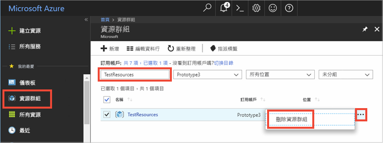

# <a name="quickstart-use-azure-redis-cache-with-a-net-application"></a>快速入門：搭配使用 Azure Redis 快取與 .NET 應用程式


本快速入門說明如何開始搭配使用 Microsoft Azure Redis 快取與 .NET。 Microsoft Azure Redis 快取以廣受使用的開放原始碼 Redis 快取為基礎。 它可讓您存取由 Microsoft 管理的安全、專用 Redis 快取。 使用 Azure Redis 快取建立的快取，可透過 Microsoft Azure 內的任何應用程式加以存取。

在這個快速入門中，您會在主控台應用程式中搭配使用 [StackExchange.Redis](https://github.com/StackExchange/StackExchange.Redis) 用戶端與 C\# 程式碼。 您會建立快取，並設定 .NET 用戶端應用程式。 然後，您會在快取中新增並更新物件。 


[!INCLUDE [quickstarts-free-trial-note](../../includes/quickstarts-free-trial-note.md)]

## <a name="prerequisites"></a>先決條件

* [Visual Studio](https://www.visualstudio.com/downloads/)
* StackExchange.Redis 用戶端需要 [.NET Framework 4 或更新版本](https://www.microsoft.com/net/download/dotnet-framework-runtime)。

## <a name="create-a-cache"></a>建立快取
[!INCLUDE [redis-cache-create](../../includes/redis-cache-create.md)]

[!INCLUDE [redis-cache-access-keys](../../includes/redis-cache-access-keys.md)]

在電腦上建立名為 CacheSecrets.config 的檔案，並將它放在應用程式範例的原始程式碼不會簽入的位置。 在本快速入門中，CacheSecrets.config 檔案位於這裡 (C:\AppSecrets\CacheSecrets.config)。

編輯 CacheSecrets.config 檔案，並新增下列內容：

```xml
<appSettings>
    <add key="CacheConnection" value="<cache-name>.redis.cache.windows.net,abortConnect=false,ssl=true,password=<access-key>"/>
</appSettings>
```

將 `<cache-name>` 取代為快取主機名稱。

將 `<access-key>` 取代為快取的主要金鑰。


## <a name="create-a-console-app"></a>建立主控台應用程式

在 Visual Studio 中，按一下 [檔案] > [新增] > [專案]。

在 **Visual C#** 下，按一下 [Windows 傳統桌面]，然後按一下 [主控台應用程式] 和 [確定]，以建立新的主控台應用程式。


<a name="configure-the-cache-clients"></a>

## <a name="configure-the-cache-client"></a>設定快取用戶端

在本節中，您會設定主控台應用程式，以使用適用於 .NET 的 [StackExchange.Redis](https://github.com/StackExchange/StackExchange.Redis) 用戶端。

在 Visual Studio 中，按一下 [工具] > [NuGet 套件管理員] > [Package Manager Console]，然後從 Package Manager Console 視窗執行下列命令。

```powershell
Install-Package StackExchange.Redis
```

安裝完成後，*StackExchange.Redis* 快取用戶端即可與專案搭配使用。


## <a name="connect-to-the-cache"></a>連接到快取

在 Visual Studio 中開啟 App.config 檔案，並將其更新為包含 `appSettings` `file` 屬性 (會參考 CacheSecrets.config 檔案)。

```xml
<?xml version="1.0" encoding="utf-8" ?>
<configuration>
    <startup> 
        <supportedRuntime version="v4.0" sku=".NETFramework,Version=v4.7.1" />
    </startup>

    <appSettings file="C:\AppSecrets\CacheSecrets.config"></appSettings>  

</configuration>
```

在 [方案總管] 中，以滑鼠右鍵按一下 [參考]，然後按一下 [新增參考]。 新增 **System.Configuration** 組件的參考。

將下列 `using` 陳述式新增至 Program.cs：

```csharp
using StackExchange.Redis;
using System.Configuration;
```

與 Azure Redis 快取的連線是由 `ConnectionMultiplexer` 類別所管理。 整個用戶端應用程式中都應該共用和重複使用此類別。 請勿對每個作業建立新連線。 

請勿將認證儲存在原始程式碼中。 為了簡化這個範例，我只使用外部密碼組態檔。 搭配使用 [Azure 金鑰保存庫與憑證](https://docs.microsoft.com/rest/api/keyvault/certificate-scenarios)會更好。

在 Program.cs 中，對主控台應用程式的 `Program` 類別新增下列成員：

```csharp
        private static Lazy<ConnectionMultiplexer> lazyConnection = new Lazy<ConnectionMultiplexer>(() =>
        {
            string cacheConnection = ConfigurationManager.AppSettings["CacheConnection"].ToString();
            return ConnectionMultiplexer.Connect(cacheConnection);
        });

        public static ConnectionMultiplexer Connection
        {
            get
            {
                return lazyConnection.Value;
            }
        }
```


這個在應用程式中共用 `ConnectionMultiplexer` 執行個體的方法，會使用可傳回已連線執行個體的靜態屬性。 此程式碼會提供安全執行緒方式，只初始化一個已連線的 `ConnectionMultiplexer` 執行個體。 `abortConnect` 會設為 false，這表示即使無法建立與 Azure Redis 快取的連線，呼叫也會成功。 `ConnectionMultiplexer` 的主要功能之一，就是一旦網路問題或其他原因獲得解決，它就會自動恢復與快取的連接。

CacheConnection appSetting 的值可用來從 Azure 入口網站中將快取連接字串參考作為密碼參數。

## <a name="executing-cache-commands"></a>執行快取命令

對主控台應用程式 `Program` 類別的 `Main` 程序新增下列程式碼：

```csharp
        static void Main(string[] args)
        {
            // Connection refers to a property that returns a ConnectionMultiplexer
            // as shown in the previous example.
            IDatabase cache = lazyConnection.Value.GetDatabase();

            // Perform cache operations using the cache object...

            // Simple PING command
            string cacheCommand = "PING";
            Console.WriteLine("\nCache command  : " + cacheCommand);
            Console.WriteLine("Cache response : " + cache.Execute(cacheCommand).ToString());

            // Simple get and put of integral data types into the cache
            cacheCommand = "GET Message";
            Console.WriteLine("\nCache command  : " + cacheCommand + " or StringGet()");
            Console.WriteLine("Cache response : " + cache.StringGet("Message").ToString());

            cacheCommand = "SET Message \"Hello! The cache is working from a .NET console app!\"";
            Console.WriteLine("\nCache command  : " + cacheCommand + " or StringSet()");
            Console.WriteLine("Cache response : " + cache.StringSet("Message", "Hello! The cache is working from a .NET console app!").ToString());

            // Demostrate "SET Message" executed as expected...
            cacheCommand = "GET Message";
            Console.WriteLine("\nCache command  : " + cacheCommand + " or StringGet()");
            Console.WriteLine("Cache response : " + cache.StringGet("Message").ToString());

            // Get the client list, useful to see if connection list is growing...
            cacheCommand = "CLIENT LIST";
            Console.WriteLine("\nCache command  : " + cacheCommand);
            Console.WriteLine("Cache response : \n" + cache.Execute("CLIENT", "LIST").ToString().Replace("id=", "id="));

            lazyConnection.Value.Dispose();
        }
```

Azure Redis 快取具有可供用來以邏輯方式區隔 Redis 快取內資料的可設定數目資料庫 (預設值為 16 個)。 該程式碼會連線至預設資料庫 (DB 0)。 如需詳細資訊，請參閱 [Redis 資料庫是什麼？](cache-faq.md#what-are-redis-databases)和[預設 Redis 伺服器組態](cache-configure.md#default-redis-server-configuration)。

您可以使用 `StringSet` 和 `StringGet` 方法來儲存和擷取快取項目。

Redis 會將多數資料儲存為 Redis 字串，但這些字串可能包含許多類型的資料，包括序列化的二進位資料 (在快取中儲存 .NET 物件時可能會用到)。

按 **Ctrl+F5** 以建置並執行主控台應用程式。

在下列範例中，您會看到 `Message` 金鑰先前有快取值，此值是在 Azure 入口網站中使用 Redis 主控台所設定的。 應用程式更新了該快取值。 應用程式也已執行 `PING` 和 `CLIENT LIST` 命令。


## <a name="work-with-net-objects-in-the-cache"></a>使用快取中的 .NET 物件

Azure Redis 快取可以快取 .NET 物件及基本資料類型，但必須先將 .NET 物件序列化，才能加以快取。 .NET 物件序列化是應用程式開發人員的責任，同時賦與開發人員選擇序列化程式的彈性。

將物件序列化的其中一個簡單方法就是使用 [Newtonsoft.Json](https://www.nuget.org/packages/Newtonsoft.Json/) 中的 `JsonConvert` 序列化方法並進行 JSON 的雙向序列化。 在本節中，您會對快取新增 .NET 物件。

在 Visual Studio 中，按一下 [工具] > [NuGet 套件管理員] > [Package Manager Console]，然後從 Package Manager Console 視窗執行下列命令。

```powershell
Install-Package Newtonsoft.Json
```

在 Program.cs 開頭處新增以下 `using` 陳述式：

```charp
using Newtonsoft.Json;
```

將下列 `Employee` 類別定義新增至 Program.cs：

```csharp
        class Employee
        {
            public string Id { get; set; }
            public string Name { get; set; }
            public int Age { get; set; }

            public Employee(string EmployeeId, string Name, int Age)
            {
                this.Id = EmployeeId;
                this.Name = Name;
                this.Age = Age;
            }
        }
```

在 Program.cs 中的 `Main()` 程序底部，於 `Dispose()` 呼叫之前，對快取新增下列程式碼，並擷取已序列化的 .NET 物件：

```csharp
            // Store .NET object to cache
            Employee e007 = new Employee("007", "Davide Columbo", 100);
            Console.WriteLine("Cache response from storing Employee .NET object : " + 
                cache.StringSet("e007", JsonConvert.SerializeObject(e007)));

            // Retrieve .NET object from cache
            Employee e007FromCache = JsonConvert.DeserializeObject<Employee>(cache.StringGet("e007"));
            Console.WriteLine("Deserialized Employee .NET object :\n");
            Console.WriteLine("\tEmployee.Name : " + e007FromCache.Name);
            Console.WriteLine("\tEmployee.Id   : " + e007FromCache.Id);
            Console.WriteLine("\tEmployee.Age  : " + e007FromCache.Age + "\n");
```

按 **Ctrl+F5** 以建置並執行主控台應用程式，來測試 .NET 物件的序列化。 


## <a name="clean-up-resources"></a>清除資源

如果您準備繼續進行下一個教學課程，則可以保留在本快速入門中所建立的資源，並重複使用它們。

否則，如果您已完成快速入門範例應用程式，便可以將在此快速入門中所建立的 Azure 資源刪除，以避免衍生費用。 

> [!IMPORTANT]
> 刪除資源群組是無法回復的動作，資源群組和其內的所有資源將會永久刪除。 請確定您不會不小心刪除錯誤的資源群組或資源。 如果您是在包含有需要保留之資源的現有資源群組內，建立用來裝載此範例的資源，則可以從每個資源各自的刀鋒視窗中個別刪除每個資源，而不必刪除正個資源群組。
>

登入 [Azure 入口網站](https://portal.azure.com)，然後按一下 [資源群組]。

在 [依名稱篩選...] 文字方塊中，輸入您的資源群組名稱。 本文的指示是使用名為 TestResources 的資源群組。 在結果清單中的目標資源群組上方，按一下 **...**，然後按一下 [刪除資源群組]。



系統將會要求您確認是否刪除資源。 輸入您的資源群組名稱來確認，然後按一下 [刪除]。

片刻過後，系統便會刪除該資源群組及其所有內含的資源。


<a name="next-steps"></a>

## <a name="next-steps"></a>後續步驟

在本快速入門中，您已了解如何從 .NET 應用程式使用 Azure Redis 快取。 請繼續閱讀下一個快速入門，來搭配使用 Redis 快取與 ASP.NET Web 應用程式。

> [!div class="nextstepaction"]
> [建立可使用 Azure Redis 快取的 ASP.NET Web 應用程式。](./cache-web-app-howto.md)


