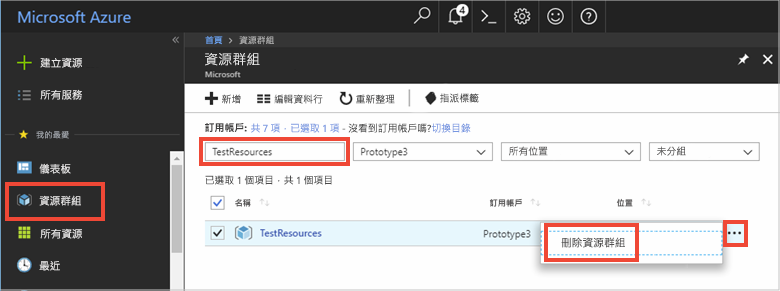

# <a name="quickstart-how-to-use-azure-redis-cache-with-java"></a>快速入門：如何搭配使用 Azure Redis 快取與 Java


Azure Redis 快取可讓您存取 Microsoft 所管理的專用 Redis 快取。 從 Microsoft Azure 內的任何應用程式都可以存取您的快取。

本文說明如何使用適用於 Java 的 [Jedis](https://github.com/xetorthio/jedis) Redis 快取用戶端來開始使用 Azure Redis 快取。


您可以使用任何程式碼編輯器來完成本快速入門中的步驟。 不過，於 Windows、macOS 和 Linux 平台上所提供的 [Visual Studio Code](https://code.visualstudio.com/) 是項不錯的選擇。

[!INCLUDE [quickstarts-free-trial-note](../../includes/quickstarts-free-trial-note.md)]


## <a name="prerequisites"></a>先決條件

[Apache Maven](http://maven.apache.org/)


## <a name="create-an-azure-redis-cache"></a>建立 Azure Redis 快取

[!INCLUDE [redis-cache-create](../../includes/redis-cache-create.md)]

[!INCLUDE [redis-cache-access-keys](../../includes/redis-cache-access-keys.md)]

為**主機名稱**和**主要**存取金鑰新增環境變數。 您會從程式碼使用這些變數，而不是直接在程式碼中包含敏感性資訊。

```
set REDISCACHEHOSTNAME=contosoCache.redis.cache.windows.net
set REDISCACHEKEY=XXXXXXXXXXXXXXXXXXXXXXXXXXXXXXXXXXXXXXXXXXXX
```

## <a name="create-a-new-java-app"></a>建立新的 Java 應用程式

使用 Maven 產生新的快速入門應用程式：

```
mvn archetype:generate -DarchetypeGroupId=org.apache.maven.archetypes -DarchetypeArtifactId=maven-archetype-quickstart -DarchetypeVersion=1.3 -DgroupId=example.demo -DartifactId=redistest -Dversion=1.0
```

變更為新的 redistest 專案目錄。

開啟 pom.xml 檔案，然後新增 [Jedis](https://github.com/xetorthio/jedis) 的相依性：

```xml
    <dependency>
        <groupId>redis.clients</groupId>
        <artifactId>jedis</artifactId>
        <version>2.9.0</version>
        <type>jar</type>
        <scope>compile</scope>
    </dependency>
```

儲存 *pom.xml* 檔案。

開啟 App.java 檔案，並以下列程式碼取代其中的程式碼：

```java
package example.demo;

import redis.clients.jedis.Jedis;
import redis.clients.jedis.JedisShardInfo;

/**
 * Redis test
 *
 */
public class App 
{
    public static void main( String[] args )
    {

        boolean useSsl = true;
        String cacheHostname = System.getenv("REDISCACHEHOSTNAME");
        String cachekey = System.getenv("REDISCACHEKEY");

        // Connect to the Redis cache over the SSL port using the key.
        JedisShardInfo shardInfo = new JedisShardInfo(cacheHostname, 6380, useSsl);
        shardInfo.setPassword(cachekey); /* Use your access key. */
        Jedis jedis = new Jedis(shardInfo);      

        // Perform cache operations using the cache connection object...

        // Simple PING command        
        System.out.println( "\nCache Command  : Ping" );
        System.out.println( "Cache Response : " + jedis.ping());

        // Simple get and put of integral data types into the cache
        System.out.println( "\nCache Command  : GET Message" );
        System.out.println( "Cache Response : " + jedis.get("Message"));

        System.out.println( "\nCache Command  : SET Message" );
        System.out.println( "Cache Response : " + jedis.set("Message", "Hello! The cache is working from Java!"));

        // Demostrate "SET Message" executed as expected...
        System.out.println( "\nCache Command  : GET Message" );
        System.out.println( "Cache Response : " + jedis.get("Message"));

        // Get the client list, useful to see if connection list is growing...
        System.out.println( "\nCache Command  : CLIENT LIST" );
        System.out.println( "Cache Response : " + jedis.clientList());

        jedis.close();
    }
}
```

此程式碼會示範如何使用快取主機名稱和金鑰環境變數來連線至 Azure Redis 快取執行個體。 此程式碼也會將字串值儲存到快取中，以及擷取其中的字串值。 `PING` 和 `CLIENT LIST` 命令也會執行。 

儲存 App.java。

## <a name="build-and-run-the-app"></a>建置並執行應用程式

執行下列 Maven 命令，以建置和執行應用程式：

```
mvn exec:java -D exec.mainClass=example.demo.App
```

在下列範例中，您會看到 `Message` 金鑰先前有快取值，此值是在 Azure 入口網站中使用 Redis 主控台所設定的。 應用程式更新了該快取值。 應用程式也已執行 `PING` 和 `CLIENT LIST` 命令。


## <a name="clean-up-resources"></a>清除資源

如果您準備繼續進行下一個教學課程，則可以保留在本快速入門中所建立的資源，並重複使用它們。

否則，如果您已完成快速入門範例應用程式，便可以將在此快速入門中所建立的 Azure 資源刪除，以避免衍生費用。 

> [!IMPORTANT]
> 刪除資源群組是無法回復的動作，資源群組和其內的所有資源將會永久刪除。 請確定您不會不小心刪除錯誤的資源群組或資源。 如果您是在包含有需要保留之資源的現有資源群組內，建立用來裝載此範例的資源，則可以從每個資源各自的刀鋒視窗中個別刪除每個資源，而不必刪除正個資源群組。
>

登入 [Azure 入口網站](https://portal.azure.com)，然後按一下 [資源群組]。

在 [依名稱篩選...] 文字方塊中，輸入您的資源群組名稱。 本文的指示是使用名為 TestResources 的資源群組。 在結果清單中的目標資源群組上方，按一下 **...**，然後按一下 [刪除資源群組]。



系統將會要求您確認是否刪除資源。 輸入您的資源群組名稱來確認，然後按一下 [刪除]。

片刻過後，系統便會刪除該資源群組及其所有內含的資源。


## <a name="next-steps"></a>後續步驟

在本快速入門中，您已了解如何從 Java 應用程式使用 Azure Redis 快取。 請繼續閱讀下一個快速入門，來搭配使用 Redis 快取與 ASP.NET Web 應用程式。

> [!div class="nextstepaction"]
> [建立可使用 Azure Redis 快取的 ASP.NET Web 應用程式。](./cache-web-app-howto.md)


