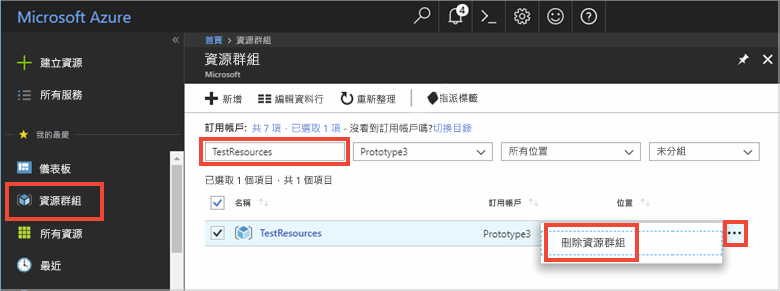

# <a name="quickstart-how-to-use-azure-redis-cache-with-nodejs"></a>快速入門：如何搭配使用 Azure Redis 快取與 Node.js


Azure Redis 快取可讓您存取 Microsoft 所管理的專用安全 Redis 快取。 從 Microsoft Azure 內的任何應用程式都可以存取您的快取。

本主題說明如何開始搭配使用 Azure Redis 快取與 Node.js。 

您可以使用任何程式碼編輯器來完成本快速入門中的步驟。 不過，於 Windows、macOS 和 Linux 平台上所提供的 [Visual Studio Code](https://code.visualstudio.com/) 是項不錯的選擇。


[!INCLUDE [quickstarts-free-trial-note](../../includes/quickstarts-free-trial-note.md)]


## <a name="prerequisites"></a>先決條件
安裝 [node_redis](https://github.com/mranney/node_redis)：

    npm install redis

本教學課程使用 [node_redis](https://github.com/mranney/node_redis)。 如需使用其他 Node.js 用戶端的範例，請參閱列在 [Node.js Redis 用戶端](http://redis.io/clients#nodejs)之 Node.js 用戶端的個別文件。


## <a name="create-a-cache"></a>建立快取
[!INCLUDE [redis-cache-create](../../includes/redis-cache-create.md)]

[!INCLUDE [redis-cache-access-keys](../../includes/redis-cache-access-keys.md)]


為**主機名稱**和**主要**存取金鑰新增環境變數。 您會從程式碼使用這些變數，而不是直接在程式碼中包含敏感性資訊。

```
set REDISCACHEHOSTNAME=contosoCache.redis.cache.windows.net
set REDISCACHEKEY=XXXXXXXXXXXXXXXXXXXXXXXXXXXXXXXXXXXXXXXXXXXX
```


## <a name="connect-to-the-cache"></a>連接到快取

[node_redis](https://github.com/mranney/node_redis) 的最新組建提供了使用 SSL 連接到 Azure Redis 快取的支援。 下列範例示範如何使用 6380 的 SSL 端點連接到 Azure Redis 快取。 

```js
var redis = require("redis");

// Add your cache name and access key.
var client = redis.createClient(6380, process.env.REDISCACHEHOSTNAME,
    {auth_pass: process.env.REDISCACHEKEY, tls: {servername: process.env.REDISCACHEHOSTNAME}});
```

請勿對程式碼中的每個作業建立新連線。 相反地，請盡可能重複使用連線。 

## <a name="create-a-new-nodejs-app"></a>建立新的 Node.js 應用程式

建立名為 redistest.js 的新指令檔。

在檔案中新增下列 JavaScript 範例。 此程式碼會示範如何使用快取主機名稱和金鑰環境變數來連線至 Azure Redis 快取執行個體。 此程式碼也會將字串值儲存到快取中，以及擷取其中的字串值。 `PING` 和 `CLIENT LIST` 命令也會執行。 如需更多搭配使用 Redis 與 [node_redis](https://github.com/mranney/node_redis) 用戶端的範例，請參閱 [http://redis.js.org/](http://redis.js.org/)。

```js
var redis = require("redis");
var bluebird = require("bluebird");

bluebird.promisifyAll(redis.RedisClient.prototype);
bluebird.promisifyAll(redis.Multi.prototype);

async function testCache() {

    // Connect to the Redis cache over the SSL port using the key.
    var cacheConnection = redis.createClient(6380, process.env.REDISCACHEHOSTNAME, 
        {auth_pass: process.env.REDISCACHEKEY, tls: {servername: process.env.REDISCACHEHOSTNAME}});
        
    // Perform cache operations using the cache connection object...

    // Simple PING command
    console.log("\nCache command: PING");
    console.log("Cache response : " + await cacheConnection.pingAsync());

    // Simple get and put of integral data types into the cache
    console.log("\nCache command: GET Message");
    console.log("Cache response : " + await cacheConnection.getAsync("Message"));    

    console.log("\nCache command: SET Message");
    console.log("Cache response : " + await cacheConnection.setAsync("Message",
        "Hello! The cache is working from Node.js!"));    

    // Demostrate "SET Message" executed as expected...
    console.log("\nCache command: GET Message");
    console.log("Cache response : " + await cacheConnection.getAsync("Message"));    

    // Get the client list, useful to see if connection list is growing...
    console.log("\nCache command: CLIENT LIST");
    console.log("Cache response : " + await cacheConnection.clientAsync("LIST"));    
}

testCache();
```

使用 Node.js 執行指令碼。

```
node redistest.js
```

在下列範例中，您會看到 `Message` 金鑰先前有快取值，此值是在 Azure 入口網站中使用 Redis 主控台所設定的。 應用程式更新了該快取值。 應用程式也已執行 `PING` 和 `CLIENT LIST` 命令。


## <a name="clean-up-resources"></a>清除資源

如果您準備繼續進行下一個教學課程，則可以保留在本快速入門中所建立的資源，並重複使用它們。

否則，如果您已完成快速入門範例應用程式，便可以將在此快速入門中所建立的 Azure 資源刪除，以避免衍生費用。 

> [!IMPORTANT]
> 刪除資源群組是無法回復的動作，資源群組和其內的所有資源將會永久刪除。 請確定您不會不小心刪除錯誤的資源群組或資源。 如果您是在包含有需要保留之資源的現有資源群組內，建立用來裝載此範例的資源，則可以從每個資源各自的刀鋒視窗中個別刪除每個資源，而不必刪除正個資源群組。
>

登入 [Azure 入口網站](https://portal.azure.com)，然後按一下 [資源群組]。

在 [依名稱篩選...] 文字方塊中，輸入您的資源群組名稱。 本文的指示是使用名為 TestResources 的資源群組。 在結果清單中的目標資源群組上方，按一下 **...**，然後按一下 [刪除資源群組]。



系統將會要求您確認是否刪除資源。 輸入您的資源群組名稱來確認，然後按一下 [刪除]。

片刻過後，系統便會刪除該資源群組及其所有內含的資源。


## <a name="next-steps"></a>後續步驟

在本快速入門中，您已了解如何從 Node.js 應用程式使用 Azure Redis 快取。 請繼續閱讀下一個快速入門，來搭配使用 Redis 快取與 ASP.NET Web 應用程式。

> [!div class="nextstepaction"]
> [建立可使用 Azure Redis 快取的 ASP.NET Web 應用程式。](./cache-web-app-howto.md)


