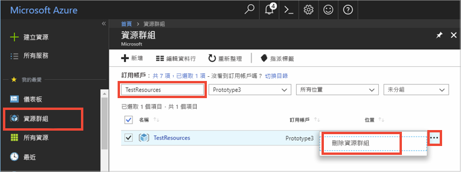

# <a name="quickstart-use-azure-redis-cache-with-python"></a>快速入門：搭配使用 Azure Redis 快取與 Python


## <a name="introduction"></a>簡介

本快速入門說明如何使用 Python 連線至 Azure Redis 快取來讀取和寫入快取。 


[!INCLUDE [quickstarts-free-trial-note](../../includes/quickstarts-free-trial-note.md)]

## <a name="prerequisites"></a>先決條件

* 已使用 [pip](https://pypi.org/project/pip/) 安裝 [Python 2 或 Python 3 環境](https://www.python.org/downloads/)。 

## <a name="create-a-redis-cache-on-azure"></a>在 Azure 上建立 Redis 快取
[!INCLUDE [redis-cache-create](../../includes/redis-cache-create.md)]

[!INCLUDE [redis-cache-create](../../includes/redis-cache-access-keys.md)]

## <a name="install-redis-py"></a>安裝 redis-py

[redis-py](https://github.com/andymccurdy/redis-py) 是 Python 用於 Redis 快取的介面。 使用 Python 的套件工具 *pip* 安裝 redis-py 套件。 

以下範例使用適用於 Python3 的 *pip3*，透過 Visual Studio 2017 開發人員命令提示字元搭配提高權限的系統管理員權限，在 Windows 10 上安裝 redis-py 套件。

    pip3 install redis


## <a name="read-and-write-to-the-cache"></a>讀取和寫入快取

從命令列執行 Python 並使用快取進行測試。 將 `<Your Host Name>` 和 `<Your Access Key>` 取代為 Redis 快取的值。 

```python
>>> import redis
>>> r = redis.StrictRedis(host='<Your Host Name>.redis.cache.windows.net',
        port=6380, db=0, password='<Your Access Key>', ssl=True)
>>> r.set('foo', 'bar')
True
>>> r.get('foo')
b'bar'
```

## <a name="create-a-python-script"></a>建立 Python 指令碼

建立新的指令碼文字檔案，命名為 PythonApplication1.py。

在 PythonApplication1.py 中新增下列指令碼並儲存檔案。 此指令碼會測試快取存取。 將 `<Your Host Name>` 和 `<Your Access Key>` 取代為 Redis 快取的值。 

```python
import redis

myHostname = "<Your Host Name>.redis.cache.windows.net"
myPassword = "<Your Access Key>"

r = redis.StrictRedis(host=myHostname, port=6380,password=myPassword,ssl=True)

result = r.ping()
print("Ping returned : " + str(result))

result = r.set("Message", "Hello!, The cache is working with Python!")
print("SET Message returned : " + str(result))

result = r.get("Message")
print("GET Message returned : " + result.decode("utf-8"))

result = r.client_list()
print("CLIENT LIST returned : ") 
for c in result:
    print("id : " + c['id'] + ", addr : " + c['addr'])
```

使用 Python 執行指令碼。


## <a name="clean-up-resources"></a>清除資源

如果您準備繼續進行其他教學課程，則可以保留在本快速入門中所建立的資源並重複使用。

否則，如果您已完成快速入門範例應用程式，便可以將在此快速入門中所建立的 Azure 資源刪除，以避免衍生費用。 

> [!IMPORTANT]
> 刪除資源群組是無法回復的動作，資源群組和其內的所有資源將會永久刪除。 請確定您不會不小心刪除錯誤的資源群組或資源。 如果您是在包含有需要保留之資源的現有資源群組內，建立用來裝載此範例的資源，則可以從每個資源各自的刀鋒視窗中個別刪除每個資源，而不必刪除正個資源群組。
>

登入 [Azure 入口網站](https://portal.azure.com)，然後按一下 [資源群組]。

在 [依名稱篩選...] 文字方塊中，輸入您的資源群組名稱。 本文的指示是使用名為 TestResources 的資源群組。 在結果清單中的目標資源群組上方，按一下 **...**，然後按一下 [刪除資源群組]。



系統將會要求您確認是否刪除資源。 輸入您的資源群組名稱來確認，然後按一下 [刪除]。

片刻過後，系統便會刪除該資源群組及其所有內含的資源。


## <a name="next-steps"></a>後續步驟

> [!div class="nextstepaction"]
> [建立可使用 Azure Redis 快取的簡單 ASP.NET Web 應用程式。](./cache-web-app-howto.md)


<!--Image references-->
[1]: ./media/cache-python-get-started/redis-cache-new-cache-menu.png
[2]: ./media/cache-python-get-started/redis-cache-cache-create.png
