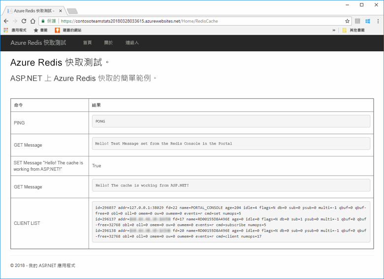
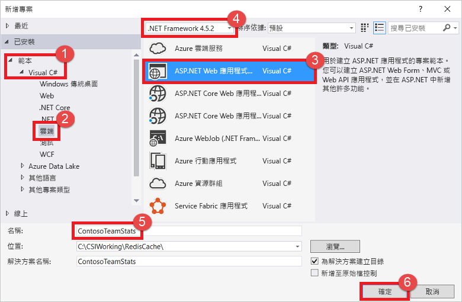
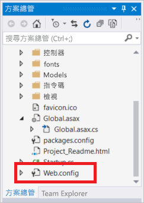
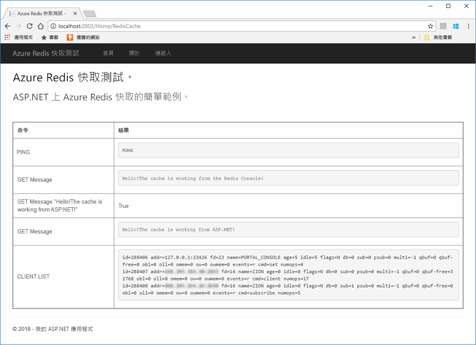
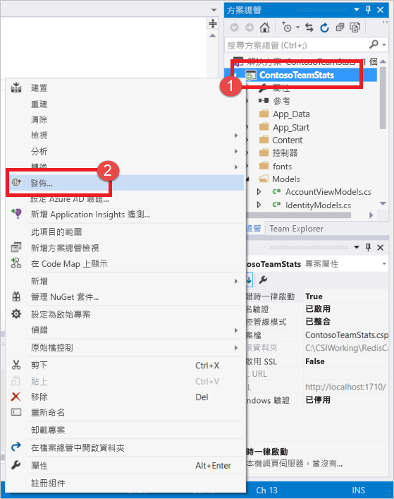
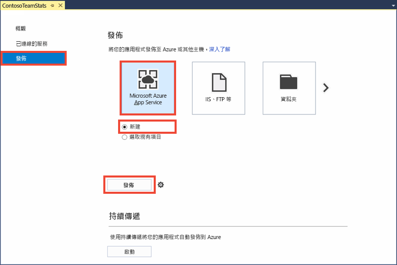
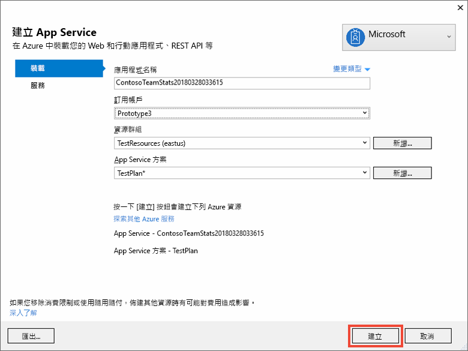
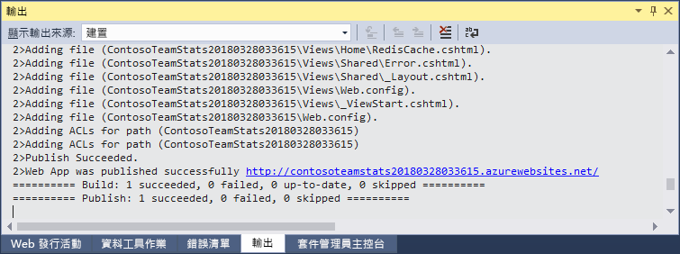
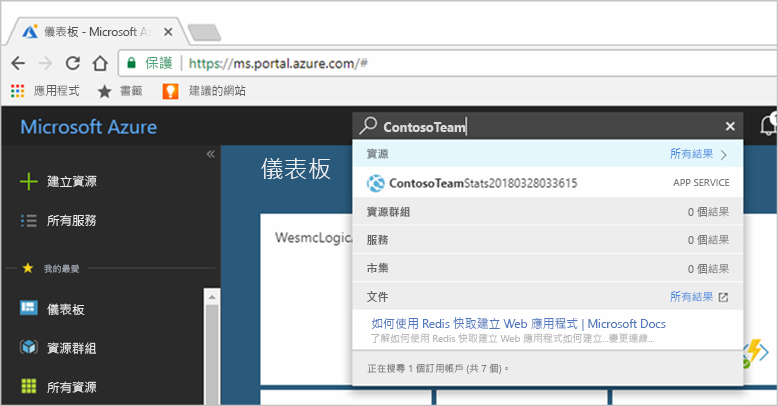
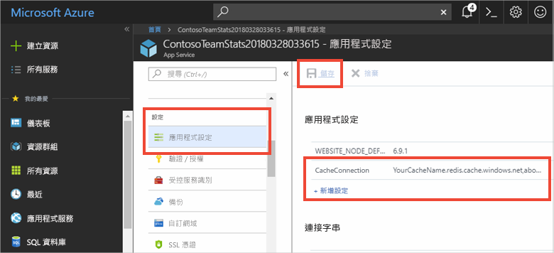

# <a name="quickstart-create-an-aspnet-web-app"></a>快速入門：建立 ASP.NET Web 應用程式 

## <a name="introduction"></a>簡介

本快速入門說明如何使用 Visual Studio 2017 在 Azure App Service 中建立和部署 ASP.NET Web 應用程式。 應用程式範例會連線至 Azure Redis 快取以儲存資料，以及從快取擷取資料。 完成本快速入門後，您將會有執行中的 Web 應用程式裝載於 Azure 中，可對 Azure Redis 快取進行讀取和寫入。



[!INCLUDE [quickstarts-free-trial-note](../../includes/quickstarts-free-trial-note.md)]

## <a name="prerequisites"></a>先決條件

若要完成本快速入門，您必須將 [Visual Studio 2017](https://www.visualstudio.com/downloads/) 安裝到下列環境：
* ASP.NET 和 Web 開發
* Azure 開發

## <a name="create-the-visual-studio-project"></a>建立 Visual Studio 專案

1. 開啟 Visual Studio，然後選取 [檔案] >[新增] > [專案]。

2. 在 [新增專案] 對話方塊中，執行下列步驟：

    

    a. 在 [範本] 清單中，展開 [Visual C#] 節點。

    b. 選取 [雲端]。

    c. 選取 [ASP.NET Web 應用程式] 。

    d. 確認已選取 [.NET Framework 4.5.2] 或更新版本。

    e. 在 [名稱] 方塊中，指定專案的名稱。 在此範例中，我們使用 **ContosoTeamStats**。

    f. 選取 [確定] 。
   
3. 選取 [MVC]  做為專案類型。

4. 確定 [驗證] 設定已指定為 [不需要驗證]。 視您的 Visual Studio 版本而定，預設的 [驗證] 設定可能會是其他值。 若要加以變更，請選取 [變更驗證]，然後選取 [不需要驗證]。

5. 選取 [確定] 以建立專案。

## <a name="create-a-cache"></a>建立快取

接下來，請建立應用程式的快取。

[!INCLUDE [redis-cache-create](../../includes/redis-cache-create.md)]

[!INCLUDE [redis-cache-access-keys](../../includes/redis-cache-access-keys.md)]

#### <a name="to-edit-the-cachesecretsconfig-file"></a>編輯 *CacheSecrets.config* 檔案

3. 在您的電腦上建立名為 *CacheSecrets.config* 的檔案。將該檔案放在範例應用程式的原始程式碼不會加以簽入的位置。 在本快速入門中，CacheSecrets.config 檔案位於 C:\AppSecrets\CacheSecrets.config。

4. 編輯 *CacheSecrets.config* 檔案。 然後，新增下列內容：

    ```xml
    <appSettings>
        <add key="CacheConnection" value="<cache-name>.redis.cache.windows.net,abortConnect=false,ssl=true,password=<access-key>"/>
    </appSettings>
    ```

5. 將 `<cache-name>` 取代為快取主機名稱。

6. 將 `<access-key>` 取代為快取的主要金鑰。

    > [!TIP]
    > 您可以在金鑰輪替期間使用次要存取金鑰作為重新產生主要存取金鑰時的替代金鑰。
>
7. 儲存檔案。

## <a name="update-the-mvc-application"></a>更新 MVC 應用程式

在本節中，您將更新應用程式以支援會對 Azure Redis 快取顯示簡單測試的新檢視。

* [使用快取的應用程式設定來更新 web.config 檔案](#Update-the-webconfig-file-with-an-app-setting-for-the-cache)
* [設定應用程式以使用 StackExchange.Redis 用戶端](#configure-the-application-to-use-stackexchangeredis)
* [更新 HomeController 和版面配置](#update-the-homecontroller-and-layout)
* [新增 RedisCache 檢視](#add-a-new-rediscache-view)

### <a name="update-the-webconfig-file-with-an-app-setting-for-the-cache"></a>使用快取的應用程式設定來更新 web.config 檔案

當您在本機執行應用程式時，CacheSecrets.config 中的資訊將會用來連線至 Azure Redis 快取執行個體。 稍後您會將此應用程式部署至 Azure。 屆時，您將會在 Azure 中設定應用程式設定，以供應用程式用來擷取快取連線資訊，而不是這個檔案。 

由於 CacheSecrets.config 檔案不會隨著應用程式部署至 Azure，因此您只會在本機測試應用程式時使用它。 請以最安全的方式保存這項資訊，以防止他人惡意存取快取資料。

#### <a name="to-update-the-webconfig-file"></a>更新 *web.config* 檔案
1. 在 [方案總管] 中，按兩下 Web.config 檔案來加以開啟。

    

2. 在 *web.config* 檔案中，尋找 `<appSetting>` 元素。 然後，新增下列 `file` 屬性。 如果您使用不同檔案名稱或位置，請以這些值取代範例中顯示的值。

* 取代前： `<appSettings>`
* 取代後： ` <appSettings file="C:\AppSecrets\CacheSecrets.config">`

ASP.NET 執行階段會將外部檔案的內容與 `<appSettings>` 元素的標記合併。 如果找不到指定的檔案，則執行階段會略過檔案屬性。 您的密碼 (您的快取的連接字串) 不會包含在應用程式的原始程式碼中。 將 Web 應用程式部署至 Azure 時，不會部署 CacheSecrests.config 檔案。

### <a name="to-configure-the-application-to-use-stackexchangeredis"></a>設定應用程式以使用 StackExchange.Redis

1. 若要將應用程式設定為使用適用於 Visual Studio 的 [StackExchange.Redis](https://github.com/StackExchange/StackExchange.Redis) NuGet 套件，請選取 [工具] > [NuGet 套件管理員] > [套件管理員主控台]。

2. 從 `Package Manager Console` 視窗執行下列命令：

    ```powershell
    Install-Package StackExchange.Redis
    ```

3. NuGet 套件會為您的用戶端應用程式下載並新增必要的組件參考，以利用 StackExchange.Redis 快取用戶端來存取 Azure Redis 快取。 如果您偏好使用強式命名的 `StackExchange.Redis` 用戶端程式庫版本，請安裝 `StackExchange.Redis.StrongName` 套件。

### <a name="to-update-the-homecontroller-and-layout"></a>更新 HomeController 和版面配置

1. 在 [方案總管] 中展開 [控制器] 資料夾，然後開啟 *HomeController.cs* 檔案。

2. 在檔案頂端新增下列兩個 `using` 陳述式，以支援快取用戶端和應用程式設定。

    ```csharp
    using System.Configuration;
    using StackExchange.Redis;
    ```

3. 將下列方法新增至 `HomeController` 類別，以支援會對新快取執行一些命令的新 `RedisCache` 動作。

    ```csharp
        public ActionResult RedisCache()
        {
            ViewBag.Message = "A simple example with Azure Redis Cache on ASP.NET.";

            var lazyConnection = new Lazy<ConnectionMultiplexer>(() =>
            {
                string cacheConnection = ConfigurationManager.AppSettings["CacheConnection"].ToString();
                return ConnectionMultiplexer.Connect(cacheConnection);
            });

            // Connection refers to a property that returns a ConnectionMultiplexer
            // as shown in the previous example.
            IDatabase cache = lazyConnection.Value.GetDatabase();

            // Perform cache operations using the cache object...

            // Simple PING command
            ViewBag.command1 = "PING";
            ViewBag.command1Result = cache.Execute(ViewBag.command1).ToString();

            // Simple get and put of integral data types into the cache
            ViewBag.command2 = "GET Message";
            ViewBag.command2Result = cache.StringGet("Message").ToString();

            ViewBag.command3 = "SET Message \"Hello! The cache is working from ASP.NET!\"";
            ViewBag.command3Result = cache.StringSet("Message", "Hello! The cache is working from ASP.NET!").ToString();

            // Demostrate "SET Message" executed as expected...
            ViewBag.command4 = "GET Message";
            ViewBag.command4Result = cache.StringGet("Message").ToString();

            // Get the client list, useful to see if connection list is growing...
            ViewBag.command5 = "CLIENT LIST";
            ViewBag.command5Result = cache.Execute("CLIENT", "LIST").ToString().Replace(" id=", "\rid=");

            lazyConnection.Value.Dispose();

            return View();
        }
    ```

4. 在 [方案總管] 中，展開 [檢視] > [共用] 資料夾。 然後開啟 *_Layout.cshtml* 檔案。

    將：

        ```csharp
        @Html.ActionLink("Application name", "Index", "Home", new { area = "" }, new { @class = "navbar-brand" })
        ```

    取代為

        ```csharp
        @Html.ActionLink("Azure Redis Cache Test", "RedisCache", "Home", new { area = "" }, new { @class = "navbar-brand" })
        ```

### <a name="to-add-a-new-rediscache-view"></a>新增 RedisCache 檢視

1. 在 [方案總管] 中，展開 [檢視] 資料夾，然後在 [主資料夾] 資料夾上按一下滑鼠右鍵。 選擇 [新增] > [檢視...]。

2. 在 [新增檢視] 對話方塊中，輸入 **RedisCache** 作為檢視名稱。 然後選取 [新增]。

3. 以下列程式碼取代 RedisCache.cshtml 檔案中的程式碼：

    ```csharp
    @{
        ViewBag.Title = "Azure Redis Cache Test";
    }

    <h2>@ViewBag.Title.</h2>
    <h3>@ViewBag.Message</h3>
    <br /><br />
    <table border="1" cellpadding="10">
        <tr>
            <th>Command</th>
            <th>Result</th>
        </tr>
        <tr>
            <td>@ViewBag.command1</td>
            <td><pre>@ViewBag.command1Result</pre></td>
        </tr>
        <tr>
            <td>@ViewBag.command2</td>
            <td><pre>@ViewBag.command2Result</pre></td>
        </tr>
        <tr>
            <td>@ViewBag.command3</td>
            <td><pre>@ViewBag.command3Result</pre></td>
        </tr>
        <tr>
            <td>@ViewBag.command4</td>
            <td><pre>@ViewBag.command4Result</pre></td>
        </tr>
        <tr>
            <td>@ViewBag.command5</td>
            <td><pre>@ViewBag.command5Result</pre></td>
        </tr>
    </table>
    ```

## <a name="run-the-app-locally"></a>在本機執行應用程式

根據預設，專案已設定為在 [IIS Express](https://docs.microsoft.com/iis/extensions/introduction-to-iis-express/iis-express-overview) 本機中裝載應用程式以進行測試和偵錯。

### <a name="to-run-the-app-locally"></a>在本機執行應用程式
1. 在 Visual Studio 中，選取 [偵錯] > [開始偵錯] 以在本機建置和啟動要測試和偵錯的應用程式。

2. 在瀏覽器中，選取導覽列上的 [Azure Redis 快取測試]。

3. 在下列範例中，`Message` 金鑰先前有快取值，此值是在入口網站中使用 Azure Redis 快取主控台設定的。 應用程式更新了該快取值。 應用程式也已執行 `PING` 和 `CLIENT LIST` 命令。

    

## <a name="publish-and-run-in-azure"></a>在 Azure 中發佈並執行

在本機成功測試應用程式後，您可以將應用程式部署至 Azure 並在雲端執行。

### <a name="to-publish-the-app-to-azure"></a>將應用程式發佈至 Azure

1. 在 Visual Studio 的 [方案總管] 中，以滑鼠右鍵按一下專案節點。 然後選取 [發佈]。

    

2. 選取 [Microsoft Azure App Service]、選取 [新建]，然後選取 [發佈]。

    

3. 在 [建立 App Service] 對話方塊中，進行下列變更：

    | 設定 | 建議值 | 說明 |
    | ------- | :---------------: | ----------- |
    | **應用程式名稱** | 使用預設值。 | 應用程式名稱會是應用程式部署至 Azure 時的主機名稱。 如有必要，該名稱中會新增時間戳記尾碼，以成為唯一名稱。 |
    | **訂用帳戶** | 選擇 Azure 訂用帳戶。 | 系統會就任何相關的裝載費用，對此訂用帳戶收費。 如果您有多個 Azure 訂用帳戶，請確認您已選取所需的訂用帳戶。|
    | **資源群組** | 使用您用來建立快取的相同資源群組 (例如 *TestResourceGroup*)。 | 資源群組可協助您以群組管理所有資源。 其後當您想要刪除應用程式時，請直接刪除該群組即可。 |
    | **App Service 計劃** | 選取 [新增]，然後建立名為 TestingPlan 的新 App Service 方案。 <br />使用您在建立快取時所使用的相同**位置**。 <br />選擇**免費**大小。 | App Service 方案會針對要搭配執行的 Web 應用程式定義一組計算資源。 |

    

4. 在您設定 App Service 裝載設定後，請選取 [建立]。

5. 在 Visual Studio 中監視 [輸出] 視窗，以查看發佈狀態。 應用程式發佈之後，系統會記錄應用程式的 URL：

    

### <a name="add-the-app-setting-for-the-cache"></a>新增快取的應用程式設定

在發佈新的應用程式之後，請新增新的應用程式設定。 這項設定會用來儲存快取連線資訊。 

#### <a name="to-add-the-app-setting"></a>新增應用程式設定 

1. 在 Azure 入口網站頂端的搜尋列中輸入應用程式名稱，以尋找您所建立的新應用程式。

    

2. 新增名為 **CacheConnection** 的應用程式設定，以供應用程式用來連線至快取。 在 CacheSecrets.config 檔案中使用針對 `CacheConnection` 所設定的相同值。 該值包含快取的主機名稱和存取金鑰。

    

### <a name="run-the-app-in-azure"></a>在 Azure 中執行應用程式

在您的瀏覽器中，移至應用程式的 URL。 該 URL 會顯示在 Visual Studio [輸出] 視窗中的發佈作業結果內。 此外，在 Azure 入口網站中，該 URL 也會提供於您建立的應用程式所屬的 [概觀] 頁面上。

選取導覽列上的 [Azure Redis 快取測試] 以測試快取存取。


## <a name="clean-up-resources"></a>清除資源

如果您準備繼續進行下一個教學課程，則可以保留在本快速入門中所建立的資源，並重複加以使用。

否則，如果您已完成快速入門範例應用程式，您可以將在此快速入門中建立的 Azure 資源刪除，以避免衍生費用。 

> [!IMPORTANT]
> 刪除資源群組是無法回復的動作。 當您刪除資源群組時，其中包含的所有資源都將永久刪除。 請確定您不會不小心刪除錯誤的資源群組或資源。 如果您是在包含有需要保留之資源的現有資源群組內，建立用來裝載此範例的資源，則可以從每個資源各自的刀鋒視窗中個別刪除每個資源，而不必刪除正個資源群組。

### <a name="to-delete-a-resource-group"></a>刪除資源群組

1. 登入 [Azure 入口網站](https://portal.azure.com)，然後選取 [資源群組]。

2. 在 [依名稱篩選...] 方塊中，並輸入您的資源群組名稱。 本文的指示是使用名為 TestResources 的資源群組。 在資源群組的結果清單中，選取 **...**，然後選取 [刪除資源群組]。

    

系統將會要求您確認是否刪除資源群組。 輸入您的資源群組名稱以進行確認，然後選取 [刪除]。

不久後，系統便會刪除該資源群組及其所有的資源。

## <a name="next-steps"></a>後續步驟

在接下來的教學課程中，您會在更加真實的案例中使用 Azure Redis 快取來改善應用程式的效能。 您會將此應用程式更新為在 ASP.NET 和資料庫中使用另行快取模式來快取排行榜結果。

> [!div class="nextstepaction"]
> [在 ASP.NET 上建立另行快取排行榜](cache-web-app-cache-aside-leaderboard.md)
