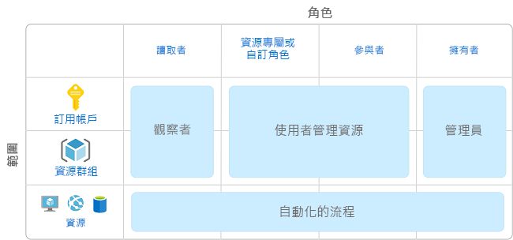
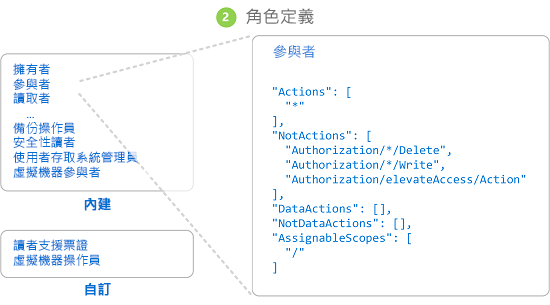
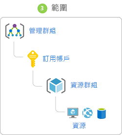
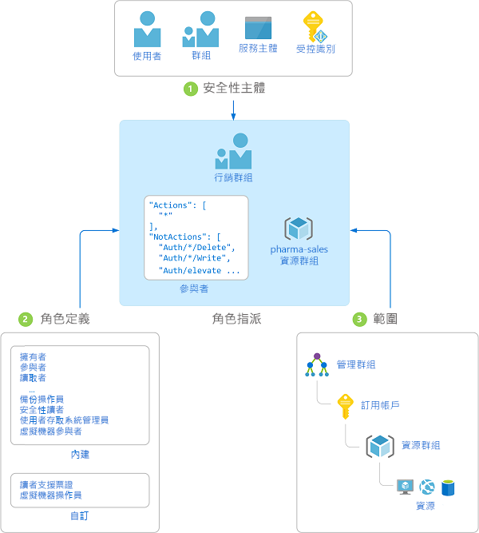

# 什麼是角色型存取控制 (RBAC)？

對於使用雲端的任何組織而言，雲端資源的存取管理是非常重要的功能。 角色型存取控制 (RBAC) 協助您管理可存取 Azure 資源的人員、這些人員如何使用資源，以及他們存取的區域。

RBAC 是建置於 [Azure Resource Manager](../azure-resource-manager/resource-group-overview.md) 上的授權系統，可提供更細緻的 Azure 資源存取管理。

## RBAC 有何用途？

以下是 RBAC 用途的一些例子：

- 允許一位使用者管理訂用帳戶中的虛擬機器，而另一位使用者管理虛擬網路
- 允許 DBA 群組管理訂用帳戶中的 SQL 資料庫
- 允許使用者管理資源群組中的所有資源，例如虛擬機器、網站和子網路
- 允許應用程式存取資源群組中的所有資源

## 使用 RBAC 的最佳做法

RBAC 可讓您區隔小組內的職責，而僅授與使用者執行作業所需的存取權。 您可以不授與每個人 Azure 訂用帳戶或資源中無限制的權限，而是只允許在特定範圍執行特定的動作。

在規劃存取控制策略時，最佳做法是授與使用者完成其工作的最低權限。 下圖顯示使用 RBAC 的建議模式。

## RBAC 的運作方式

您利用 RBAC 來控制資源存取權的方式就是建立角色指派。 這是很重要的概念 – 可讓您了解如何強制執行權限。 角色指派由三項元素所組成：安全性主體、角色定義和範圍。

### 安全性主體

「安全性主體」是一個物件，代表要求存取 Azure 資源的使用者、群組或服務主體。

- 使用者 - 在 Azure Active Directory 中具有設定檔的個人。 您也可以指派角色給其他租用戶中的使用者。 如需有關其他組織中使用者的資訊，請參閱 [Azure Active Directory B2B](/azure/active-directory/active-directory-b2b-what-is-azure-ad-b2b)。
- 群組 - 在 Azure Active Directory 中建立的一組使用者。 當您將角色指派給群組時，該群組內的所有使用者都具有該角色。 
- 服務主體 - 應用程式或服務用來存取特定 Azure 資源的安全性身分識別。 您可以將它視為應用程式的「使用者身分識別」(使用者名稱和密碼或憑證)。

### 角色定義

「角色定義」是權限集合。 有時簡稱為「角色」。 角色定義會列出可執行的作業，例如讀取、寫入和刪除。 角色可為高層級，例如擁有者或特定，例如虛擬機器讀取器。

Azure 包含數個您可使用的[內建角色](built-in-roles.md)。 以下列出四個基本內建角色。 前三個適用於所有資源類型。

- [擁有者](built-in-roles.md#owner) - 具有所有資源的完整存取權，包括將存取權委派給其他人的權限。
- [參與者](built-in-roles.md#contributor) - 可以建立和管理所有類型的 Azure 資源，但是不能將存取權授與其他人。
- [讀者](built-in-roles.md#reader) - 可以檢視現有的 Azure 資源。
- [使用者存取管理員](built-in-roles.md#user-access-administrator) - 讓您管理使用者對 Azure 資源的存取權。

其餘的 RBAC 角色可以管理特定 Azure 資源。 例如，[虛擬機器參與者](built-in-roles.md#virtual-machine-contributor)角色可讓使用者建立和管理虛擬機器。 如果內建的角色無法滿足您組織的特定需求，您可以建立自己的[自訂角色](custom-roles.md)。

Azure 引進了可讓您授與物件內資料存取權的資料作業 (目前處於預覽狀態)。 例如，如果使用者有儲存體帳戶的讀取資料存取權，則他們可讀取該儲存體帳戶中的 Blob 或訊息。 如需詳細資訊，請參閱[了解角色定義](role-definitions.md)。

### 影響範圍

「範圍」是存取權的適用界限。 當您指派角色時，可以藉由定義範圍來進一步限制動作。 如果您想要讓某位使用者成為[網站參與者](built-in-roles.md#website-contributor)，但僅限於某個資源群組，這會很實用。

在 Azure 中，您可以在多個層級指定範圍：[管理群組](../azure-resource-manager/management-groups-overview.md)、訂用帳戶、資源群組或資源。 範圍的結構為父子式關聯性。

當您在父範圍授與存取權時，子範圍將會繼承這些權限。 例如︰

- 如果您在管理群組範圍將[擁有者](built-in-roles.md#owner)角色指派給使用者，該使用者將可對管理群組中所有訂用帳戶的所有項目進行管理。
- 如果您將[讀者](built-in-roles.md#reader)角色指派給訂用帳戶範圍的群組，則該群組的成員可以檢視訂用帳戶中的每個資源群組和資源。
- 如果您將[參與者](built-in-roles.md#contributor)角色指派給資源群組範圍的應用程式，則該應用程式可以管理該資源群組中所有類型的資源，但是無法管理訂用帳戶中的其他資源群組。

### 角色指派

「角色指派」是一個繫結程序，其為了授與存取權，而將角色定義繫結至特定範圍的使用者、群組或服務主體。 建立角色指派可授與存取權，而移除角色指派則可撤銷存取權。

下圖顯示角色指派的範例。 在此範例中，行銷群組已被指派醫藥銷售資源群組的[參與者](built-in-roles.md#contributor)角色。 這表示行銷群組中的使用者可以建立或管理醫藥銷售資源群組中的任何 Azure 資源。 行銷使用者無法存取醫藥銷售資源群組外的資源，除非他們具有另一個角色指派。

您可以使用 Azure 入口網站、Azure CLI、Azure PowerShell、Azure SDK 或 REST API 建立角色指派。 您在每個訂用帳戶中可以有最多 2000 個角色指派。 若要建立和移除角色指派，您必須具有 `Microsoft.Authorization/roleAssignments/*` 權限。 此權限是透過[擁有者](built-in-roles.md#owner)或[使用者存取管理員](built-in-roles.md#user-access-administrator)角色來授與。

## 拒絕指派

在以前，RBAC 為不含拒絕的僅允許模型，但現在，RBAC 會以有限方式支援拒絕指派。 與角色指派相同，「拒絕指派」也會基於拒絕存取權的目的來繫結一組在特定範圍內拒絕使用者、群組或服務主體的動作。 角色指派會定義一組「允許」的動作，而拒絕指派會定義一組「不允許」的動作。 換句話說，拒絕指派會封鎖使用者執行指定的動作，即使角色指派授與他們存取權也一樣。 拒絕指派的優先順序高於角色指派。

目前，拒絕指派是**唯讀的**，而且只能由 Azure 設定。 即使您無法建立自己的拒絕指派，還是可以列出拒絕指派，因為它們可能會影響您的有效權限。 若要取得拒絕指派的相關資訊，您必須擁有 `Microsoft.Authorization/denyAssignments/read` 權限，此權限包含於大部分的[內建角色](built-in-roles.md#owner)中。 如需詳細資訊，請參閱[了解拒絕指派](deny-assignments.md)。

## RBAC 如何判斷使用者是否有權存取資源

以下是 RBAC 在管理平面上用來判斷您是否有權存取資源的概要步驟。 這有助於了解您是否正嘗試對存取問題進行疑難排解。

1. 使用者 (或服務主體) 會取得適用於 Azure Resource Manager 的權杖。

    權杖包含使用者的群組成員資格 (包括可轉移的群組成員資格)。

1. 使用者可以使用附加的權杖，來對 Azure Resource Manager 進行 REST API 呼叫。

1. Azure Resource Manager 會擷取所有角色指派和拒絕指派，以套用到要據以採取動作的資源。

1. Azure Resource Manager 會縮小要套用到此使用者或其群組之角色指派的範圍，並判斷使用者針對此資源需具備哪些角色。

1. Azure Resource Manager 會判斷 API 呼叫中的動作是否包含於使用者針對此資源所具備的角色中。

1. 如果使用者在要求範圍內不具含有該動作的角色，則不會授與存取權。 否則，Azure Resource Manager 會檢查拒絕指派是否適用。

1. 如果拒絕指派適用，則會封鎖存取。 否則會授與存取權。

## 後續步驟

- [快速入門 - 使用 RBAC 與 Azure 入口網站為使用者授與存取權](quickstart-assign-role-user-portal.md)
- [使用 RBAC 和 Azure 入口網站來管理存取權](role-assignments-portal.md)
- [了解 Azure 中的不同角色](rbac-and-directory-admin-roles.md)
