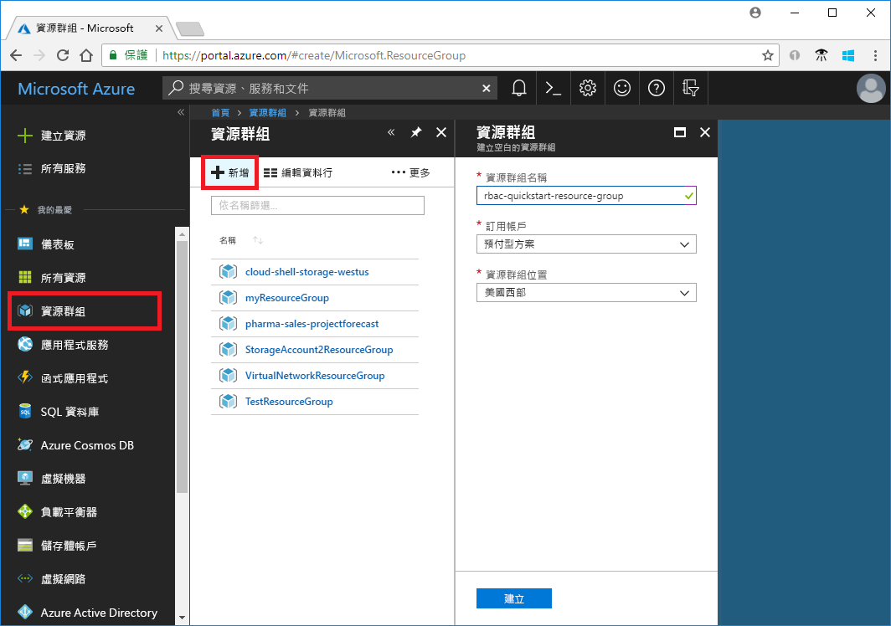
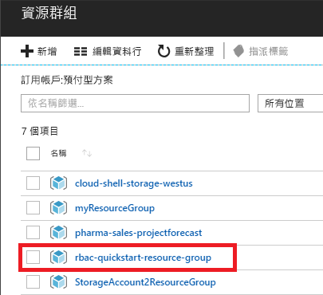
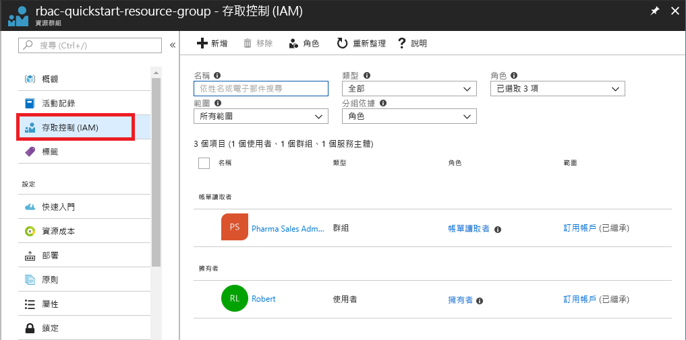
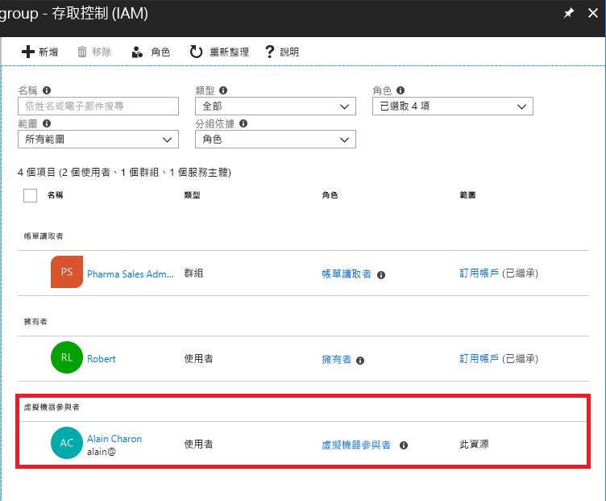
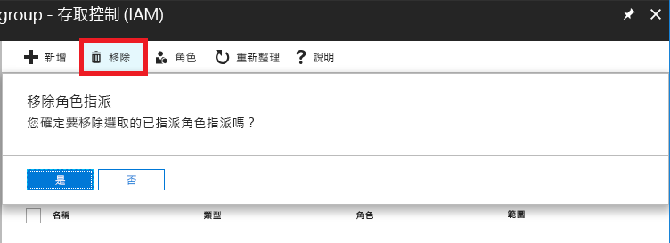
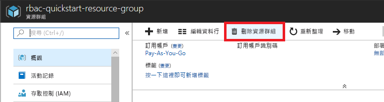

# 教學課程：使用 RBAC 與 Azure 入口網站為使用者授與 Azure 資源的存取權

[角色型存取控制 (RBAC)](overview.md) 是您對 Azure 資源存取進行管理的機制。 在本教學課程中，您可以對使用者授與存取權，讓其在資源群組中建立和管理虛擬機器。

在本教學課程中，您了解如何：

> [!div class="checklist"]
> * 對使用者授與資源群組範圍的存取權
> * 移除存取

如果您沒有 Azure 訂用帳戶，請在開始前建立 [免費帳戶](https://azure.microsoft.com/free/?WT.mc_id=A261C142F) 。

## 登入 Azure

在 https://portal.azure.com 登入 Azure 入口網站。

## 建立資源群組

1. 在導覽清單中，按一下 [資源群組]。

1. 按一下 [新增] 以開啟 [資源群組] 刀鋒視窗。

   

1. 在 [資源群組名稱] 中，輸入 **rbac-resource-group**。

1. 選取訂用帳戶和位置。

1. 按一下 [建立]  以建立資源群組。

1. 按一下 [重新整理] 以重新整理資源群組清單。

   新的資源群組便會出現在資源群組清單中。

   

## 授與存取權

在 RBAC 中，若要授與存取權，您可以建立角色指派。

1. 在 [資源群組] 清單中，按一下新的 **rbac-resource-group** 資源群組。

1. 按一下 [存取控制 (IAM)]。

1. 按一下 [角色指派] 索引標籤，以查看目前的角色指派清單。

   

1. 按一下 [新增] > [新增角色指派]，以開啟 [新增角色指派] 窗格。

   若您沒有指派角色的權限，[新增角色指派] 選項將會被停用。

   ![[新增] 功能表](./media/role-assignments-portal/add-menu.png)

   ![[新增角色指派] 窗格](./media/quickstart-assign-role-user-portal/add-role-assignment.png)

1. 在 [角色] 下拉式清單中選取 [虛擬機器參與者]。

1. 在 [選取] 清單中，選取您自己或其他使用者。

1. 按一下 [儲存] 以建立角色指派。

   一會兒之後，使用者就會在 rbac-resource-group 資源群組範圍內獲派「虛擬機器參與者」角色。

   

## 移除存取

在 RBAC 中，若要移除存取權，您可以移除角色指派。

1. 在 [角色指派] 清單中，在具有「虛擬機器參與者」角色的使用者旁邊新增核取記號。

1. 按一下 [移除] 。

   

1. 在顯示的移除角色指派訊息中，按一下 [是]。

## 清除

1. 在導覽清單中，按一下 [資源群組]。

1. 按一下 **rbac-resource-group** 以開啟資源群組。

1. 按一下 [刪除資源群組] 以刪除資源群組。

   

1. 在 [是否確定刪除] 刀鋒視窗中，輸入資源群組名稱：**rbac-resource-group**。

1. 按一下 [刪除] 以刪除資源群組。

## 後續步驟

> [!div class="nextstepaction"]
> [教學課程：使用 RBAC 與 Azure PowerShell 為使用者授與 Azure 資源的存取權](tutorial-role-assignments-user-powershell.md)

