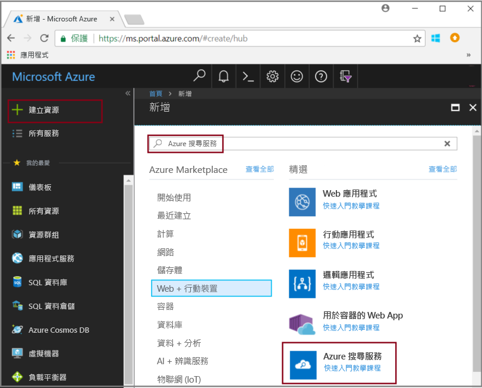
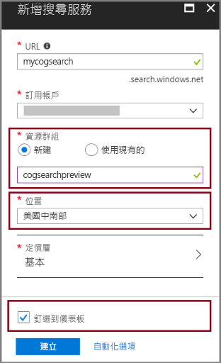
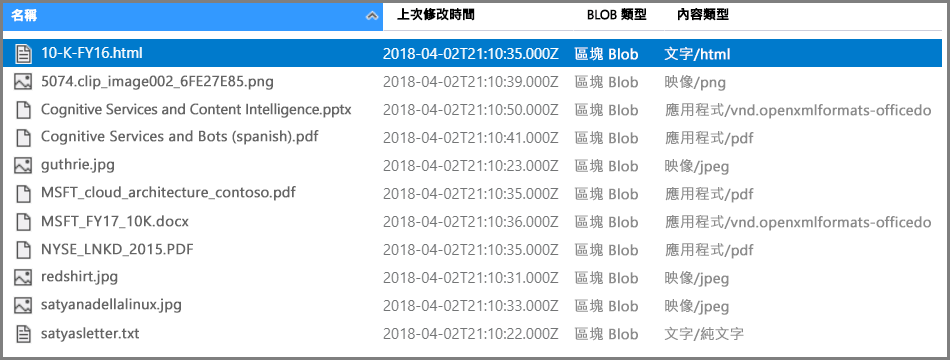
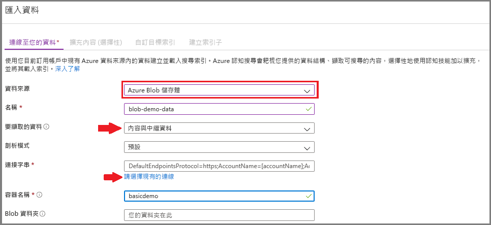
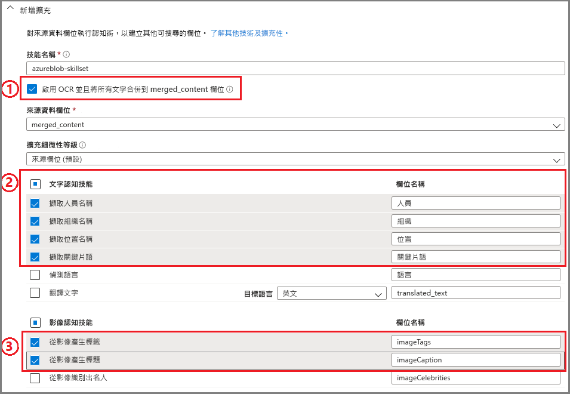
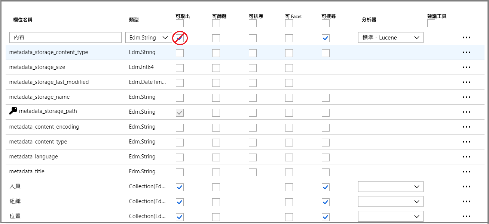
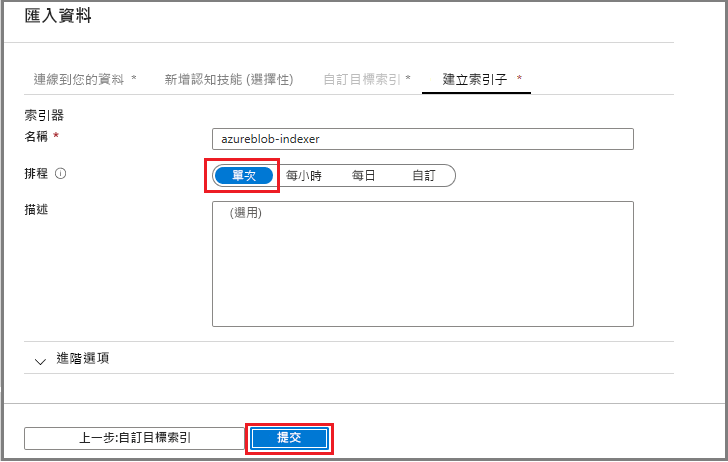
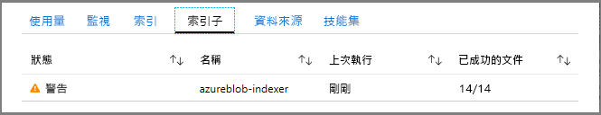
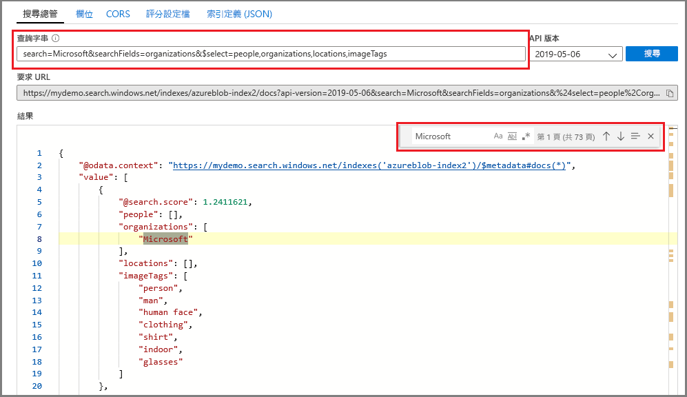

# 快速入門：使用技能和範例資料建立認知搜尋管線

認知搜尋 (預覽) 會將資料擷取、自然語言處理 (NLP) 和影像處理技能新增至 Azure 搜尋服務索引管線，讓無法搜尋或非結構化的內容變得更便於搜尋。 由技能 (例如實體辨識或影像分析) 所建立的資訊會新增至 Azure 搜尋服務的索引中。

在本快速入門中，您會先在 [Azure 入口網站](https://portal.azure.com)中試用擴充管線，然後再撰寫單一程式碼：

* 從使用 Azure blob 儲存體中的範例資料開始
* 設定[匯入資料精靈](search-import-data-portal.md)來編製索引和進行擴充 
* 執行精靈 (會偵測人員、位置和組織的實體技能)
* 使用[搜尋總管](search-explorer.md)來查詢擴充的資料。

您可以在下列區域中建立的 Azure 搜尋服務中嘗試使用認知搜尋：

* 美國中南部
* 西歐

如果您沒有 Azure 訂用帳戶，請在開始前建立 [免費帳戶](https://azure.microsoft.com/free/?WT.mc_id=A261C142F) 。

> [!NOTE]
> 認知搜尋目前為公開預覽狀態。 技能集執行、映像擷取與正規劃目前免費提供。 我們將在不久後宣布這些功能的定價。 

## 必要條件

[「什麼是認知搜尋？」](cognitive-search-concept-intro.md) 介紹擴充架構和元件。 

Azure 服務僅限用於此案例中。 建立所需服務是準備工作的一部分。

+ Azure Blob 儲存體會提供來源資料。
+ Azure 搜尋服務會處理擷取和索引編製、認知服務擴充及全文檢索搜尋查詢。

### 設定 Azure 搜尋服務

首先，請註冊 Azure 搜尋服務。 

1. 使用您的 Azure 帳戶登入 [Azure 入口網站](https://portal.azure.com)。

1. 按一下 [建立資源]，搜尋「Azure Search 搜尋服務」，然後按一下 [建立]。 如果您第一次設定搜尋服務，而且需要更多協助，請參閱[在入口網站中建立 Azure 搜尋服務](search-create-service-portal.md)。

  

1. 針對資源群組，請建立資源群組來包含本快速入門中建立的所有資源。 這可讓您在完成快速入門後，更輕鬆地清除資源。

1. 針對位置，請選擇 [美國中南部] 或 [西歐]。 預覽版本目前只能在這些區域中使用。

1. 針對 [定價層]，您可以建立 [免費] 服務以完成教學課程和快速入門。 若要使用您自己的資料進行深入調查，請建立[付費服務](https://azure.microsoft.com/pricing/details/search/)，例如**基本**或**標準**。 

  「免費」服務僅限使用 3 個索引、上限為 16 MB 的 Blob 大小，以及 2 分鐘的索引編製，這對執行完整認知搜尋功能而言是不夠的。 若要檢視不同層級的限制，請參閱[服務限制](search-limits-quotas-capacity.md)。

  > [!NOTE]
  > 認知搜尋目前為公開預覽狀態。 目前，在所有層級中都可執行技能集，包括免費層。 我們將在不久後宣布此功能的定價。

1. 將服務釘選到儀表板，以快速存取服務資訊。

  

### 設定 Azure Blob 服務並載入範例資料

擴充管線會從 [Azure 搜尋索引子](search-indexer-overview.md)支援的 Azure 資料來源中提取資料。 針對此練習，我們使用 Blob 儲存體來展現多個內容類型。

1. [下載範例資料](https://1drv.ms/f/s!As7Oy81M_gVPa-LCb5lC_3hbS-4)，其中有不同類型的小型檔案集。 

1. 註冊 Azure Blob 儲存體、建立儲存體帳戶、登入儲存體總管，並建立容器。 如需關於上述所有步驟的指示，請參閱 [Azure 儲存體總管快速入門](../storage/blobs/storage-quickstart-blobs-storage-explorer.md)。

1. 使用 Azure 儲存體總管，在您建立的容器中按一下 [上傳]，即可上傳範例檔案。

  

## 建立擴充管線

請返回 Azure 搜尋服務儀表板頁面，按一下命令列上的 [匯入資料]，以四個步驟來設定擴充。

### 步驟 1：建立資料來源

在 [連線到您的資料] > [Azure Blob 儲存體] 中，選取您建立的帳戶和容器。 指定資料來源的名稱，其餘部分則使用預設值。 

   

按一下 [確定] 以建立資料來源。

使用**匯入資料**精靈的其中一個好處是可同時建立索引。 此精靈在建立資料來源時，會同時建構索引結構描述。 建立索引可能需要幾秒鐘的時間。

### 步驟 2：新增認知技能

接著，將擴充步驟新增至管線。 入口網站會提供預先定義的認知技能來分析影像和文字。 在入口網站中，技能集會透過單一來源欄位來運作。 這聽起來像是小目標，但 Azure Blob 的 `content` 欄位包含大部分的 Blob 文件 (例如，Word 文件或 PowerPoint Deck)。 因此，此欄位是理想的輸入，因為其中有 Blob 的所有內容。

有時候您想要從大部分掃描影像 (如掃描程式所產生的 PDF) 所組成的檔案中，擷取文字表示法。 Azure 搜尋服務可以自動從文件中的內嵌影像擷取內容。 若要這樣做，請選取 [啟用 OCR 並將所有文字合併到 merged_content 欄位中] 選項。 這會自動建立 `merged_content` 欄位，其中包含從文件擷取的文字，以及文件中內嵌影像的文字表示法。 當您選取此選項時，`Source data field` 會設定為 `merged_content`。

在 [新增認知技能] 中，選擇執行自然語言處理的技能。 針對本快速入們，請選擇適用於人員、組織和位置的實體辨識。

按一下 [確定] 以接受定義。
   
  

自然語言處理技能會透過範例資料集內的文字內容來運作。 由於我們並未選取任何影像處理選項，因此，本快速入門將不處理在範例資料集中找到的 JPEG 檔。 

### 步驟 3︰設定索引

記得使用資料來源建立的索引嗎？ 在此步驟中，您可以檢視其結構描述，也可能會修改任何設定。 

在本快速入門中，精靈會妥善地設定好合理的預設值： 

+ 每個索引必須有名稱。 針對此資料來源類型，預設名稱是 azureblob-index。

+ 每個文件必須有索引鍵。 精靈會選擇具有唯一值的欄位。 在本快速入門中，索引鍵是 metadata_storage_path。

+ 每個欄位集合中的欄位必須有可描述其值的資料類型，而且每個欄位應具有描述其如何在搜尋案例中使用的索引屬性。 

由於您定義了技能集，精靈會假設您想要來源資料欄位，以及技能所建立的輸出欄位。 基於這個理由，入口網站會新增 `content`、`people`、`organizations` 和 `locations` 的索引欄位。 請注意，精靈會自動為這些欄位啟用「可擷取」和「可搜尋」。

在 [自訂索引] 中，檢閱欄位上的屬性，即可查看其在索引中的使用方式。 「可搜尋」表示可搜尋到某個欄位。 「可擷取」表示它可以在結果中傳回。 

請考慮從 `content` 欄位清除「可擷取」。 在 Blob 中，此欄位可能會有數千行，難以在**搜尋總管**這類工具中讀取。

按一下 [確定] 以接受索引定義。

  

> [!NOTE]
> 為求簡潔，畫面中已刪去未使用的欄位。 如果您正在入口網站中遵循這些指示，您的清單中會顯示其他欄位。

### 步驟 4：設定索引子

索引子是會驅動索引編製程序的高階資源。 它會指定資料來源名稱、索引和執行頻率。 **匯入資料**精靈最終結果一定是您可以重複執行的索引子。

在 [索引子] 頁面上，指定索引子的名稱，然後使用預設的 [執行一次] 以立即執行索引子。 

  

按一下 [確定] 來匯入、擴充及為資料編製索引。

  

編製索引和擴充需要一些時間，這就是為什麼會建議您在初期探索時使用較小的資料集。 您可以在 Azure 入口網站的 [通知] 頁面中監視的索引編製。 

## 在搜尋總管中查詢

建立索引之後，您可以提交查詢以從索引中傳回文件。 在入口網站中，使用**搜尋總管**來執行查詢並檢視結果。 

1. 在搜尋服務儀表板頁面上，按一下命令列上的 [搜尋總管]。

1. 選取頂端的 [變更索引] 以選取您建立的索引。

1. 輸入搜尋字串以查詢索引，例如 "John F. Kennedy"。

結果會以 JSON 傳回，內容可能很詳細但也很難閱讀，尤其是源自於 Azure Blob 的大型文件更是如此。 

如果您無法輕鬆地瀏覽結果，請使用 CTRL-F 來搜尋文件。 對於此查詢，您可在 JSON 內搜尋 "John F. Kennedy"，以檢視該搜尋詞彙的執行個體。 

CTRL-F 也可協助您判斷指定的結果集中有多少文件。 針對 Azure Blob，入口網站會選擇 "metadata_storage_path" 作為索引鍵，因為每個值對文件而言都是唯一的。 使用 CTRL-F 搜尋 "metadata_storage_path，即可取得文件計數。 針對此查詢，結果集中有兩個文件包含 "John F. Kennedy" 詞彙。

  

## 重要摘要

您現在已完成第一個擴充的索引編製練習。 本快速入門的目的是要介紹重要概念，並透過精靈引導您完成步驟，讓您可以使用自己的資料，快速完成認知搜尋解決方案的原型。

我們希望您了解的一些重要概念包括 Azure 資料來源上的相依性。 認知搜尋擴充會受到索引子的約束，而索引子專屬於 Azure 與來源。 雖然本快速入門使用 Azure Blob 儲存體，但您也可使用其他 Azure 資料來源。 如需詳細資訊，請參閱 [Azure 搜尋服務中的索引子](search-indexer-overview.md)。

另一個重要概念是，技能是透過輸入欄位來運作。 在入口網站中，您必須為所有技能選擇單一來源欄位。 在程式碼中，輸入可以是其他欄位或上游技能的輸出。

 技能的輸入會對應到索引中的輸出欄位。 就內部而言，入口網站會設定[註解](cognitive-search-concept-annotations-syntax.md)並定義[技能集](cognitive-search-defining-skillset.md)，以建立作業順序和一般流程。 這些步驟會隱藏在入口網站中，但是當您開始撰寫程式碼時，這些概念就會變得很重要。

最後，您已了解可透過查詢索引來檢視結果。 結果就是 Azure 搜尋服務提供的功能是可搜尋的索引，您可以使用[簡單](https://docs.microsoft.com/rest/api/searchservice/simple-query-syntax-in-azure-search)或[完全展開的查詢語法](https://docs.microsoft.com/rest/api/searchservice/lucene-query-syntax-in-azure-search)來進行查詢。 包含擴充欄位的索引都彼此類似。 如果您想要加入標準或[自訂分析器](search-analyzers.md)、[評分設定檔](https://docs.microsoft.com/rest/api/searchservice/add-scoring-profiles-to-a-search-index)、[同義字](search-synonyms.md)、[多面向篩選](search-filters-facets.md)、地理搜尋，或任何其他 Azure 搜尋功能，您完全可以這麼做。

## 清除資源

如果您的探索已結束，最快速的清除方式是刪除包含 Azure 搜尋服務和 Azure Blob 服務的資源群組。  

如果您將這兩項服務放在相同群組中，現在刪除資源群組表示永久刪除其中所有內容，包括服務與您為此練習建立的任何已儲存內容。 在入口網站中，資源群組名稱位在每個服務的 [概觀] 頁面上。

## 後續步驟

您可以使用不同技能和來源資料欄位重新執行精靈，來實驗索引編製和擴充。 若要重複步驟，請刪除索引和索引子，然後以新的選項組合來重新建立索引子。

+ 在 [概觀] > [索引] 中，選取您建立的索引，然後按一下 [刪除]。

+ 在 [概觀] 中，連按兩下 [索引子] 磚。 找到您建立的索引子，並將它刪除。

或者，重複使用您建立的範例資料和服務，然後在下一個教學課程中，了解如何以程式設計方式執行相同工作。 

> [!div class="nextstepaction"]
> [教學課程：了解認知搜尋 REST API](cognitive-search-tutorial-blob.md)