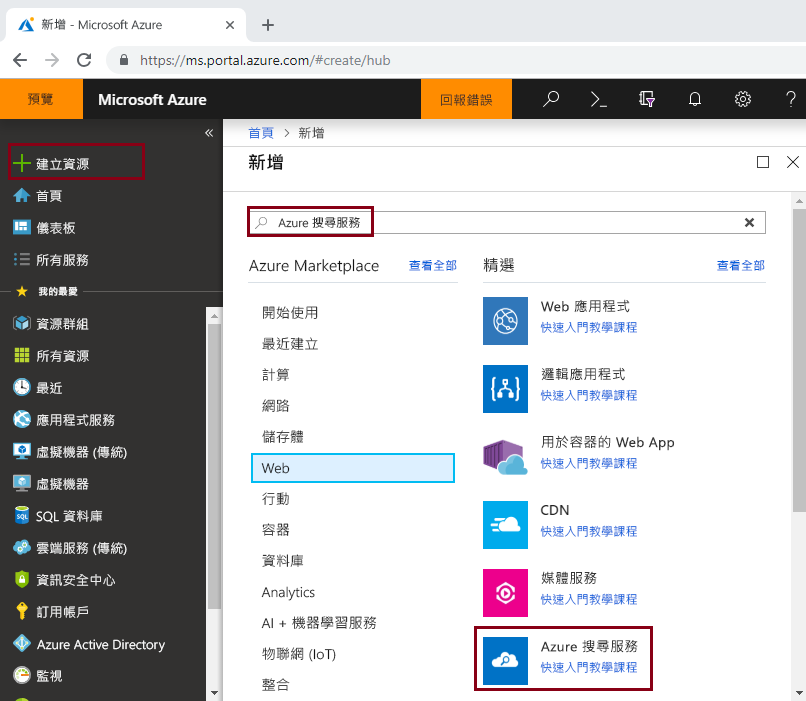
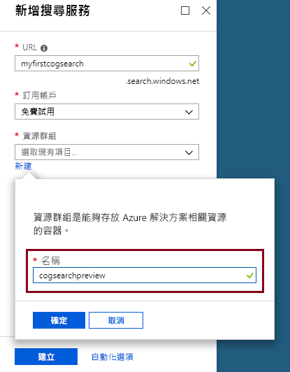

# 快速入門：使用技能和範例資料建立認知搜尋管線

認知搜尋 (預覽) 會將資料擷取、自然語言處理 (NLP) 和影像處理技能新增至 Azure 搜尋服務索引管線，讓無法搜尋或非結構化的內容變得更便於搜尋。 

認知搜尋管線將[認知服務資源](https://azure.microsoft.com/services/cognitive-services/) (例如 [OCR](cognitive-search-skill-ocr.md)、[語言偵測](cognitive-search-skill-language-detection.md)、[實體辨識](cognitive-search-skill-entity-recognition.md)) 整合到編製索引程序中。 認知服務的 AI 演算法用來尋找來源資料中的模式、特徵和特性，傳回結構和文字內容，這些資訊可用於以 Azure 搜尋服務為基礎的全文檢索搜尋解決方案。

在本快速入門中，您會先在 [Azure 入口網站中](https://portal.azure.com)建立擴充管線，然後再撰寫單一行程式碼：

> [!div class="checklist"]
> * 從使用 Azure blob 儲存體中的範例資料開始
> * 設定[**匯入資料**](search-import-data-portal.md)精靈來進行認知編製索引和進行擴充 
> * 執行精靈 (會偵測人員、位置和組織的實體技能)
> * 使用[**搜尋總管**](search-explorer.md)來查詢擴充的資料

## 支援的區域

您可以在下列區域中建立的 Azure 搜尋服務中嘗試使用認知搜尋：

* 美國中西部
* 美國中南部
* 美國東部
* 美國東部 2
* 美國西部 2
* 加拿大中部
* 西歐
* 英國南部
* 北歐
* 巴西南部
* 東南亞
* 印度中部
* 澳洲東部

如果您沒有 Azure 訂用帳戶，請在開始前建立 [免費帳戶](https://azure.microsoft.com/free/?WT.mc_id=A261C142F) 。

> [!NOTE]
> 從 2018 年 12 月 21 日開始，您可以在認知服務資源與 Azure 搜尋服務的技能集之間建立關聯。 這可讓我們開始收取執行技能集的費用。 自這個日期起，我們也會開始收取文件萃取階段的影像擷取費用。 從文件中擷取文字的功能則繼續免費提供。
>
> 內建技能的執行會依現行的[認知服務隨用隨附價格](https://azure.microsoft.com/pricing/details/cognitive-services/)收費。 影像擷取定價會依預覽定價收費，如 [Azure 搜尋服務定價頁面](https://go.microsoft.com/fwlink/?linkid=2042400)所述。 [深入](cognitive-search-attach-cognitive-services.md)了解。

## 必要條件

[「什麼是認知搜尋？」](cognitive-search-concept-intro.md) 介紹擴充架構和元件。 

Azure 服務僅限用於此案例中。 建立所需服務是準備工作的一部分。

+ [Azure Blob 儲存體](https://azure.microsoft.com/services/storage/blobs/)會提供來源資料
+ [認知服務](https://azure.microsoft.com/services/cognitive-services/) 提供 AI (您可在指定管線時建立這些資源)
+ [Azure 搜尋服務](https://azure.microsoft.com/services/search/)提供擴充編製索引管線和豐富的自由格式文字搜尋體驗，讓使用者在自訂應用程式中使用

### 設定 Azure 搜尋服務

首先，請註冊 Azure 搜尋服務。 

1. 使用您的 Azure 帳戶登入 [Azure 入口網站](https://portal.azure.com)。

1. 按一下 [建立資源]，搜尋「Azure Search 搜尋服務」，然後按一下 [建立]。 如果您第一次設定搜尋服務，而且需要更多協助，請參閱[在入口網站中建立 Azure 搜尋服務](search-create-service-portal.md)。

  

1. 針對資源群組，請建立新的資源群組來包含本快速入門中建立的所有資源。 這可讓您在完成快速入門後，更輕鬆地清除資源。

1. 針對位置，請選擇其中一個[支援的區域](#supported-regions)以進行認知搜尋。

1. 針對 [定價層]，您可以建立 [免費] 服務以完成教學課程和快速入門。 若要使用您自己的資料進行深入調查，請建立[付費服務](https://azure.microsoft.com/pricing/details/search/)，例如**基本**或**標準**。 

  「免費」服務僅限使用 3 個索引、上限為 16 MB 的 Blob 大小，以及 2 分鐘的索引編製，這對執行完整認知搜尋功能而言是不夠的。 若要檢視不同層級的限制，請參閱[服務限制](search-limits-quotas-capacity.md)。

  

  > [!NOTE]
  > 認知搜尋目前為公開預覽狀態。 目前，在所有層級中都可執行技能集，包括免費層。 不與付費的認知服務資源建立關聯，您可以執行的擴充數目有限。 [深入](cognitive-search-attach-cognitive-services.md)了解。

1. 將服務釘選到儀表板，以快速存取服務資訊。

  

### 設定 Azure Blob 服務並載入範例資料

擴充管線會從 [Azure 搜尋索引子](search-indexer-overview.md)支援的 Azure 資料來源中提取資料。 請注意，認知服務不支援 Azure 表格儲存體。 針對此練習，我們會使用 Blob 儲存體來展現多個內容類型。

1. [下載範例資料](https://1drv.ms/f/s!As7Oy81M_gVPa-LCb5lC_3hbS-4)，其中有不同類型的小型檔案集。 

1. 註冊 Azure Blob 儲存體、建立儲存體帳戶、開啟 Blob 服務夜面，以及建立容器。 在容器上，將公用存取層級設為 [容器]。 如需詳細資訊，請參閱*搜尋非結構化資料*教學課程中的[建立容器一節](../storage/blobs/storage-unstructured-search.md#create-a-container)。

1. 在您建立的 容器中，按一下 [上傳] 以上傳您在上一步中下載的範例檔案。

  

## 建立擴充管線

返回 Azure 搜尋服務儀表板頁面，按一下命令列上的 [匯入資料]，以四個步驟來設定認知擴充。

  

### 步驟 1：建立資料來源

在 [連線到您的資料] 中，選擇 [Azure Blob 儲存體]，選取您建立的帳戶和容器。 指定資料來源的名稱，其餘部分則使用預設值。 

  

繼續進行下一頁。

  

### 步驟 2：新增認知技能

接著，將擴充步驟新增至管線。 如果您沒有認知服務資源，可以註冊免費版，其可提供您每天 20 筆交易。 範例資料包含 14 個檔案，因此您一旦執行此精靈，就幾乎用盡每日配置。

1. 展開 [附加認知服務] 以檢視認知服務 API 的資源處理選項。 針對本教學課程的目的，您可以使用**免費**資源。

  

2. 展開 [新增擴充] 然後選取可執行自然語言處理的技能。 針對本快速入們，請選擇適用於人員、組織和位置的實體辨識。

  

  入口網站提供 OCR 處理和文字分析的內建技能。 在入口網站中，技能集會透過單一來源欄位來運作。 這聽起來像是小目標，但 Azure Blob 的 `content` 欄位包含大部分的 Blob 文件 (例如，Word 文件或 PowerPoint Deck)。 因此，此欄位是理想的輸入，因為其中有 Blob 的所有內容。

3. 繼續進行下一頁。

  

> [!NOTE]
> 自然語言處理技能會透過範例資料集內的文字內容來運作。 由於我們並未選取 OCR 選項，在範例資料集中找到的 JPEG 和 PNG 檔案將不會在此快速入門中處理。 

### 步驟 3：設定索引

此精靈通常可以推斷預設索引。 在此步驟中，您可以檢視所產生的索引結構描述，也可能會修改任何設定。 以下是針對示範 Blob 資料集所建立的預設索引。

在本快速入門中，精靈會妥善地設定好合理的預設值： 

+ 預設名稱是 *azureblob-index*。
+ 預設索引鍵是 *metadata_storage_path* (此欄位包含唯一值)。
+ 預設資料類型和屬性在全文檢索搜尋案例中是有效的。

請考慮清除 `content` 欄位的 [可擷取]。 在 Blob 中，此欄位可能有數千行。 您可以想像在搜尋結果清單中，以 JSON 方式檢視含有大量內容的檔案 (例如 Word 文件或 PowerPoint 投影片組) 有多麼困難。 

由於您定義了技能集，精靈會假設您想要原始的來源資料欄位，以及認知管線所建立的輸出欄位。 基於這個理由，入口網站會新增 `content`、`people`、`organizations` 和 `locations` 的索引欄位。 請注意，精靈會自動為這些欄位啟用「可擷取」和「可搜尋」。 「可搜尋」表示可搜尋到某個欄位。 「可擷取」表示它可以在結果中傳回。 

  
  
繼續進行下一頁。

  

### 步驟 4：設定索引子

索引子是會驅動索引編製程序的高階資源。 它會指定資料來源名稱、目標索引和執行頻率。 **匯入資料**精靈最終結果一定是您可以重複執行的索引子。

在 [索引子] 頁面上，您可以接受預設名稱，並使用 [執行一次] 排程選項來立即執行它。 

  

按一下 [提交] 以建立並同時執行索引子。

## 監視編製索引

擴充步驟需要比一般文字索引更長的時間來完成。 精靈應該會在 [概觀] 頁面中開啟索引子清單，方便您追蹤進度。 若要自行瀏覽，請移至 [概觀] 頁面，然後按一下 [索引子]。

因為 JPG 和 PNG 檔是影像檔案，而我們在此管線中省略了 OCR 技能，因此會發生警告。 您也可以找到截斷通知。 Azure 搜尋服務在免費層的擷取限制為 32,000 個字元。

  

編製索引和擴充需要一些時間，這就是為什麼會建議您在初期探索時使用較小的資料集。 

## 在搜尋總管中查詢

建立索引之後，您可以提交查詢以從索引中傳回文件。 在入口網站中，使用**搜尋總管**來執行查詢並檢視結果。 

1. 在搜尋服務儀表板頁面上，按一下命令列上的 [搜尋總管]。

1. 選取頂端的 [變更索引] 以選取您建立的索引。

1. 輸入搜尋字串以查詢索引，例如 `search=Microsoft&searchFields=organizations`。

結果會以 JSON 傳回，內容可能很詳細但也很難閱讀，尤其是源自於 Azure Blob 的大型文件更是如此。 如果您無法輕鬆地瀏覽結果，請使用 CTRL-F 來搜尋文件。 針對此查詢，您可以在 JSON 中搜尋特定字詞。 

CTRL-F 也可協助您判斷指定的結果集中有多少文件。 針對 Azure Blob，入口網站會選擇 "metadata_storage_path" 作為索引鍵，因為每個值對文件而言都是唯一的。 使用 CTRL-F 搜尋 "metadata_storage_path，即可取得文件計數。 

  

## 重要心得

您現在已完成第一個擴充的認知索引編製練習。 本快速入門的目的是要介紹重要概念，並透過精靈引導您完成步驟，讓您可以使用自己的資料，快速完成認知搜尋解決方案的原型。

我們希望您了解的一些重要概念包括 Azure 資料來源上的相依性。 認知搜尋擴充會受到索引子的約束，而索引子專屬於 Azure 與來源。 雖然本快速入門使用 Azure Blob 儲存體，但您也可使用其他 Azure 資料來源。 如需詳細資訊，請參閱 [Azure 搜尋服務中的索引子](search-indexer-overview.md)。

另一個重要概念是，技能是透過輸入欄位來運作。 在入口網站中，您必須為所有技能選擇單一來源欄位。 在程式碼中，輸入可以是其他欄位或上游技能的輸出。

 技能的輸入會對應到索引中的輸出欄位。 就內部而言，入口網站會設定[註解](cognitive-search-concept-annotations-syntax.md)並定義[技能集](cognitive-search-defining-skillset.md)，以建立作業順序和一般流程。 這些步驟會隱藏在入口網站中，但是當您開始撰寫程式碼時，這些概念就會變得很重要。

最後，您已了解可透過查詢索引來檢視結果。 結果就是 Azure 搜尋服務提供的功能是可搜尋的索引，您可以使用[簡單](https://docs.microsoft.com/rest/api/searchservice/simple-query-syntax-in-azure-search)或[完全展開的查詢語法](https://docs.microsoft.com/rest/api/searchservice/lucene-query-syntax-in-azure-search)來進行查詢。 包含擴充欄位的索引都彼此類似。 如果您想要加入標準或[自訂分析器](search-analyzers.md)、[評分設定檔](https://docs.microsoft.com/rest/api/searchservice/add-scoring-profiles-to-a-search-index)、[同義字](search-synonyms.md)、[多面向篩選](search-filters-facets.md)、地理搜尋，或任何其他 Azure 搜尋功能，您完全可以這麼做。

## 清除資源

如果您的探索已結束，最快速的清除方式是刪除包含 Azure 搜尋服務和 Azure Blob 服務的資源群組。  

如果您將這兩項服務放在相同群組中，現在刪除資源群組表示永久刪除其中所有內容，包括服務與您為此練習建立的任何已儲存內容。 在入口網站中，資源群組名稱位在每個服務的 [概觀] 頁面上。

## 後續步驟

根據您佈建認知服務資源的方式，您可以使用不同技能和來源資料欄位重新執行精靈，來實驗索引編製和擴充。 若要重複步驟，請刪除索引和索引子，然後以新的選項組合來重新建立索引子。

+ 在 [概觀] > [索引] 中，選取您建立的索引，然後按一下 [刪除]。

+ 在 [概觀] 中，連按兩下 [索引子] 磚。 找到您建立的索引子，並將它刪除。

或者，重複使用您建立的範例資料和服務，然後在下一個教學課程中，了解如何以程式設計方式執行相同工作。 

> [!div class="nextstepaction"]
> [教學課程：了解認知搜尋 REST API](cognitive-search-tutorial-blob.md)
