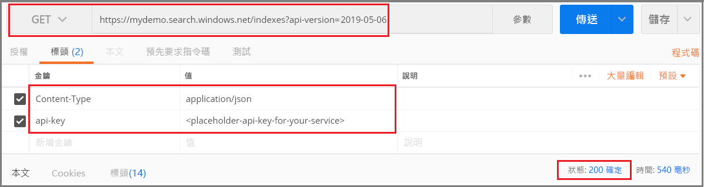

# <a name="tutorial-add-structure-to-unstructured-content-with-cognitive-search"></a>教學課程：使用認知搜尋將結構新增至「非結構化內容」

如果您有非結構化的文字或影像，Azure 搜尋服務的[認知搜尋](cognitive-search-concept-intro.md)功能可協助您擷取資訊，並建立適用於全文檢索搜尋或知識挖掘案例的新內容。 雖然認知搜尋可以處理影像檔案 (JPG、PNG、TIFF)，但本教學課程著重於文字內容，並且會套用語言偵測和文字分析來建立可用於查詢、Facet 和篩選的新欄位和資訊。

> [!div class="checklist"]
> * 我們將從 Azure Blob 儲存體中的完整文件 (非結構化文字) 開始，例如 PDF、MD、DOCX 和 PPTX。
> * 建立管線來擷取文字、偵測語言、辨識實體及偵測關鍵片語。
> * 定義用來儲存輸出的索引 (原始內容加上管線產生的名稱/值組)。
> * 執行用來建立和載入索引的管線。
> * 使用全文檢索搜尋和豐富的查詢語法來探索內容。

您將需要數個服務來完成此逐步解說，以及使用 [Postman 傳統型應用程式](https://www.getpostman.com/)或另一個 Web 測試工具來進行 REST API 呼叫。 

如果您沒有 Azure 訂用帳戶，請在開始前開啟[免費帳戶](https://azure.microsoft.com/free/?WT.mc_id=A261C142F)。

## <a name="download-files"></a>下載檔案

1. 開啟此 [OneDrive 資料夾](https://1drv.ms/f/s!As7Oy81M_gVPa-LCb5lC_3hbS-4)，然後在左上角按一下 [下載]  ，將檔案複製到您的電腦。 

1. 以滑鼠右鍵按一下 ZIP 檔案並選取 [全部解壓縮]  。 其中有 14 個不同類型的檔案。 在此練習中，您將使用 7 個檔案。

## <a name="1---create-services"></a>1 - 建立服務

本逐步解說會使用 Azure 搜尋服務進行索引編製和查詢、將認知服務用於 AI 擴充，以及使用 Azure Blob 儲存體來提供資料。 為具備鄰近性和管理方面的優勢，如果可能，請在相同的區域和資源群組中建立這三項服務。 實際上，您的 Azure 儲存體帳戶可以位在任何區域中。

### <a name="start-with-azure-storage"></a>開始使用 Azure 儲存體

1. [登入 Azure 入口網站](https://portal.azure.com/)，然後按一下 [+ 建立資源]  。

1. 搜尋「儲存體帳戶」  ，然後選取 Microsoft 的儲存體帳戶供應項目。

   

1. 在 [基本] 索引標籤中，需要下列項目。 接受所有其他項目的預設值。

   + **資源群組**。 選取現有群組或建立一個新的群組，但必須對所有服務使用相同的群組，以便您一起管理這些服務。

   + **儲存體帳戶名稱**。 如果您認為您可能會有多個相同類型的資源，請透過名稱在類型和區域上做出區別，例如 blobstoragewestus  。 

   + **位置**。 可能的話，請選擇用於 Azure 搜尋服務和認知服務的相同位置。 單一位置可避免產生頻寬費用。

   + **帳戶種類**。 選擇預設值 [StorageV2 (一般用途 v2)]  。

1. 按一下 [檢閱 + 建立]  以建立服務。

1. 建立後，按一下 [移至資源]  以開啟 [概觀] 頁面。

1. 按一下 [Blob]  服務。

1. 按一下 [+ 容器]  來建立容器，並將其命名為 cog-search-demo  。

1. 選取 [cog-search-demo]  ，然後按一下 [上傳]  以開啟其中儲存下載檔案的資料夾。 選取所有非影像檔案。 您應該會有 7 個檔案。 按一下 [確定]  來上傳。

   

1. 在您離開 Azure 儲存體之前，請取得連接字串，以便在 Azure 搜尋服務中制定連線。 

   1. 往回瀏覽到儲存體帳戶的 [概觀] 頁面 (我們使用 blobstragewestus  作為範例)。 
   
   1. 在左側導覽窗格中，選取 [存取金鑰]  並複製其中一個連接字串。 

   連接字串應為類似於下列範例的 URL：

      ```http
      DefaultEndpointsProtocol=https;AccountName=cogsrchdemostorage;AccountKey=<your account key>;EndpointSuffix=core.windows.net
      ```

1. 將連接字串儲存到記事本。 您稍後設定資料來源連線時會用到該字串。

### <a name="cognitive-services"></a>認知服務

認知搜尋中的 AI 擴充是以認知服務為後盾，包括用於自然語言和影像處理的文字分析和電腦視覺。 如果您的目標是要完成實際的原型或專案，您將在此時佈建認知服務 (位於 Azure 搜尋服務所在的區域)，以便您將其連結至索引作業。

不過，在此練習中，您可以略過資源佈建，因為 Azure 搜尋服務可以在幕後連線到認知服務，並為每個索引子執行提供 20 個免費交易。 由於本教學課程會使用 7 筆交易，因此使用免費配置就已足夠。 針對較大型的專案，請考慮以隨用隨付 S0 層來佈建認知服務。 如需詳細資訊，請參閱[連結認知服務](cognitive-search-attach-cognitive-services.md)。

### <a name="azure-search"></a>Azure 搜尋服務

第三個元件是 Azure 搜尋服務，您可以[在入口網站中建立該服務](search-create-service-portal.md)。 您可以使用免費層來完成此逐步解說。 

如同 Azure Blob 儲存體，請花點時間來收集存取金鑰。 此外，當您開始結構化要求時，您必須提供用來驗證每個要求的端點和管理員 API 金鑰。

### <a name="get-an-admin-api-key-and-url-for-azure-search"></a>取得 Azure 搜尋服務的管理員 API 金鑰和 URL

1. [登入 Azure 入口網站](https://portal.azure.com/)，並在搜尋服務的 [概觀]  頁面中取得您的搜尋服務名稱。 您可藉由檢閱端點 URL 來確認您的服務名稱。 如果您的端點 URL 為 `https://mydemo.search.windows.net`，您的服務名稱會是 `mydemo`。

2. 在 [設定]   >  [金鑰]  中，取得服務上完整權限的管理金鑰。 可互換的管理金鑰有兩個，可在您需要變換金鑰時提供商務持續性。 您可以在新增、修改及刪除物件的要求上使用主要或次要金鑰。

    一併取得查詢金鑰。 最佳做法是發出具有唯讀存取權的查詢要求。


在傳送至您服務的每個要求的標頭中都需要有 api-key。 有效的金鑰能為每個要求在傳送要求之應用程式與處理要求的服務間建立信任。

## <a name="2---set-up-postman"></a>2 - 設定 Postman

啟動 Postman 及設定 HTTP 要求。 如果您不熟悉此工具，請參閱[使用 Postman 探索 Azure 搜尋服務 REST API](search-get-started-postman.md)。

本教學課程中使用的要求方法為 **POST**、**PUT** 和 **GET**。 您將使用這些方法來對您的搜尋服務進行四個 API 呼叫：建立資料來源、技能集、索引及索引子。

在標頭中，將 "Content-type" 設定為 `application/json`，以及將 `api-key` 設定為您 Azure 搜尋服務的管理員 API 金鑰。 設定標頭之後，您就可以在此練習中的每個要求上加以使用。

  

## <a name="3---create-the-pipeline"></a>3 - 建立管線

在 Azure 搜尋服務中，AI 處理會在編製索引 (或資料內嵌) 期間進行。 逐步解說的這個部分會建立四個物件：資料來源、索引定義、技能集、索引子。 

### <a name="step-1-create-a-data-source"></a>步驟 1：建立資料來源

[資料來源物件](https://docs.microsoft.com/rest/api/searchservice/create-data-source)會對包含檔案的 Blob 容器提供連接字串。

1. 使用 **POST** 和下列 URL，並將 YOUR-SERVICE-NAME 取代為您服務的實際名稱。

   ```http
   https://[YOUR-SERVICE-NAME].search.windows.net/datasources?api-version=2019-05-06
   ```

1. 在要求**本文**中，複製下列 JSON 定義，並將 `connectionString` 取代為您儲存體帳戶的實際連接字串。 

   請記得也要編輯容器名稱。 我們建議您使用先前步驟中的 "cog-search-demo" 作為容器名稱。

    ```json
    {
      "name" : "cog-search-demo-ds",
      "description" : "Demo files to demonstrate cognitive search capabilities.",
      "type" : "azureblob",
      "credentials" :
      { "connectionString" :
        "DefaultEndpointsProtocol=https;AccountName=<YOUR-STORAGE-ACCOUNT>;AccountKey=<YOUR-ACCOUNT-KEY>;"
      },
      "container" : { "name" : "<YOUR-BLOB-CONTAINER-NAME>" }
    }
    ```
1. 傳送要求。 您應該會看到確認成功的狀態碼 201。 

如果發生 403 或 404 錯誤，請檢查要求建構：`api-version=2019-05-06` 位於端點上，`api-key` 應位於標頭中的 `Content-Type` 後面，且其值必須是適用於搜尋服務的值。 您可以透過線上 JSON 驗證程式執行 JSON 文件，以確定語法正確無誤。 

### <a name="step-2-create-a-skillset"></a>步驟 2：建立技能集

[技能集物件](https://docs.microsoft.com/rest/api/searchservice/create-skillset)是一組套用至內容的擴充步驟。 

1. 使用 **PUT** 和下列 URL，並將 YOUR-SERVICE-NAME 取代為您服務的實際名稱。

    ```http
    https://[YOUR-SERVICE-NAME].search.windows.net/skillsets/cog-search-demo-ss?api-version=2019-05-06
    ```

1. 在要求**本文**中，複製下列 JSON 定義。 此技能集包含下列內建技能。

   | 技能                 | 說明    |
   |-----------------------|----------------|
   | [實體辨識](cognitive-search-skill-entity-recognition.md) | 從 Blob 容器中的內容擷取人員、組織及位置名稱。 |
   | [語言偵測](cognitive-search-skill-language-detection.md) | 偵測內容的語言。 |
   | [文字分割](cognitive-search-skill-textsplit.md)  | 在呼叫關鍵片語擷取技能之前，將大型內容分成較小的區塊。 關鍵片語擷取可接受不超過 50,000 個字元的輸入。 有些範例檔案需要進行分割，以符合這項限制。 |
   | [關鍵片語擷取](cognitive-search-skill-keyphrases.md) | 提取前幾個關鍵片語。 |

   每項技術會分別對文件的內容執行。 在處理期間，Azure 搜尋服務會萃取每份文件，以讀取不同檔案格式的內容。 找到來自來源檔案的文字時，會將文字放入產生的 ```content``` 欄位中，每份文件一個欄位。 因此，輸入會變成 ```"/document/content"```。

   針對關鍵片語的擷取，因為我們使用文字分隔器技能將較大的檔案分成多個頁面，所以關鍵片語擷取技能的內容會是 ```"document/pages/*"```，而不是 ```"/document/content"```。

    ```json
    {
      "description": "Extract entities, detect language and extract key-phrases",
      "skills":
      [
        {
          "@odata.type": "#Microsoft.Skills.Text.EntityRecognitionSkill",
          "categories": [ "Person", "Organization", "Location" ],
          "defaultLanguageCode": "en",
          "inputs": [
            { "name": "text", "source": "/document/content" }
          ],
          "outputs": [
            { "name": "persons", "targetName": "persons" },
            { "name": "organizations", "targetName": "organizations" },
            { "name": "locations", "targetName": "locations" }
          ]
        },
        {
          "@odata.type": "#Microsoft.Skills.Text.LanguageDetectionSkill",
          "inputs": [
            { "name": "text", "source": "/document/content" }
          ],
          "outputs": [
            { "name": "languageCode", "targetName": "languageCode" }
          ]
        },
        {
          "@odata.type": "#Microsoft.Skills.Text.SplitSkill",
          "textSplitMode" : "pages",
          "maximumPageLength": 4000,
          "inputs": [
            { "name": "text", "source": "/document/content" },
            { "name": "languageCode", "source": "/document/languageCode" }
          ],
          "outputs": [
            { "name": "textItems", "targetName": "pages" }
          ]
        },
        {
          "@odata.type": "#Microsoft.Skills.Text.KeyPhraseExtractionSkill",
          "context": "/document/pages/*",
          "inputs": [
            { "name": "text", "source": "/document/pages/*" },
            { "name":"languageCode", "source": "/document/languageCode" }
          ],
          "outputs": [
            { "name": "keyPhrases", "targetName": "keyPhrases" }
          ]
        }
      ]
    }
    ```
    以下顯示技能集的圖形化表示法。 

    

1. 傳送要求。 Postman 應該會傳回確認成功的狀態碼 201。 

> [!NOTE]
> 輸出可以對應至索引、作為下游技能的輸入，或在使用語言代碼時同時作為對應和輸入。 在索引中，語言代碼可用於篩選。 作為輸入時，文字分析技能會使用語言代碼指出斷字方面的語言規則。 如需技能集基本概念的詳細資訊，請參閱[如何定義技能集](cognitive-search-defining-skillset.md)。

### <a name="step-3-create-an-index"></a>步驟 3：建立索引

[索引](https://docs.microsoft.com/rest/api/searchservice/create-index)會提供架構，用來在 Azure 搜尋服務的反向索引和其他建構中建立內容的實體運算式。 索引的最大元件是欄位集合，其中的資料類型和屬性會決定 Azure 搜尋服務中的內容和行為。

1. 使用 **PUT** 和下列 URL，並將 YOUR-SERVICE-NAME 取代為您服務的實際名稱，以命名您的索引。

   ```http
   https://[YOUR-SERVICE-NAME].search.windows.net/indexes/cog-search-demo-idx?api-version=2019-05-06
   ```

1. 在要求**本文**中，複製下列 JSON 定義。 `content` 欄位會儲存文件本身。 `languageCode`、`keyPhrases` 和 `organizations` 的其他欄位代表技能集所建立的新資訊 (欄位和值)。

    ```json
    {
      "fields": [
        {
          "name": "id",
          "type": "Edm.String",
          "key": true,
          "searchable": true,
          "filterable": false,
          "facetable": false,
          "sortable": true
        },
        {
          "name": "metadata_storage_name",
          "type": "Edm.String",
          "searchable": false,
          "filterable": false,
          "facetable": false,
          "sortable": false
        },
        {
          "name": "content",
          "type": "Edm.String",
          "sortable": false,
          "searchable": true,
          "filterable": false,
          "facetable": false
        },
        {
          "name": "languageCode",
          "type": "Edm.String",
          "searchable": true,
          "filterable": false,
          "facetable": false
        },
        {
          "name": "keyPhrases",
          "type": "Collection(Edm.String)",
          "searchable": true,
          "filterable": false,
          "facetable": false
        },
        {
          "name": "persons",
          "type": "Collection(Edm.String)",
          "searchable": true,
          "sortable": false,
          "filterable": true,
          "facetable": true
        },
        {
          "name": "organizations",
          "type": "Collection(Edm.String)",
          "searchable": true,
          "sortable": false,
          "filterable": true,
          "facetable": true
        },
        {
          "name": "locations",
          "type": "Collection(Edm.String)",
          "searchable": true,
          "sortable": false,
          "filterable": true,
          "facetable": true
        }
      ]
    }
    ```

1. 傳送要求。 Postman 應該會傳回確認成功的狀態碼 201。 

### <a name="step-4-create-and-run-an-indexer"></a>步驟 4：建立及執行索引子

[索引子](https://docs.microsoft.com/rest/api/searchservice/create-indexer)會驅動管線。 到目前為止所建立的三個元件 (資料來源、技能集、索引) 都是索引子的輸入。 在 Azure 搜尋服務上建立索引子是用以啟動整個管線的事件。 

1. 使用 **PUT** 和下列 URL，並將 YOUR-SERVICE-NAME 取代為您服務的實際名稱，以命名您的索引子。

   ```http
   https://[servicename].search.windows.net/indexers/cog-search-demo-idxr?api-version=2019-05-06
   ```

1. 在要求**本文**中，複製下列 JSON 定義。 請注意欄位對應元素；這些對應會定義資料流程，所以很重要。 

   `fieldMappings` 會在技能集之前進行處理，用來將資料來源中的內容傳送到索引中的目標欄位。 您會使用欄位對應將已修改的現有內容傳送至索引。 如果兩端上的欄位名稱和類型都相同，則不需要任何對應。

   `outputFieldMappings` 會用於技能所建立的欄位，因此會在技能集執行後處理。 針對 `outputFieldMappings`中 `sourceFieldNames` 的參考項目，當您從文件萃取或擴充中建立這些項目之後，這些項目才會存在。 `targetFieldName` 是索引中的欄位，定義於索引結構描述中。

    ```json
    {
      "name":"cog-search-demo-idxr",    
      "dataSourceName" : "cog-search-demo-ds",
      "targetIndexName" : "cog-search-demo-idx",
      "skillsetName" : "cog-search-demo-ss",
      "fieldMappings" : [
        {
          "sourceFieldName" : "metadata_storage_path",
          "targetFieldName" : "id",
          "mappingFunction" :
            { "name" : "base64Encode" }
        },
        {
          "sourceFieldName" : "metadata_storage_name",
          "targetFieldName" : "metadata_storage_name",
          "mappingFunction" :
            { "name" : "base64Encode" }
        },
        {
          "sourceFieldName" : "content",
          "targetFieldName" : "content"
        }
      ],
      "outputFieldMappings" :
      [
        {
          "sourceFieldName" : "/document/persons",
          "targetFieldName" : "persons"
        },
        {
          "sourceFieldName" : "/document/organizations",
          "targetFieldName" : "organizations"
        },
        {
          "sourceFieldName" : "/document/locations",
          "targetFieldName" : "locations"
        },
        {
          "sourceFieldName" : "/document/pages/*/keyPhrases/*",
          "targetFieldName" : "keyPhrases"
        },
        {
          "sourceFieldName": "/document/languageCode",
          "targetFieldName": "languageCode"
        }
      ],
      "parameters":
      {
        "maxFailedItems":-1,
        "maxFailedItemsPerBatch":-1,
        "configuration":
        {
          "dataToExtract": "contentAndMetadata",
          "parsingMode": "default",
          "firstLineContainsHeaders": false,
          "delimitedTextDelimiter": ","
        }
      }
    }
    ```

1. 傳送要求。 Postman 應會傳回確認處理成功的狀態碼 201。 

   預期此步驟需要幾分鐘的時間才能完成。 即使資料集很小，分析技能仍需要大量計算。 

> [!NOTE]
> 建立索引子時會叫用管線。 資料的存取、輸入和輸出的對應或作業順序若有問題，都會在這個階段中出現。 若要透過程式碼或指令碼的變更重新執行管線，您可能需要先卸除物件。 如需詳細資訊，請參閱[重設並重新執行](#reset)。

#### <a name="about-indexer-parameters"></a>關於索引子參數

指令碼會將 ```"maxFailedItems"``` 設定為 -1，這會指示索引引擎在資料匯入期間忽略錯誤。 這是可接受的設定，因為示範資料來源中只有少量文件。 若要有較大的資料來源，您應將值設定為大於 0。

```"dataToExtract":"contentAndMetadata"``` 陳述式會指示索引子自動擷取不同檔案格式的內容，以及每個檔案的相關中繼資料。 

在擷取內容時，您可以設定 ```imageAction```，以從在資料來源中找到的影像擷取文字。 ```"imageAction":"generateNormalizedImages"``` 組態可與 OCR 技術和文字合併技術結合，指示索引子從影像中擷取文字 (例如，從「停」交通號誌中擷取「停」這個字)，並將其內嵌為內容欄位的一部分。 此行為適用於內嵌在文件中的影像 (例如 PDF 內的影像)，以及在資料來源中找到的影像 (例如 JPG 檔案)。

## <a name="4---monitor-indexing"></a>4 - 監視編製索引

當您提交建立索引子的要求時，編制索引和擴充就會開始進行。 根據您所定義的認知技能，索引編製可能會需要一段時間。 若要確認索引子是否仍在執行，請傳送下列要求以檢查索引子狀態。

1. 使用 **GET** 和下列 URL，並將 YOUR-SERVICE-NAME 取代為您服務的實際名稱，以命名您的索引子。

   ```http
   https://[YOUR-SERVICE-NAME].search.windows.net/indexers/cog-search-demo-idxr/status?api-version=2019-05-06
   ```

1. 請檢查回應以了解索引子是否正在執行，或查看錯誤和警告資訊。  

如果您使用免費層，則可能會出現下列訊息：「無法從您的文件中擷取內容或中繼資料。 已將擷取的文字截斷為 '32768' 個字元」。 之所以出現這則訊息，是因為免費層上的 Blob 索引有 [32K 的字元擷取限制](search-limits-quotas-capacity.md#indexer-limits)。 若此資料集在較高的層級上，您就不會看到此訊息。 

> [!NOTE]
> 警告在某些案例中很常見，但不一定表示有問題。 例如，如果 Blob 容器包含影像檔案，而管線並未處理影像，您就會收到指出影像未處理的警告。

## <a name="5---search"></a>5 - 搜尋

現在您已建立新的欄位和資訊，接著讓我們來執行一些查詢，以了解認知搜尋在一般搜尋案例上的價值。

回想一下，我們從 Blob 內容開始，並將整份文件封裝成單一 `content` 欄位。 您可以搜尋此欄位，並尋找與您查詢相符的項目。

1. 使用 **GET** 和下列 URL，將 YOUR-SERVICE-NAME 取代為服務的實際名稱，以搜尋詞彙或片語的實例，並傳回 `content` 欄位和相符文件的計數。

   ```http
   https://[YOUR-SERVICE-NAME].search.windows.net/indexes/cog-search-demo-idx?search=*&$count=true&$select=content?api-version=2019-05-06
   ```
   
   此查詢的結果會傳回文件內容，如果您在沒有認知搜尋管線的情況下使用 Blob 索引子，也會得到相同的結果。 此欄位是可搜尋的，但無法使用 Facet、篩選或自動完成。

   
   
1. 第二個查詢會傳回管線所建立的一些新欄位 (人員、組織、位置、languageCode)。 為了簡潔起見，我們會省略 keyPhrases，但如果您想要查看這些值，就要將其包含在內。

   ```http
   https://mydemo.search.windows.net/indexes/cog-search-demo-idx/docs?search=*&$count=true&$select=metadata_storage_name,persons,organizations,locations,languageCode&api-version=2019-05-06
   ```
   $Select 陳述式中的欄位會包含新資訊，也就是從認知服務的自然語言處理功能建立的資訊。 如您所預期，結果中有一些非必要資訊，而文件之間會有些變異，但在許多情況下，分析模型會產生精確的結果。

   下圖顯示的結果來自 Satya Nadella 在擔任 Microsoft CEO 角色時的公開信。

   

1. 若要了解您可以如何利用這些欄位，請新增 Facet 參數，以依據位置傳回相符文件的彙總。

   ```http
   https://[YOUR-SERVICE-NAME].search.windows.net/indexes/cog-search-demo-idx/docs?search=*&facet=locations&api-version=2019-05-06
   ``` 

   在此範例中，每個位置都有 2 或 3 個相符項目。

   
   

1. 在最後一個範例中，將篩選套用至組織集合，以根據 NASDAQ 傳回符合篩選準則的兩個項目。

   ```http
   cog-search-demo-idx/docs?search=*&$filter=organizations/any(organizations: organizations eq 'NASDAQ')&$select=metadata_storage_name,organizations&$count=true&api-version=2019-05-06
   ```

這些查詢說明在認知搜尋所建立的新欄位上，您可使用的一些查詢語法和篩選方式。如需更多查詢範例，請參閱[搜尋文件 REST API 中的範例](https://docs.microsoft.com/rest/api/searchservice/search-documents#bkmk_examples)、[簡單的語法查詢範例](search-query-simple-examples.md)及[完整的 Lucene 查詢範例](search-query-lucene-examples.md)。

<a name="reset"></a>

## <a name="reset-and-rerun"></a>重設並重新執行

在管線開發的早期實驗階段中，設計反覆項目最實用的方法是從 Azure 搜尋服務中刪除物件，並讓您的程式碼加以重建。 資源名稱是唯一的。 刪除物件可讓您使用相同的名稱加以重新建立。

若要使用新的定義為您的文件重新編製索引：

1. 刪除索引子、索引和技能集。
2. 修改物件。
3. 在您的服務上重新建立以執行管線。 

您可以使用入口網站來刪除索引、索引子和技能集，或使用 **DELETE** 並提供 URL 給每個物件。 下列命令會刪除索引子。

```http
DELETE https://[YOUR-SERVICE-NAME]].search.windows.net/indexers/cog-search-demo-idxr?api-version=2019-05-06
```

成功刪除時會傳回狀態碼 204。

當您的程式碼成熟時，您可以精簡重建策略。 如需詳細資訊，請參閱[如何重建索引](search-howto-reindex.md)。

## <a name="takeaways"></a>重要心得

本教學課程示範了藉由建立下列元件組件來建置擴充索引管線的基本步驟：資料來源、技能集、索引和索引子。

[預先定義的技能](cognitive-search-predefined-skills.md)已透過輸入和輸出連同技能集定義和鏈結技能的機制一起導入。 您也已了解在將管線中的擴充值路由至 Azure 搜尋服務上的可搜尋索引時，索引子定義中必須要有 `outputFieldMappings`。

最後，您了解到如何測試結果並重設系統，以進行進一步的反覆運算。 您已了解對索引發出查詢，會傳回由擴充的索引管線建立的輸出。 

## <a name="clean-up-resources"></a>清除資源

在完成教學課程後，最快速的清除方式是刪除包含 Azure 搜尋服務和 Azure Blob 服務的資源群組。 如果您將這兩項服務放在相同群組中，此時刪除資源群組，將會永久刪除其中的所有內容，包括服務與您為此教學課程建立的任何已儲存內容。 在入口網站中，資源群組名稱位在每個服務的 [概觀] 頁面上。

## <a name="next-steps"></a>後續步驟

以自訂技能自訂或擴充管線。 建立自訂技能並將其新增至技能集，以便讓您自行撰寫的文字或影像分析上線。 

> [!div class="nextstepaction"]
> [範例：建立認知搜尋的自訂技能](cognitive-search-create-custom-skill-example.md)