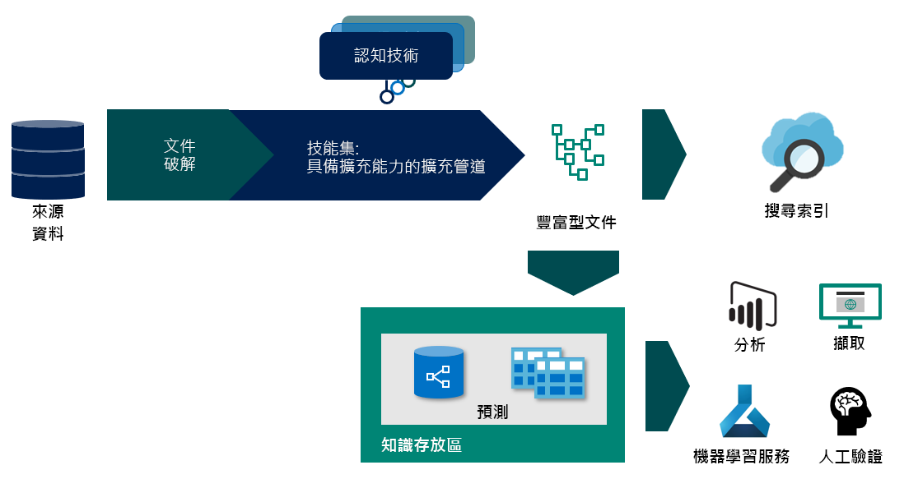

# <a name="working-with-skillsets-in-azure-cognitive-search"></a>使用 Azure 認知搜尋中的技能集

本文適用于需要深入瞭解擴充管線運作方式的開發人員，並假設您已瞭解 AI 擴充程式的概念。 如果您是這個概念的新手，請從下列開始：
+ [Azure 認知搜尋中的 AI 擴充](cognitive-search-concept-intro.md)
+ [知識存放區（預覽）](knowledge-store-concept-intro.md)

## <a name="specify-the-skillset"></a>指定技能集
技能集是 Azure 認知搜尋中可重複使用的資源，可指定在編制索引期間用來分析、轉換和充實文字或影像內容的認知技能集合。 建立技能集可讓您在資料內嵌階段附加文字和影像擴充，並從原始內容中解壓縮和建立新的資訊和結構。

技能集有三個屬性：

+   ```skills```，這是一種未排序的技能集合，平臺會根據每項技能所需的輸入來決定執行順序
+   ```cognitiveServices```，為所叫用的認知技能計費所需的認知服務金鑰
+   ```knowledgeStore```，將會投射擴充的檔所在的儲存體帳戶


技能集是以 JSON 撰寫。 您可以使用[運算式語言](https://docs.microsoft.com/azure/search/cognitive-search-skill-conditional)來建立具有迴圈和[分支](https://docs.microsoft.com/en-us/azure/search/cognitive-search-skill-conditional)的複雜技能集。 運算式語言會使用[JSON 指標](https://tools.ietf.org/html/rfc6901)路徑標記法，並進行一些修改來識別擴充樹狀結構中的節點。 ```"/"``` 在樹狀結構中的層級較低，而 ```"*"``` 會作為內容中的每個運算子。 這些概念最適合用來說明範例。 為了說明其中一些概念和功能，我們將逐步解說[飯店評論範例](knowledge-store-connect-powerbi.md)技能集。 若要在您遵循匯入資料工作流程後查看技能集，您必須使用 REST API 用戶端來[取得技能集](https://docs.microsoft.com/en-us/rest/api/searchservice/get-skillset)。

### <a name="enrichment-tree"></a>擴充樹狀結構

為了想像技能集如何逐漸來擴充您的檔，讓我們從檔在任何擴充之前的樣子開始。 檔破解的輸出取決於資料來源和所選取的特定剖析模式。 這也是在將資料新增至搜尋索引時，[欄位](search-indexer-field-mappings.md)對應可從中來源內容的檔狀態。


一旦檔在擴充管線中，就會以內容樹狀結構和相關聯的擴充表示。 此樹狀結構會具現化為檔破解的輸出。 擴充樹狀格式可讓擴充管線將中繼資料附加至基本資料類型，但它不是有效的 JSON 物件，但可以投射成有效的 JSON 格式。 下表顯示進入擴充管線的檔狀態：

|資料 Source\Parsing 模式|預設值|JSON，JSON 行 & CSV|
|---|---|---|
|Blob 儲存體|/document/content<br>/document/normalized_images/*<br>…|/document/{key1}<br>/document/{key2}<br>…|
|SQL|/document/{column1}<br>/document/{column2}<br>…|N/A |
|Cosmos DB|/document/{key1}<br>/document/{key2}<br>…|N/A|

 當技能執行時，他們會將新節點新增至擴充樹狀結構。 然後，這些新節點可以做為下游技能的輸入、投射到知識存放區，或對應至索引欄位。 擴充不是可變動的：一旦建立之後，就無法編輯節點。 當您的技能集變得更複雜時，您的擴充樹狀結構，但擴充樹狀結構中的所有節點都不需要將它設為索引或知識存放區。 您可以選擇性地只將擴充的子集保存至索引或知識存放區。

您可以選擇性地只將擴充的子集保存至索引或知識存放區。
本檔的其餘部分，我們假設我們使用[飯店評論範例](https://docs.microsoft.com/en-us/azure/search/knowledge-store-connect-powerbi)，但相同的概念也適用于從其他所有資料來源充實檔。

### <a name="context"></a>Context
每項技能都需要一個內容。 內容會決定：
+   根據選取的節點，技能執行的次數。 對於類型為 collection 的內容值，在結尾加入 ```/*``` 將會導致在集合中的每個實例叫用一次技能。 
+   在擴充樹狀結構中，新增技能輸出的位置。 輸出一律會當做內容節點的子系加入樹狀目錄中。 
+   輸入的形狀。 針對多層集合，將內容設定為父集合會影響輸入技能的形狀。 例如，如果您的擴充樹狀目錄中有一個國家/地區清單，每個都有一份包含 zipcodes 清單的狀態清單。

|Context|輸入|輸入的形狀|技能調用|
|---|---|---|---|
|```/document/countries/*``` |```/document/countries/*/states/*/zipcodes/*``` |國家/地區中所有 zipcodes 的清單 |每個國家/地區 |
|```/document/countries/*/states/*``` |```/document/countries/*/states/*/zipcodes/*``` |狀態中的 zipcodes 清單 | 每個國家/地區與州的組合一次|

### <a name="sourcecontext"></a>SourceCoNtext

`sourceContext` 僅用於[整形的技能](cognitive-search-skill-shaper.md)和[投影](knowledge-store-projection-overview.md)。 它是用來建立多層級的嵌套物件。 此 `sourceContext` 可讓您建立階層式匿名型別物件，如果您只使用內容，就需要多個技能。 下一節會顯示使用 `sourceContext`。

### <a name="projections"></a>投影

投射是從擴充樹狀結構中選取要儲存在知識存放區中之節點的程式。 投影是檔（content 和擴充）的自訂圖形，可以輸出成資料表或物件投射。 若要深入瞭解如何使用投影，請參閱使用[投影](knowledge-store-projection-overview.md)。


上圖根據您在擴充管線中的位置，描述您使用的選取器。

## <a name="generate-enriched-data"></a>產生豐富的資料 

現在讓我們逐步執行飯店評論技能集，您可以依照[教學](knowledge-store-connect-powerbi.md)課程來建立技能集或[觀看](https://github.com/Azure-Samples/azure-search-postman-samples/blob/master/samples/skillset.json)技能集。 我們將探討：

* 擴充樹狀結構如何隨著每項技能的執行而演變 
* 內容和輸入如何用於判斷技能執行的次數 
* 輸入的形式是根據內容而定。 

因為我們針對索引子使用分隔的文字剖析模式，所以擴充程式內的檔代表 CSV 檔案內的單一資料列。

### <a name="skill-1-split-skill"></a>技能 #1：分割技能 


利用 ```"/document/reviews_text"```的技能內容，此技能會針對 `reviews_text`執行一次。 技能輸出是一份清單，其中 `reviews_text` 分成5000個字元區段。 分割技能的輸出會命名為 `pages` 並新增至擴充樹狀結構。 [`targetName`] 功能可讓您在將技能輸出新增至擴充樹狀結構之前，先將其重新命名。

擴充樹狀結構現在會在技能的內容下放置新的節點。 這個節點可用於任何技能、投射或輸出欄位對應。


所有擴充的根節點都是 `"/document"`。 使用 blob 索引子時，[`"/document"`] 節點將會有 `"/document/content"` 和 `"/document/normalized_images"`的子節點。 使用 CSV 資料時，如我們在此範例中所示，資料行名稱將會對應至 `"/document"`下的節點。 若要存取由技能加入至節點的任何擴充，則需要擴充的完整路徑。 例如，如果您想要使用 [```pages```] 節點中的文字作為另一個技能的輸入，您必須將其指定為 [```"/document/reviews_text/pages/*"```]。
 
 

### <a name="skill-2-language-detection"></a>技術 #2 語言偵測
 雖然語言偵測技能是技能集中所定義的第三個（技能 #3）技能，但它是下一項要執行的技能。 由於它不會因為要求任何輸入而遭到封鎖，因此它會與先前的技能平行執行。 就像之前的分割技能一樣，語言偵測技能也會針對每份檔叫用一次。 擴充樹狀結構現在具有適用于 language 的新節點。
 

上述樹狀結構中的連接器色彩表示擴充是由不同的技能所建立，而節點則必須個別定址，而且不會成為選取父節點時所傳回物件的一部分。

## <a name="save-enrichments-in-a-knowledge-store"></a>儲存知識存放區中的擴充 

技能集也會定義知識存放區，您可以在其中將擴充的檔投射為數據表或物件。 若要將擴充的資料儲存在知識存放區中，您可以定義一組擴充檔的預測。 若要深入瞭解知識存放區，請參閱[知識存放區總覽](knowledge-store-concept-intro.md)

### <a name="slicing-projections"></a>切割投影

定義資料表投射群組時，擴充樹狀結構中的單一節點可以分割成多個相關的資料表。 如果您加入的資料表包含的來源路徑是現有資料表投射的子系，則產生的子節點將不會是現有資料表投射的子系，而是會投射到新的相關資料表。 這項切割技術可讓您在「整形程式」技能中定義單一節點，這種技能可以是所有資料表投影的來源。 

### <a name="shaping-projections"></a>成形投影

有兩種方式可以定義投射。 您可以使用「整形者」技能來建立新節點，這是您要投射之所有擴充的根節點。 然後，在您的投影中，您只會參考整形程式技能的輸出。 您也可以將投影圖形化投影定義本身中的投射。

造型方法比內嵌成形更詳細，但可確保擴充樹狀結構的所有變化都包含在技能內，而且輸出是可以重複使用的物件。 內嵌成形可讓您建立所需的圖形，但它是匿名物件，而且只適用于其定義所在的投影。 這些方法可以一起使用或分開使用。 在入口網站工作流程中為您建立的技能集包含兩者。 它會使用資料表投影的造型技能，但也會使用內嵌成形來投影關鍵字組資料表。

若要擴充範例，您可以選擇移除內嵌成形，並使用造型技能來為主要片語建立新的節點。 若要建立投影到三個數據表的圖形，也就是 `hotelReviewsDocument`、`hotelReviewsPages`和 `hotelReviewsKeyPhrases`，下列各節將說明這兩個選項。


#### <a name="shaper-skill-and-projection"></a>整形的技能和預測 

> [!Note]
> 為了簡潔起見，已從這個範例中移除檔資料表中的部分資料行。
>
```json
{
    "@odata.type": "#Microsoft.Skills.Util.ShaperSkill",
    "name": "#5",
    "description": null,
    "context": "/document",
    "inputs": [        
        {
            "name": "reviews_text",
            "source": "/document/reviews_text",
            "sourceContext": null,
            "inputs": []
        },
        {
            "name": "reviews_title",
            "source": "/document/reviews_title",
            "sourceContext": null,
            "inputs": []
        },
        {
            "name": "AzureSearch_DocumentKey",
            "source": "/document/AzureSearch_DocumentKey",
            "sourceContext": null,
            "inputs": []
        },  
        {
            "name": "pages",
            "source": null,
            "sourceContext": "/document/reviews_text/pages/*",
            "inputs": [
                {
                    "name": "SentimentScore",
                    "source": "/document/reviews_text/pages/*/Sentiment",
                    "sourceContext": null,
                    "inputs": []
                },
                {
                    "name": "LanguageCode",
                    "source": "/document/Language",
                    "sourceContext": null,
                    "inputs": []
                },
                {
                    "name": "Page",
                    "source": "/document/reviews_text/pages/*",
                    "sourceContext": null,
                    "inputs": []
                },
                {
                    "name": "keyphrase",
                    "sourceContext": "/document/reviews_text/pages/*/Keyphrases/*",
                    "inputs": [
                        {
                            "source": "/document/reviews_text/pages/*/Keyphrases/*",
                            "name": "Keyphrases"
                        }
                    ]
                }
            ]
        }
    ],
    "outputs": [
        {
            "name": "output",
            "targetName": "tableprojection"
        }
    ]
}
```

使用上述 [`outputs`] 區段中所定義的 [`tableprojection`] 節點，我們現在可以使用 [切割] 功能，將 `tableprojection` 節點的元件投影到不同的資料表中：

> [!Note]
> 這只是知識存放區設定內投射的程式碼片段。
>
```json
"projections": [
    {
        "tables": [
            {
                "tableName": "hotelReviewsDocument",
                "generatedKeyName": "Documentid",
                "source": "/document/tableprojection"
            },
            {
                "tableName": "hotelReviewsPages",
                "generatedKeyName": "Pagesid",
                "source": "/document/tableprojection/pages/*"
            },
            {
                "tableName": "hotelReviewsKeyPhrases",
                "generatedKeyName": "KeyPhrasesid",
                "source": "/document/tableprojection/pages/*/keyphrase/*"
            }
        ]
    }
]
```

#### <a name="inline-shaping-projections"></a>內嵌成形投影

內嵌成形方法不需要造型技能，因為投影所需的所有圖形都是在需要時建立的。 若要投影與上一個範例相同的資料，內嵌投影選項看起來會像這樣：

```json
"projections": [
    {
        "tables": [
            {
                "tableName": "hotelReviewsInlineDocument",
                "generatedKeyName": "Documentid",
                "sourceContext": "/document",     
                "inputs": [
                    {
                        "name": "reviews_text",
                        "source": "/document/reviews_text"
                    },
                    {
                        "name": "reviews_title",
                        "source": "/document/reviews_title"
                    },
                    {
                        "name": "AzureSearch_DocumentKey",
                        "source": "/document/AzureSearch_DocumentKey"
                    }                             
                ]
            },
            {
                "tableName": "hotelReviewsInlinePages",
                "generatedKeyName": "Pagesid",
                "sourceContext": "/document/reviews_text/pages/*",
                "inputs": [
                        {
                    "name": "SentimentScore",
                    "source": "/document/reviews_text/pages/*/Sentiment"
                    },
                    {
                        "name": "LanguageCode",
                        "source": "/document/Language"
                    },
                    {
                        "name": "Page",
                        "source": "/document/reviews_text/pages/*"
                    }
                ]
            },
            {
                "tableName": "hotelReviewsInlineKeyPhrases",
                "generatedKeyName": "KeyPhraseId",
                "sourceContext": "/document/reviews_text/pages/*/Keyphrases/*",
                "inputs": [
                    {
                        "name": "Keyphrases",
                        "source": "/document/reviews_text/pages/*/Keyphrases/*"
                    }
                ]
            }
        ]
    }
]
```
  
這兩種方法的其中一個觀察是如何使用 `"sourceContext"`來投射 `"Keyphrases"` 的值。 包含字串集合的 `"Keyphrases"` 節點本身就是頁面文字的子系。 不過，因為投影需要 JSON 物件，而頁面是基本（字串），所以會使用 `"sourceContext"` 將關鍵字組包裝到具有命名屬性的物件中。 這項技術可讓您獨立預測基本專案。

## <a name="next-steps"></a>後續步驟

在下一個步驟中，使用認知技能建立您的第一個技能集。

> [!div class="nextstepaction"]
> [建立您的第一個技能集](cognitive-search-defining-skillset.md)。
