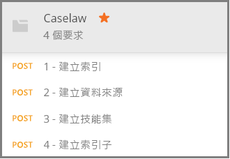

# <a name="how-to-get-started-with-knowledge-mining-in-azure-search"></a>如何開始在 Azure 搜尋服務中使用知識發掘

> [!Note]
> 知識存放區處於預覽狀態，不適合用於生產環境。 [REST API 版本 2019-05-06-Preview](search-api-preview.md) 提供此功能。 目前沒有 .NET SDK 支援。
>
[知識存放區](knowledge-store-concept-intro.md)會將在編製索引期間建立的 AI 擴充文件儲存到您的 Azure 儲存體帳戶，以便在其他應用程式中進行下游知識發掘。 您也可以使用已儲存的擴充資料，以了解 Azure 搜尋服務索引管線並縮小其範圍。 

知識存放區是由「技能集」  所定義，並由「索引子」  所建立。 知識存放區的實體運算式是透過能判斷儲存體中資料結構的「投影」  來指定。 在您完成此逐步解說之後，您將會建立所有這些物件，並了解它們彼此配合的方式。 

這個練習會從範例資料、服務和工具開始，逐步了解建立和使用您第一個知識存放區的基本工作流程，並將重點放在技能集定義。

## <a name="prerequisites"></a>必要條件

知識存放區位於多個服務的中心，並由 Azure Blob 儲存體和 Azure 資料表儲存體提供實體儲存體，以及由 Azure 搜尋服務和認知服務提供物件建立和更新。 熟悉[基本架構](knowledge-store-concept-intro.md)為本逐步解說的必要條件。

本快速入門會使用下列服務和工具。 

+ [取得 Postman 傳統型應用程式](https://www.getpostman.com/) \(英文\)，其是用來將 HTTP 要求傳送至 Azure 搜尋服務。

+ [建立 Azure 儲存體帳戶](https://docs.microsoft.com/azure/storage/common/storage-quickstart-create-account)以儲存範例資料和知識存放區。 您的知識存放區將存在於 Azure 儲存體中。

+ 在 S0 隨用隨付層[建立認知服務資源](https://docs.microsoft.com/azure/cognitive-services/cognitive-services-apis-create-account) \(機器翻譯\)，以廣泛取得在 AI 擴充資料中使用的完整技能。 認知服務和您的 Azure 搜尋服務都必須位於相同區域。

+ [建立 Azure 搜尋服務](search-create-service-portal.md)，或在您目前的訂用帳戶下方[尋找現有服務](https://ms.portal.azure.com/#blade/HubsExtension/BrowseResourceBlade/resourceType/Microsoft.Search%2FsearchServices)。 您可以使用此教學課程的免費服務。 

範例 JSON 文件和 Postman 集合檔案也是必要項目。 找出並載入在[準備範例資料](#prepare-sample-data)小節中所提供之增補檔案的指示。

## <a name="get-a-key-and-url"></a>取得金鑰和 URL

REST 呼叫需要服務 URL 和每個要求的存取金鑰。 搜尋服務是同時建立，因此如果您將 Azure 搜尋服務新增至您的訂用帳戶，請遵循下列步驟來取得必要的資訊：

1. [登入 Azure 入口網站](https://portal.azure.com/)，並在搜尋服務的 [概觀]  頁面上取得 URL。 範例端點看起來會像是 `https://mydemo.search.windows.net`。

1. 在 [設定]   >  [金鑰]  中，取得服務上完整權限的管理金鑰。 可互換的管理金鑰有兩個，可在您需要變換金鑰時提供商務持續性。 您可以在新增、修改及刪除物件的要求上使用主要或次要金鑰。

    

所有要求均都需要在傳送至您服務上的每個要求上使用 API 金鑰。 您將會在下列各節於每個 HTTP 要求中提供服務名稱和 API 金鑰。

<a name="prepare-sample-data"></a>

## <a name="prepare-sample-data"></a>準備範例資料

知識存放區包含擴充管線的輸出。 輸入包含「無法使用」的資料；這些資料在通過管線後，最終會變成「可用」的資料。 無法使用的資料範例可能是需要分析文字或影像特徵的影像檔案，或是可對其分析實體、關鍵片語或情緒的密集文字檔。 

本練習會使用源自於 [Caselaw Access Project](https://case.law/bulk/download/) \(英文\) 公用大量資料下載頁面的密集文字檔 (判例法資訊)。 我們為此練習上傳了包含 10 個文件的範例至 GitHub。 

在此工作中，您將會為這些文件建立 Azure Blob 容器以作為管線的輸入使用。 

1. 下載 [Azure 搜尋服務範例資料](https://github.com/Azure-Samples/azure-search-sample-data/tree/master/caselaw) \(英文\) 存放庫並將其解壓縮，以取得 [Caselaw 資料集](https://github.com/Azure-Samples/azure-search-sample-data/tree/master/caselaw) \(英文\)。 

1. [登入 Azure 入口網站](https://portal.azure.com)瀏覽至您的 Azure 儲存體帳戶、按一下 [Blob]  ，然後按一下 [+ 容器]  。

1. [建立 Blob 容器](https://docs.microsoft.com/azure/storage/blobs/storage-quickstart-blobs-portal)以容納範例資料： 

   1. 將容器命名為 `caselaw-test`。 
   
   1. 將 [公用存取層級] 設定為任何有效值。

1. 建立容器之後，請加以開啟，然後選取命令列的 [上傳]  。

   

1. 瀏覽至包含 **caselaw-sample.json** 範例檔案的資料夾。 選取檔案，然後按一下 [上傳]  。

1. 當您位於 Azure 儲存體中時，請取得連接字串和容器名稱。  您在[建立資料來源](#create-data-source)時將會需要這兩個字串：

   1. 在 [概觀] 頁面中，按一下 [存取金鑰]  並複製「連接字串」  。 它會以 `DefaultEndpointsProtocol=https;` 作為開頭，並以 `EndpointSuffix=core.windows.net` 作為結尾。 您的帳戶名稱和金鑰會介於它們之間。 

   1. 容器名稱應該是 `caselaw-test` 或您所指派的任何名稱。


## <a name="set-up-postman"></a>設定 Postman

Postman 是您將用來把要求和 JSON 文件傳送至 Azure 搜尋服務的用戶端應用程式。 有數個要求只需要使用此文章中的資訊便可以構成。 不過，其中兩個最大的要求 (建立索引、建立技能集) 會包含具詳細資訊的 JSON，其大小過大而無法內嵌在文章中。 

若要使所有 JSON 文件和要求皆完全可用，我們已建立 Postman 集合檔案。 下載並匯入此檔案，是您設定用戶端的第一個工作。

1. 下載 [Azure 搜尋服務 Postman 範例](https://github.com/Azure-Samples/azure-search-postman-samples) \(英文\) 存放庫，並將它解壓縮。

1. 啟動 Postman 並匯入 Caselaw Postman 集合：

   1. 按一下 [匯入]   > [匯入檔案]   > [選擇檔案]  。 

   1. 瀏覽至 \azure-search-postman-samples-master\azure-search-postman-samples-master\Caselaw 資料夾。

   1. 選取 **Caselaw.postman_collection_v2.json**。 您在集合中應該會看到四個 **POST** 要求。

   
   

## <a name="create-an-index"></a>建立索引
    
第一個要求會使用[建立索引 API](https://docs.microsoft.com/rest/api/searchservice/create-data-source) \(英文\)，其會建立可儲存所有可搜尋資料的 Azure 搜尋服務索引。 索引會指定所有欄位、參數及屬性。

您不一定需要索引來進行知識採礦，但必須提供索引才能執行索引子。 

1. 在 `https://YOUR-AZURE-SEARCH-SERVICE-NAME.search.windows.net/indexes?api-version=2019-05-06-Preview` 這個 URL 中，將 `YOUR-AZURE-SEARCH-SERVICE-NAME` 取代為您搜尋服務的名稱。 

1. 在 [標頭] 區段中，將 `<YOUR AZURE SEARCH ADMIN API-KEY>` 取代為適用於 Azure 搜尋服務的管理員 API 金鑰。

1. 在 [主體] 區段中，JSON 文件會是索引結構描述。 基於可見性的原因，索引的外殼預設已摺疊；其由下列元素組成。 欄位集合會對應至 Caselaw 資料集中的欄位。

   ```json
   {
      "name": "caselaw",
      "defaultScoringProfile": null,
      "fields": [],
      "scoringProfiles": [],
      "corsOptions": null,
      "suggesters": [],
      "analyzers": [],
      "tokenizers": [],
      "tokenFilters": [],
      "charFilters": [],
      "encryptionKey": null
   }
   ```

1. 展開 `fields` 集合。 它包含大部分的索引定義，並由簡單欄位、具巢狀子結構的[複雜欄位](search-howto-complex-data-types.md)，以及集合所組成。

   請花點時間檢閱位於第 302-384 行上，適用於 `casebody` 複雜欄位的欄位定義。 請注意，需使用階層式表示法時，複雜欄位可包含其他複雜欄位。 階層式結構可以在索引中模型化 (如這裡所示)，也可以模型化為技能集中的投影，因而會在知識存放區中建立巢狀資料結構。

   ```json
   {
    "name": "casebody",
    "type": "Edm.ComplexType",
    "fields": [
        {
            "name": "status",
            "type": "Edm.String",
            "searchable": true,
            "filterable": true,
            "retrievable": true,
            "sortable": true,
            "facetable": true,
            "key": false,
            "indexAnalyzer": null,
            "searchAnalyzer": null,
            "analyzer": null,
            "synonymMaps": []
        },
        {
            "name": "data",
            "type": "Edm.ComplexType",
            "fields": [
                {
                    "name": "head_matter",
                    "type": "Edm.String",
                    "searchable": true,
                    "filterable": false,
                    "retrievable": true,
                    "sortable": false,
                    "facetable": false,
                    "key": false,
                    "indexAnalyzer": null,
                    "searchAnalyzer": null,
                    "analyzer": null,
                    "synonymMaps": []
                },
                {
                    "name": "opinions",
                    "type": "Collection(Edm.ComplexType)",
                    "fields": [
                        {
                            "name": "author",
                            "type": "Edm.String",
                            "searchable": true,
                            "filterable": true,
                            "retrievable": true,
                            "sortable": false,
                            "facetable": true,
                            "key": false,
                            "indexAnalyzer": null,
                            "searchAnalyzer": null,
                            "analyzer": null,
                            "synonymMaps": []
                        },
                        {
                            "name": "text",
                            "type": "Edm.String",
                            "searchable": true,
                            "filterable": false,
                            "retrievable": true,
                            "sortable": false,
                            "facetable": false,
                            "key": false,
                            "indexAnalyzer": null,
                            "searchAnalyzer": null,
                            "analyzer": null,
                            "synonymMaps": []
                        },
                        {
                            "name": "type",
                            "type": "Edm.String",
                            "searchable": true,
                            "filterable": true,
                            "retrievable": true,
                            "sortable": false,
                            "facetable": true,
                            "key": false,
                            "indexAnalyzer": null,
                            "searchAnalyzer": null,
                            "analyzer": null,
                            "synonymMaps": []
                        }
                    ]
                },
    . . .
   ```

1. 按一下 [傳送]  以執行要求。  作為回覆，您應該會收到「狀態:已建立 201」  。

<a name="create-data-source"></a>

## <a name="create-a-data-source"></a>建立資料來源

第二個要求會使用[建立資料來源 API](https://docs.microsoft.com/rest/api/searchservice/create-data-source) \(英文\) 來連線至 Azure Blob 儲存體。 

1. 在 `https://YOUR-AZURE-SEARCH-SERVICE-NAME.search.windows.net/datasources?api-version=2019-05-06-Preview` 這個 URL 中，將 `YOUR-AZURE-SEARCH-SERVICE-NAME` 取代為您搜尋服務的名稱。 

1. 在 [標頭] 區段中，將 `<YOUR AZURE SEARCH ADMIN API-KEY>` 取代為適用於 Azure 搜尋服務的管理員 API 金鑰。

1. 在 [主體] 區段中，JSON 文件會包含您的儲存體帳戶連接字串和 Blob 容器名稱。 該連接字串可以在 Azure 入口網站中您儲存體帳戶的 [存取金鑰]  內找到。 

    ```json
    {
        "name": "caselaw-ds",
        "description": null,
        "type": "azureblob",
        "subtype": null,
        "credentials": {
            "connectionString": "DefaultEndpointsProtocol=https;AccountName=<YOUR-STORAGE-ACCOUNT>;AccountKey=<YOUR-STORAGE-KEY>;EndpointSuffix=core.windows.net"
        },
        "container": {
            "name": "<YOUR-BLOB-CONTAINER-NAME>",
            "query": null
        },
        "dataChangeDetectionPolicy": null,
        "dataDeletionDetectionPolicy": null
    }
    ```

1. 按一下 [傳送]  以執行要求。  作為回覆，您應該會收到「狀態:已建立 201」  。


<a name="create-skillset"></a>

## <a name="create-a-skillset-and-knowledge-store"></a>建立技能集和知識存放區

第三個要求會使用[建立技能集 API](https://docs.microsoft.com/rest/api/searchservice/create-skillset) \(英文\)，其可建立 Azure 搜尋服務物件，以指定要呼叫哪些認知技術、如何鏈結技術，以及如何指定知識存放區 (此為本逐步解說的重點)。

1. 在 `https://YOUR-AZURE-SEARCH-SERVICE-NAME.search.windows.net/skillsets?api-version=2019-05-06-Preview` 這個 URL 中，將 `YOUR-AZURE-SEARCH-SERVICE-NAME` 取代為您搜尋服務的名稱。 

1. 在 [標頭] 區段中，將 `<YOUR AZURE SEARCH ADMIN API-KEY>` 取代為適用於 Azure 搜尋服務的管理員 API 金鑰。

1. 在 [主體] 區段中，JSON 文件會是技能集定義。 基於可見性的原因，技能集的外殼預設已摺疊；其由下列元素組成。 `skills` 集合會定義記憶體內部的擴充資料，但 `knowledgeStore` 定義會指定輸出的儲存方式。 `cognitiveServices` 定義是您與 AI 擴充引擎的連線。

   ```json
   {
    "name": "caselaw-ss",
    "description": null,
    "skills": [],
    "cognitiveServices": [],
    "knowledgeStore": []
   }
   ```

1. 展開 `cognitiveServices` 和 `knowledgeStore` 來讓您可以提供連線資訊。 在範例中，這些字串位於技能集定義後方，靠近要求本文的結尾處。 

   針對 `cognitiveServices`，請在位於與 Azure 搜尋服務相同區域的 S0 層佈建資源。 您可以從 Azure 入口網站中的相同頁面上取得 cognitiveServices 名稱和金鑰。 
   
   針對 `knowledgeStore`，您可以使用和 Caselaw Blob 容器相同的連接字串。

    ```json
    "cognitiveServices": {
        "@odata.type": "#Microsoft.Azure.Search.CognitiveServicesByKey",
        "description": "YOUR-SAME-REGION-S0-COGNITIVE-SERVICES-RESOURCE",
        "key": "YOUR-COGNITIVE-SERVICES-KEY"
    },
    "knowledgeStore": {
        "storageConnectionString": "YOUR-STORAGE-ACCOUNT-CONNECTION-STRING",
    ```

1. 展開技能集合，特別是分別位於第 85 和 179 行的 Shaper 技能。 Shaper 技能很重要，因為它會組合您進行知識採礦時所需的資料結構。 技能集在執行期間，這些結構只會存在於記憶體內部，但當您移至下一個步驟時，就會了解此輸出如何儲存至知識存放區以供進一步探索。

   下列程式碼片段來自第 217 行。 

    ```json
    "name": "Opinions",
    "source": null,
    "sourceContext": "/document/casebody/data/opinions/*",
    "inputs": [
        {
            "name": "Text",
            "source": "/document/casebody/data/opinions/*/text"
        },
        {
            "name": "Author",
            "source": "/document/casebody/data/opinions/*/author"
        },
        {
            "name": "Entities",
            "source": null,
            "sourceContext": "/document/casebody/data/opinions/*/text/pages/*/entities/*",
            "inputs": [
                {
                    "name": "Entity",
                    "source": "/document/casebody/data/opinions/*/text/pages/*/entities/*/value"
                },
                {
                    "name": "EntityType",
                    "source": "/document/casebody/data/opinions/*/text/pages/*/entities/*/category"
                }
            ]
        }
    ]
   . . .
   ```

1. 展開 `knowledgeStore` 中的 `projections` 元素 (從第 262 行開始)。 投影會指定知識存放區組合。 投影是在資料表-物件組中指定的，但目前有時只有一個。 如您在第一個投影中所見，已指定 `tables` 但未指定 `objects`。 在第二個中則是相反的。

   在 Azure 儲存體中，您建立的每個資料表都會在資料表儲存體中建立，而且每個物件都會在 Blob 儲存體中取得一個容器。

   Blob 物件通常包含擴充資料的完整運算式。 資料表通常包含您針對特定用途所安排組合中的部分擴充資料。 此範例顯示一個 Cases 資料表及 Opinions 資料表，但沒有顯示其他資料表，例如 Entities、Attorneys、Judges 和 Parties。

    ```json
    "projections": [
        {
            "tables": [
                {
                    "tableName": "Cases",
                    "generatedKeyName": "CaseId",
                    "source": "/document/Case"
                },
                {
                    "tableName": "Opinions",
                    "generatedKeyName": "OpinionId",
                    "source": "/document/Case/OpinionsSnippets/*"
                }
            ],
            "objects": []
        },
        {
            "tables": [],
            "objects": [
                {
                    "storageContainer": "enrichedcases",
                    
                    "source": "/document/CaseFull"
                }
            ]
        }
    ]
    ```

1. 按一下 [傳送]  以執行要求。 回應應為 **201**，且看起來應該類似以下範例 (僅顯示回應的前面部分)。

    ```json
    {
    "name": "caselaw-ss",
    "description": null,
    "skills": [
        {
            "@odata.type": "#Microsoft.Skills.Text.SplitSkill",
            "name": "SplitSkill#1",
            "description": null,
            "context": "/document/casebody/data/opinions/*/text",
            "defaultLanguageCode": "en",
            "textSplitMode": "pages",
            "maximumPageLength": 5000,
            "inputs": [
                {
                    "name": "text",
                    "source": "/document/casebody/data/opinions/*/text
                }
            ],
            "outputs": [
                {
                    "name": "textItems",
                    "targetName": "pages"
                }
            ]
        },
        . . .
    ```

## <a name="create-and-run-an-indexer"></a>建立及執行索引子

第四個要求會使用[建立索引子 API](https://docs.microsoft.com/rest/api/searchservice/create-indexer) \(英文\)，其會建立 Azure 搜尋服務索引子。 索引子是索引管線的執行引擎。 您到目前為止已經建立的所有定義都將在此步驟中發揮效用。

1. 在 `https://YOUR-AZURE-SEARCH-SERVICE-NAME.search.windows.net/indexers?api-version=2019-05-06-Preview` 這個 URL 中，將 `YOUR-AZURE-SEARCH-SERVICE-NAME` 取代為您搜尋服務的名稱。 

1. 在 [標頭] 區段中，將 `<YOUR AZURE SEARCH ADMIN API-KEY>` 取代為適用於 Azure 搜尋服務的管理員 API 金鑰。

1. 在 [主體] 區段中，JSON 文件會指定索引子名稱。 索引子需要資料來源和索引。 技能集對索引子而言是選擇性的，但對 AI 擴充資料來說是必要的。

    ```json
    {
        "name": "caselaw-idxr",
        "description": null,
        "dataSourceName": "caselaw-ds",
        "skillsetName": "caselaw-ss",
        "targetIndexName": "caselaw",
        "disabled": null,
        "schedule": null,
        "parameters": { },
        "fieldMappings": [],
        "outputFieldMappings": [ ]
    ```

1. 展開 outputFieldMappings。 相較於 fieldMappings (適用於資料來源和索引中欄位之間的自訂對應)，outputFieldMappings 是用來將擴充欄位 (由管線建立並填入) 對應至索引或投影中的輸出欄位。

    ```json
    "outputFieldMappings": [
        {
            "sourceFieldName": "/document/casebody/data/opinions/*/text/pages/*/people/*",
            "targetFieldName": "people",
            "mappingFunction": null
        },
        {
            "sourceFieldName": "/document/casebody/data/opinions/*/text/pages/*/organizations/*",
            "targetFieldName": "orginizations",
            "mappingFunction": null
        },
        {
            "sourceFieldName": "/document/casebody/data/opinions/*/text/pages/*/locations/*",
            "targetFieldName": "locations",
            "mappingFunction": null
        },
        {
            "sourceFieldName": "/document/Case/OpinionsSnippets/*/Entities/*",
            "targetFieldName": "entities",
            "mappingFunction": null
        },
        {
            "sourceFieldName": "/document/casebody/data/opinions/*/text/pages/*/keyPhrases/*",
            "targetFieldName": "keyPhrases",
            "mappingFunction": null
        }
    ]
    ```

1. 按一下 [傳送]  以執行要求。 回應應為 **201**，且回應本文看起來應該和您所提供的要求承載幾乎一模一樣 (為了簡潔起見已修剪)。

    ```json
    {
        "name": "caselaw-idxr",
        "description": null,
        "dataSourceName": "caselaw-ds",
        "skillsetName": "caselaw-ss",
        "targetIndexName": "caselaw",
        "disabled": null,
        "schedule": null,
        "parameters": { },
        "fieldMappings": [],
        "outputFieldMappings": [ ]
    }
    ```

## <a name="explore-knowledge-store"></a>探索知識存放區

第一個文件匯入後，您就可以開始探索。 針對此工作，請在入口網站中使用[**儲存體總管**](https://docs.microsoft.com/azure/storage/blobs/storage-quickstart-blobs-storage-explorer)。

請務必了解一點，那就是知識存放區與 Azure 搜尋服務是完全分離的。 Azure 搜尋服務索引和知識存放區都包含資料表示和內容，但從那裡開始就分道揚鑣了。 請針對全文檢索搜尋、篩選搜尋與 Azure 搜尋服務中支援的所有案例使用索引。 或者，您也可以只使用知識存放區，然後附加其他工具來分析內容。

## <a name="takeaways"></a>重要心得

您現在已經在 Azure 儲存體中建立第一個知識存放區，並使用儲存體總管檢視擴充資料。 這是使用預存擴充資料的基本體驗。 

## <a name="next-steps"></a>後續步驟

Shaper 技能會負責執行繁重工作，建立可合併成新形式的細微資料表單。 下一個步驟即是檢閱這個技能的參考頁面，了解其使用方式詳細資料。

> [!div class="nextstepaction"]
> [Shaper 技能參考](cognitive-search-skill-shaper.md)


<!---
## Keep This

How to convert unformatted JSON into an indented JSON document structure that allows you to quickly identify nested structures. Useful for creating an index that includes complex types.

1. Use Visual Studio Code.
2. Open data.jsonl
--->
