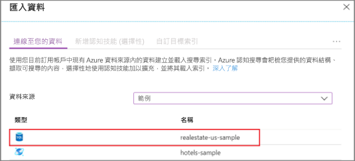
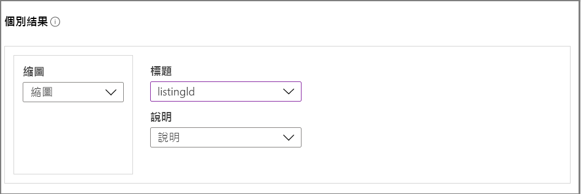
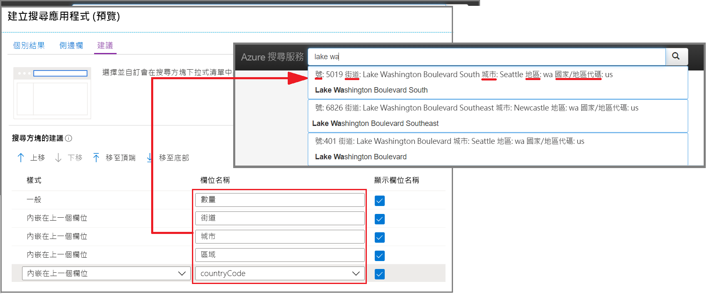
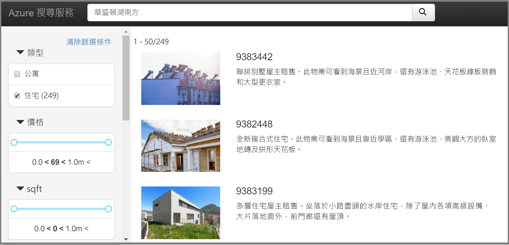

# 快速入門：在入口網站中建立搜尋應用程式 (Azure 認知搜尋)

使用入口網站的**建立搜尋應用程式**精靈，可產生會在瀏覽器中執行的可下載「localhost」樣式 Web 應用程式。 根據其設定，所產生的應用程式會在第一次使用時運作，並即時連線至遠端索引。 預設應用程式可包含搜尋列、結果區域、提要欄位篩選和自動提示支援。

如果您沒有 Azure 訂用帳戶，請在開始前建立[免費帳戶](https://azure.microsoft.com/free/?WT.mc_id=A261C142F)。 

## 必要條件

[建立 Azure 認知搜尋服務](search-create-service-portal.md)，或在您目前的訂用帳戶下方[尋找現有服務](https://ms.portal.azure.com/#blade/HubsExtension/BrowseResourceBlade/resourceType/Microsoft.Search%2FsearchServices)。 您可以使用本快速入門的免費服務。 

[建立索引](search-create-index-portal.md)來作為您應用程式的基礎。 

本快速入門會使用內建的房地產資料和索引範例，因為其具有縮圖影像。 若要建立此練習中所用的索引，請執行**匯入資料**精靈，並選擇 realestate-us-sample  資料來源。

當索引已可供使用時，請繼續進行下一個步驟。

## 啟動精靈

1. 登入 [Azure 入口網站](https://portal.azure.com)，然後[尋找您的搜尋服務](https://ms.portal.azure.com/#blade/HubsExtension/BrowseResourceBlade/resourceType/Microsoft.Search%2FsearchServices)。

1. 在 [概觀] 頁面上，從頁面中間的連結中，選取 [索引]  。 

1. 從現有索引的清單中選擇 [realestate-us-sample-index]  。

1. 在索引頁面頂端，選取 [建立搜尋應用程式 (預覽)]  以啟動精靈。

1. 在第一個精靈頁面上，選取 [啟用跨原始來源資源共用 (CORS)]  以將 CORS 支援新增至索引定義。 這是選擇性步驟，但如果沒有此支援，本機 Web 應用程式就不會連線至遠端索引。

## 設定搜尋結果

此精靈會為所呈現的搜尋結果提供基本的版面配置，其中會有空間可容納縮圖影像、標題和描述。 在這些元素背後是會提供資料的索引欄位。 

1. 在 [縮圖] 中，選擇 [realestate-us-sample]  索引中的 [縮圖]  欄位。 此範例正好納入了影像縮圖，此縮圖採用 URL 定址影像的形式，並儲存在稱為 [縮圖]  的欄位中。 如果您的索引沒有影像，請讓此欄位保持空白。

1. 在 [標題] 中，選擇可傳達每份文件唯一性的欄位。 在此範例中，「清單識別碼」是合理的選擇。

1. 在 [描述] 中，請選擇會提供詳細資料的欄位，以便協助使用者決定是否要點選以獲得該特定文件。

## 新增提要欄位

搜尋服務可支援多面向導覽，這通常會以提要欄位的形式來呈現。 Facet 會以可篩選和可 Facet 的欄位為基礎，如索引結構描述所表示。

在 Azure 認知搜尋中，多面向導覽是一種累積的篩選體驗。 在單一類別內，選取多個篩選條件會擴大結果 (例如，在 [城市] 內選取 [西雅圖] 和 [貝爾維尤])。 跨多個類別時，選取多個篩選條件則會縮小結果範圍。

> [!TIP]
> 您可以在入口網站中檢視整個索引結構描述。 請在每個索引的 [概觀] 頁面中，尋找 [索引定義 (JSON)]  連結。 符合多面向導覽資格的欄位會有「可篩選：true」和「可 Facet：true」屬性。

接受目前選取的 Facet，並繼續進行下一頁。

## 新增自動提示

自動提示功能可透過自動完成和查詢建議的形式來獲得。 精靈會支援查詢建議。 根據使用者所提供的按鍵輸入，搜尋服務會傳回「已完成」的查詢字串清單，您可以選取這些字串來作為輸入。

特定欄位定義上會啟用建議。 精靈會提供選項讓您設定建議中要包含多少資訊。 

下列螢幕擷取畫面顯示精靈中的選項，以及應用程式中所呈現的頁面。 您可以看到欄位選取項目的使用方式，以及「顯示欄位名稱」如何用來在建議內包含或排除標籤。

## 建立、下載和執行

1. 選取 [建立搜尋應用程式]  來產生 HTML 檔案。

1. 出現提示時，選取 [下載應用程式]  來下載檔案。

1. 開啟 檔案。 您應該會看到類似下列螢幕擷取畫面的頁面。 輸入一個詞並使用篩選條件來縮小結果範圍。 

基礎索引會由所產生的虛構資料構成，這些資料已複製到各個文件，且描述有時會與影像不符。 當您建立以自己的索引為基礎的應用程式時，應該會有更完整的體驗。

## 清除資源

使用您自己的訂用帳戶時，在專案結束後確認您是否還需要您建立的資源，是很好的做法。 讓資源繼續執行可能會產生費用。 您可以個別刪除資源，或刪除資源群組以刪除整組資源。

您可以使用左導覽窗格中的 [所有資源]  或 [資源群組]  連結，在入口網站中尋找和管理資源。

如果您使用免費服務，請記住您會有三個索引、索引子和資料來源的限制。 您可以在入口網站中刪除個別項目，以避免超出限制。 

## 後續步驟

雖然預設應用程式很適合用於初始探索和小型工作，但在初期檢閱 API 將協助您了解更深層級的概念和工作流程：

> [!div class="nextstepaction"]
> [使用 .NET SDK 建立索引](https://docs.microsoft.com/azure/search/search-create-index-dotnet)