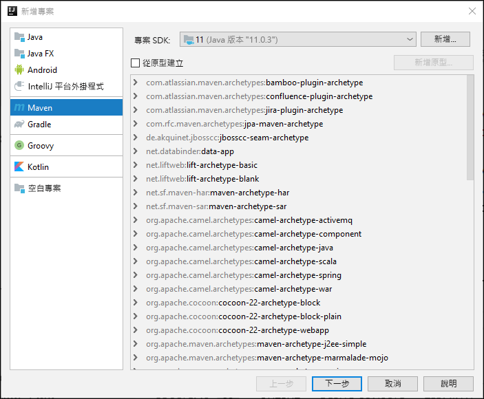
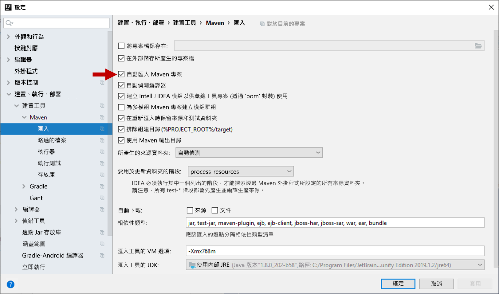
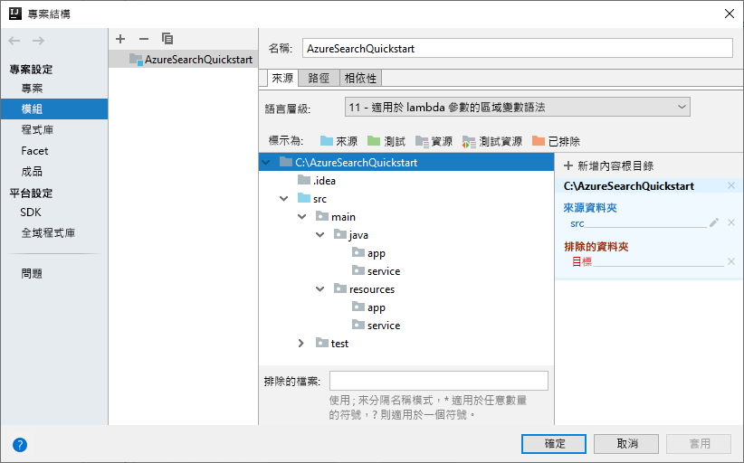
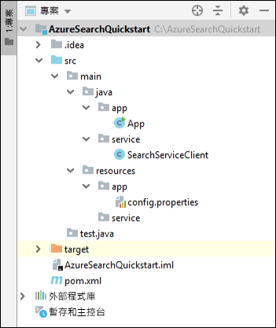
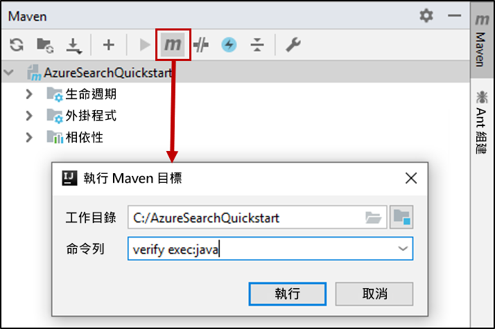

# <a name="quickstart-create-load-and-query-indexes-using-azure-search-rest-apis-with-java"></a>快速入門：使用 Azure 搜尋服務 REST API 與 Java 來建立、載入及查詢索引
> [!div class="op_single_selector"]
> * [JavaScript](search-get-started-nodejs.md)
> * [C#](search-get-started-dotnet.md)
> * [Java](search-get-started-java.md)
> * [入口網站](search-get-started-portal.md)
> * [PowerShell](search-create-index-rest-api.md)
> * [Python](search-get-started-python.md)
> * [Postman](search-get-started-postman.md)

建立 JAVA 主控台應用程式，以使用 [IntelliJ](https://www.jetbrains.com/idea/)、[JAVA 11 SDK](/java/azure/jdk/?view=azure-java-stable) 和 [Azure 搜尋服務 REST API](/rest/api/searchservice/) 來建立、載入及查詢 Azure 搜尋服務索引。本文提供建立應用程式的逐步指示。 或者，您可以[下載並執行完整應用程式](/samples/azure-samples/azure-search-java-samples/java-sample-quickstart/) \(英文\)。

如果您沒有 Azure 訂用帳戶，請在開始前建立 [免費帳戶](https://azure.microsoft.com/free/?WT.mc_id=A261C142F) 。

## <a name="prerequisites"></a>必要條件

我們使用了以下軟體和服務來建置及測試此範例：

+ [IntelliJ IDEA](https://www.jetbrains.com/idea/)

+ [Java 11 SDK](/java/azure/jdk/?view=azure-java-stable)

+ [建立 Azure 搜尋服務](search-create-service-portal.md)，或在您目前的訂用帳戶下方[尋找現有服務](https://ms.portal.azure.com/#blade/HubsExtension/BrowseResourceBlade/resourceType/Microsoft.Search%2FsearchServices)。 您可以使用本快速入門的免費服務。

<a name="get-service-info"></a>

## <a name="get-a-key-and-url"></a>取得金鑰和 URL

在每個對服務發出呼叫的要求上，都需要 URL 端點和存取金鑰。 搜尋服務是同時建立，因此如果您將 Azure 搜尋服務新增至您的訂用帳戶，請遵循下列步驟來取得必要的資訊：

1. [登入 Azure 入口網站](https://portal.azure.com/)，並在搜尋服務的 [概觀]  頁面上取得 URL。 範例端點看起來會像是 `https://mydemo.search.windows.net`。

2. 在 [設定]   >  [金鑰]  中，取得服務上完整權限的管理金鑰。 可互換的管理金鑰有兩個，可在您需要變換金鑰時提供商務持續性。 您可以在新增、修改及刪除物件的要求上使用主要或次要金鑰。

   此外也須建立查詢金鑰。 最佳做法是發出具有唯讀存取權的查詢要求。


傳送至服務的每個要求都需要 API 金鑰。 擁有有效的金鑰就能為每個要求在傳送要求之應用程式與處理要求之服務間建立信任。

## <a name="set-up-your-environment"></a>設定環境

首先，請開啟 IntelliJ IDEA 並設定新的專案。

### <a name="create-the-project"></a>建立專案

1. 開啟 IntelliJ IDEA，並選取 [建立新專案]  。
1. 選取 [Maven]  。
1. 在 [專案 SDK]  清單中，選取 Java 11 SDK。

     

1. 針對 **GroupId** 和 **ArtifactId**，輸入 `AzureSearchQuickstart`。
1. 接受其餘預設值以開啟專案。

### <a name="specify-maven-dependencies"></a>指定 Maven 相依性

1. 選取 [檔案]   > [設定]  。
1. 在 [設定]  視窗中，選取 [建置、執行、部署]   > [建置工具]   > [Maven]   > [匯入]  。
1. 選取 [自動匯入 Maven 專案]  核取方塊，然後按一下 [確定]  以關閉視窗。 現在，當您在下一個步驟中更新 pom .xml 檔案時，Maven 外掛程式和其他相依性將會自動同步處理。

    

1. 開啟 pom.xml 檔案，並將內容取代為下列 Maven 組態詳細資料。 其中包括 [Exec Maven 外掛程式](https://www.mojohaus.org/exec-maven-plugin/)和 [JSON 介面 API](https://javadoc.io/doc/org.glassfish/javax.json/1.0.2) 的參考

    ```xml
    <?xml version="1.0" encoding="UTF-8"?>
    <project xmlns="http://maven.apache.org/POM/4.0.0"
             xmlns:xsi="http://www.w3.org/2001/XMLSchema-instance"
             xsi:schemaLocation="http://maven.apache.org/POM/4.0.0 http://maven.apache.org/xsd/maven-4.0.0.xsd">
        <modelVersion>4.0.0</modelVersion>
    
        <groupId>AzureSearchQuickstart</groupId>
        <artifactId>AzureSearchQuickstart</artifactId>
        <version>1.0-SNAPSHOT</version>
        <build>
            <sourceDirectory>src</sourceDirectory>
            <plugins>
                <plugin>
                    <artifactId>maven-compiler-plugin</artifactId>
                    <version>3.1</version>
                    <configuration>
                        <source>11</source>
                        <target>11</target>
                    </configuration>
                </plugin>
                <plugin>
                    <groupId>org.codehaus.mojo</groupId>
                    <artifactId>exec-maven-plugin</artifactId>
                    <version>1.6.0</version>
                    <executions>
                        <execution>
                            <goals>
                                <goal>exec</goal>
                            </goals>
                        </execution>
                    </executions>
                    <configuration>
                        <mainClass>main.java.app.App</mainClass>
                        <cleanupDaemonThreads>false</cleanupDaemonThreads>
                    </configuration>
                </plugin>
            </plugins>
        </build>
        <dependencies>
            <dependency>
                <groupId>org.glassfish</groupId>
                <artifactId>javax.json</artifactId>
                <version>1.0.2</version>
            </dependency>
        </dependencies>   
    </project>
    ```

### <a name="set-up-the-project-structure"></a>設定專案結構

1. 選取 [檔案]   > [專案結構]  。
1. 選取 [模組]  ，然後展開來源樹狀結構以存取 `src` >  `main` 資料夾的內容。
1. 在 `src` >  `main` > `java` 資料夾中，新增 `app` 和 `service` 資料夾。 若要這麼做，請選取 `java` 資料夾，按 Alt + Insert，然後輸入資料夾名稱。
1. 在 `src` >  `main` >`resources` 資料夾中，新增 `app` 和 `service` 資料夾。

    完成作業後，專案樹狀結構應該會如下圖所示。

    

1. 按一下 [ **確定** ] 關閉視窗。

### <a name="add-azure-search-service-information"></a>新增 Azure 搜尋服務資訊

1. 在 [專案]  視窗中展開來源樹狀結構，以存取 `src` >  `main` >`resources` > `app` 資料夾，並新增 `config.properties` 檔案。 若要這麼做，請選取 `app` 資料夾，按 Alt + Insert，選取 [檔案]  ，然後輸入檔案名稱。

1. 將下列設定複製到新檔案中，並將 `<YOUR-SEARCH-SERVICE-NAME>`、`<YOUR-ADMIN-KEY>` 和 `<YOUR-QUERY-KEY>` 取代為您的服務名稱和金鑰。 若您的服務端點是 `https://mydemo.search.windows.net`，服務名稱將會是 "mydemo"。

    ```java
        SearchServiceName=<YOUR-SEARCH-SERVICE-NAME>
        SearchServiceAdminKey=<YOUR-ADMIN-KEY>
        SearchServiceQueryKey=<YOUR-QUERY-KEY>
        IndexName=hotels-quickstart
        ApiVersion=2019-05-06
    ```

### <a name="add-the-main-method"></a>新增 Main 方法

1. 在 `src` >  `main` > `java` > `app` 資料夾中，新增 `App` 類別。 若要這麼做，請選取 `app` 資料夾，按 Alt + Insert，選取 [Java 類別]  ，然後輸入類別名稱。
1. 開啟 `App` 類別，並將內容取代為下列程式碼。 此程式碼包含 `main` 方法。 

    取消註解的程式碼會讀取搜尋服務參數，並使用它們來建立搜尋服務用戶端的執行個體。 搜尋服務用戶端程式碼將會在下一節新增。

    本快速入門的後續章節將會取消註解此類別中已註解的程式碼。

    ```java
    package main.java.app;
    
    import main.java.service.SearchServiceClient;
    import java.io.IOException;
    import java.util.Properties;
    
    public class App {
    
        private static Properties loadPropertiesFromResource(String resourcePath) throws IOException {
            var inputStream = App.class.getResourceAsStream(resourcePath);
            var configProperties = new Properties();
            configProperties.load(inputStream);
            return configProperties;
        }
    
        public static void main(String[] args) {
            try {
                var config = loadPropertiesFromResource("/app/config.properties");
                var client = new SearchServiceClient(
                        config.getProperty("SearchServiceName"),
                        config.getProperty("SearchServiceAdminKey"),
                        config.getProperty("SearchServiceQueryKey"),
                        config.getProperty("ApiVersion"),
                        config.getProperty("IndexName")
                );
    
    
    //Uncomment the next 3 lines in the 1 - Create Index section of the quickstart
    //            if(client.indexExists()){ client.deleteIndex();}
    //            client.createIndex("/service/index.json");
    //            Thread.sleep(1000L); // wait a second to create the index
    
    //Uncomment the next 2 lines in the 2 - Load Documents section of the quickstart
    //            client.uploadDocuments("/service/hotels.json");
    //            Thread.sleep(2000L); // wait 2 seconds for data to upload
    
    //Uncomment the following 5 search queries in the 3 - Search an index section of the quickstart
    //            // Query 1
    //            client.logMessage("\n*QUERY 1****************************************************************");
    //            client.logMessage("Search for: Atlanta'");
    //            client.logMessage("Return: All fields'");
    //            client.searchPlus("Atlanta");
    //
    //            // Query 2
    //            client.logMessage("\n*QUERY 2****************************************************************");
    //            client.logMessage("Search for: Atlanta");
    //            client.logMessage("Return: HotelName, Tags, Address");
    //            SearchServiceClient.SearchOptions options2 = client.createSearchOptions();
    //            options2.select = "HotelName,Tags,Address";
    //            client.searchPlus("Atlanta", options2);
    //
    //            //Query 3
    //            client.logMessage("\n*QUERY 3****************************************************************");
    //            client.logMessage("Search for: wifi & restaurant");
    //            client.logMessage("Return: HotelName, Description, Tags");
    //            SearchServiceClient.SearchOptions options3 = client.createSearchOptions();
    //            options3.select = "HotelName,Description,Tags";
    //            client.searchPlus("wifi,restaurant", options3);
    //
    //            // Query 4 -filtered query
    //            client.logMessage("\n*QUERY 4****************************************************************");
    //            client.logMessage("Search for: all");
    //            client.logMessage("Filter: Ratings greater than 4");
    //            client.logMessage("Return: HotelName, Rating");
    //            SearchServiceClient.SearchOptions options4 = client.createSearchOptions();
    //            options4.filter="Rating%20gt%204";
    //            options4.select = "HotelName,Rating";
    //            client.searchPlus("*",options4);
    //
    //            // Query 5 - top 2 results, ordered by
    //            client.logMessage("\n*QUERY 5****************************************************************");
    //            client.logMessage("Search for: boutique");
    //            client.logMessage("Get: Top 2 results");
    //            client.logMessage("Order by: Rating in descending order");
    //            client.logMessage("Return: HotelId, HotelName, Category, Rating");
    //            SearchServiceClient.SearchOptions options5 = client.createSearchOptions();
    //            options5.top=2;
    //            options5.orderby = "Rating%20desc";
    //            options5.select = "HotelId,HotelName,Category,Rating";
    //            client.searchPlus("boutique", options5);
    
            } catch (Exception e) {
                System.err.println("Exception:" + e.getMessage());
                e.printStackTrace();
            }
        }
    }
    ```

### <a name="add-the-http-operations"></a>新增 HTTP 作業

1. 在 `src` >  `main` > `java` > `service` 資料夾中，新增 `SearchServiceClient` 類別。 若要這麼做，請選取 `service` 資料夾，按 Alt + Insert，選取 [Java 類別]  ，然後輸入類別名稱。
1. 開啟 `SearchServiceClient` 類別，並將內容取代為下列程式碼。 此程式碼提供使用 Azure 搜尋服務 REST API 所需的 HTTP 作業。 後續章節將會新增用來建立索引、上傳文件和查詢索引的其他方法。

    ```java
    package main.java.service;

    import javax.json.Json;
    import javax.net.ssl.HttpsURLConnection;
    import java.io.IOException;
    import java.io.StringReader;
    import java.net.HttpURLConnection;
    import java.net.URI;
    import java.net.http.HttpClient;
    import java.net.http.HttpRequest;
    import java.net.http.HttpResponse;
    import java.nio.charset.StandardCharsets;
    import java.util.Formatter;
    import java.util.function.Consumer;
    
        /* This class is responsible for implementing HTTP operations for creating the index, uploading documents and searching the data*/
        public class SearchServiceClient {
            private final String _adminKey;
            private final String _queryKey;
            private final String _apiVersion;
            private final String _serviceName;
            private final String _indexName;
            private final static HttpClient client = HttpClient.newHttpClient();
    
        public SearchServiceClient(String serviceName, String adminKey, String queryKey, String apiVersion, String indexName) {
            this._serviceName = serviceName;
            this._adminKey = adminKey;
            this._queryKey = queryKey;
            this._apiVersion = apiVersion;
            this._indexName = indexName;
        }

        private static HttpResponse<String> sendRequest(HttpRequest request) throws IOException, InterruptedException {
            logMessage(String.format("%s: %s", request.method(), request.uri()));
            return client.send(request, HttpResponse.BodyHandlers.ofString());
        }

        private static URI buildURI(Consumer<Formatter> fmtFn)
                {
                    Formatter strFormatter = new Formatter();
                    fmtFn.accept(strFormatter);
                    String url = strFormatter.out().toString();
                    strFormatter.close();
                    return URI.create(url);
        }
    
        public static void logMessage(String message) {
            System.out.println(message);
        }
    
        public static boolean isSuccessResponse(HttpResponse<String> response) {
            try {
                int responseCode = response.statusCode();
    
                logMessage("\n Response code = " + responseCode);
    
                if (responseCode == HttpURLConnection.HTTP_OK || responseCode == HttpURLConnection.HTTP_ACCEPTED
                        || responseCode == HttpURLConnection.HTTP_NO_CONTENT || responseCode == HttpsURLConnection.HTTP_CREATED) {
                    return true;
                }
    
                // We got an error
                var msg = response.body();
                if (msg != null) {
                    logMessage(String.format("\n MESSAGE: %s", msg));
                }
    
            } catch (Exception e) {
                e.printStackTrace();
            }
    
            return false;
        }
    
        public static HttpRequest httpRequest(URI uri, String key, String method, String contents) {
            contents = contents == null ? "" : contents;
            var builder = HttpRequest.newBuilder();
            builder.uri(uri);
            builder.setHeader("content-type", "application/json");
            builder.setHeader("api-key", key);
    
            switch (method) {
                case "GET":
                    builder = builder.GET();
                    break;
                case "HEAD":
                    builder = builder.GET();
                    break;
                case "DELETE":
                    builder = builder.DELETE();
                    break;
                case "PUT":
                    builder = builder.PUT(HttpRequest.BodyPublishers.ofString(contents));
                    break;
                case "POST":
                    builder = builder.POST(HttpRequest.BodyPublishers.ofString(contents));
                    break;
                default:
                    throw new IllegalArgumentException(String.format("Can't create request for method '%s'", method));
            }
            return builder.build();
        }
    }
    
    ```

### <a name="build-the-project"></a>建置專案

1. 確認您的專案具有下列結構。

    

1. 開啟 [Maven]  工具視窗，並執行下列 Maven 目標：`verify exec:java`


在處理完成後，尋找其後有零 (0) 結束代碼的「建置成功」訊息。

## <a name="1---create-index"></a>1 - 建立索引

飯店索引定義包含簡單欄位和一個複雜欄位。 舉例來說，[HotelName] 或 [描述] 即屬於簡單欄位。 [地址] 欄位屬於複雜欄位，因為它有子欄位，例如 [街道地址] 和 [城市]。 在本快速入門中，索引定義是使用 JSON 指定的。

1. 在 [專案]  視窗中展開來源樹狀結構，以存取 `src` >  `main` >`resources` > `service` 資料夾，並新增 `index.json` 檔案。 若要這麼做，請選取 `app` 資料夾，按 Alt + Insert，選取 [檔案]  ，然後輸入檔案名稱。

1. 開啟 `index.json` 檔案，並插入下列索引定義。

    ```json
    {
      "name": "hotels-quickstart",
      "fields": [
        {
          "name": "HotelId",
          "type": "Edm.String",
          "key": true,
          "filterable": true
        },
        {
          "name": "HotelName",
          "type": "Edm.String",
          "searchable": true,
          "filterable": false,
          "sortable": true,
          "facetable": false
        },
        {
          "name": "Description",
          "type": "Edm.String",
          "searchable": true,
          "filterable": false,
          "sortable": false,
          "facetable": false,
          "analyzer": "en.lucene"
        },
        {
          "name": "Description_fr",
          "type": "Edm.String",
          "searchable": true,
          "filterable": false,
          "sortable": false,
          "facetable": false,
          "analyzer": "fr.lucene"
        },
        {
          "name": "Category",
          "type": "Edm.String",
          "searchable": true,
          "filterable": true,
          "sortable": true,
          "facetable": true
        },
        {
          "name": "Tags",
          "type": "Collection(Edm.String)",
          "searchable": true,
          "filterable": true,
          "sortable": false,
          "facetable": true
        },
        {
          "name": "ParkingIncluded",
          "type": "Edm.Boolean",
          "filterable": true,
          "sortable": true,
          "facetable": true
        },
        {
          "name": "LastRenovationDate",
          "type": "Edm.DateTimeOffset",
          "filterable": true,
          "sortable": true,
          "facetable": true
        },
        {
          "name": "Rating",
          "type": "Edm.Double",
          "filterable": true,
          "sortable": true,
          "facetable": true
        },
        {
          "name": "Address",
          "type": "Edm.ComplexType",
          "fields": [
            {
              "name": "StreetAddress",
              "type": "Edm.String",
              "filterable": false,
              "sortable": false,
              "facetable": false,
              "searchable": true
            },
            {
              "name": "City",
              "type": "Edm.String",
              "searchable": true,
              "filterable": true,
              "sortable": true,
              "facetable": true
            },
            {
              "name": "StateProvince",
              "type": "Edm.String",
              "searchable": true,
              "filterable": true,
              "sortable": true,
              "facetable": true
            },
            {
              "name": "PostalCode",
              "type": "Edm.String",
              "searchable": true,
              "filterable": true,
              "sortable": true,
              "facetable": true
            },
            {
              "name": "Country",
              "type": "Edm.String",
              "searchable": true,
              "filterable": true,
              "sortable": true,
              "facetable": true
            }
          ]
        }
      ]
    }
    ```

    索引名稱將是 "hotels-quickstart"。 索引欄位上的屬性會決定在應用程式中搜尋索引資料的方式。 例如，`IsSearchable` 屬性必須指派給應該包括在全文檢索搜尋中的每個欄位。 若要深入了解屬性，請參閱[欄位集合和欄位屬性](search-what-is-an-index.md#fields-collection)。
    
    `Description`此索引中的欄位會使用選擇性`analyzer`屬性來覆寫預設的 Lucene 語言分析器。 `Description_fr` 欄位會使用法文 Lucene 分析器 `fr.lucene`，因為它會儲存法文文字。 `Description` 會使用選擇性的 Microsoft 語言分析器 en.lucene。 若要深入了解分析器，請參閱 [Azure 搜尋服務中用於文字處理的分析器](search-analyzers.md)。

1. 將下列程式碼新增至 `SearchServiceClient` 類別。 這些方法會建置 Azure 搜尋服務 REST 服務 URL，用以建立和刪除索引，以及判斷是否有索引存在。 這些方法也會提出 HTTP 要求。

    ```java
    public boolean indexExists() throws IOException, InterruptedException {
        logMessage("\n Checking if index exists...");
        var uri = buildURI(strFormatter -> strFormatter.format(
                "https://%s.search.windows.net/indexes/%s/docs?api-version=%s&search=*",
                _serviceName,_indexName,_apiVersion));
        var request = httpRequest(uri, _adminKey, "HEAD", "");
        var response = sendRequest(request);
        return isSuccessResponse(response);
    }
    
    public boolean deleteIndex() throws IOException, InterruptedException {
        logMessage("\n Deleting index...");
        var uri = buildURI(strFormatter -> strFormatter.format(
                "https://%s.search.windows.net/indexes/%s?api-version=%s",
                _serviceName,_indexName,_apiVersion));
        var request = httpRequest(uri, _adminKey, "DELETE", "*");
        var response = sendRequest(request);
        return isSuccessResponse(response);
    }
    
    
    public boolean createIndex(String indexDefinitionFile) throws IOException, InterruptedException {
        logMessage("\n Creating index...");
        //Build the search service URL
        var uri = buildURI(strFormatter -> strFormatter.format(
                "https://%s.search.windows.net/indexes/%s?api-version=%s",
                _serviceName,_indexName,_apiVersion));
        //Read in index definition file
        var inputStream = SearchServiceClient.class.getResourceAsStream(indexDefinitionFile);
        var indexDef = new String(inputStream.readAllBytes(), StandardCharsets.UTF_8);
        //Send HTTP PUT request to create the index in the search service
        var request = httpRequest(uri, _adminKey, "PUT", indexDef);
        var response = sendRequest(request);
        return isSuccessResponse(response);
    }
    ```

1. 在 `App` 類別中取消註解下列程式碼。 此程式碼會刪除 "hotels-quickstart" 索引 (如果有的話)，並根據 "index.json" 檔案中的索引定義來建立新的索引。 

    在索引建立要求之後，會插入一秒的暫停。 此暫停可確保索引會在您上傳檔案之前建立。

    ```java
        if (client.indexExists()) { client.deleteIndex();}
          client.createIndex("/service/index.json");
          Thread.sleep(1000L); // wait a second to create the index
    ```

1. 開啟 [Maven]  工具視窗，並執行下列 Maven 目標：`verify exec:java`

    在程式碼執行時，尋找其後有 201 回應碼的「正在建立索引」訊息。 此回應碼會確認索引已建立。 執行結束時應出現「建置成功」訊息和零 (0) 結束代碼。
    
## <a name="2---load-documents"></a>2 - 載入文件

1. 在 [專案]  視窗中展開來源樹狀結構，以存取 `src` >  `main` >`resources` > `service` 資料夾，並新增 `hotels.json` 檔案。 若要這麼做，請選取 `app` 資料夾，按 Alt + Insert，選取 [檔案]  ，然後輸入檔案名稱。
1. 將下列飯店文件插入檔案中。

    ```json
    {
      "value": [
        {
          "@search.action": "upload",
          "HotelId": "1",
          "HotelName": "Secret Point Motel",
          "Description": "The hotel is ideally located on the main commercial artery of the city in the heart of New York. A few minutes away is Time's Square and the historic centre of the city, as well as other places of interest that make New York one of America's most attractive and cosmopolitan cities.",
          "Description_fr": "L'hôtel est idéalement situé sur la principale artère commerciale de la ville en plein cœur de New York. A quelques minutes se trouve la place du temps et le centre historique de la ville, ainsi que d'autres lieux d'intérêt qui font de New York l'une des villes les plus attractives et cosmopolites de l'Amérique.",
          "Category": "Boutique",
          "Tags": [ "pool", "air conditioning", "concierge" ],
          "ParkingIncluded": "false",
          "LastRenovationDate": "1970-01-18T00:00:00Z",
          "Rating": 3.60,
          "Address": {
            "StreetAddress": "677 5th Ave",
            "City": "New York",
            "StateProvince": "NY",
            "PostalCode": "10022",
            "Country": "USA"
          }
        },
        {
          "@search.action": "upload",
          "HotelId": "2",
          "HotelName": "Twin Dome Motel",
          "Description": "The hotel is situated in a  nineteenth century plaza, which has been expanded and renovated to the highest architectural standards to create a modern, functional and first-class hotel in which art and unique historical elements coexist with the most modern comforts.",
          "Description_fr": "L'hôtel est situé dans une place du XIXe siècle, qui a été agrandie et rénovée aux plus hautes normes architecturales pour créer un hôtel moderne, fonctionnel et de première classe dans lequel l'art et les éléments historiques uniques coexistent avec le confort le plus moderne.",
          "Category": "Boutique",
          "Tags": [ "pool", "free wifi", "concierge" ],
          "ParkingIncluded": "false",
          "LastRenovationDate": "1979-02-18T00:00:00Z",
          "Rating": 3.60,
          "Address": {
            "StreetAddress": "140 University Town Center Dr",
            "City": "Sarasota",
            "StateProvince": "FL",
            "PostalCode": "34243",
            "Country": "USA"
          }
        },
        {
          "@search.action": "upload",
          "HotelId": "3",
          "HotelName": "Triple Landscape Hotel",
          "Description": "The Hotel stands out for its gastronomic excellence under the management of William Dough, who advises on and oversees all of the Hotel’s restaurant services.",
          "Description_fr": "L'hôtel est situé dans une place du XIXe siècle, qui a été agrandie et rénovée aux plus hautes normes architecturales pour créer un hôtel moderne, fonctionnel et de première classe dans lequel l'art et les éléments historiques uniques coexistent avec le confort le plus moderne.",
          "Category": "Resort and Spa",
          "Tags": [ "air conditioning", "bar", "continental breakfast" ],
          "ParkingIncluded": "true",
          "LastRenovationDate": "2015-09-20T00:00:00Z",
          "Rating": 4.80,
          "Address": {
            "StreetAddress": "3393 Peachtree Rd",
            "City": "Atlanta",
            "StateProvince": "GA",
            "PostalCode": "30326",
            "Country": "USA"
          }
        },
        {
          "@search.action": "upload",
          "HotelId": "4",
          "HotelName": "Sublime Cliff Hotel",
          "Description": "Sublime Cliff Hotel is located in the heart of the historic center of Sublime in an extremely vibrant and lively area within short walking distance to the sites and landmarks of the city and is surrounded by the extraordinary beauty of churches, buildings, shops and monuments. Sublime Cliff is part of a lovingly restored 1800 palace.",
          "Description_fr": "Le sublime Cliff Hotel est situé au coeur du centre historique de sublime dans un quartier extrêmement animé et vivant, à courte distance de marche des sites et monuments de la ville et est entouré par l'extraordinaire beauté des églises, des bâtiments, des commerces et Monuments. Sublime Cliff fait partie d'un Palace 1800 restauré avec amour.",
          "Category": "Boutique",
          "Tags": [ "concierge", "view", "24-hour front desk service" ],
          "ParkingIncluded": "true",
          "LastRenovationDate": "1960-02-06T00:00:00Z",
          "Rating": 4.60,
          "Address": {
            "StreetAddress": "7400 San Pedro Ave",
            "City": "San Antonio",
            "StateProvince": "TX",
            "PostalCode": "78216",
            "Country": "USA"
          }
        }
      ]
    }
    ```

1. 將下列程式碼插入 `SearchServiceClient` 類別中。 此程式碼會建置 REST 服務 URL 以將飯店文件上傳至索引，然後提出 HTTP POST 要求。

    ```java
    public boolean uploadDocuments(String documentsFile) throws IOException, InterruptedException {
        logMessage("\n Uploading documents...");
        //Build the search service URL
        var endpoint = buildURI(strFormatter -> strFormatter.format(
                "https://%s.search.windows.net/indexes/%s/docs/index?api-version=%s",
                _serviceName,_indexName,_apiVersion));
        //Read in the data to index
        var inputStream = SearchServiceClient.class.getResourceAsStream(documentsFile);
        var documents = new String(inputStream.readAllBytes(), StandardCharsets.UTF_8);
        //Send HTTP POST request to upload and index the data
        var request = httpRequest(endpoint, _adminKey, "POST", documents);
        var response = sendRequest(request);
        return isSuccessResponse(response);
    }
    ```

1. 在 `App` 類別中取消註解下列程式碼。 此程式碼會將 "hotels.json" 中的文件上傳至索引。

    ```java
    client.uploadDocuments("/service/hotels.json");
    Thread.sleep(2000L); // wait 2 seconds for data to upload
    ```

    在上傳要求之後會插入兩秒暫停，以確保文件載入程序會在您查詢索引之前完成。

1. 開啟 [Maven]  工具視窗，並執行下列 Maven 目標：`verify exec:java`

    由於您在先前的步驟中建立了 "hotels-quickstart" 索引，因此程式碼此時會將其刪除並重新建立，然後再載入飯店文件。

    在程式碼執行時，尋找其後有 200 回應碼的「正在上傳文件」訊息。 此回應碼會確認文件已上傳至索引。 執行結束時應出現「建置成功」訊息和零 (0) 結束代碼。

## <a name="3---search-an-index"></a>3 - 搜尋索引

現在您已載入飯店文件，接下來可以建立搜尋查詢以存取飯店資料。

1. 將下列程式碼新增至 `SearchServiceClient` 類別。 此程式碼會建置 Azure 搜尋服務 REST 服務 URL，以搜尋已編製索引的資料及列印搜尋結果。

    `SearchOptions` 類別和 `createSearchOptions` 方法可讓您指定可用 Azure 搜尋服務 REST API 查詢選項的子集。 如需 REST API 查詢選項的詳細資訊，請參閱[搜尋文件 (Azure 搜尋服務 REST API)](/rest/api/searchservice/search-documents)。

    `SearchPlus` 方法會建立搜尋查詢 URL、提出搜尋要求，然後將結果列印至主控台。 

    ```java
    public SearchOptions createSearchOptions() { return new SearchOptions();}

    //Defines available search parameters that can be set
    public static class SearchOptions {

        public String select = "";
        public String filter = "";
        public int top = 0;
        public String orderby= "";
    }

    //Concatenates search parameters to append to the search request
    private String createOptionsString(SearchOptions options)
    {
        String optionsString = "";
        if (options != null) {
            if (options.select != "")
                optionsString = optionsString + "&$select=" + options.select;
            if (options.filter != "")
                optionsString = optionsString + "&$filter=" + options.filter;
            if (options.top != 0)
                optionsString = optionsString + "&$top=" + options.top;
            if (options.orderby != "")
                optionsString = optionsString + "&$orderby=" +options.orderby;
        }
        return optionsString;
    }
    
    public void searchPlus(String queryString)
    {
        searchPlus( queryString, null);
    }
    
    public void searchPlus(String queryString, SearchOptions options) {
    
        try {
            String optionsString = createOptionsString(options);
            var uri = buildURI(strFormatter -> strFormatter.format(
                    "https://%s.search.windows.net/indexes/%s/docs?api-version=%s&search=%s%s",
                    _serviceName, _indexName, _apiVersion, queryString, optionsString));
            var request = httpRequest(uri, _queryKey, "GET", null);
            var response = sendRequest(request);
            var jsonReader = Json.createReader(new StringReader(response.body()));
            var jsonArray = jsonReader.readObject().getJsonArray("value");
            var resultsCount = jsonArray.size();
            logMessage("Results:\nCount: " + resultsCount);
            for (int i = 0; i <= resultsCount - 1; i++) {
                logMessage(jsonArray.get(i).toString());
            }
    
            jsonReader.close();
    
        }
        catch (Exception e) {
            e.printStackTrace();
        }
    
    }
    ```

1. 在 `App` 類別中，取消註解下列程式碼。 此程式碼會設定五個不同的查詢，包括搜尋文字、查詢參數，和要傳回的資料欄位。 

    ```java
    // Query 1
    client.logMessage("\n*QUERY 1****************************************************************");
    client.logMessage("Search for: Atlanta");
    client.logMessage("Return: All fields'");
    client.searchPlus("Atlanta");

    // Query 2
    client.logMessage("\n*QUERY 2****************************************************************");
    client.logMessage("Search for: Atlanta");
    client.logMessage("Return: HotelName, Tags, Address");
    SearchServiceClient.SearchOptions options2 = client.createSearchOptions();
    options2.select = "HotelName,Tags,Address";
    client.searchPlus("Atlanta", options2);

    //Query 3
    client.logMessage("\n*QUERY 3****************************************************************");
    client.logMessage("Search for: wifi & restaurant");
    client.logMessage("Return: HotelName, Description, Tags");
    SearchServiceClient.SearchOptions options3 = client.createSearchOptions();
    options3.select = "HotelName,Description,Tags";
    client.searchPlus("wifi,restaurant", options3);

    // Query 4 -filtered query
    client.logMessage("\n*QUERY 4****************************************************************");
    client.logMessage("Search for: all");
    client.logMessage("Filter: Ratings greater than 4");
    client.logMessage("Return: HotelName, Rating");
    SearchServiceClient.SearchOptions options4 = client.createSearchOptions();
    options4.filter="Rating%20gt%204";
    options4.select = "HotelName,Rating";
    client.searchPlus("*",options4);

    // Query 5 - top 2 results, ordered by
    client.logMessage("\n*QUERY 5****************************************************************");
    client.logMessage("Search for: boutique");
    client.logMessage("Get: Top 2 results");
    client.logMessage("Order by: Rating in descending order");
    client.logMessage("Return: HotelId, HotelName, Category, Rating");
    SearchServiceClient.SearchOptions options5 = client.createSearchOptions();
    options5.top=2;
    options5.orderby = "Rating%20desc";
    options5.select = "HotelId,HotelName,Category,Rating";
    client.searchPlus("boutique", options5);
    ```


    有[兩種在查詢中比對字詞的方式](search-query-overview.md#types-of-queries)：全文檢索搜尋，以及篩選。 全文檢索搜尋查詢會在您的索引中搜尋 `IsSearchable` 欄位中的一或多個字詞。 篩選是布林值運算式，系統會針對索引中的 `IsFilterable` 欄位評估運算式。 您可以一起使用全文檢索搜尋與篩選或個別使用它們。

1. 開啟 [Maven]  工具視窗，並執行下列 Maven 目標：`verify exec:java`

    尋找每個查詢及其結果的摘要。 執行完成時應出現「建置成功」訊息和零 (0) 結束代碼。

## <a name="clean-up"></a>清除

如果您使用自己的訂用帳戶，當專案結束時，建議您移除不再需要的資源。 讓資源繼續執行可能會產生費用。 您可以個別刪除資源，或刪除資源群組以刪除整組資源。

您可以使用左導覽窗格中的 [所有資源]  或 [資源群組]  連結，在入口網站中尋找和管理資源。

如果您使用免費服務，請記住您會有三個索引、索引子和資料來源的限制。 您可以在入口網站中刪除個別項目，以避免超出限制。 

## <a name="next-steps"></a>後續步驟

在此 Java 快速入門中，您已執行一系列的工作來建立索引、連同文件加以載入，以及執行查詢。 如果您熟悉基本概念，建議您閱讀下列文章以進行更深度的學習。

+ [索引作業](/rest/api/searchservice/index-operations)

+ [文件作業](/rest/api/searchservice/document-operations)

+ [索引子作業](/rest/api/searchservice/indexer-operations)
