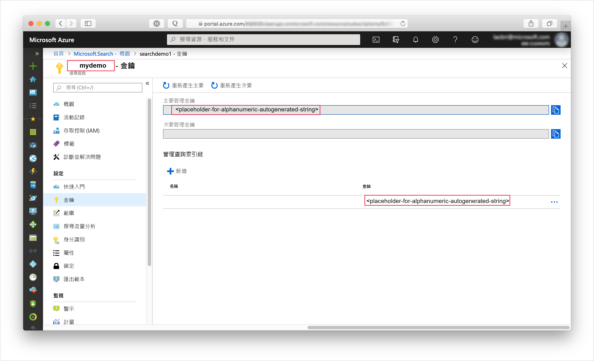
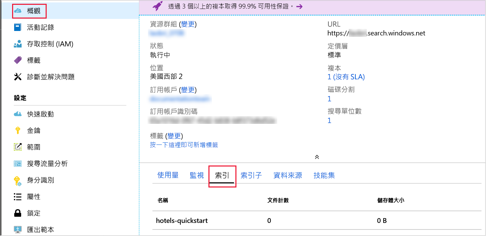

# <a name="quickstart-create-an-azure-cognitive-search-index-in-nodejs-using-rest-apis"></a>快速入門：使用 REST API 在 Node.js 中建立 Azure 認知搜尋索引
> [!div class="op_single_selector"]
> * [JavaScript](search-get-started-nodejs.md)
> * [C#](search-get-started-dotnet.md)
> * [入口網站](search-get-started-portal.md)
> * [PowerShell](search-create-index-rest-api.md)
> * [Python](search-get-started-python.md)
> * [Postman](search-get-started-postman.md)

建立 Node.js 應用程式，以建立、載入和查詢 Azure 認知搜尋索引。 本文示範如何逐步建立應用程式。 或者，您可以[下載原始程式碼和資料](https://github.com/Azure-Samples/azure-search-javascript-samples/tree/master/quickstart/)，並從命令列執行應用程式。

如果您沒有 Azure 訂用帳戶，請在開始前建立[免費帳戶](https://azure.microsoft.com/free/?WT.mc_id=A261C142F)。

## <a name="prerequisites"></a>必要條件

本快速入門會使用下列服務、工具和資料。

+ [Node.js](https://nodejs.org).
+ [NPM](https://www.npmjs.com) 應由 Node.js 安裝。
+ 本文或[存放庫的**快速入門**目錄](https://github.com/Azure-Samples/azure-search-javascript-samples/)會提供範例索引結構和比對文件。
+ [建立 Azure 認知搜尋服務](search-create-service-portal.md)，或在您目前的訂用帳戶下方[尋找現有服務](https://ms.portal.azure.com/#blade/HubsExtension/BrowseResourceBlade/resourceType/Microsoft.Search%2FsearchServices)。 您可以使用本快速入門的免費服務。

建議使用：

* [Visual Studio Code](https://code.visualstudio.com)。
* 適用於 VSCode 的 [Prettier](https://marketplace.visualstudio.com/items?itemName=esbenp.prettier-vscode) 和 [ESLint](https://marketplace.visualstudio.com/items?itemName=dbaeumer.vscode-eslint)。

<a name="get-service-info"></a>
## <a name="get-keys-and-urls"></a>取得金鑰和 URL

在每個對服務發出呼叫的要求上，都需要 URL 端點和存取金鑰。 建立搜尋服務時需要這兩項資料，因此如果您將 Azure 認知搜尋新增至您的訂用帳戶，請依照下列步驟來取得必要的資訊：

1. [登入 Azure 入口網站](https://portal.azure.com/)，並在搜尋服務的 [概觀]  頁面中取得您的搜尋服務名稱。 您可藉由檢閱端點 URL 來確認您的服務名稱。 如果您的端點 URL 為 `https://mydemo.search.windows.net`，您的服務名稱會是 `mydemo`。

2. 在 [設定]   >  [金鑰]  中，取得服務上完整權限的管理金鑰。 可互換的管理金鑰有兩個，可在您需要變換金鑰時提供商務持續性。 您可以在新增、修改及刪除物件的要求上使用主要或次要金鑰。

    一併取得查詢金鑰。 最佳做法是發出具有唯讀存取權的查詢要求。



在傳送至您服務的每個要求的標頭中都需要有 api-key。 有效的金鑰能為每個要求在傳送要求之應用程式與處理要求的服務間建立信任。

## <a name="set-up-your-environment"></a>設定環境

首先，開啟 Powershell 主控台或您已安裝 Node.js 的其他環境。

1. 建立開發目錄，並將其命名為 `quickstart`：

    ```powershell
    mkdir quickstart
    cd quickstart
    ```

2. 藉由執行 `npm init`，使用 NPM 初始化空的專案。 接受預設值，但 [授權] 除外，您應將其設定為 [MIT]。 

1. 新增將相依於程式碼並可協助開發的套件：

    ```powershell
    npm install nconf node-fetch
    npm install --save-dev eslint eslint-config-prettier eslint-config-airbnb-base eslint-plugin-import prettier
    ```

4. 檢查您的 **package. json** 檔案是否如下所示，確認您已設定好專案及其相依性：

    ```json
    {
      "name": "quickstart",
      "version": "1.0.0",
      "description": "Azure Cognitive Search Quickstart",
      "main": "index.js",
      "scripts": {
        "test": "echo \"Error: no test specified\" && exit 1"
      },
      "keywords": [
        "Azure",
        "Azure_Search"
      ],
      "author": "Your Name",
      "license": "MIT",
      "dependencies": {
        "nconf": "^0.10.0",
        "node-fetch": "^2.6.0"
      },
      "devDependencies": {
        "eslint": "^6.1.0",
        "eslint-config-airbnb-base": "^13.2.0",
        "eslint-config-prettier": "^6.0.0",
        "eslint-plugin-import": "^2.18.2",
        "prettier": "^1.18.2"
      }
    }
    ```
建立 **azure_search_config.json**檔案，以保存您的搜尋服務資料：

```json
{
    "serviceName" : "[SERVICE_NAME]",
    "adminKey" : "[ADMIN_KEY]",
    "queryKey" : "[QUERY_KEY]",
    "indexName" : "hotels-quickstart"
}
```

使用您的搜尋服務名稱來取代 `[SERVICE_NAME]` 值。 使用您稍早記錄的金鑰值來取代 `[ADMIN_KEY]` 和 `[QUERY_KEY]`。 

## <a name="1---create-index"></a>1 - 建立索引 

建立 **hotels_quickstart_index.json** 檔案。  此檔案會定義 Azure 認知搜尋將如何處理您要在下一個步驟中載入的文件。 每個欄位都會由 `name` 識別，並具有指定的 `type`。 每個欄位也有一系列的索引屬性，可指定 Azure 認知搜尋是否可在欄位上進行搜尋、篩選、排序和 Facet 處理。 大部分的欄位都是簡單的資料類型，但有些 (像是 `AddressType`) 則為複雜類型，其可讓您在索引中建立豐富的資料結構。  您可以深入了解[支援的資料類型](https://docs.microsoft.com/rest/api/searchservice/supported-data-types)和[索引屬性](https://docs.microsoft.com/azure/search/search-what-is-an-index#index-attributes)。 

將下列內容新增至 **hotels_quickstart_index.json**，或[下載檔案](https://github.com/Azure-Samples/azure-search-javascript-samples/blob/master/quickstart/hotels_quickstart_index.json)。 

```json
{
    "name": "hotels-quickstart",
    "fields": [
        {
            "name": "HotelId",
            "type": "Edm.String",
            "key": true,
            "filterable": true
        },
        {
            "name": "HotelName",
            "type": "Edm.String",
            "searchable": true,
            "filterable": false,
            "sortable": true,
            "facetable": false
        },
        {
            "name": "Description",
            "type": "Edm.String",
            "searchable": true,
            "filterable": false,
            "sortable": false,
            "facetable": false,
            "analyzer": "en.lucene"
        },
        {
            "name": "Description_fr",
            "type": "Edm.String",
            "searchable": true,
            "filterable": false,
            "sortable": false,
            "facetable": false,
            "analyzer": "fr.lucene"
        },
        {
            "name": "Category",
            "type": "Edm.String",
            "searchable": true,
            "filterable": true,
            "sortable": true,
            "facetable": true
        },
        {
            "name": "Tags",
            "type": "Collection(Edm.String)",
            "searchable": true,
            "filterable": true,
            "sortable": false,
            "facetable": true
        },
        {
            "name": "ParkingIncluded",
            "type": "Edm.Boolean",
            "filterable": true,
            "sortable": true,
            "facetable": true
        },
        {
            "name": "LastRenovationDate",
            "type": "Edm.DateTimeOffset",
            "filterable": true,
            "sortable": true,
            "facetable": true
        },
        {
            "name": "Rating",
            "type": "Edm.Double",
            "filterable": true,
            "sortable": true,
            "facetable": true
        },
        {
            "name": "Address",
            "type": "Edm.ComplexType",
            "fields": [
                {
                    "name": "StreetAddress",
                    "type": "Edm.String",
                    "filterable": false,
                    "sortable": false,
                    "facetable": false,
                    "searchable": true
                },
                {
                    "name": "City",
                    "type": "Edm.String",
                    "searchable": true,
                    "filterable": true,
                    "sortable": true,
                    "facetable": true
                },
                {
                    "name": "StateProvince",
                    "type": "Edm.String",
                    "searchable": true,
                    "filterable": true,
                    "sortable": true,
                    "facetable": true
                },
                {
                    "name": "PostalCode",
                    "type": "Edm.String",
                    "searchable": true,
                    "filterable": true,
                    "sortable": true,
                    "facetable": true
                },
                {
                    "name": "Country",
                    "type": "Edm.String",
                    "searchable": true,
                    "filterable": true,
                    "sortable": true,
                    "facetable": true
                }
            ]
        }
    ],
    "suggesters": [
        {
            "name": "sg",
            "searchMode": "analyzingInfixMatching",
            "sourceFields": [
                "HotelName"
            ]
        }
    ]
}
```
    

建議將特定案例的細節與廣泛適用的程式碼區隔開。 在 **AzureSearchClient.js**檔案中定義的 `AzureSearchClient` 類別會知道如何建構要求 URL、使用 Fetch API 提出要求，以及對回應的狀態碼做出反應。

匯入 **node-fetch** 套件並建立簡單的類別，以便開始使用 **AzureSearchClient.js**。 將各種組態值傳遞至其建構函式，以隔離 `AzureSearchClient` 類別的可變更部分：

```javascript
const fetch = require('node-fetch');

class AzureSearchClient {
    constructor(searchServiceName, adminKey, queryKey, indexName) {
        this.searchServiceName = searchServiceName;
        this.adminKey = adminKey;
        // The query key is used for read-only requests and so can be distributed with less risk of abuse.
        this.queryKey = queryKey;
        this.indexName = indexName;
        this.apiVersion = '2019-05-06';
    }

    // All methods go inside class body here!
}

module.exports = AzureSearchClient;
```

類別的第一項責任是瞭解如何建構可供傳送各種要求的 URL。 執行個體方法會使用傳遞至類別建構函式的組態資料，請使用此種方法建立這些 URL。 請注意，它們所建構的 URL 為 API 版本特有，且必須具有指定該版本 (在此應用程式中為 `2019-05-06`) 的引數。 

這些方法中的第一個會傳回索引本身的 URL。 在類別主體中新增下列方法：

```javascript
getIndexUrl() { return `https://${this.searchServiceName}.search.windows.net/indexes/${this.indexName}?api-version=${this.apiVersion}`; }

```

`AzureSearchClient` 的下一個責任是使用 Fetch API 進行非同步要求。 非同步靜態方法 `request` 會採用 URL、指定 HTTP 方法的字串 ("GET"、"PUT"、"POST"、"DELETE")、要在要求中使用的金鑰，以及選用 JSON 物件。 `queryKey` 變數會將 `headers` (不論是管理金鑰或唯讀查詢金鑰) 對應至 "api-key" HTTP 要求標頭。 要求選項一律包含要使用的 `method` 和 `headers`。 如果 `bodyJson` 不為 `null`，HTTP 要求的主體會設定為 `bodyJson` 的字串表示法。 `request` 方法會傳回 Fetch API 的承諾以執行 HTTP 要求。

```javascript
static async request(url, method, apiKey, bodyJson = null) {
    // Uncomment the following for request details:
    /*
    console.log(`\n${method} ${url}`);
    console.log(`\nKey ${apiKey}`);
    if (bodyJson !== null) {
        console.log(`\ncontent: ${JSON.stringify(bodyJson, null, 4)}`);
    }
    */

    const headers = {
        'content-type' : 'application/json',
        'api-key' : apiKey
    };
    const init = bodyJson === null ?
        { 
            method, 
            headers
        }
        : 
        {
            method, 
            headers,
            body : JSON.stringify(bodyJson)
        };
    return fetch(url, init);
}
```

基於示範目的，如果 HTTP 要求不成功，我們就會擲回例外狀況。 在實際的應用程式中，您可能會在搜尋服務要求的 `response` 中，進行 HTTP 狀態碼的記錄和診斷。 
    
```javascript
static throwOnHttpError(response) {
    const statusCode = response.status;
    if (statusCode >= 300){
        console.log(`Request failed: ${JSON.stringify(response, null, 4)}`);
        throw new Error(`Failure in request. HTTP Status was ${statusCode}`);
    }
}
```

最後，新增用來偵測、刪除及建立 Azure 認知搜尋索引的方法。 這些方法全都有相同的結構：

* 取得將對其提出要求的端點。
* 使用適當的端點、HTTP 指令動詞、API 金鑰和 JSON 主體 (如果適用) 來產生要求。 `indexExistsAsync()` 和 `deleteIndexAsync()` 沒有 JSON 主體，但 `createIndexAsync(definition)` 有。
* `await` 要求的回應。  
* 對回應的狀態碼採取行動。
* 傳回一些適當值的承諾 (布林值、`this` 或查詢結果)。 

```javascript
async indexExistsAsync() { 
    console.log("\n Checking if index exists...");
    const endpoint = this.getIndexUrl();
    const response = await AzureSearchClient.request(endpoint, "GET", this.adminKey);
    // Success has a few likely status codes: 200 or 204 (No Content), but accept all in 200 range...
    const exists = response.status >= 200 && response.status < 300;
    return exists;
}

async deleteIndexAsync() {
    console.log("\n Deleting existing index...");
    const endpoint = this.getIndexUrl();
    const response = await AzureSearchClient.request(endpoint, "DELETE", this.adminKey);
    AzureSearchClient.throwOnHttpError(response);
    return this;
}

async createIndexAsync(definition) {
    console.log("\n Creating index...");
    const endpoint = this.getIndexUrl();
    const response = await AzureSearchClient.request(endpoint, "PUT", this.adminKey, definition);
    AzureSearchClient.throwOnHttpError(response);
    return this;
}
```

確認您的方法在類別內，而且您要匯出類別。 **AzureSearchClient** 的最外層範圍應該是：

```javascript
const fetch = require('node-fetch');

class AzureSearchClient {
    // ... code here ...
}

module.exports = AzureSearchClient;
```

物件導向的類別很適合用於可能可重複使用的 **AzureSearchClient.js** 模組，但並非主要程式所必要，您應該將該主要程式放入 **index.js** 檔案中。 

建立 **index.js** 並由帶入以下內容著手：

* **nconf** 套件，讓您有彈性地使用 JSON、環境變數或命令列引數來指定組態。
* 來自 **hotels_quickstart_index.json**檔案的資料。
* `AzureSearchClient` 模組。

```javascript
const nconf = require('nconf');

const indexDefinition = require('./hotels_quickstart_index.json');
const AzureSearchClient = require('./AzureSearchClient.js');
```

[**nconf** package](https://github.com/indexzero/nconf) 套件可讓您指定各種格式的組態資料，例如環境變數或命令列。 此範例會以基本方式使用 **nconf**，以讀取 **azure_search_config.json** 檔案並以字典形式傳回該檔案的內容。 使用 **nconf** 的 `get(key)` 函式，您就可以快速檢查設定資訊是否已正確自訂。 最後，函式會傳回設定：

```javascript
function getAzureConfiguration() {
    const config = nconf.file({ file: 'azure_search_config.json' });
    if (config.get('serviceName') === '[SEARCH_SERVICE_NAME' ) {
        throw new Error("You have not set the values in your azure_search_config.json file. Change them to match your search service's values.");
    }
    return config;
}
```

`Promise` 函式會建立 `sleep`，它會在指定的時間量之後解析。 使用此函式可讓應用程式暫停，同時等候非同步索引作業完成並變成可用。 新增此種延遲只有在示範、測試與範例應用程式中才有必要。

```javascript
function sleep(ms) {
    return(
        new Promise(function(resolve, reject) {
            setTimeout(function() { resolve(); }, ms);
        })
    );
}
```

最後，指定並呼叫主要非同步 `run` 函式。 此函式會依序呼叫其他函式，視需要等待以解決 `Promise`。

* 使用您先前撰寫的 `getAzureConfiguration()` 來擷取組態
* 建立新 `AzureSearchClient` 的執行個體，並從您的組態傳入值
* 檢查索引是否存在，如果有的話，將它刪除
* 使用從 **hotels_quickstart_index.json** 載入的 `indexDefinition` 來建立索引

```javascript
const run = async () => {
    try {
        const cfg = getAzureConfiguration();
        const client = new AzureSearchClient(cfg.get("serviceName"), cfg.get("adminKey"), cfg.get("queryKey"), cfg.get["serviceName"]);
        
        const exists = await client.indexExistsAsync();
        await exists ? client.deleteIndexAsync() : Promise.resolve();
        // Deleting index can take a few seconds
        await sleep(2000);
        await client.createIndexAsync(indexDefinition);
    } catch (x) {
        console.log(x);
    }
}

run();
```

別忘了最後呼叫 `run()`！ 當您在下一個步驟中執行 `node index.js` 時，它就是您程式的進入點。

請注意，`AzureSearchClient.indexExistsAsync()` 和 `AzureSearchClient.deleteIndexAsync()` 不接受參數。 這些函式會呼叫不含 `bodyJson` 引數的 `AzureSearchClient.request()`。 在 `AzureSearchClient.request()` 中，由於 `bodyJson === null` 是 `true`，因此，`init` 結構會設為只有 HTTP 指令動詞 (用於 `indexExistsAsync()` 的 "GET" 和用於 `deleteIndexAsync()` 的 "DELETE")，以及指定要求金鑰的標頭。  

相反地，`AzureSearchClient.createIndexAsync(indexDefinition)` 方法「會」  接受參數。 `index.js` 中的 `run` 函式會將 **hotels_quickstart_index.json** 檔案的內容傳遞給 `AzureSearchClient.createIndexAsync(indexDefinition)` 方法。 `createIndexAsync()` 方法會將此定義傳遞給 `AzureSearchClient.request()`。 在 `AzureSearchClient.request()` 中，由於 `bodyJson === null` 現在是 `false`，因此，`init` 結構不只包含 HTTP 指令動詞 ("PUT") 和標頭，也將 `body` 設定為索引定義資料。

### <a name="prepare-and-run-the-sample"></a>準備並執行範例

在終端機視窗中，執行下列命令。

1. 瀏覽至內含 **package.json** 檔案和其餘程式碼的資料夾。
1. 使用 `npm install` 安裝該範例的套件。  此命令會下載程式碼所相依的套件。
1. 使用 `node index.js` 執行您的程式。

您應會看到一系列的訊息，描述程式所採取的動作。 如果您想要查看要求的更多詳細資料，您可以將 **AzureSearchClient.js** 中 [`AzureSearchClient.request()` 方法的開頭幾行]https://github.com/Azure-Samples/azure-search-javascript-samples/blob/master/quickstart/AzureSearchClient.js#L21-L27) 取消註解。 

在 Azure 入口網站中開啟搜尋服務的**概觀**。 選取 [索引]  標籤。您應該會看到如下的內容：



在下一個步驟中，您會將資料新增至索引。 

## <a name="2---load-documents"></a>2 - 載入文件 

在 Azure 認知搜尋中，文件是同時屬於索引輸入與查詢輸出的資料結構。 您必須將這類資料 POST 至索引。 此動作使用的端點會與上一個步驟中所執行的作業不同。 開啟 **AzureSearchClient.js**，並在 `getIndexUrl()` 之後新增下列方法：

```javascript
 getPostDataUrl() { return `https://${this.searchServiceName}.search.windows.net/indexes/${this.indexName}/docs/index?api-version=${this.apiVersion}`;  }
```

如同 `AzureSearchClient.createIndexAsync(definition)`，您需要一個函式來呼叫 `AzureSearchClient.request()`，並傳入飯店資料作為其主體。 在 **AzureSearchClient.js**，將 `postDataAsync(hotelsData)` 新增在 `createIndexAsync(definition)` 之後：

```javascript
async postDataAsync(hotelsData) {
    console.log("\n Adding hotel data...");
    const endpoint = this.getPostDataUrl();
    const response = await AzureSearchClient.request(endpoint,"POST", this.adminKey, hotelsData);
    AzureSearchClient.throwOnHttpError(response);
    return this;
}
```

 文件輸入可能是資料庫中的資料列、Blob 儲存體中的 Blob，或磁碟上的 JSON 文件。 您可以下載 [hotels. json](https://github.com/Azure-Samples/azure-search-javascript-samples/blob/master/quickstart/hotels.json)，或使用下列內容建立自己的 **hotels.json** 檔案：

```json
{
    "value": [
        {
            "HotelId": "1",
            "HotelName": "Secret Point Motel",
            "Description": "The hotel is ideally located on the main commercial artery of the city in the heart of New York. A few minutes away is Time's Square and the historic centre of the city, as well as other places of interest that make New York one of America's most attractive and cosmopolitan cities.",
            "Description_fr": "L'hôtel est idéalement situé sur la principale artère commerciale de la ville en plein cœur de New York. A quelques minutes se trouve la place du temps et le centre historique de la ville, ainsi que d'autres lieux d'intérêt qui font de New York l'une des villes les plus attractives et cosmopolites de l'Amérique.",
            "Category": "Boutique",
            "Tags": ["pool", "air conditioning", "concierge"],
            "ParkingIncluded": false,
            "LastRenovationDate": "1970-01-18T00:00:00Z",
            "Rating": 3.6,
            "Address": {
                "StreetAddress": "677 5th Ave",
                "City": "New York",
                "StateProvince": "NY",
                "PostalCode": "10022"
            }
        },
        {
            "HotelId": "2",
            "HotelName": "Twin Dome Motel",
            "Description": "The hotel is situated in a  nineteenth century plaza, which has been expanded and renovated to the highest architectural standards to create a modern, functional and first-class hotel in which art and unique historical elements coexist with the most modern comforts.",
            "Description_fr": "L'hôtel est situé dans une place du XIXe siècle, qui a été agrandie et rénovée aux plus hautes normes architecturales pour créer un hôtel moderne, fonctionnel et de première classe dans lequel l'art et les éléments historiques uniques coexistent avec le confort le plus moderne.",
            "Category": "Boutique",
            "Tags": ["pool", "free wifi", "concierge"],
            "ParkingIncluded": "false",
            "LastRenovationDate": "1979-02-18T00:00:00Z",
            "Rating": 3.6,
            "Address": {
                "StreetAddress": "140 University Town Center Dr",
                "City": "Sarasota",
                "StateProvince": "FL",
                "PostalCode": "34243"
            }
        },
        {
            "HotelId": "3",
            "HotelName": "Triple Landscape Hotel",
            "Description": "The Hotel stands out for its gastronomic excellence under the management of William Dough, who advises on and oversees all of the Hotel’s restaurant services.",
            "Description_fr": "L'hôtel est situé dans une place du XIXe siècle, qui a été agrandie et rénovée aux plus hautes normes architecturales pour créer un hôtel moderne, fonctionnel et de première classe dans lequel l'art et les éléments historiques uniques coexistent avec le confort le plus moderne.",
            "Category": "Resort and Spa",
            "Tags": ["air conditioning", "bar", "continental breakfast"],
            "ParkingIncluded": "true",
            "LastRenovationDate": "2015-09-20T00:00:00Z",
            "Rating": 4.8,
            "Address": {
                "StreetAddress": "3393 Peachtree Rd",
                "City": "Atlanta",
                "StateProvince": "GA",
                "PostalCode": "30326"
            }
        },
        {
            "HotelId": "4",
            "HotelName": "Sublime Cliff Hotel",
            "Description": "Sublime Cliff Hotel is located in the heart of the historic center of Sublime in an extremely vibrant and lively area within short walking distance to the sites and landmarks of the city and is surrounded by the extraordinary beauty of churches, buildings, shops and monuments. Sublime Cliff is part of a lovingly restored 1800 palace.",
            "Description_fr": "Le sublime Cliff Hotel est situé au coeur du centre historique de sublime dans un quartier extrêmement animé et vivant, à courte distance de marche des sites et monuments de la ville et est entouré par l'extraordinaire beauté des églises, des bâtiments, des commerces et Monuments. Sublime Cliff fait partie d'un Palace 1800 restauré avec amour.",
            "Category": "Boutique",
            "Tags": ["concierge", "view", "24-hour front desk service"],
            "ParkingIncluded": true,
            "LastRenovationDate": "1960-02-06T00:00:00Z",
            "Rating": 4.6,
            "Address": {
                "StreetAddress": "7400 San Pedro Ave",
                "City": "San Antonio",
                "StateProvince": "TX",
                "PostalCode": "78216"
            }
        }
    ]
}

```

若要將此資料載入您的程式，請藉由在靠近頂端的位置上新增參考 `hotelData` 的行，來修改 **index.js**：

```javascript
const nconf = require('nconf');

const hotelData = require('./hotels.json');
const indexDefinition = require('./hotels_quickstart_index.json');
```

現在，在 **index.js** 中修改 `run()` 函式。 索引可能需要幾秒鐘的時間才會變成可用，因此，請在呼叫 `AzureSearchClient.postDataAsync(hotelData)` 之前加入 2 秒的暫停：

```javascript
const run = async () => {
    try {
        const cfg = getAzureConfiguration();
        const client = new AzureSearchClient(cfg.get("serviceName"), cfg.get("adminKey"), cfg.get("queryKey"), cfg.get("indexName"));
        
        const exists = await client.indexExistsAsync();
        await exists ? client.deleteIndexAsync() : Promise.resolve();
        // Deleting index can take a few seconds
        await sleep(2000);
        await client.createIndexAsync(indexDefinition);
        // Index availability can take a few seconds
        await sleep(2000);
        await client.postDataAsync(hotelData);
    } catch (x) {
        console.log(x);
    }
}
```

使用 `node index.js` 再次執行程式。 您應該會看到一組與步驟 1 所示訊息略有不同的訊息。 這次，索引「確實」  存在，而且您應該會在應用程式建立新索引並對其發佈資料之前，看到有關刪除該索引的訊息。 

## <a name="3---search-an-index"></a>3 - 搜尋索引

返回 [索引]  標籤 (位於 Azure 入口網站的搜尋服務 [概觀]  中)。 您的索引現在會包含四個文件，並且會耗用一些儲存體 (UI 可能需要幾分鐘的時間，才能正確反映索引的基礎狀態)。 按一下索引名稱，以移至 [搜尋總管]  。 此頁面可讓您試驗資料查詢。 若嘗試搜尋 `*&$count=true` 的查詢字串，您應該會收到所有文件和結果數目。 若嘗試 `historic&highlight=Description&$filter=Rating gt 4` 查詢字串，您應該會收到單一文件，其中 "historic" 一詞會以 `<em></em>` 標記括住。 深入了解[如何在 Azure 認知搜尋中撰寫查詢](https://docs.microsoft.com/azure/search/search-query-overview)。 

藉由開啟 **index.js** 並將此程式碼加入至頂端附近的位置，以在程式碼中重現這些查詢：

```javascript
const queries = [
    "*&$count=true",
    "historic&highlight=Description&$filter=Rating gt 4&"
];
```

在相同的 **index.js** 檔案中，寫入 `doQueriesAsync()` 函式，如下所示。 此函式會接受 `AzureSearchClient` 物件，並將 `AzureSearchClient.queryAsync` 方法套用至 `queries` 陣列中的每個值。 它會使用 `Promise.all()` 函式來傳回單一 `Promise`，它只會在所有查詢都已解析時才會解析。 呼叫 `JSON.stringify(body, null, 4)` 將查詢結果格式化為更容易讀取。

```javascript
async function doQueriesAsync(client) {
    return Promise.all(
        queries.map( async query => {
            const result = await client.queryAsync(query);
            const body = await result.json();
            const str = JSON.stringify( body, null, 4);
            console.log(`Query: ${query} \n ${str}`);
        })
    );
}
```

修改 `run()` 函式以設定足夠的暫停時間，讓索引子能夠運作並呼叫 `doQueriesAsync(client)` 函式：

```javascript
const run = async () => {
    try {
        const cfg = getAzureConfiguration();
        const client = new AzureSearchClient(cfg.get("serviceName"), cfg.get("adminKey"), cfg.get("queryKey"), cfg.get("indexName"));
        
        const exists = await client.indexExistsAsync();
        await exists ? client.deleteIndexAsync() : Promise.resolve();
        // Deleting index can take a few seconds
        await sleep(2000);
        await client.createIndexAsync(indexDefinition);
        // Index availability can take a few seconds
        await sleep(2000);
        await client.postDataAsync(hotelData);
        // Data availability can take a few seconds
        await sleep(5000);
        await doQueriesAsync(client);
    } catch (x) {
        console.log(x);
    }
}
```

若要實作 `AzureSearchClient.queryAsync(query)`，請編輯 **AzureSearchClient.js** 檔案。 搜尋需要不同的端點，而且搜尋字詞會變成 URL 引數，因此請加入 `getSearchUrl(searchTerm)` 函式及您已撰寫的 `getIndexUrl()` 和 `getPostDataUrl()` 方法。

```javascript
getSearchUrl(searchTerm) { return `https://${this.searchServiceName}.search.windows.net/indexes/${this.indexName}/docs?api-version=${this.apiVersion}&search=${searchTerm}&searchMode=all`; }
 ```

`queryAsync(searchTerm)` 函式也會放入 **AzureSearchClient.js**，並遵循與 `postDataAsync(data)` 和其他查詢函式相同的結構： 

```javascript
async queryAsync(searchTerm) {
    console.log("\n Querying...")
    const endpoint = this.getSearchUrl(searchTerm);
    const response = await AzureSearchClient.request(endpoint, "GET", this.queryKey);
    AzureSearchClient.throwOnHttpError(response);
    return response;
}
```

搜尋會透過 "GET" 動詞來完成，並且沒有主體，因為搜尋字詞是 URL 的一部分。 請注意，`queryAsync(searchTerm)` 會使用 `this.queryKey`，不同於其他使用管理金鑰的函式。 查詢金鑰只能用來查詢索引 (如其名所示)，無論如何都無法用來修改索引。 因此，將查詢金鑰散發給用戶端應用程式會更安全。

以 `node index.js` 執行程式。 現在，除了先前的步驟之外，查詢也會送出，並將結果寫入主控台。

### <a name="about-the-sample"></a>關於範例

此範例會使用少量的旅館資料，其足以示範建立和查詢 Azure 認知搜尋索引的基本概念。

**AzureSearchClient** 類別會封裝搜尋服務的組態、URL 和基本 HTTP 要求。 **index.js** 檔案會載入 Azure 認知搜尋服務的組態資料、將上傳以供編製索引的旅館資料，以及在其 `run` 函式中排序和執行各種作業。

`run` 函式的整體行為是要刪除 Azure 認知搜尋索引 (如果有的話)、建立索引、新增一些資料，以及執行一些查詢。  

## <a name="clean-up"></a>清除 

使用您自己的訂用帳戶時，在專案結束後確認您是否還需要您建立的資源，是很好的做法。 讓資源繼續執行可能會產生費用。 您可以個別刪除資源，或刪除資源群組以刪除整組資源。

您可以使用左導覽窗格中的 [所有資源]  或 [資源群組]  連結，在入口網站中尋找和管理資源。
如果您使用免費服務，請記住您會有三個索引、索引子和資料來源的限制。 您可以在入口網站中刪除個別項目，以避免超出限制。 

## <a name="next-steps"></a>後續步驟

在此 Node.js 快速入門中，您已執行一系列的工作來建立索引、使用文件來載入索引，以及執行查詢。 我們會以最簡單的方式，執行特定步驟，例如讀取組態及定義查詢。 在實際的應用程式中，您會想要將這些考量放在可提供彈性和封裝的個別模組中。 
 
如果您已有一些 Azure 認知搜尋的背景知識，可以利用此範例作為試用建議工具 (預先輸入或自動完成查詢)、篩選及多面向導覽的跳板。 如果您不熟悉 Azure 認知搜尋，建議您嘗試藉由其他教學課程了解您可以建立的項目。 請瀏覽我們的 [文件頁面](https://azure.microsoft.com/documentation/services/search/) 以尋找更多資源。 

> [!div class="nextstepaction"]
> [使用 Javascript 從網頁呼叫 Azure 認知搜尋](https://github.com/liamca/azure-search-javascript-samples)
