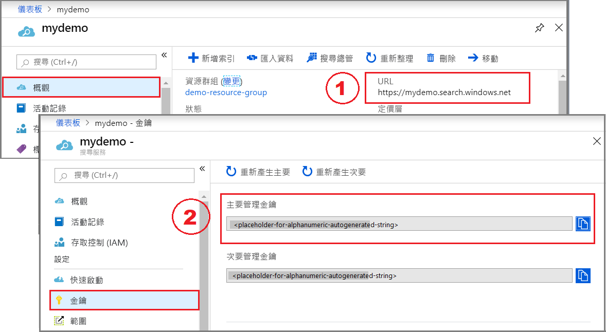

# <a name="quickstart-create-an-azure-cognitive-search-index-in-python-using-jupyter-notebooks"></a>快速入門：使用 Jupyter Notebook 在 Python 中建立 Azure 認知搜尋索引

> [!div class="op_single_selector"]
> * [Python (REST)](search-get-started-python.md)
> * [PowerShell (REST)](search-create-index-rest-api.md)
> * [C#](search-create-index-dotnet.md)
> * [Postman (REST)](search-get-started-postman.md)
> * [入口網站](search-create-index-portal.md)
> 

建置 Jupyter Notebook，以使用 Python 和 [Azure 認知搜尋 REST API](https://docs.microsoft.com/rest/api/searchservice/) 來建立、載入和查詢 Azure 認知搜尋索引。 本文將說明如何逐步建立筆記本。 或是，您可以[下載並執行已完成的 Jupyter Python 筆記本](https://github.com/Azure-Samples/azure-search-python-samples)。

如果您沒有 Azure 訂用帳戶，請在開始前建立[免費帳戶](https://azure.microsoft.com/free/?WT.mc_id=A261C142F)。

## <a name="prerequisites"></a>必要條件

此快速入門需要下列服務和工具。 

+ [Anaconda 3.x](https://www.anaconda.com/distribution/#download-section)，提供 Python 3.x 和 Jupyter Notebook。

+ [建立 Azure 認知搜尋服務](search-create-service-portal.md)，或在您目前的訂用帳戶下方[尋找現有服務](https://ms.portal.azure.com/#blade/HubsExtension/BrowseResourceBlade/resourceType/Microsoft.Search%2FsearchServices)。 您可以使用免費層來進行本快速入門。 

## <a name="get-a-key-and-url"></a>取得金鑰和 URL

REST 呼叫需要服務 URL 和每個要求的存取金鑰。 建立搜尋服務時需要這兩項資料，因此如果您將 Azure 認知搜尋新增至您的訂用帳戶，請依照下列步驟來取得必要的資訊：

1. [登入 Azure 入口網站](https://portal.azure.com/)，並在搜尋服務的 [概觀]  頁面上取得 URL。 範例端點看起來會像是 `https://mydemo.search.windows.net`。

1. 在 [設定]   >  [金鑰]  中，取得服務上完整權限的管理金鑰。 可互換的管理金鑰有兩個，可在您需要變換金鑰時提供商務持續性。 您可以在新增、修改及刪除物件的要求上使用主要或次要金鑰。



所有要求均都需要在傳送至您服務上的每個要求上使用 API 金鑰。 擁有有效的金鑰就能為每個要求在傳送要求之應用程式與處理要求之服務間建立信任。

## <a name="connect-to-azure-cognitive-search"></a>連線至 Azue 認知搜尋

在這項工作中，請啟動 Jupyter Notebook，確認您可以連線至 Azure 認知搜尋。 您將藉由從服務中要求索引清單來執行此動作。 在具有 Anaconda3 的 Windows 上，您可以使用 Anaconda Navigator 來啟動筆記本。

1. 建立新的 Python3 筆記本。

1. 在第一個資料格中，載入處理 JSON 和制訂 HTTP 要求所使用的程式庫。

   ```python
   import json
   import requests
   from pprint import pprint
   ```

1. 在第二個資料格中，輸入將在每個要求上成為常數的要求元素。 將搜尋服務名稱 (YOUR-SEARCH-SERVICE-NAME) 與系統管理 API 金鑰 (YOUR-ADMIN-API-KEY) 取代為有效的值。 

   ```python
   endpoint = 'https://<YOUR-SEARCH-SERVICE-NAME>.search.windows.net/'
   api_version = '?api-version=2019-05-06'
   headers = {'Content-Type': 'application/json',
           'api-key': '<YOUR-ADMIN-API-KEY>' }
   ```

   如果您收到 ConnectionError `"Failed to establish a new connection"`，請檢查 API 金鑰是主要或次要系統管理金鑰，而且所有開頭和結尾字元 (`?` 和 `/`) 是否都正確。

1. 在第三個資料格中，制訂要求。 此 GET 要求會以您搜尋服務的索引集合為目標，並選取現有索引的名稱屬性。

   ```python
   url = endpoint + "indexes" + api_version + "&$select=name"
   response  = requests.get(url, headers=headers)
   index_list = response.json()
   pprint(index_list)
   ```

1. 執行每個步驟。 如果索引存在，回應就會包含索引名稱清單。 在下面的螢幕擷取畫面中，服務中已經有 azureblob-index 和 realestate-us-sample 索引。

   

   相對的，空的索引集合會傳回此回應：`{'@odata.context': 'https://mydemo.search.windows.net/$metadata#indexes(name)', 'value': []}`

## <a name="1---create-an-index"></a>1 - 建立索引

除非您使用入口網站，否則服務上必須有索引，您才能載入資料。 此步驟會使用[建立索引 REST API](https://docs.microsoft.com/rest/api/searchservice/create-index) 將索引結構描述推送至服務。

索引的必要元素包括名稱、欄位集合和索引鍵。 欄位集合會定義「文件」  的結構。 每個欄位都有名稱、類型和用於決定欄位使用方式的屬性 (例如，該欄位是否可在搜尋結果中進行全文檢索搜尋、篩選或擷取)。 在索引內，類型為 `Edm.String` 的其中一個欄位必須指定為識別文件所需的「索引鍵」  。

如下所示，此索引名為 "hotels-quickstart"，並且具有欄位定義。 這是較大型[飯店索引](https://github.com/Azure-Samples/azure-search-sample-data/blob/master/hotels/Hotels_IndexDefinition.JSON) (用於其他逐步解說) 的子集。 為了簡潔起見，我們已在本快速入門中予以修剪。

1. 在下一個資料格中，將下列範例貼入資料格中，以提供結構描述。 

    ```python
    index_schema = {
       "name": "hotels-quickstart",  
       "fields": [
         {"name": "HotelId", "type": "Edm.String", "key": "true", "filterable": "true"},
         {"name": "HotelName", "type": "Edm.String", "searchable": "true", "filterable": "false", "sortable": "true", "facetable": "false"},
         {"name": "Description", "type": "Edm.String", "searchable": "true", "filterable": "false", "sortable": "false", "facetable": "false", "analyzer": "en.lucene"},
         {"name": "Description_fr", "type": "Edm.String", "searchable": "true", "filterable": "false", "sortable": "false", "facetable": "false", "analyzer": "fr.lucene"},
         {"name": "Category", "type": "Edm.String", "searchable": "true", "filterable": "true", "sortable": "true", "facetable": "true"},
         {"name": "Tags", "type": "Collection(Edm.String)", "searchable": "true", "filterable": "true", "sortable": "false", "facetable": "true"},
         {"name": "ParkingIncluded", "type": "Edm.Boolean", "filterable": "true", "sortable": "true", "facetable": "true"},
         {"name": "LastRenovationDate", "type": "Edm.DateTimeOffset", "filterable": "true", "sortable": "true", "facetable": "true"},
         {"name": "Rating", "type": "Edm.Double", "filterable": "true", "sortable": "true", "facetable": "true"},
         {"name": "Address", "type": "Edm.ComplexType", 
         "fields": [
         {"name": "StreetAddress", "type": "Edm.String", "filterable": "false", "sortable": "false", "facetable": "false", "searchable": "true"},
         {"name": "City", "type": "Edm.String", "searchable": "true", "filterable": "true", "sortable": "true", "facetable": "true"},
         {"name": "StateProvince", "type": "Edm.String", "searchable": "true", "filterable": "true", "sortable": "true", "facetable": "true"},
         {"name": "PostalCode", "type": "Edm.String", "searchable": "true", "filterable": "true", "sortable": "true", "facetable": "true"},
         {"name": "Country", "type": "Edm.String", "searchable": "true", "filterable": "true", "sortable": "true", "facetable": "true"}
        ]
       }
      ]
    }
    ```

2. 在另一個資料格中，制訂要求。 此 PUT 要求會以您搜尋服務的索引集合為目標，並根據您在上一個資料格中提供的索引結構描述來建立索引。

   ```python
   url = endpoint + "indexes" + api_version
   response  = requests.post(url, headers=headers, json=index_schema)
   index = response.json()
   pprint(index)
   ```

3. 執行每個步驟。

   回應會包括結構描述的 JSON 標記法。 下列螢幕擷取畫面只顯示回應的一部分。

    

> [!Tip]
> 驗證索引是否建立的另一種方法是在入口網站中檢查 [索引] 清單。

<a name="load-documents"></a>

## <a name="2---load-documents"></a>2 - 載入文件

若要推送文件，可將 HTTP POST 要求發送至您索引的 URL 端點。 該 REST API 為[新增、更新或刪除文件](https://docs.microsoft.com/rest/api/searchservice/addupdate-or-delete-documents)。 這些文件來自 GitHub 上的 [HotelsData](https://github.com/Azure-Samples/azure-search-sample-data/blob/master/hotels/HotelsData_toAzureSearch.JSON)。

1. 在新的資料格中，請提供符合索引結構描述的四份文件。 指定每份文件的上傳動作。

    ```python
    documents = {
        "value": [
        {
        "@search.action": "upload",
        "HotelId": "1",
        "HotelName": "Secret Point Motel",
        "Description": "The hotel is ideally located on the main commercial artery of the city in the heart of New York. A few minutes away is Time's Square and the historic centre of the city, as well as other places of interest that make New York one of America's most attractive and cosmopolitan cities.",
        "Description_fr": "L'hôtel est idéalement situé sur la principale artère commerciale de la ville en plein cœur de New York. A quelques minutes se trouve la place du temps et le centre historique de la ville, ainsi que d'autres lieux d'intérêt qui font de New York l'une des villes les plus attractives et cosmopolites de l'Amérique.",
        "Category": "Boutique",
        "Tags": [ "pool", "air conditioning", "concierge" ],
        "ParkingIncluded": "false",
        "LastRenovationDate": "1970-01-18T00:00:00Z",
        "Rating": 3.60,
        "Address": {
            "StreetAddress": "677 5th Ave",
            "City": "New York",
            "StateProvince": "NY",
            "PostalCode": "10022",
            "Country": "USA"
            }
        },
        {
        "@search.action": "upload",
        "HotelId": "2",
        "HotelName": "Twin Dome Motel",
        "Description": "The hotel is situated in a  nineteenth century plaza, which has been expanded and renovated to the highest architectural standards to create a modern, functional and first-class hotel in which art and unique historical elements coexist with the most modern comforts.",
        "Description_fr": "L'hôtel est situé dans une place du XIXe siècle, qui a été agrandie et rénovée aux plus hautes normes architecturales pour créer un hôtel moderne, fonctionnel et de première classe dans lequel l'art et les éléments historiques uniques coexistent avec le confort le plus moderne.",
        "Category": "Boutique",
        "Tags": [ "pool", "free wifi", "concierge" ],
        "ParkingIncluded": "false",
        "LastRenovationDate": "1979-02-18T00:00:00Z",
        "Rating": 3.60,
        "Address": {
            "StreetAddress": "140 University Town Center Dr",
            "City": "Sarasota",
            "StateProvince": "FL",
            "PostalCode": "34243",
            "Country": "USA"
            }
        },
        {
        "@search.action": "upload",
        "HotelId": "3",
        "HotelName": "Triple Landscape Hotel",
        "Description": "The Hotel stands out for its gastronomic excellence under the management of William Dough, who advises on and oversees all of the Hotel’s restaurant services.",
        "Description_fr": "L'hôtel est situé dans une place du XIXe siècle, qui a été agrandie et rénovée aux plus hautes normes architecturales pour créer un hôtel moderne, fonctionnel et de première classe dans lequel l'art et les éléments historiques uniques coexistent avec le confort le plus moderne.",
        "Category": "Resort and Spa",
        "Tags": [ "air conditioning", "bar", "continental breakfast" ],
        "ParkingIncluded": "true",
        "LastRenovationDate": "2015-09-20T00:00:00Z",
        "Rating": 4.80,
        "Address": {
            "StreetAddress": "3393 Peachtree Rd",
            "City": "Atlanta",
            "StateProvince": "GA",
            "PostalCode": "30326",
            "Country": "USA"
            }
        },
        {
        "@search.action": "upload",
        "HotelId": "4",
        "HotelName": "Sublime Cliff Hotel",
        "Description": "Sublime Cliff Hotel is located in the heart of the historic center of Sublime in an extremely vibrant and lively area within short walking distance to the sites and landmarks of the city and is surrounded by the extraordinary beauty of churches, buildings, shops and monuments. Sublime Cliff is part of a lovingly restored 1800 palace.",
        "Description_fr": "Le sublime Cliff Hotel est situé au coeur du centre historique de sublime dans un quartier extrêmement animé et vivant, à courte distance de marche des sites et monuments de la ville et est entouré par l'extraordinaire beauté des églises, des bâtiments, des commerces et Monuments. Sublime Cliff fait partie d'un Palace 1800 restauré avec amour.",
        "Category": "Boutique",
        "Tags": [ "concierge", "view", "24-hour front desk service" ],
        "ParkingIncluded": "true",
        "LastRenovationDate": "1960-02-06T00:00:00Z",
        "Rating": 4.60,
        "Address": {
            "StreetAddress": "7400 San Pedro Ave",
            "City": "San Antonio",
            "StateProvince": "TX",
            "PostalCode": "78216",
            "Country": "USA"
            }
        }
    ]
    }
    ```   

2. 在另一個資料格中，制訂要求。 此 POST 要求會以 hotels-quickstart 索引的文件集合為目標，並推送上一個步驟中所提供的文件。

   ```python
   url = endpoint + "indexes/hotels-quickstart/docs/index" + api_version
   response  = requests.post(url, headers=headers, json=documents)
   index_content = response.json()
   pprint(index_content)
   ```

3. 請執行每個步驟，將文件推送至搜尋服務中的索引。 結果看起來應該會類似以下的範例。 

    

## <a name="3---search-an-index"></a>3 - 搜尋索引

此步驟將說明如何使用[搜尋文件 REST API](https://docs.microsoft.com/rest/api/searchservice/search-documents) 來查詢索引。

1. 在資料格中，提供查詢運算式來執行空的搜尋 (search=*)，並傳回未排名的雜亂文件清單 (搜尋分數 = 1.0)。 根據預設，Azure 認知搜尋一次會傳回 50 個相符項目。 經過結構化後，此查詢會傳回整個文件結構和值。 新增 $count = true 可取得結果中所有文件的計數。

   ```python
   searchstring = '&search=*&$count=true'
   ```

1. 在新的資料格中，提供下列範例來搜尋「飯店」和「wifi」字詞。 新增 $select 以指定要包含在搜尋結果中的欄位。

   ```python
   searchstring = '&search=hotels wifi&$count=true&$select=HotelId,HotelName'
   ```

1. 在另一個資料格中，制訂要求。 此 GET 要求會以 hotels-quickstart 索引的文件集合為目標，並連結上一個步驟中指定的查詢。

   ```python
   url = endpoint + "indexes/hotels-quickstart/docs" + api_version + searchstring
   response  = requests.get(url, headers=headers, json=searchstring)
   query = response.json()
   pprint(query)
   ```

1. 執行每個步驟。 結果看起來應該會類似以下的輸出。 

    

1. 嘗試其他幾個查詢範例來了解語法的風格。 您可以將 `searchstring` 取代為下列範例，然後重新執行搜尋要求。 

   套用篩選： 

   ```python
   searchstring = '&search=*&$filter=Rating gt 4&$select=HotelId,HotelName,Description,Rating'
   ```

   取前兩個結果：

   ```python
   searchstring = '&search=boutique&$top=2&$select=HotelId,HotelName,Description,Category'
   ```

    依特定欄位排序：

   ```python
   searchstring = '&search=pool&$orderby=Address/City&$select=HotelId, HotelName, Address/City, Address/StateProvince, Tags'
   ```

## <a name="clean-up"></a>清除

使用您自己的訂用帳戶時，在專案結束後確認您是否還需要您建立的資源，是很好的做法。 讓資源繼續執行可能會產生費用。 您可以個別刪除資源，或刪除資源群組以刪除整組資源。

您可以使用左導覽窗格中的 [所有資源]  或 [資源群組]  連結，在入口網站中尋找和管理資源。

如果您使用免費服務，請記住您會有三個索引、索引子和資料來源的限制。 您可以在入口網站中刪除個別項目，以避免超出限制。 

## <a name="next-steps"></a>後續步驟

為達到簡化目的，本快速入門使用了「飯店索引」的縮減版本。 您可以建立完整版本來嘗試更有趣的查詢。 若要取得完整版本和所有 50 個文件，請執行 [匯入資料]  精靈，從內建的範例資料來源中選取 [hotels-sample]  。

> [!div class="nextstepaction"]
> [快速入門：在 Azure 入口網站中建立索引](search-get-started-portal.md)
