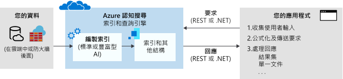

# 什麼是 Azure 認知搜尋？

Azure 認知搜尋（之前[稱為「Azure 搜尋服務](whats-new.md#new-service-name)」）是一個搜尋即服務雲端解決方案，可為開發人員提供 api 和工具，讓您在 web、行動和企業應用程式中，為私人、異類內容新增豐富的搜尋體驗. 您的程式碼或工具會叫用資料內嵌（索引編制）來建立和載入索引。 （選擇性）您可以新增認知技能，以在編制索引期間套用 AI 程式。 這麼做可以針對搜尋和其他案例新增有用的資訊和結構。

在服務的另一端，您的應用程式程式碼會發出查詢要求並處理回應。 搜尋體驗是在您的用戶端使用 Azure 認知搜尋的功能來定義，其中查詢會透過您建立、擁有並儲存在服務中的持續性索引執行。

透過簡單的 [REST API](/rest/api/searchservice/) 或 [.NET SDK](search-howto-dotnet-sdk.md) 展現功能，並同時隱蔽資訊擷取固有之複雜性。 除了 API 之外，Azure 入口網站也提供系統管理和內容管理的支援，以及建立原型和查詢索引的工具。 因為服務在雲端執行，Microsoft 會管理基礎結構和可用性。

## 使用 Azure 認知搜尋的時機

Azure 認知搜尋適用于下列應用程式案例：

+ 將異質內容類型合併為可搜尋的單一私人索引。 查詢一律會放在您使用檔建立和載入的索引上方，而且索引一律會位於 Azure 認知搜尋服務的雲端中。 您可以從任何來源或平台，將 JSON 文件的資料流填入索引。 或者，針對 Azure 上的內容，您可以使用「索引子」將資料提取到索引中。 索引定義和管理/擁有權是使用 Azure 認知搜尋的主要原因。

+ 原始內容是大型的無差異文字、影像檔案或應用程式檔，例如 azure 資料來源（例如 Azure Blob 儲存體或 Cosmos DB）上的 Office 內容類型。 您可以在編制索引期間套用認知技能，以新增結構或從影像和應用程式檔中摘錄意義。

+ 輕鬆實作與搜尋相關的功能。 Azure 認知搜尋 Api 簡化了查詢結構、多面向導覽、篩選（包括地理空間搜尋）、同義字對應、自動提示查詢和關聯性調整。 透過內建功能，您可以滿足終端使用者希望搜尋體驗能類似 Web 搜尋引擎的期望。

+ 編製非結構化文字的索引，或從影像檔擷取文字和資訊。 Azure 認知搜尋的[ai 擴充](cognitive-search-concept-intro.md)功能會將 ai 處理新增至索引管線。 一些常見的使用案例，包括已掃描文件的 OCR、大型文件的實體辨識和關鍵片語擷取、語言偵測和文字轉譯及情感分析。

+ 使用 Azure 認知搜尋的自訂和語言分析器，滿足了語言需求。 如果您有非英文內容，Azure 認知搜尋支援 Lucene 分析器和 Microsoft 的自然語言處理器。 您也可以設定分析器來完成原始內容的特殊處理，例如篩選出變音符號。

## 功能描述

| 核心&nbsp;搜尋&nbsp;&nbsp;&nbsp;&nbsp;&nbsp;&nbsp;&nbsp;&nbsp;&nbsp;&nbsp;&nbsp;&nbsp;&nbsp;&nbsp;&nbsp;&nbsp;&nbsp;&nbsp;&nbsp;&nbsp;&nbsp;&nbsp;&nbsp;&nbsp;  | 特性 |
|-------------------|----------|
|自由格式文字檢索 | [**全文檢索搜尋**](search-lucene-query-architecture.md)是大部分以搜尋為基礎之應用程式的主要使用案例。 您可以使用 Azure 搜尋服務支援的語法制訂查詢。   [**簡單查詢語法**](query-simple-syntax.md)可提供邏輯運算子、片語搜尋運算子、後置運算子、優先順序運算子。  [**Lucene 查詢語法**](query-lucene-syntax.md)包含簡單語法中的所有作業，並具有諸如模糊搜尋、鄰近搜尋、詞彙提升和規則運算式等擴充功能。|
| 相關性 | [**簡單評分**](index-add-scoring-profiles.md)是 Azure 認知搜尋的主要優點。 評分設定檔用於將相關性模型化為文件本身中的值函數。 例如，您可能想要新推出的產品或折扣的產品，出現在搜尋結果中較高的位置。 您也可以根據您所追蹤並個別儲存的客戶搜尋喜好設定，使用標記進行個人化計分來建置計分設定檔。 |
| 地區搜尋 | Azure 認知搜尋會處理、篩選和顯示地理位置。 可讓使用者根據搜尋結果與實體位置的鄰近程度來瀏覽資料。 如需詳細資訊，請[觀看此影片](https://channel9.msdn.com/Shows/Data-Exposed/Azure-Search-and-Geospatial-Data) (英文) 或[檢閱此範例](https://github.com/Azure-Samples/search-dotnet-asp-net-mvc-jobs) (英文)。 |
| 篩選與 Facet | 透過單一查詢參數便可啟用[**多面向導覽**](search-faceted-navigation.md) (英文)。 Azure 認知搜尋會傳回多面向導覽結構，供您用來做為分類清單背後的程式碼，以進行自我引導篩選（例如，依價格範圍或品牌篩選類別目錄專案）。    [**篩選**](query-odata-filter-orderby-syntax.md) (英文) 可用於將多面向導覽納入應用程式的 UI、增強查詢編寫，以及根據使用者或開發人員指定的準則進行篩選。 請使用 OData 語法建立篩選。 |
| 使用者體驗功能 | 您可以在搜尋列中針對預先輸入的查詢啟用 [**自動完成**](search-autocomplete-tutorial.md)。   [**搜尋建議**](https://docs.microsoft.com/rest/api/searchservice/suggesters)也會在搜尋列中排除部分的文字輸入，但結果是您索引中的實際文件，而不是查詢字詞。   與對等字詞相關聯的[**同義字**](search-synonyms.md)，讓使用者不必提供替代字詞，就能以隱含方式擴充查詢範圍。   [**搜尋結果醒目提示**](https://docs.microsoft.com/rest/api/searchservice/Search-Documents)會將文字格式套用至搜尋結果中的相符關鍵字。 您可以選擇哪些欄位傳回醒目提示的文字片段。  我們會透過索引結構描述針對多個欄位提供[**排序**](https://docs.microsoft.com/rest/api/searchservice/Search-Documents) (英文)，然後使用單一搜尋參數在查詢階段進行切換。   使用 Azure 認知搜尋在您的搜尋結果中所提供的微調控制項，即可直接對搜尋結果進行[**分頁**](search-pagination-page-layout.md)和節流。    |

| AI&nbsp;enrichment&nbsp;&nbsp;&nbsp;&nbsp;&nbsp;&nbsp;&nbsp;&nbsp;&nbsp;&nbsp;&nbsp;       | 特性 |
|-------------------|----------|
|AI 擴充的文件 | 適用于影像和文字分析的[**AI 擴充**](cognitive-search-concept-intro.md)可套用至索引管線，以從原始內容中解壓縮文字資訊。 [內建技巧](cognitive-search-predefined-skills.md)的範例包括光學字元辨識 (讓掃描過的 JPEG 可搜尋)、實體辨識 (識別組織、名稱或位置)，以及關鍵片語辨識。 您也可以[將自訂技巧編碼](cognitive-search-create-custom-skill-example.md)，以附加至管線。 |
| 適用於分析和取用的預存擴充| [**知識存放區 (預覽)** ](knowledge-store-concept-intro.md) 是以 AI 為基礎之索引的延伸。 將 Azure 儲存體當作後端時，您可以儲存編製索引期間建立的擴充。 這些成品可以用來協助您設計更好的技能集，或從無組織或模稜兩可的資料建立圖形和結構。 您可以針對特定工作負載或使用者的這些結構建立投影。 您也可以直接分析擷取的資料，或將其載入至其他應用程式。   |

| 資料&nbsp;匯入/編製索引 | 特性 |
|----------------------------------|----------|
| 資料來源 | Azure 認知搜尋索引會接受來自任何來源的資料，前提是它會提交為 JSON 資料結構。    [**索引子**](search-indexer-overview.md)會針對支援的 Azure 資料來源，將資料擷取自動化，並處理 JSON 序列化。 連線 [Azure SQL Database](search-howto-connecting-azure-sql-database-to-azure-search-using-indexers.md)、[Azure Cosmos DB](search-howto-index-cosmosdb.md) 或 [Azure Blob 儲存體](search-howto-indexing-azure-blob-storage.md)，以擷取主要資料存放區中可搜尋的內容。 Azure Blob 索引子可執行「文件破解」以[從主要檔案格式擷取文字](search-howto-indexing-azure-blob-storage.md)，包括 Microsoft Office、PDF 和 HTML 文件。 |
| 階層式和巢狀資料結構 | [**複雜類型**](search-howto-complex-data-types.md)和集合可讓您將幾乎任何類型的 JSON 結構模型為 Azure 認知搜尋索引。 一對多和多對多基數可以透過集合、複雜類型和複雜類型的集合，以原生方式表示。|
| 語言分析 | 分析器是在編製索引和搜尋作業期間用於文字處理的元件。 有兩種類型。   [**自訂語彙分析器**](index-add-custom-analyzers.md) (英文) 用於使用語音比對和規則運算式的複雜搜尋查詢。   Lucene 或 Microsoft 的[**語言分析器**](index-add-language-analyzers.md) (英文) 可用來以智慧方式處理特定語言的語言學，包括動詞時態、性別、不規則複數名詞 (例如 ' mouse' 與 'mice')、拆解複合字、斷字 (針對沒有空格的語言) 等。   |

| 平台&nbsp;層級&nbsp;&nbsp;&nbsp;&nbsp;&nbsp;&nbsp;&nbsp;&nbsp;&nbsp;&nbsp;&nbsp;&nbsp;&nbsp;| 特性 |
|-------------------|----------|
| 用於原型設計和檢查的工具 | 在入口網站中，您可以使用 [[匯入資料]](search-import-data-portal.md) 精靈設定索引子、使用索引設計工具建立索引，以及使用 [[搜尋總管]](search-explorer.md) 測試查詢並修改評分設定檔。 您也可以開啟任何索引，以檢視其結構描述。 |
| 監視和診斷 | [**啟用監視功能**](search-monitor-usage.md)，使其超越永遠可以在入口網站看到，且一目了然的計量。 自動會擷取每秒查詢次數、延遲和節流的計量，並在入口網站頁面中報告，不需要其他設定。|
| 伺服器端加密 | [**Microsoft 管理的待用加密**](search-security-overview.md#encrypted-transmission-and-storage)會內建到內部儲存層，而且無法回復。 您可以選擇性地使用[**客戶管理的加密金鑰 (預覽)** ](search-security-manage-encryption-keys.md) 補充預設加密。 您在 Azure Key Vault 中建立和管理的金鑰會用來加密 Azure 認知搜尋中的索引和同義字對應。 |
| 基礎結構 | **高可用性平台**可確保相當可靠的搜尋服務體驗。 適當地調整時， [Azure 認知搜尋會提供99.9% 的 SLA](https://azure.microsoft.com/support/legal/sla/search/v1_0/)。   **完全受控且可**調整為端對端解決方案，Azure 認知搜尋完全不需要管理基礎結構。 以兩種方式調整您的服務，即可針對您的需求量身訂做，以處理更多的文件儲存體、更高的查詢負載，或兩者。  |

## 如何使用 Azure 認知搜尋
### 步驟 1：佈建服務
您可以在[Azure 入口網站](https://portal.azure.com/)中或透過[AZURE 資源管理 API](/rest/api/searchmanagement/)來布建 azure 認知搜尋服務。 您可以選擇與其他訂閱者共用的免費服務，或選擇只為您的服務提供專用資源的[付費層](https://azure.microsoft.com/pricing/details/search/)。 若選擇付費層，您可以從兩方面調整服務︰ 

- 新增複本，以擴大容量來處理繁重的查詢負載。   
- 新增資料分割，以擴充儲存體來存放更多文件。 

將文件儲存體和查詢輸送量分開處理，可讓您根據生產需求而校正資源分配。

### 步驟 2：建立索引
在您可以上傳可搜尋的內容之前，您必須先定義 Azure 認知搜尋索引。 索引就像是資料庫資料表，其中保存您的資料並可接受搜尋查詢。 您可定義索引結構描述，以反映您要搜尋的文件結構 (類似於資料庫中的欄位)。

您可以在 Azure 入口網站中建立結構描述，或使用 [.NET SDK](search-howto-dotnet-sdk.md) 或 [REST API](/rest/api/searchservice/) 以程式設計方式建立結構描述。

### 步驟 3：載入資料
定義索引之後，您便可以上傳內容。 您可以使用推送或提取模型。

提取模型會從外部資料來源擷取資料。 這可透過*索引子*而達成，索引子可簡化和自動化資料擷取的各層面，例如連線至、讀取和序列化資料。 [索引子](/rest/api/searchservice/Indexer-operations)適用於 Azure Cosmos DB、Azure SQL Database、Azure Blob 儲存體和 Azure VM 中裝載的 SQL Server。 您可以重新整理隨需或排定的資料以設定索引子。

推送模式是透過 SDK 或 REST API 來提供，可用來將已更新的文件傳送到索引。 使用 JSON 格式，您幾乎可以從任何資料集發送資料。 如需載入資料的指引，請參閱[新增、更新或刪除文件](/rest/api/searchservice/addupdate-or-delete-documents)或[如何使用 .NET SDK](search-howto-dotnet-sdk.md)。

### 步驟 4︰搜尋
填入索引後，您可以透過 [REST API](search-query-overview.md) 或 [.NET SDK](/rest/api/searchservice/Search-Documents)，使用簡單的 HTTP 要求對服務端點[發出搜尋查詢](https://docs.microsoft.com/dotnet/api/microsoft.azure.search.idocumentsoperations)。

逐步執行[建立您的第一個搜尋應用程式](tutorial-csharp-create-first-app.md)以建置並擴充用來收集使用者輸入並處理結果的網頁。 您也可以使用 [Postman 來進行互動式 REST](search-get-started-postman.md) 呼叫或在 Azure 入口網站使用內建的[搜尋總管](search-explorer.md)來查詢現有索引。

## 比較的結果

客戶通常會詢問 Azure 認知搜尋與其他搜尋相關解決方案的比較方式。 下表摘要說明主要差異。

| 相較於 | 主要差異 |
|-------------|-----------------|
|Bing | [Bing Web 搜尋 API](https://docs.microsoft.com/azure/cognitive-services/bing-web-search/) 會在 Bing.com 上搜尋索引中符合您送出的項目。 索引是從 HTML、XML 和其他公用網站上的網站內容所建置。 根據相同的基礎，[Bing 自訂搜尋](https://docs.microsoft.com/azure/cognitive-services/bing-custom-search/)會為網站內容類型提供相同的編目程式技術，範圍設定為個別的網站。  Azure 認知搜尋會搜尋您所定義的索引，並填入您所擁有的資料和檔，通常來自不同的來源。 Azure 認知搜尋會透過[索引子](search-indexer-overview.md)取得部分資料來源的編目程式功能，但您可以將任何符合您的索引架構的 JSON 檔推送至單一、可匯總的可搜尋資源。 |
|資料庫搜尋 | 許多資料庫平台包括內建的搜尋經驗。 SQL Server 有[全文檢索搜尋](https://docs.microsoft.com/sql/relational-databases/search/full-text-search)。 Cosmos DB 與類似技術有可供查詢的索引。 對結合搜尋和儲存體的產品進行評估時，可能不容易決定要使用哪一個。 許多解決方案都使用： DBMS 作為儲存體，而 Azure 認知搜尋則用於特定的搜尋功能。  相較于 DBMS 搜尋，Azure 認知搜尋會儲存來自不同來源的內容，並提供特製化文字處理功能，例如[56 語言](https://docs.microsoft.com/rest/api/searchservice/language-support)的語言感知文字處理（詞幹分析、詞形歸併還原、文字形式）。 並也支援拼字錯誤的自動校正、[同義字](https://docs.microsoft.com/rest/api/searchservice/synonym-map-operations)、[建議](https://docs.microsoft.com/rest/api/searchservice/suggestions)、[計分控制](https://docs.microsoft.com/rest/api/searchservice/add-scoring-profiles-to-a-search-index)、[Facet](https://docs.microsoft.com/azure/search/search-filters-facets) 和[自訂 Token 化](https://docs.microsoft.com/rest/api/searchservice/custom-analyzers-in-azure-search)。 Azure 認知搜尋中的[全文搜尋引擎](search-lucene-query-architecture.md)建基於 Apache Lucene，這是資訊檢索的業界標準。 雖然 Azure 認知搜尋會以反向索引的形式保存資料，但很少會取代真正的資料儲存。 如需詳細資訊，請參閱[此論壇文章](https://stackoverflow.com/questions/40101159/can-azure-search-be-used-as-a-primary-database-for-some-data)。   資源使用率是此類別中的另一項轉折點。 編製索引及某些查詢作業通常會耗用大量運算資源。 將搜尋從 DBMS 卸載至雲端中的專用解決方案，可保留用於交易處理的系統資源。 此外，將搜尋外部化可以輕鬆調整級別以符合查詢量。|
|專用的搜尋解決方案 | 假設您已決定使用具有全面功能的專用搜尋，最後就是要比較內部部署解決方案或雲端服務的範圍。 許多搜尋技術會提供編製索引和查詢管線的控制權、存取更豐富的查詢及篩選語法、控制順位和相關性，以及自我引導和智慧型搜尋的功能。   如果您想要擁有最少額外負荷和維護，還可調整級別的周全方案，雲端服務是正確的選擇。   在雲端範式內，許多提供者提供可比較的基準功能，不但有全文檢索搜尋、地區搜尋，還能夠處理搜尋輸入中一定程度的語意模糊。 是否最適合通常取決於[特殊化功能](#feature-drilldown)，或 API、工具和管理的容易性和整體簡單性。 |

在雲端提供者之間，Azure 認知搜尋最適用于 Azure 上的內容存放區和資料庫的全文檢索搜尋工作負載，適用于主要依賴搜尋資訊抓取和內容導覽的應用程式。 

主要優點包括︰

+ 索引層的 Azure 資料整合 (編目程式)
+ 集中管理的 Azure 入口網站
+ Azure 調整性、可靠性和世界級的可用性
+ 透過 AI 處理，原始資料會變得更容易搜尋，包括影像中的文字或尋找非結構化內容中的圖樣。
+ 語言和自訂分析，還有分析器提供可靠的全文檢索搜尋，支援 56 種語言
+ [搜尋導向應用程式常用的核心功能包括](#feature-drilldown)：評分、多面向、建議、同義字、地區搜尋等。

> [!Note]
> 雖然完全支援非 Azure 資料來源，但依賴需要更大量程式碼的推送方法，而不是索引子。 使用 Api，您可以將任何 JSON 檔集合輸送至 Azure 認知搜尋索引。

在我們的客戶中，能夠利用 Azure 認知搜尋中最廣泛功能的人員包括線上目錄、企業營運程式和檔探索應用程式。

## REST API | .NET SDK

雖然許多工作都可以在入口網站中執行，但 Azure 認知搜尋適用于想要將搜尋功能整合到現有應用程式的開發人員。 有下列程式設計介面可用。

|平台 |說明 |
|-----|------------|
|[REST](/rest/api/searchservice/) | 任何程式設計平台和語言 (包括 Xamarin、Java 和 JavaScript) 支援的 HTTP 指令|
|[.NET SDK](search-howto-dotnet-sdk.md) | REST API 的 .NET 包裝函式支援使用 C# 和以 .NET Framework 為目標的其他受控程式碼語言，有效率地撰寫程式碼 |

## 免費試用
Azure 訂閱者可以[在免費層中佈建服務](search-create-service-portal.md)。

如果您不是訂閱者，可以[免費申請 Azure 帳戶](https://azure.microsoft.com/pricing/free-trial/?WT.mc_id=A261C142F)。 您會獲得信用額度來試用 Azure 付費服務。 信用額度用完之後，您可以保留帳戶並使用[免費的 Azure 服務](https://azure.microsoft.com/free/)。 除非您明確變更您的設定且同意付費，否則我們絕對不會從您的信用卡收取任何費用。

或者，您也可以[啟用 MSDN 訂閱者權益](https://azure.microsoft.com/pricing/member-offers/msdn-benefits-details/?WT.mc_id=A261C142F)：您的 MSDN 訂用帳戶每月會提供您額度，您可以用在 Azure 付費服務。 

## 如何開始使用

1. 建立[免費服務](search-create-service-portal.md)。 所有的快速入門和教學課程都可用免費的服務完成。

2. 逐步執行[使用內建工具進行索引編製和查詢的教學課程](search-get-started-portal.md)。 了解重要概念並熟悉入口網站提供的資訊。

3. 繼續使用 .NET 或 REST API 執行程式碼：

   + [如何使用 .NET SDK](search-howto-dotnet-sdk.md) 示範受控程式碼中的主要工作流程。  
   + [開始使用 REST API](https://github.com/Azure-Samples/search-rest-api-getting-started) (英文) 會示範使用 REST API 的相同步驟。 您也可以使用本快速入門，從 Postman 或 Fiddler 呼叫 REST Api：[探索 Azure 認知搜尋 REST api](search-get-started-postman.md)。

## 觀看這部影片

搜尋引擎是行動裝置應用程式、Web 和公司資料存放區中推動資訊擷取的常用工具。 Azure 認知搜尋提供您工具來建立類似于大型商業網站的搜尋體驗。

在程式管理員 Liam Cavanagh 主講的這段 9 分鐘影片中，您可以了解應用程式如何經由整合搜尋引擎而受益。 簡短示範涵蓋 Azure 認知搜尋中的重要功能，以及一般工作流程的樣子。 

>[!VIDEO https://channel9.msdn.com/Events/Connect/2016/138/player]
 
+ 0-3 分鐘涵蓋主要功能和使用案例。
+ 3-4 分鐘涵蓋服務佈建。 
+ 4-6 分鐘涵蓋使用「匯入資料」精靈，以內建的房地產資料集建立索引。
+ 第 6-9 分鐘涵蓋「搜尋總管」和各種查詢。
