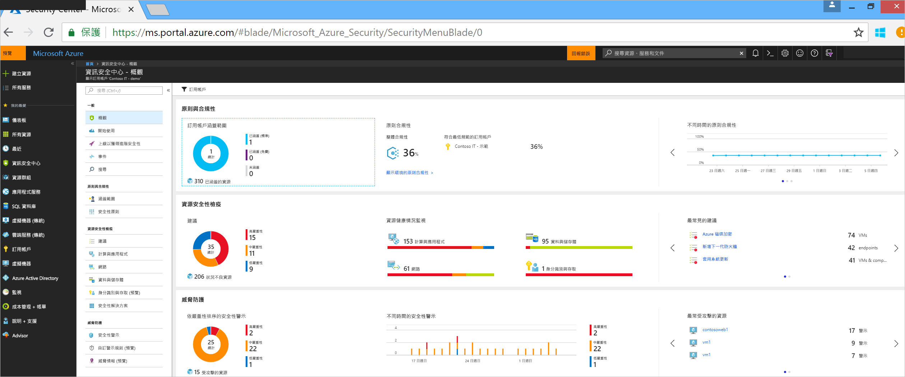
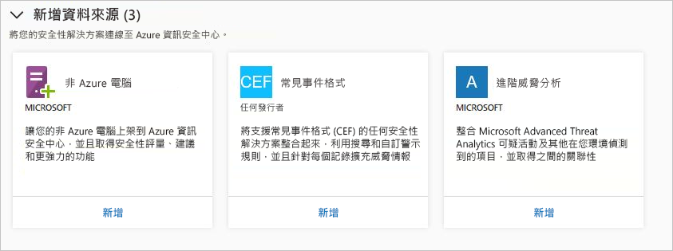
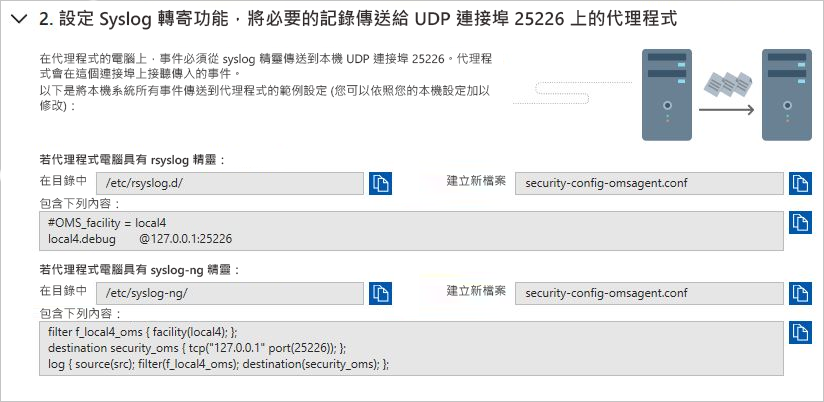
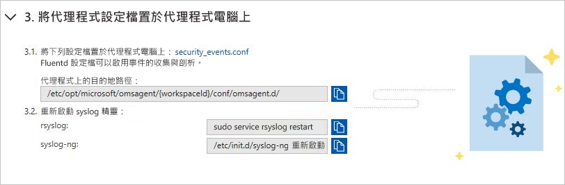
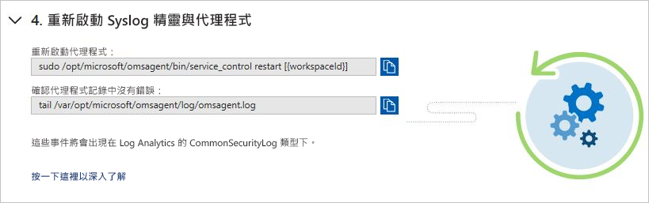
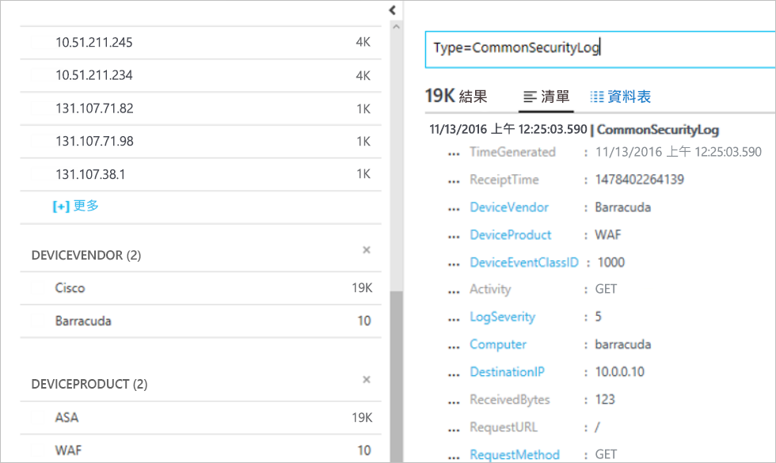

# 快速入門：將安全性解決方案連線至資訊安全中心

除了從電腦收集安全性資料，您還可以整合來自各種其他安全性解決方案的安全性資料，包括支援常見事件格式 (CEF) 的任何安全性解決方案。 CEF 是一種以 Syslog 訊息為基礎的業界標準格式，許多安全性廠商使用此格式來讓事件可在不同平台之間整合。

本快速入門示範如何：
- 使用 CEF 記錄將安全性解決方案連線到資訊安全中心
- 驗證與安全性解決方案的連線

## 先決條件
若要開始使用資訊安全中心，您必須有 Microsoft Azure 訂用帳戶。 如果您沒有訂用帳戶，可以註冊[免費帳戶](https://azure.microsoft.com/free/)。

請確認您是在資訊安全中心的標準定價層，才可按照本快速入門逐步進行。 前 60 天可以免費試用資訊安全中心標準定價層。 [將 Azure 訂用帳戶上架到資訊安全中心標準定價層](security-center-get-started.md)快速入門會為您逐步解說如何升級至「標準」定價層。

您也需要 [Linux 機器](https://docs.microsoft.com/azure/log-analytics/log-analytics-agent-linux)，其中包含已連線到資訊安全中心的 Syslog 服務。

## 使用 CEF 連線解決方案

1. 登入 [Azure 入口網站](https://azure.microsoft.com/features/azure-portal/)。
2. 在 [Microsoft Azure] 功能表中，選取 [資訊安全中心]。 [資訊安全中心 - 概觀] 隨即開啟。

      

3. 在 [資訊安全中心] 主功能表下，選取 [安全性解決方案]。
4. 在 [安全性解決方案] 頁面的 [新增資料來源 (3)] 之下，按一下 [常見事件格式] 之下的 [新增]。

    

5. 在 [常見事件格式記錄] 頁面中，展開第二個步驟 (**設定 Syslog 轉寄功能，將必要的記錄傳送給 UDP 連接埠 25226 上的代理程式**)，並且在您的 Linux 電腦中遵循下列指示：

    

6. 展開第三個步驟 (**將代理程式設定檔置於代理程式電腦上**)，並且在您的 Linux 電腦中遵循下列指示：

    

7. 展開第四個步驟 (**重新啟動 Syslog 精靈與代理程式**)，並且在您的 Linux 電腦中遵循下列指示：

    

## 驗證連線

您必須等到 syslog 開始向資訊安全中心回報，才能繼續進行下列步驟。 這可能需要一些時間，而且會根據環境大小而有所不同。

1.  在 [資訊安全中心] 儀表板的左面板中，按一下 [搜尋]。
2.  選取 Syslog (Linux 電腦) 所連線的工作區。
3.  輸入 CommonSecurityLog，然後按一下 [搜尋] 按鈕。

下列範例會顯示這些步驟的結果：

## 清除資源
此集合中的其他快速入門和教學課程會以本快速入門為基礎。 如果您打算繼續處理後續的快速入門和教學課程，請繼續執行標準層，並保持將自動佈建維持為啟用狀態。 如果您不打算繼續，或是要返回免費層：

1. 返回 [資訊安全中心] 主功能表，並選取 [安全性原則]。
2. 選取您需要返回免費層的訂用帳戶或原則。 [安全性原則] 隨即開啟。
3. 在 [原則元件] 下，選取 [定價層]。
4. 選取 [免費] 以將訂用帳戶從標準層變更為免費層。
5. 選取 [ **儲存**]。

如果您需要停用自動佈建：

1. 返回 [資訊安全中心] 主功能表，並選取 [安全性原則]。
2. 選取您想要停用自動佈建的訂用帳戶。
3. 在 [安全性原則 - 資料收集] 下，選取 [上架] 底下的 [關閉] 以停用自動佈建。
4. 選取 [ **儲存**]。

>[!NOTE]
> 停用自動佈建不會從已佈建代理程式的 Azure VM 移除 Microsoft Monitoring Agent。 停用自動佈建會限制對資源的安全性監視。
>

## 後續步驟
在本快速入門中，您已了解如何使用 CEF 將 Linux Syslog 解決方案連線到資訊安全中心。 將您的 CEF 記錄連線到資訊安全中心，您即可利用每份記錄中提供的搜尋與自訂警示規則及豐富的威脅資訊。 若要深入了解如何使用資訊安全中心，請繼續進行設定安全性原則及評估資源安全性的教學課程。

> [!div class="nextstepaction"]
> [教學課程：定義和評估安全性原則](./tutorial-security-policy.md)
