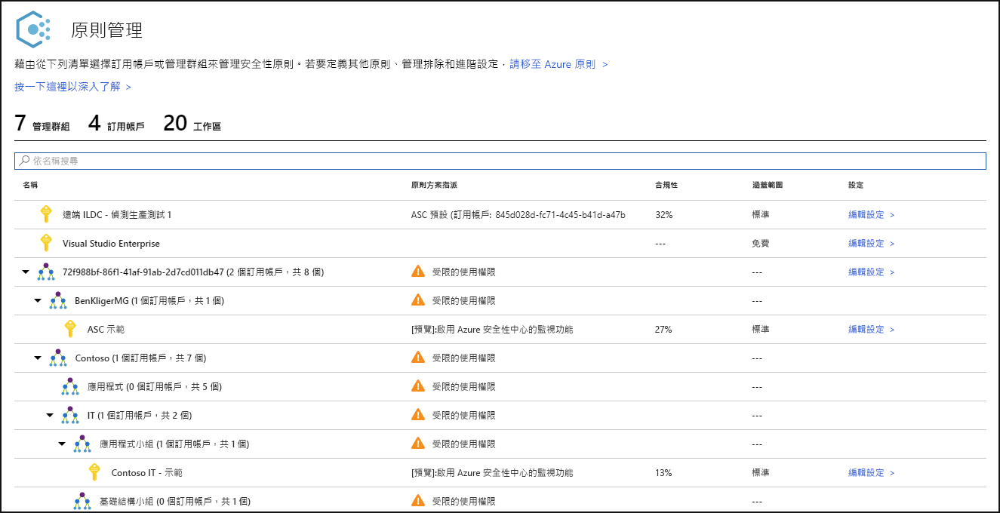
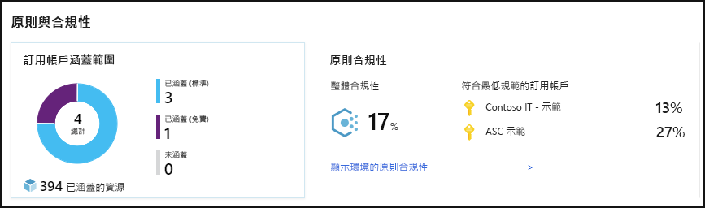
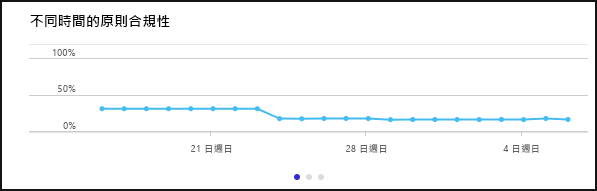
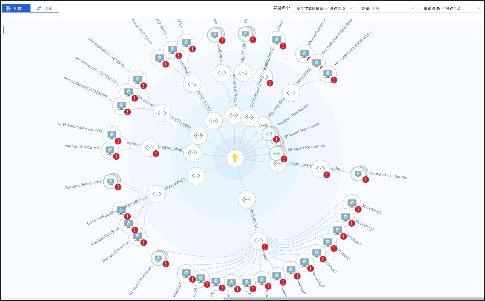
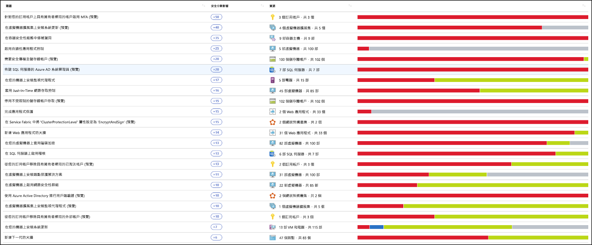
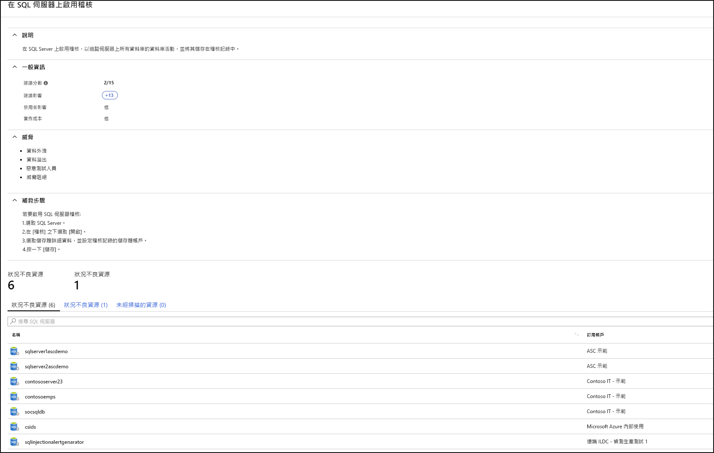
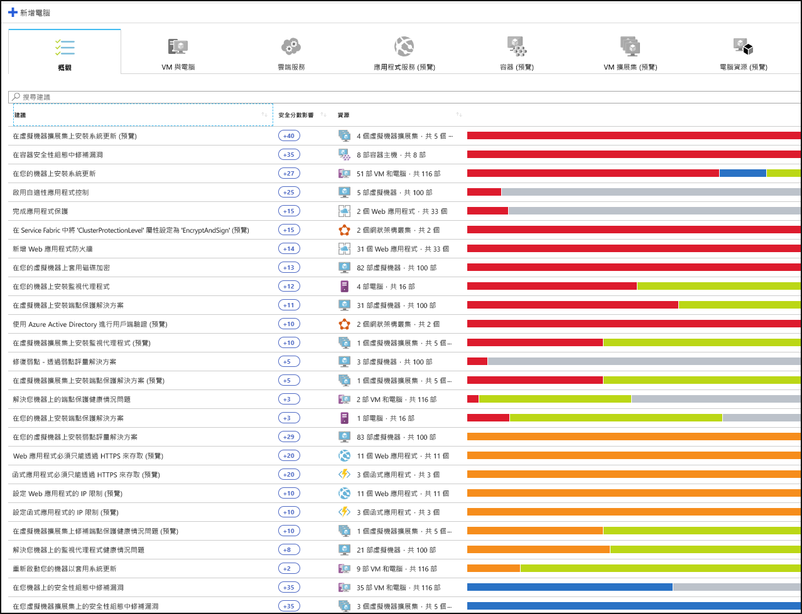
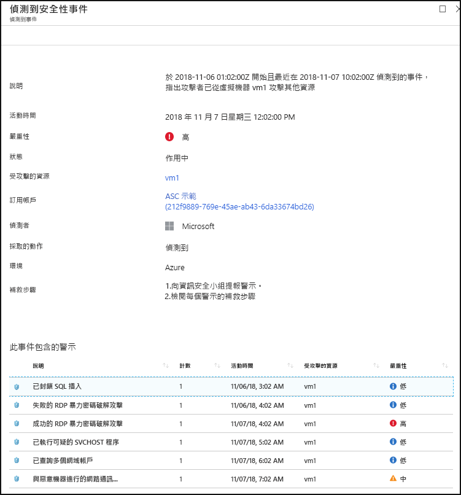

# 什麼是 Azure 資訊安全中心？

Azure 資訊安全中心是統一基礎結構安全性管理系統，可強化資料中心的安全性狀態，並在雲端 (無論在 Azure 中與否) 及內部部署的混合式工作負載全面提供進階威脅防護。

資源的安全要由雲端提供者、Azure 及您 (客戶) 共同協力保護。 當您移至雲端時必須確保工作負載的安全，同時當您移至 IaaS (基礎結構即服務) 時，會比在 PaaS (平台即服務) 與 SaaS (軟體即服務) 承擔更多客戶責任。 Azure 資訊安全中心提供您必要的工具，強化網路、保護服務安全，並確保您能掌握安全性狀態。

Azure 資訊安全中心可解決三項最急迫的安全性挑戰：

-   **工作負載快速變化** - 不僅是雲端的長處，也是挑戰。 一方面，終端使用者能做的事更多樣。 另一方面，您要如何確定人們會依據您的安全性標準使用和建立形形色色的服務，並遵循安全性最佳做法？

-   **攻擊日益狡詰複雜** - 無論您在何處執行工作負載，攻擊都會越來越狡詰複雜。 您必須保護公用雲端的工作負載，實際上，也就是網際網路對應工作負載，如未遵循安全性最佳做法，會讓您更易受攻擊。

-   **安全性技能供不應求** - 安全性警示和警示系統的數目，遠超過具有必要背景和經驗的管理員數目，更遑論保護您的環境安全。 時時留意了解最新的攻擊，是一項持續不斷的挑戰，而安全性世界瞬息萬變，亦無法故步自封，停滯不前。

為了協助您面對這些挑戰，資訊安全中心為您提供工具：

-   **加強安全性狀態**：資訊安全中心會評估您的環境，並讓您了解資源的狀態是否安全無虞？

-   **抵禦威脅**：資訊安全中心會評估您的工作負載，並提出威脅預防建議和威脅偵測警示。

-   **更快保障安全**：在資訊安全中心的一切都是以雲端速度完成。 因為原生整合，使得部署資訊安全中心相當容易，能夠使用 Azure 服務為您自動佈建和提供保護。

## 架構

因為資訊安全中心原生為 Azure 的一部分，完全不需要部署，Azure 中的 PaaS 服務 (包括 Service Fabric、SQL 資料庫及儲存體帳戶) 即可由資訊安全中心監視和保護。

此外，在 Windows 和 Linux 伺服器上安裝 Microsoft Monitoring Agent，資訊安全中心即可保護雲端中或內部部署上的非 Azure 伺服器和虛擬機器。 Azure 虛擬機器會自動佈建在資訊安全中心。

從代理程式和從 Azure 收集的事件會在安全性分析引擎中相互關聯，為您提供量身打造應該遵循來確保工作負載安全的建議 (強化工作) 以及威脅偵測警示。 您應該儘速調查這類警示，確保您的工作負載並未遭受惡意攻擊。

## 鞏固安全性現況

Azure 資訊安全中心可讓您加強安全性狀態。 這表示其可協助您依照安全性最佳做法的建議，識別和執行建議的強化工作，並在機器、資料服務及應用程式全面實作。 這包括管理和強制執行安全性原則，以及確定 Azure 虛擬機器、非 Azure 伺服器及 Azure PaaS 服務符合規範。 資訊安全中心為您提供所需工具，讓您聚焦於網路安全性資產的可見性，全面檢視工作負載。

### 管理組織安全性原則與合規性

其為安全性基本須知，並可確保工作負載安全無虞，而且一開始會備妥量身打造的安全性原則。 資訊安全中心的所有原則都是以 Azure 原則控制項為基礎所建置，因此您可獲得全套的 **世界級原則解決方案**與其彈性。 您可以在資訊安全中心設定原則，以在管理群組上、跨訂用帳戶執行，甚至可供整個租用戶使用。

資訊安全中心可協助您 **識別影子 IT 訂用帳戶**。 查看儀表板中標記為**未涵蓋**的訂用帳戶，即可在有新的訂用帳戶建立時立即得知，以及確保其涵蓋在原則中，並受到 Azure 資訊安全中心保護。

資訊安全中心的進階監視功能也可讓您 **追蹤和管理一段時間內的合規性與治理**。  **整體合規性** 提供的量值可讓您知道，有多少訂用帳戶符合與工作負載相關聯的原則。 

### 持續評量

資訊安全中心會持續探索部署於工作負載的新資源，並評估其是否根據安全性最佳做法來設定，若非如此則會加上旗標，並提供建議您必須優先修正以保護機器的事項清單。

資訊安全中心所提供，用來持續監視網路安全性狀態的最強大工具之一，就是 **網路地圖**。 此地圖可讓您查看工作負載的拓撲，如此便可了解是否已正確設定每個節點。 您可以查看節點的連線方式，幫助您封鎖來路不明且可能讓攻擊者趁機沿著網路蔓延的連線。

資訊安全中心藉由加上 **安全分數**，更進一步減少安全性警示。 安全分數現在與收到的每個建議相關聯，協助您了解每個建議對整體安全性狀態的重要程度。 這對於讓您 **排定安全性工作的順位**十分重要。

### 透過設定建議的控制項來最佳化和改善安全性

Azure 資訊安全中心的價值核心在於其建議。 建議是專為工作負載上發現的特定安全性考量而量身打造，資訊安全中心為您代勞執行安全性管理工作，不僅可找出弱點，還會提供如何去除的特定指示。

如此一來，資訊安全中心不只能讓您設定安全性原則，還可以對資源套用安全性設定標準。

建議可協助您減少每個資源的受攻擊面。 這包括 Azure 虛擬機器、非 Azure 伺服器及 Azure PaaS 服務 (如 SQL 和儲存體帳戶等等)，其中每種類型的資源都會以自己的標準分別評估。

## 抵禦威脅

資訊安全中心的威脅防護可讓您偵測並防止基礎結構即服務 (IaaS) 層、非 Azure 伺服器及 Azure 中平台即服務 (PaaS) 的威脅。

資訊安全中心的威脅防護包括混合的狙殺鏈分析，其會根據網路狙殺鏈分析自動與環境中的警示相互關聯，協助您更了解攻擊活動全貌，知道攻擊在何處開始和對資源有何影響。

### 進階威脅防護

使用資訊安全中心，您可以取得原生整合的現成 Windows Defender 進階威脅防護。 這表示不需要任何設定，Windows 虛擬機器與伺服器已與資訊安全中心的建議與評量功能完全整合。 也為 Linux 虛擬機器和伺服器提供現成的進階威脅偵測。

此外，資訊安全中心可讓您在伺服器環境自動化執行應用程式控制原則。 資訊安全中心的自適性應用程式控制會在所有 Windows 伺服器啟用端對端應用程式允許清單。 建立規則和檢查違規全都會自動完成，您不需要動手。

### 保護 PaaS

資訊安全中心可協助您在所有 Azure PaaS 服務偵測威脅。 您可以偵測以 Azure 服務為目標的威脅，包括 Azure App Service、Azure SQL、Azure 儲存體帳戶及更多資料服務。 您也可以利用原生整合的 Microsoft Cloud App Security 使用者和實體行為分析 (UEBA)，針對 Azure 活動記錄執行異常偵測。

### 封鎖暴力密碼破解攻擊

資訊安全中心可協助您限制暴露於暴力密碼破解攻擊的程度。 藉由減少存取虛擬機器連接埠，使用 Just-In-Time VM 存取權，可以透過防止不必要的存取來強化您的網路。 您可以針對選取的連接埠設定安全存取原則，只限授權的使用者，允許的來源 IP 位址範圍或 IP 位址，在有限的時間內使用。

### 保護資料服務

資訊安全中心所含的功能可協助您在 Azure SQL 中自動將資料分類。 您也可以取得所有 Azure SQL 和儲存體服務的潛在弱點評量，以及如何緩解的建議。

## 更快保障安全

原生 Azure 整合 (包括 Azure 原則與 Log Analytics) 結合與之緊密整合的其他 Microsoft 安全性解決方案，例如 Microsoft Cloud App Security 與 Windows Defender 進階威脅防護，可協助確保您的安全性解決方案完善周全且容易上架和推出。

此外，您可以將整個解決方案擴充到 Azure 外部於其他雲端上和內部部署資料中心內執行的工作負載。

### 自動探索和上架 Azure 資源

資訊安全中心提供 Azure 和 Azure 資源的緊密原生整合。 這表示您可以將所有 Azure 資源的相關 Azure 原則與內建資訊安全中心原則，彙整成完整的安全性案例，並確保新找到於 Azure 中建立的資源會自動整個套用。

從 Windows 和 Linux 收集而來的大量記錄檔集合，都會在安全性分析引擎中運用，並用來建立建議和警示。

## 後續步驟

- 若要開始使用資訊安全中心，您需要 Microsoft Azure 訂用帳戶。 如果您沒有訂用帳戶，可以註冊[免費試用](https://azure.microsoft.com/free/)。
- 資訊安全中心的定價層已經由 Azure 訂用帳戶啟用。 若要利用進階安全性管理和威脅偵測功能，您必須升級為標準定價層。 標準層可以免費試用。 如需詳細資訊，請參閱[資訊安全中心定價頁面](https://azure.microsoft.com/pricing/details/security-center/)。
- 如果您準備好要立即啟用資訊安全中心標準，[快速入門：將 Azure 訂用帳戶上架到資訊安全中心標準定價層](security-center-get-started.md)將引導您逐步完成相關步驟。

