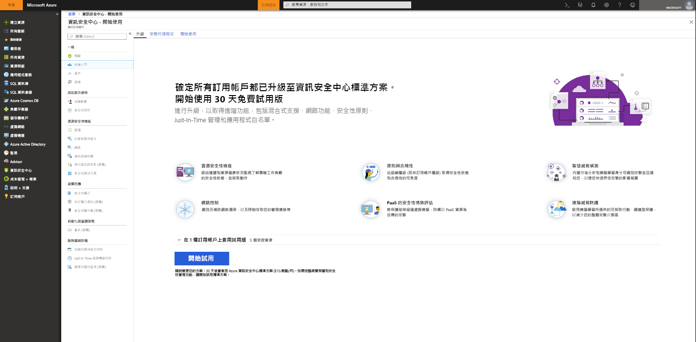
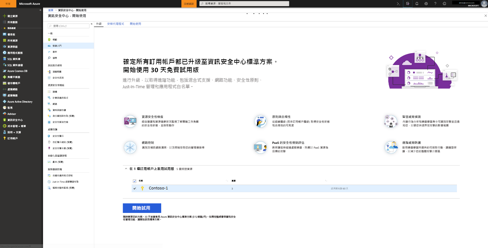

# 上架到 Azure 資訊安全中心標準版以增強安全性
升級至資訊安全中心標準版，讓您的混合式雲端工作負載能充分享有強化的安全性管理和威脅防護。  您可以免費試用「標準版」60 天。 如需詳細資訊，請參閱資訊安全中心[價格頁面](https://azure.microsoft.com/pricing/details/security-center/)。

資訊安全中心標準版包括：

- **混合式安全性** – 取得您所有內部部署和雲端工作負載中安全性的統一檢視。 套用安全性原則，並持續評估您混合式雲端工作負載的安全性，以確保符合安全性標準。 從各種來源 (包括防火牆和其他合作夥伴解決方案) 收集、搜尋及分析安全性資料。
- **進階威脅偵測** - 利用進階分析和 Microsoft Intelligent Security Graph 勝過不斷進化的網路攻擊。  有效率的調控內建行為分析和機器學習服務，以發現攻擊和零時差惡意探索。 監視網路、機器和雲端服務中是否有傳入攻擊和侵入後活動。 使用互動式工具和內容相關威脅情報來簡化調查。
- **存取與應用程式控制** - 藉由套用依特定工作負載調整並由機器學習服務提供的白名單建議，來封鎖惡意程式碼和其他不想要的應用程式。 利用即時控制存取減少網路攻擊面，以管理 Azure VM 上的連接埠，大幅減少暴力密碼破解攻擊和其他網路攻擊。

## 偵測未受保護的資源     
資訊安全中心會自動偵測未向資訊安全中心標準版啟用的任何 Azure 訂用帳戶或工作區。 這包括使用未啟用安全性解決方案之資訊安全中心免費版和工作區的 Azure 訂用帳戶。

您可以將整個 Azure 訂用帳戶升級至標準層，該層會繼承訂用帳戶中的所有資源，或者您也可以定義專屬策略，僅升級特定的資源群組。 如果資源群組原則設定是唯一專屬的，當您將訂用帳戶升級至標準層時，資訊安全中心不會覆寫定價原則。 若將標準層套用至訂用帳戶，僅會套用到訂用帳戶中向資訊安全中心建立之工作區回報的虛擬機器。 將標準層套用至工作區，會套用到向工作區回報的所有資源。

> [!NOTE]
> 您可能會想要管理您的成本，並透過將解決方案限制在一組特定的代理程式，來限制針對該解決方案所收集的資料量。 [解決方案目標](../operations-management-suite/operations-management-suite-solution-targeting.md)可讓您將某個範圍套用至解決方案，並將工作區中的電腦子集設定為目標。  如果您使用解決方案目標鎖定，資訊安全中心會將工作區列為沒有解決方案。
>
>

## 升級 Azure 訂用帳戶或工作區
若要將訂用帳戶或工作區升級至「標準」：
1. 在 [資訊安全中心] 主功能表下，選取 [開始使用]。
  
2. 在 [升級] 下，資訊安全中心會列出符合上架資格的訂用帳戶和工作區。 
   - 您可以按一下可擴展的 [適用試用版] 以查看所有訂用帳戶和工作區的清單與其試用版的資格狀態。
   -    您可以將沒有資格使用試用版的訂用帳戶和工作區升級。
   -    您可以選取符合資格的工作區和訂用帳戶來啟動試用版。
3.  按一下 [啟動試用版] 來啟動所選訂用帳戶上的試用版。
  

   > [!NOTE]
   > 資訊安全中心的「免費版」功能只會套用至您的 Azure VM。 免費版功能不會套用至非 Azure 電腦。 如果您選取「標準版」，「標準版」功能會套用至所有 Azure 虛擬機器和回報工作區的非 Azure 電腦。 我們建議您套用「標準版」，為您的 Azure 與非 Azure 資源提供進階的安全性。
   >
   >

## 上架非 Azure 電腦
資訊安全中心可以監視非 Azure 電腦的安全性狀態，但您需要先上架這些資源。 您可以從 [開始使用] 刀鋒視窗或從 [計算] 刀鋒視窗新增非 Azure 電腦。 我們將逐步解說這兩種方法。

### 從 [開始使用] 新增非 Azure 電腦

1. 返回 [開始使用]。   
2. 選取 [開始使用] 索引標籤。

  

3. 按一下 [新增非 Azure 電腦] 下方的 [設定]。 隨即會顯示 Log Analytics 工作區清單。 清單中顯示啟用自動佈建之後，資訊安全中心為您建立的預設工作區 (如果適用)。 選取此工作區或其他您要使用的工作區。

  ![新增非 Azure 電腦][7]

如果您有現有的工作區，它們會列在 [新增非 Azure 電腦] 下。 您可以將電腦新增至現有的工作區，或建立新的工作區。 若要建立新的工作區，請選取 [新增工作區] 連結。

### 從 [計算] 新增非 Azure 電腦

**建立新的工作區，並新增電腦**

1. 在 [新增非 Azure 電腦] 下，選取 [新增工作區]。

   ![新增工作區][4]

2. 在 [安全性與稽核] 下，選取 [OMS 工作區] 以建立新的工作區。
3. 在 [OMS 工作區] 下，輸入您的工作區資訊。
4. 在 [OMS 工作區] 下，選取 [確定]。  選取 [確定] 之後，您會得到下載 Windows 或 Linux 代理程式的連結，以及工作區識別碼的金鑰，以用於設定代理程式。
5. 在 [安全性與稽核] 下，選取 [確定]。

**選取現有的工作區，並新增電腦**

您可以依照 [上架] 的工作流程來新增電腦，如上所示。 您也可以依照 [計算] 的工作流程來新增電腦。 在此範例中，我們使用 [計算]。

1. 返回資訊安全中心的主功能表[概觀] 儀表板。

   ![概觀][5]

2. 選取 [計算及應用程式]。
3. 在 [計算及應用程式] 下，選取 [新增電腦]。

   ![[計算] 刀鋒視窗][6]

4. 在 [新增非 Azure 電腦] 下，選取您的電腦要連線的工作區，並按一下 [新增電腦]。

   ![新增電腦][7]

 [直接代理程式] 刀鋒視窗提供下載 Windows 或 Linux 代理程式的連結，以及用來設定代理程式的工作區識別碼和金鑰。   

## 後續步驟
您可以在本文中了解如何上架 Azure 與非 Azure 資源，以從資訊安全中心的進階安全性受益。  若要透過上架的資源執行更多動作，請參閱

- [啟用資料收集](security-center-enable-data-collection.md)
- [威脅情報報告](security-center-threat-report.md)
- [Just-In-Time VM 存取](security-center-just-in-time.md)

<!--Image references-->
[1]: ./media/security-center-onboarding/onboard.png
[2]: ./media/security-center-onboarding/onboard-subscription.png
[3]: ./media/security-center-onboarding/get-started.png
[4]: ./media/security-center-onboarding/create-workspace.png
[5]: ./media/security-center-onboarding/overview.png
[6]: ./media/security-center-onboarding/compute-blade.png
[7]: ./media/security-center-onboarding/add-computer.png
[8]: ./media/security-center-onboarding/onboard-workspace.png
