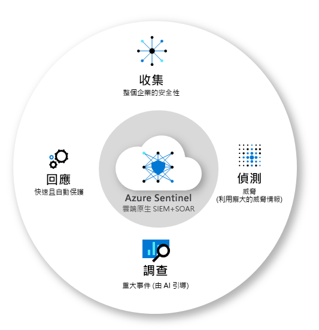
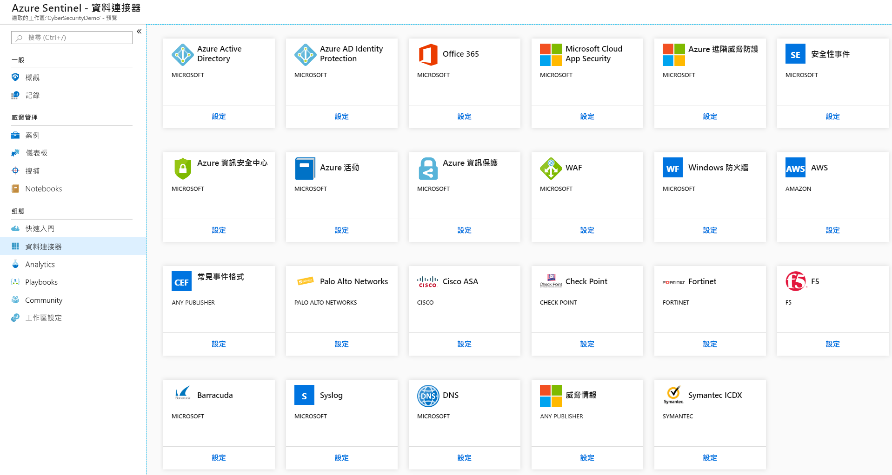
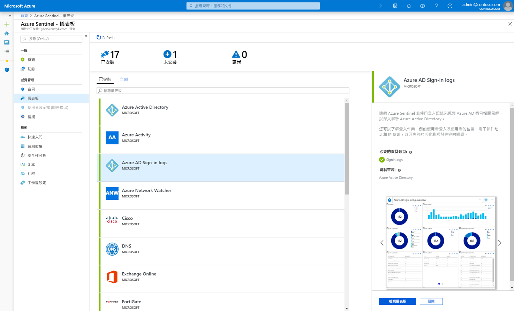
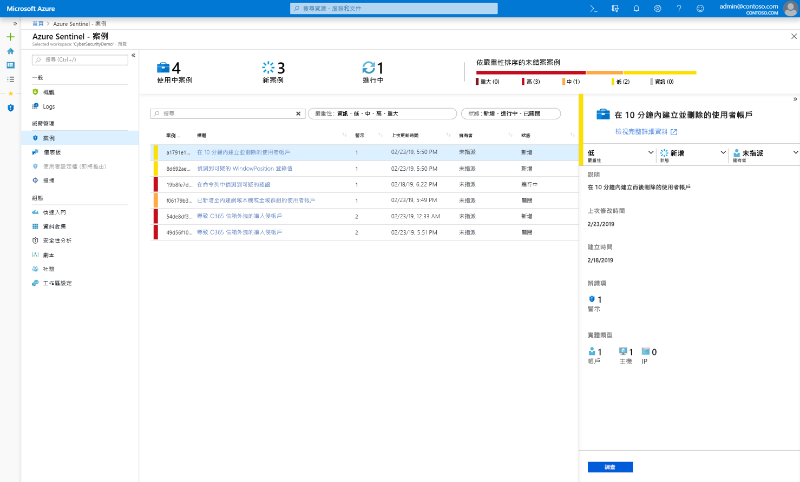
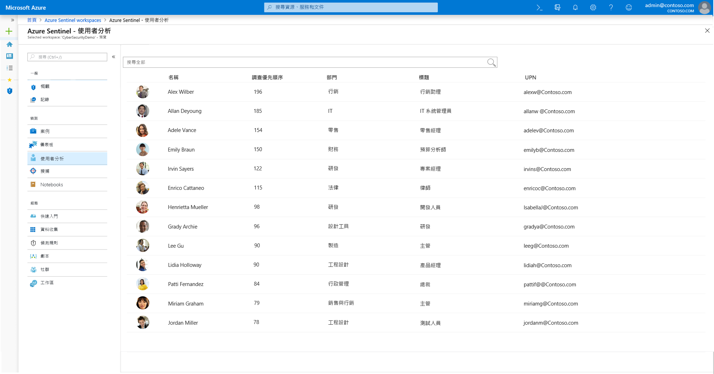
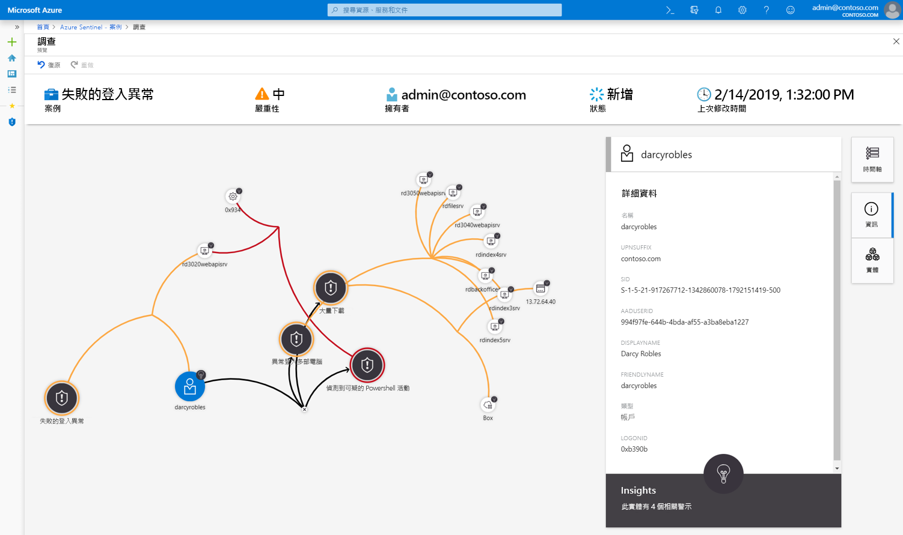
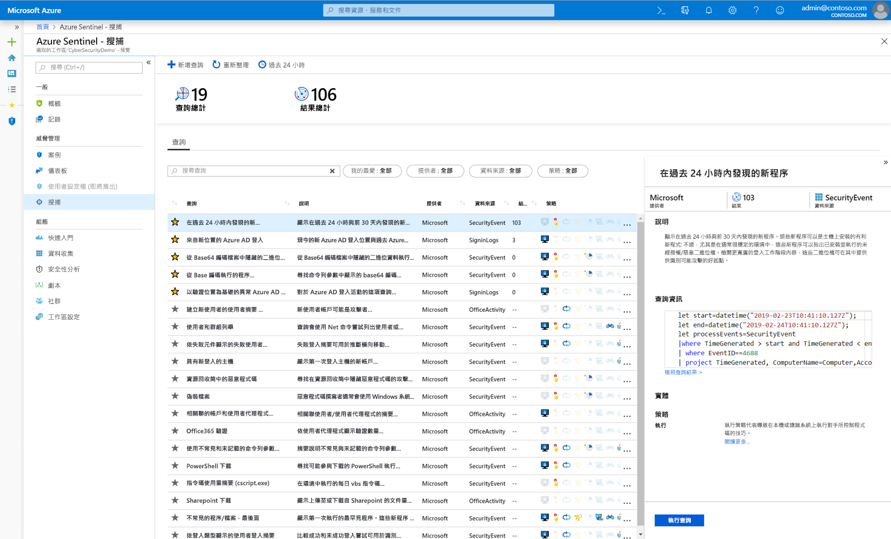
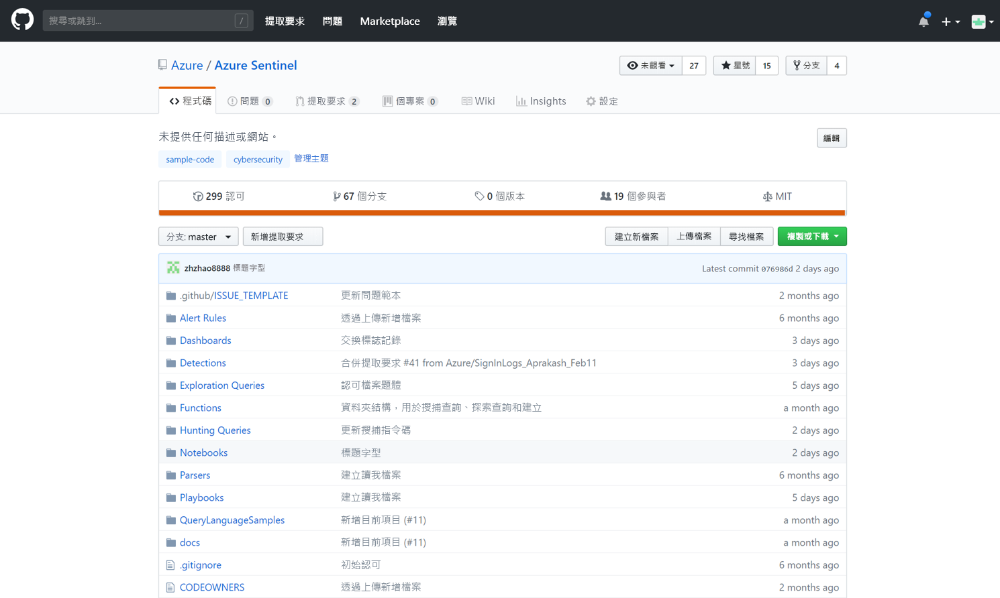

# 什麼是 Azure Sentinel 預覽版？

> [!IMPORTANT]
> Azure Sentinel 目前為公開預覽狀態。
> 此預覽版本是在沒有服務等級協定的情況下提供，不建議用於生產工作負載。 可能不支援特定功能，或可能已經限制功能。 如需詳細資訊，請參閱 [Microsoft Azure 預覽版增補使用條款](https://azure.microsoft.com/support/legal/preview-supplemental-terms/)。

Microsoft Azure Sentinel 是可調整的雲端原生**安全性資訊事件管理 (SIEM)** 和**安全性協調流程自動化回應 (SOAR)** 解決方案。 Azure Sentinel 提供整個企業的智慧型安全性分析和威脅情報，並針對警示偵測、威脅可見性、主動式搜捕及回應威脅提供單一解決方案。 

Azure Sentinel 可讓您鳥瞰檢視整個企業，以減輕攻擊日益複雜、警示數量增加及解決時間範圍冗長的壓力。

- **以雲端規模收集**內部部署和多個雲端中所有使用者、裝置、應用程式和基礎結構的資料。 

- 使用 Microsoft 的分析和無可匹敵的威脅情報，**偵測先前未偵測到的威脅**，並減少誤判。 

- **使用人工智慧調查威脅**，並大規模搜捕可疑的活動，深入探究 Microsoft 多年來的網路安全性工作。 

- 使用內建的常見工作協調流程和自動化，**快速回應事件**。

Azure Sentinel 以完方位的現有 Azure 服務為基礎，原生併入經過實證的基礎，諸如 Log Analytics 和 Logic Apps 等。 Azure Sentinel 利用 AI 擴充您的調查和偵測，並提供 Microsoft 威脅情報資料流，讓您能夠自備威脅情報。 

 
## 連線到您所有的資料

若要將 Azure Sentinel 上架，必須先[連線到安全性來源](connect-data-sources.md)。 Azure Sentinel 隨附多種適用於 Microsoft 解決方案的連接器，現成可用且提供即時整合，包括 Microsoft 威脅防護解決方案與 Microsoft 365 來源，例如 Office 365、Azure AD、Azure ATP 和 Microsoft Cloud App Security 等等。 此外，還有適用於非 Microsoft 解決方案的內建連接器，用於連線至更廣泛的安全性生態系統。 您也可以使用常見事件格式 (Syslog 或 REST API) 來連線資料來源與 Azure Sentinel。  

## 儀表板

連線資料來源之後，您可以從[巧妙建立的儀表板](quickstart-get-visibility.md#dashboards)資源庫中選擇，以呈現來自您資料來源的深入解析。 每個儀表板均可完全自訂 - 您可以新增自己的邏輯或修改查詢，也可以從頭開始建立儀表板。

儀表板會使用進階分析來提供互動式視覺效果，協助安全性分析師進一步了解在攻擊期間發生什麼情況。 調查工具可讓您深入探討任何欄位，從任何資料快速開發威脅內容。 

## 分析

為了協助您減少雜訊並盡可能減少您必須檢閱和調查的警示數目，Azure Sentinel 使用[分析讓警示相互關聯成為案例](tutorial-detect-threats.md)。 **案例**是一組相關警示，可一起建立可操作的可能威脅，以便您進行調查並予以解決。 依照現狀使用內建的相互關聯規則，或使用其作為建立自有規則的起點。 Azure Sentinel 也會提供機器學習規則來對應您的網路行為，然後跨越資源尋找異常狀況。 這些分析會將不同實體的相關低精確度警示結合成為潛在高精確度安全性事件，藉此將點點滴滴串聯起來。

## 使用者分析

利用機器學習 (ML) 與[使用者分析](user-analytics.md)的原生整合，Azure Sentinel 有助於快速偵測威脅。 Azure Sentinel 與 Azure 進階威脅防護緊密整合，以根據警示和橫跨 Azure Sentinel 和 Microsoft 365 的可疑活動模式來分析使用者行為，並設定使用者的調查先後順序。

## 安全性自動化與協調流程

將一般工作自動化及[利用劇本簡化安全性協調流程](tutorial-respond-threats-playbook.md)，以整合 Azure 服務與您現有的工具。 Azure Sentinel 的自動化和協調流程解決方案會以 Azure Logic Apps 的基礎為根據，提供可高度延伸的架構，讓自動化可隨著新技術和威脅的出現而調整。 若要使用 Azure Logic Apps 建置劇本，您可以從不斷成長的內建劇本資源庫中選擇。 其中包括 [200 個以上的連接器](https://docs.microsoft.com/azure/connectors/apis-list)其適用於 Azure Functions 等服務。 連接器可讓您在程式碼、ServiceNow、Jira、Zendesk、HTTP 要求、Microsoft Teams、Slack、Windows Defender ATP 和 Cloud App Security 中套用任何自訂邏輯。

舉例來說，如果您使用 ServiceNow 票證系統，則可透過所提供的工具，使用 Azure Logic Apps 將您的工作流程自動化，並且在每次偵測到特殊事件時在 ServiceNow 中開啟票證。

## 調查

Azure Sentinel [深入調查](tutorial-investigate-cases.md)工具可協助您了解潛在安全性威脅的範圍，並找出其根本原因。 您可以選擇互動式圖形上的實體，以詢問有關特定實體的關注問題，並向下切入至該實體與其連線，以取得威脅的根本原因。 

## 搜捕

使用 Azure Sentinel 的[強大搜捕搜尋查詢工具](hunting.md) ( MITRE 架構為基礎)，可讓您在警示觸發之前，主動搜捕貴組織各資料來源的安全性威脅。 在您發現哪個搜捕查詢可提供可能攻擊的寶貴見解之後，您也可以根據您的查詢建立自訂偵測規則，以及將這些見解當作警示向您的安全性事件回應程式呈現。 進行搜捕時，您可以為感興趣的事件建立書籤，以便稍後返回、與他人分享，以及與其他相互關聯事件構成群組，以建立令人注目的調查案。

## 社群

Azure Sentinel 是威脅偵測和自動化的強大資源。 我們的 Microsoft 安全性分析師會不斷地建立和新增儀表板、劇本、搜捕查詢和更多項目，並將這些項目張貼到社群，以便您在自己的環境中使用。 您可以從私人社群 GitHub [存放庫](https://aka.ms/asicommunity)下載範例內容，以便為 Azure Sentinel 建立自訂儀表板、搜捕查詢、筆記本和劇本。 

## 後續步驟

- 若要開始使用 Azure Sentinel，您需要 Microsoft Azure 訂用帳戶。 如果您沒有訂用帳戶，可以註冊[免費試用](https://azure.microsoft.com/free/)。
- 了解如何[將資料上架到 Azure Sentinel](quickstart-onboard.md)，並[掌握您的資料和潛在威脅](quickstart-get-visibility.md)。
