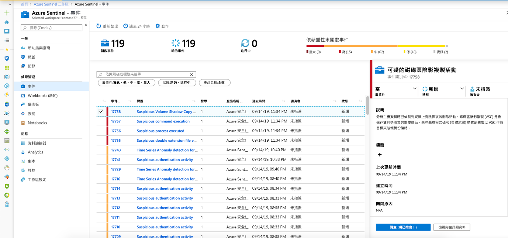
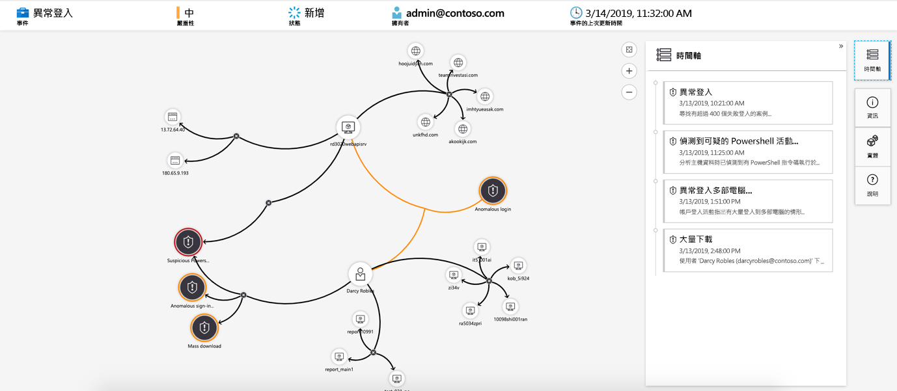

# 教學課程：使用 Azure Sentinel 調查事件

> [!IMPORTANT]
> 調查圖表目前為公開預覽狀態。
> 這項功能是在沒有服務等級協定的情況下提供，不建議用於生產工作負載。
> 如需詳細資訊，請參閱 [Microsoft Azure 預覽版增補使用條款](https://azure.microsoft.com/support/legal/preview-supplemental-terms/)。

本教學課程可協助您調查 Azure Sentinel 的事件。 在您將資料來源連接到 Azure Sentinel 之後，您會想要在發生可疑的情況時收到通知。 為了讓您這麼做，Azure Sentinel 可讓您建立「高階」警示規則，以產生您可以指派和調查的事件。

本文涵蓋：
> [!div class="checklist"]
> * 調查事件
> * 使用調查圖表
> * 回應威脅

事件可以包含多個警示。 它是特定調查的所有相關辨識項的匯總。 系統會根據您在 [**分析**] 頁面中建立的分析規則來建立事件。 與警示相關的屬性（例如嚴重性和狀態）會在事件層級設定。 當您讓 Azure Sentinel 知道您要尋找的威脅種類，以及如何尋找它們之後，您可以藉由調查事件來監視偵測到的威脅。

## 必要條件
只有當您在設定分析規則時使用實體對應欄位，才能夠調查事件。 調查圖表需要您的原始事件包含實體。

## 如何調查事件

1. 選取 [**事件**]。 [**事件**] 頁面可讓您知道有多少事件、已開啟的數目、已設定為**進行中**的數目，以及已關閉的事件數目。 針對每個事件，您可以查看發生的時間，以及事件的狀態。 查看嚴重性，以決定要優先處理的事件。

    

1. 您可以視需要篩選事件，例如 [狀態] 或 [嚴重性]。

1. 若要開始調查，請選取特定的事件。 在右側，您可以看到事件的詳細資訊，包括其嚴重性、涉及的實體數目摘要、觸發此事件的原始事件，以及事件的唯一識別碼。

1. 若要在事件中查看警示和實體的更多詳細資料，請選取 [事件] 頁面中的 [**查看完整詳細資料**]，並查看摘要事件資訊的相關索引標籤。 在 [**警示**] 索引標籤中，檢查警示本身。 您可以查看警示的所有相關資訊–觸發警示的查詢、每個查詢所傳回的結果數目，以及對警示執行腳本的能力。 若要更進一步向下切入事件，請選取**事件**的數目。 這會開啟產生結果的查詢，以及在 Log Analytics 中觸發警示的事件。 在 [**實體**] 索引標籤中，您可以看到您對應為警示規則定義之一部分的所有實體。

    

1. 如果您要主動調查事件，建議您將事件的狀態設定為 [**進行中**]，直到您關閉它為止。

1. 事件可以指派給特定的使用者。 針對每個事件，您可以藉由設定 [**事件擁有**者] 欄位來指派擁有者。 所有事件都以未指派的形式啟動。 您也可以新增批註，讓其他分析師能夠瞭解您調查的內容，以及您對於事件的顧慮。

    

1. 選取 [**調查**] 以查看調查地圖。

## 使用調查圖表深入探討

調查圖形可讓分析師針對每項調查提出適當的問題。 調查圖表會將相關的資料與任何涉及的實體相互關聯，以協助您瞭解潛在安全性威脅的範圍，並找出根本原因。 您可以藉由選取並選擇不同的展開選項，深入探索圖形中所呈現的任何實體並加以調查。  
  
調查圖形提供：

- **來自原始資料的視覺內容**：即時的視覺效果圖表會顯示從原始資料自動解壓縮的實體關聯性。 這可讓您輕鬆地查看不同資料來源之間的連接。

- **完整調查範圍探索**：使用內建的探索查詢來擴展您的調查範圍，以呈現缺口的完整範圍。

- **內建的調查步驟**：使用預先定義的探索選項，以確保您在面臨威脅時詢問正確的問題。

若要使用調查圖形：

1. 選取事件，然後選取 [**調查**]。 這會帶您前往調查圖表。 圖形會提供直接連接到警示，且每個資源彼此連線的對應實體。

   > [!IMPORTANT] 
   > 只有當您在設定分析規則時使用實體對應欄位，才能夠調查事件。 調查圖表需要您的原始事件包含實體。

   

1. 選取實體以開啟 [**實體**] 窗格，讓您可以查看該實體的資訊。

    
  
1. 將滑鼠停留在每個實體上以展開您的調查，以顯示由我們的安全性專家和分析師針對每個實體類型所設計的問題清單，以加深您的調查。 我們會呼叫這些選項**探索查詢**。

    

   例如，您可以在電腦上要求相關的警示。 如果您選取探索查詢，所產生的結果會加回圖表中。 在此範例中，選取 [**相關警示**] 會將下列警示傳回圖形：

    

1. 針對每個探索查詢，您可以選取 [**事件 @ no__t-1**] 來開啟原始事件結果和 Log Analytics 中使用的查詢。

1. 為了瞭解事件，圖形提供平行的時間軸。

    

1. 將滑鼠停留在時程表上，以查看圖形上有哪些專案發生在哪個時間點。

    

## 後續步驟
在本教學課程中，您已瞭解如何使用 Azure Sentinel 開始調查事件。 繼續進行教學課程，以瞭解[如何使用自動化的操作手冊來回應威脅](tutorial-respond-threats-playbook.md)。
> [!div class="nextstepaction"]
> [回應威脅](tutorial-respond-threats-playbook.md)，將您對威脅的回應自動化。

