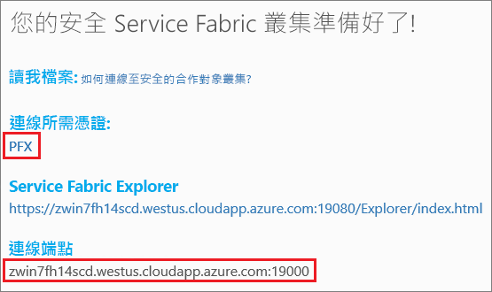

# <a name="quickstart-deploy-a-service-fabric-windows-container-application-on-azure"></a>快速入門：在 Azure 上部署 Service Fabric Windows 容器應用程式
Azure Service Fabric 是一個分散式系統平台，可讓您部署及管理可調整和可信賴的微服務與容器。 

在 Service Fabric 叢集上的 Windows 容器中執行現有的應用程式，不需要變更您的應用程式。 本快速入門示範如何在 Service Fabric 應用程式中部署預先建立的 Docker 容器映像。 當您完成時，您會有執行中的 Windows Server 2016 Nano Server 和 IIS 容器。 本快速入門說明如何部署 Windows 容器，請閱讀[本快速入門](service-fabric-quickstart-containers-linux.md)以部署 Linux 容器。

![IIS 預設網頁][iis-default]

在此快速入門中，您將了解如何：

* 封裝 Docker 映像容器
* 設定通訊
* 建置及封裝 Service Fabric 應用程式
* 將容器應用程式部署至 Azure

## <a name="prerequisites"></a>先決條件
* Azure 訂用帳戶 (您可以建立[免費帳戶](https://azure.microsoft.com/free/?WT.mc_id=A261C142F))。
* 執行下列項目的開發電腦︰
  * Visual Studio 2015 或 Visual Studio 2017。
  * [Service Fabric SDK 和工具](service-fabric-get-started.md)。

## <a name="package-a-docker-image-container-with-visual-studio"></a>使用 Visual Studio 封裝 Docker 映像容器
Service Fabric SDK 和工具會提供一個服務範本，協助您將容器部署到 Service Fabric 叢集。

以「系統管理員」身分啟動 Visual Studio。  選取 [檔案] > [新增] > [專案]。

選取 [Service Fabric 應用程式]，將它命名為 "MyFirstContainer"，然後按一下 [確定]。

從 [裝載的容器和應用程式] 範本選取 [容器]。

在 [映像名稱] 中，輸入 "microsoft/iis:nanoserver"、[Windows Server Nano Server 和 IIS 基底映像](https://hub.docker.com/r/microsoft/iis/)。 

設定容器連接埠對主機的連接埠對應，以便讓通訊埠 80 上服務的連入要求對應到容器上的連接埠 80。  將 [容器連接埠] 設定為 "80"，並將 [主機連接埠] 設定為 "80"。  

將您的服務命名為 "MyContainerService"，然後按一下 [確定]。

![[新增服務] 對話方塊][new-service]

## <a name="create-a-cluster"></a>建立叢集
若要將應用程式部署到 Azure 中的叢集，您可以加入合作對象叢集。 合作對象的叢集是免費的限時 Service Fabric 叢集，裝載於 Azure 上，並且由任何人都可以部署應用程式並了解平台的 Service Fabric 小組執行。  叢集會針對節點對節點和用戶端對節點安全性，使用單一的自我簽署憑證。 合作對象叢集支援容器。 如果您決定設定和使用您自己的叢集，叢集必須在支援容器的 SKU 上執行 (例如 Windows Server 2016 Datacenter with Containers)。

登入並[加入 Windows 叢集](http://aka.ms/tryservicefabric) \(英文\)。 藉由按一下 [PFX] 連結，將 PFX 憑證下載至您的電腦。 按一下 [如何連線至安全的合作對象叢集?] 連結，並複製憑證密碼。 後續步驟中會使用憑證、憑證密碼和 [連線端點] 值。



> [!Note]
> 每小時可用的合作對象叢集數目有限。 如果您在嘗試註冊合作對象叢集時收到錯誤，您可以等候一段時間再重試，也可以遵循[部署 .NET 應用程式](https://docs.microsoft.com/azure/service-fabric/service-fabric-tutorial-deploy-app-to-party-cluster#deploy-the-sample-application)教學課程中的這些步驟，在您的 Azure 訂用帳戶中建立 Service Fabric 叢集並對其部署應用程式。 透過 Visual Studio 建立的叢集支援容器。 在叢集中部署並確認應用程式之後，您可以直接跳到本快速入門的＜[Service Fabric 應用程式和服務資訊清單的完整範例](#complete-example-service-fabric-application-and-service-manifests)＞。 
>

在 Windows 電腦上，將 PFX 安裝在 *CurrentUser\My* 憑證存放區中。

```powershell
PS C:\mycertificates> Import-PfxCertificate -FilePath .\party-cluster-873689604-client-cert.pfx -CertStoreLocation Cert:\CurrentUser\My -Password (ConvertTo-SecureString 873689604 -AsPlainText -Force)


  PSParentPath: Microsoft.PowerShell.Security\Certificate::CurrentUser\My

Thumbprint                                Subject
----------                                -------
3B138D84C077C292579BA35E4410634E164075CD  CN=zwin7fh14scd.westus.cloudapp.azure.com
``` 

## <a name="deploy-the-application-to-azure-using-visual-studio"></a>使用 Visual Studio 將應用程式部署至 Azure
應用程式備妥後，即可直接從 Visual Studio 將其部署到叢集。

以滑鼠右鍵按一下 [方案總管] 中的 **MyFirstContainer**，並選擇 [發佈]。 [發行] 對話方塊隨即出現。

將合作對象叢集頁面上的 [連線端點] 複製到 [連線端點] 欄位。 例如： `zwin7fh14scd.westus.cloudapp.azure.com:19000`。 

按一下 [發佈] 。

叢集中的每個應用程式都必須有一個唯一的名稱。  合作對象叢集是公用的共用環境，可能會與現有的應用程式發生衝突。  如果發生名稱衝突，請將 Visual Studio 專案重新命名並再次部署。

開啟瀏覽器並瀏覽至合作對象叢集頁面中指定的**連線端點**。 您可以選擇性地在 URL 前面加上配置識別碼 `http://`，並將連接埠 `:80` 附加到 URL。 例如： http://zwin7fh14scd.westus.cloudapp.azure.com:80。 您應會看到 IIS 預設網頁：![IIS 預設網頁][iis-default]

## <a name="next-steps"></a>後續步驟
在此快速入門中，您已了解如何：

* 封裝 Docker 映像容器
* 設定通訊
* 建置及封裝 Service Fabric 應用程式
* 將容器應用程式部署至 Azure

若要深入了解如何在 Service Fabric 中使用 Windows 容器，請繼續進行教學課程以了解 Windows 容器應用程式。

> [!div class="nextstepaction"]
> [建立 Windows 容器應用程式](./service-fabric-host-app-in-a-container.md)

[iis-default]: ./media/service-fabric-quickstart-containers/iis-default.png
[publish-dialog]: ./media/service-fabric-quickstart-containers/publish-dialog.png
[new-service]: ./media/service-fabric-quickstart-containers/NewService.png
