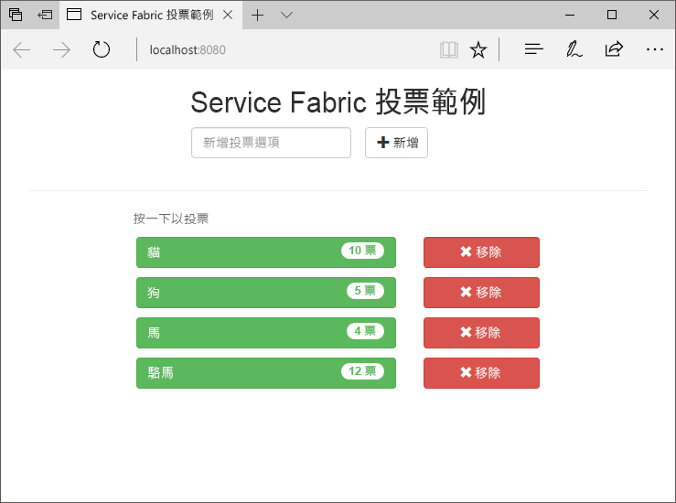
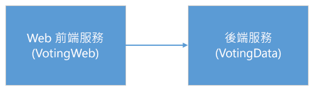
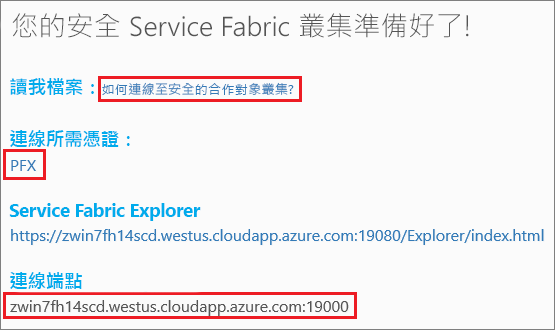
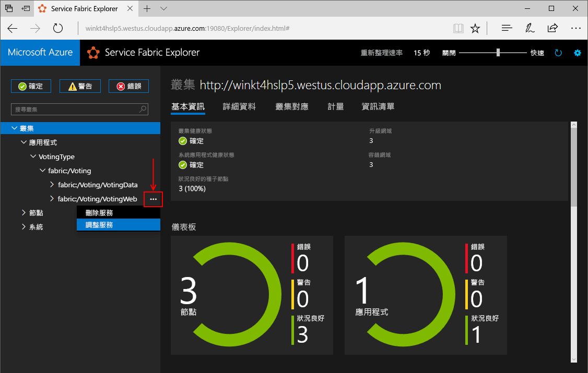
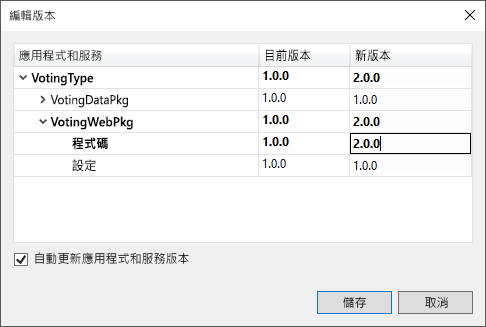
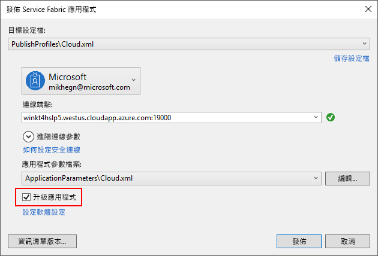
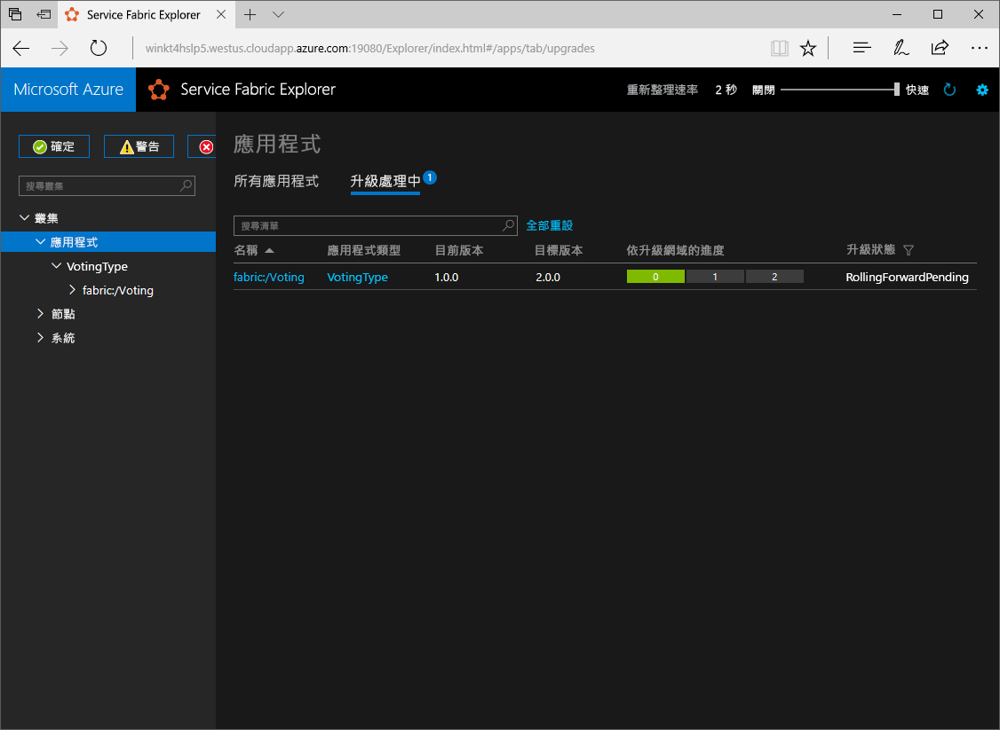

# <a name="quickstart-deploy-a-net-reliable-services-application-to-service-fabric"></a>快速入門：將 .NET 可靠服務應用程式部署至 Service Fabric

Azure Service Fabric 是一個分散式系統平台，可讓您部署及管理可調整和可信賴的微服務與容器。

本快速入門示範如何將您的第一個 .NET 應用程式部署到 Service Fabric。 當您完成時，您會有一個投票應用程式，其 ASP.NET Core Web 前端會將投票結果儲存在叢集中具狀態的後端服務。



使用此應用程式，您將了解如何：

* 建立使用 .NET 和 Service Fabric 的應用程式
* 使用 ASP.NET Core 作為 Web 前端
* 將應用程式資料儲存在具狀態服務中
* 在本機偵錯您的應用程式
* 將應用程式部署到 Azure 中的叢集
* 跨多個節點相應放大應用程式
* 執行輪流應用程式升級

## <a name="prerequisites"></a>必要條件

若要完成本快速入門：

1. [安裝 Visual Studio 2017](https://www.visualstudio.com/)，其中包含 **Azure 開發**以及 **ASP.NET 和 Web 開發**工作負載。
2. [安裝 Git](https://git-scm.com/)
3. [安裝 Microsoft Azure Service Fabric SDK](http://www.microsoft.com/web/handlers/webpi.ashx?command=getinstallerredirect&appid=MicrosoftAzure-ServiceFabric-CoreSDK)
4. 執行下列命令以將 Visual Studio 部署到本機 Service Fabric 叢集：
    ```powershell
    Set-ExecutionPolicy -ExecutionPolicy Unrestricted -Force -Scope CurrentUser
    ```

>[!NOTE]
> 在本快速入門中，範例應用程式使用的功能在 Windows 7 中無法使用。
>

## <a name="download-the-sample"></a>下載範例

在命令視窗中執行下列命令，將範例應用程式存放庫複製到本機電腦。

```git
git clone https://github.com/Azure-Samples/service-fabric-dotnet-quickstart
```

## <a name="run-the-application-locally"></a>在本機執行應用程式

以滑鼠右鍵按一下 [開始] 功能表中的 Visual Studio 圖示，然後選擇 [以系統管理員身分執行]。 若要將偵錯工具附加至您的服務，您需要以系統管理員身分執行 Visual Studio。

從您複製的存放庫開啟 **Voting.sln** Visual Studio 方案。

根據預設，投票應用程式設定為在連接埠 8080 上接聽。  應用程式連接埠設定於 */VotingWeb/PackageRoot/ServiceManifest.xml* 檔案中。  更新 [端點] 元素的 [連接埠] 屬性，即可變更應用程式連接埠。  若要在本機上部署並執行應用程式，則必須在您的電腦上開啟此應用程式連接埠並讓連接埠可供使用。  如果您變更了應用程式連接埠，請以新的應用程式連接埠值取代本篇文章中所有的 "8080"。

若要部署應用程式，請按 **F5**。

> [!NOTE]
> 您第一次執行及部署應用程式時，Visual Studio 會建立本機叢集以供偵錯。 這項作業可能需要一些時間。 叢集建立狀態會顯示在 Visual Studio 輸出視窗中。  在輸出中，會顯示如下的訊息：「應用程式 URL 未設定或不是 HTTP/HTTPS URL，所以瀏覽器不會開啟應用程式。」  此訊息不表示發生錯誤，而是代表瀏覽器將無法自動啟動。

部署完成之後，啟動瀏覽器並開啟此頁面：`http://localhost:8080` - 應用程式的 Web 前端。


您現在可以新增一組投票選項，並開始進行投票。 應用程式會執行並將所有資料儲存在 Service Fabric 叢集中，而不需要個別資料庫。

## <a name="walk-through-the-voting-sample-application"></a>逐步解說投票範例應用程式

投票應用程式包含兩個服務：

* Web 前端服務 (VotingWeb) 是 ASP.NET Core Web 前端服務，可作為網頁，並公開 Web API 來與後端服務通訊。
* 後端服務 (VotingData) 是 ASP.NET Core Web 服務，會公開 API 來將投票結果儲存在磁碟上所保存的可靠字典中。



當您在應用程式中投票時，會發生下列事件：

1. JavaScript 會將投票要求當做 HTTP PUT 要求，傳送至 Web 前端服務中的 Web API。

2. Web 前端服務使用 Proxy 來尋找 HTTP PUT 要求，並將其轉送至後端服務。

3. 後端服務會接受傳入要求，並將更新的結果儲存在可靠的字典中，以複寫至叢集中的多個節點並保存在磁碟上。 應用程式的所有資料都會儲存在叢集中，因此不需要資料庫。

## <a name="debug-in-visual-studio"></a>在 Visual Studio 中偵錯

應用程式應可正常執行，但是您可以使用偵錯工具查看應用程式主要組件的運作情形。 在 Visual Studio 中偵錯應用程式時，您會使用本機 Service Fabric 開發叢集。 您可以根據自己的情況選擇調整偵錯體驗。 在這個應用程式中，我們會使用可靠的字典，將資料儲存在後端服務中。 當您停止偵錯工具時，Visual Studio 預設會移除應用程式。 移除應用程式也會導致移除後端服務中的資料。 若要保存偵錯工作階段之間的資料，您可以在 Visual Studio 中，將 [應用程式偵錯模式] 當做 [投票] 專案上的屬性來變更。

若要查看對程式碼的影響，請完成下列步驟：

1. 開啟 **/VotingWeb/Controllers/VotesController.cs** 檔案，並在 Web API 的 **Put** 方法 (第 69 行) 中設定中斷點 - 您可以在 Visual Studio 的方案總管中搜尋此檔案。

2. 開啟 **/VotingData/Controllers/VoteDataController.cs** 檔案，並在這個 Web API 的 **Put** 方法 (第 54 行) 中設定中斷點。

3. 返回到瀏覽器，並按一下投票選項或新增投票選項。 您到達 Web 前端之 API 控制器的第一個中斷點。
    * 瀏覽器中的 JavaScript 會在此位置，將要求傳送至前端服務中的 Web API 控制器。

    

    * 首先，請針對後端服務 **(1)** 建構 ReverseProxy 的 URL。
    * 接著，將 HTTP PUT 要求傳送至 ReverseProxy **(2)**。
    * 最後，將後端服務的回應傳回給用戶端 **(3)**。

4. 按 **F5** 繼續
    - 如果瀏覽器出現提示，請將偵錯模式的讀取和執行權限授與 ServiceFabricAllowedUsers 群組。
    - 您現在位於後端服務的中斷點。

    

    * 在方法的第一行 **(1)** 中，`StateManager` 會取得或新增名為 `counts` 的可靠字典。
    * 與可靠字典中的值進行的所有互動，都需要交易，這會使用陳述式 **(2)** 建立該交易。
    * 在交易中，更新投票選項的相關索引鍵值，然後認可作業 **(3)**。 一旦傳回認可方法，字典中的資料會更新並複寫至叢集中的其他節點。 資料現在會安全地儲存在叢集中，而且後端服務可以容錯移轉到仍有可用資料的其他節點。
5. 按 **F5** 繼續

若要停止偵錯工作階段，請按 **Shift+F5**。

## <a name="deploy-the-application-to-azure"></a>將應用程式部署至 Azure

若要將應用程式部署至 Azure，您需要執行該應用程式的 Service Fabric 叢集。

### <a name="join-a-party-cluster"></a>加入合作對象叢集

合作對象的叢集是免費的限時 Service Fabric 叢集，裝載於 Azure 上，並且由任何人都可以部署應用程式並了解平台的 Service Fabric 小組執行。 叢集會針對節點對節點和用戶端對節點安全性，使用單一的自我簽署憑證。

登入並[加入 Windows 叢集](http://aka.ms/tryservicefabric) \(英文\)。 藉由按一下 [PFX] 連結，將 PFX 憑證下載至您的電腦。 按一下 [如何連線至安全的合作對象叢集?] 連結，並複製憑證密碼。 後續步驟中會使用憑證、憑證密碼和 [連線端點] 值。



> [!Note]
> 每小時可用的合作對象叢集數目有限。 如果您在嘗試註冊合作對象叢集時收到錯誤，您可以等候一段時間再重試，也可以遵循[部署 .NET 應用程式](https://docs.microsoft.com/azure/service-fabric/service-fabric-tutorial-deploy-app-to-party-cluster#deploy-the-sample-application)教學課程中的這些步驟，在您的 Azure 訂用帳戶中建立 Service Fabric 叢集並對其部署應用程式。 如果您還沒有 Azure 訂用帳戶，您可以建立[免費帳戶](https://azure.microsoft.com/free/?WT.mc_id=A261C142F)。 在叢集中部署並確認應用程式之後，您可以直接跳到本快速入門的[調整叢集中的應用程式和服務](#scale-applications-and-services-in-a-cluster)。
>

在 Windows 電腦上，將 PFX 安裝在 CurrentUser\My 憑證存放區。

```powershell
PS C:\mycertificates> Import-PfxCertificate -FilePath .\party-cluster-873689604-client-cert.pfx -CertStoreLocation Cert:\CurrentUser\My -Password (ConvertTo-SecureString 873689604 -AsPlainText -Force)


   PSParentPath: Microsoft.PowerShell.Security\Certificate::CurrentUser\My

Thumbprint                                Subject
----------                                -------
3B138D84C077C292579BA35E4410634E164075CD  CN=zwin7fh14scd.westus.cloudapp.azure.com
```

請記住指紋以在後續步驟中使用。

> [!Note]
> 根據預設，Web 前端服務設定為在連接埠 8080 上接聽傳入流量。 在合作對象叢集中，會開啟連接埠 8080。  如果您需要變更應用程式連接埠，請將它變更為合作對象叢集中開啟的連接埠之一。
>

### <a name="deploy-the-application-using-visual-studio"></a>使用 Visual Studio 部署應用程式

應用程式備妥後，即可直接從 Visual Studio 將其部署到叢集。

1. 以滑鼠右鍵按一下方案總管中的 [投票]，並選擇 [發行]。 [發行] 對話方塊隨即出現。

2. 將合作對象叢集頁面上的 [連線端點] 複製到 [連線端點] 欄位。 例如： `zwin7fh14scd.westus.cloudapp.azure.com:19000`。 按一下 [進階連線參數]，並確定 FindValue 和 ServerCertThumbprint 值符合先前步驟中所安裝的憑證指紋。

    ![[發佈] 對話方塊](./media/service-fabric-quickstart-dotnet/publish-app.png)

    叢集中的每個應用程式都必須有一個唯一的名稱。  合作對象叢集是公用的共用環境，可能會與現有的應用程式發生衝突。  如果發生名稱衝突，請將 Visual Studio 專案重新命名並再次部署。

3. 按一下 [發佈] 。

4. 開啟瀏覽器並鍵入叢集位址，再加上 ': 8080' 以連接叢集中的應用程式 - 例如，`http://zwin7fh14scd.westus.cloudapp.azure.com:8080`。 您現在應該會看到應用程式在 Azure 的叢集中執行。

    

## <a name="scale-applications-and-services-in-a-cluster"></a>調整叢集中的應用程式和服務

您可以在整個叢集內輕鬆地調整 Service Fabric 服務，以符合服務上的負載變更。 您可以藉由變更叢集中執行的執行個體數目來調整服務。 您有多種方法來調整您的服務，您可以使用 PowerShell 或 Service Fabric CLI (sfctl) 中的指令碼或命令。 在此範例中，請使用 Service Fabric Explorer。

Service Fabric Explorer 會在所有 Service Fabric 叢集中執行，並可從瀏覽器瀏覽至叢集 HTTP 管理連接埠 (19080) 來存取，例如 `http://zwin7fh14scd.westus.cloudapp.azure.com:19080`。

您可能會收到位置不受信任的瀏覽器警告。 這是因為憑證是自我簽署的憑證。 您可以選擇忽略警告並繼續進行。
1. 當瀏覽器出現提示時，選取已安裝的憑證來進行連線。 您從清單中選取的合作對象叢集憑證必須符合您嘗試存取的合作對象叢集。 例如，win243uja6w62r.westus.cloudapp.azure.com。
2. 如果瀏覽器出現提示，針對此工作階段授與 CryptoAPI 私密金鑰的存取權。

若要調整 Web 前端服務，請執行下列步驟：

1. 在您的叢集中開啟 Service Fabric Explorer，例如 `http://zwin7fh14scd.westus.cloudapp.azure.com:19080`。

2. 在樹狀檢視中，依序展開 [應用程式]->**VotingType**->**fabric:/Voting**。 按一下樹狀檢視中 **fabric:/Voting/VotingWeb** 節點旁的省略符號 (三個點)，然後選擇 [調整服務]。

    

    您現在可以選擇調整 Web 前端服務的執行個體數目。

3. 將數字變更為 **2**，然後按一下 [調整服務]。
4. 按一下樹狀檢視中的 **fabric:/Voting/VotingWeb** 節點，然後展開資料分割節點 (以 GUID 表示)。

    ![Service Fabric Explorer 的 [調整服務]](./media/service-fabric-quickstart-dotnet/service-fabric-explorer-scaled-service.png)

    在延遲之後，您可以看到服務有兩個執行個體。  您可以在樹狀檢視中查看執行個體在哪些節點上執行。

藉由這項簡單的管理工作，前端服務可獲得加倍的資源來處理使用者負載。 請務必了解，您不需要多個服務執行個體，就能夠可靠地執行。 如果服務失敗，Service Fabric 可確保新的服務執行個體在叢集中執行。

## <a name="perform-a-rolling-application-upgrade"></a>執行輪流應用程式升級

將新的更新部署到應用程式時，Service Fabric 會以安全的方式來推出更新。 輪流升級可讓您在不需要停機的情況下進行升級，並在發生錯誤時自動復原。

若要升級應用程式，請執行下列動作：

1. 在 Visual Studio 中開啟 **/VotingWeb/Views/Home/Index.cshtml** 檔案。
2. 新增或更新文字以變更頁面上的標題。 例如，將標題變更為「Service Fabric 投票範例第 2 版」。
3. 儲存檔案。
4. 以滑鼠右鍵按一下方案總管中的 [投票]，並選擇 [發行]。 [發行] 對話方塊隨即出現。
5. 按一下 [資訊清單版本] 按鈕以變更服務和應用程式的版本。
6. 例如，將 [VotingWebPkg] 下的 [Code] 元素版本變更為 "2.0.0"，然後按一下 [儲存]。

    
7. 在 [發行 Service Fabric 應用程式] 對話方塊中，核取 [升級應用程式] 核取方塊，然後按一下 [發行]。

    

    執行升級期間，您仍然可以使用應用程式。 由於您有兩個服務執行個體正在叢集中執行，因此其中一些要求可能會取得應用程式的升級版本，而其他要求可能仍然會取得舊版。

8. 開啟您的瀏覽器，然後瀏覽至連接埠 19080 上的叢集位址，例如 `http://zwin7fh14scd.westus.cloudapp.azure.com:19080`。
9. 按一下樹狀檢視中的 [應用程式] 節點，然後按一下右窗格中的 [正在升級]。 您會看到在叢集的升級網域中輪流升級的情況，請確保每個網域的狀況良好，再繼續下一步。 當網域的健康狀態通過驗證時，進度列中的升級網域即會呈現綠色。
    

    Service Fabric 會等候兩分鐘，再升級叢集中每個節點上的服務，以確保安全升級。 整個更新預計需要約八分鐘。

## <a name="next-steps"></a>後續步驟

在此快速入門中，您已了解如何：

* 建立使用 .NET 和 Service Fabric 的應用程式
* 使用 ASP.NET Core 作為 Web 前端
* 將應用程式資料儲存在具狀態服務中
* 在本機偵錯您的應用程式
* 將應用程式部署到 Azure 中的叢集
* 跨多個節點相應放大應用程式
* 執行輪流應用程式升級

若要深入了解 Service Fabric 和 .NET，請參閱下列教學課程：
> [!div class="nextstepaction"]
> [Service Fabric 上的 .NET 應用程式](service-fabric-tutorial-create-dotnet-app.md)
