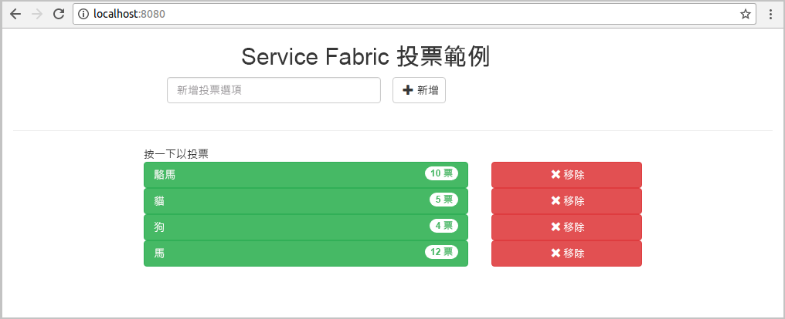
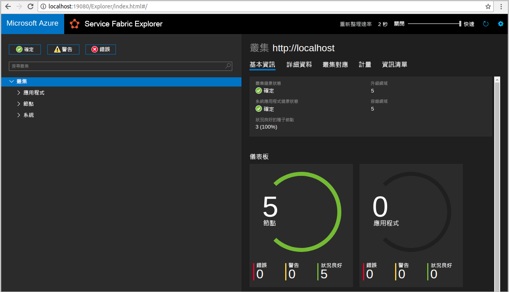
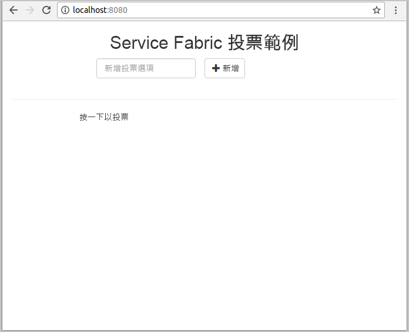
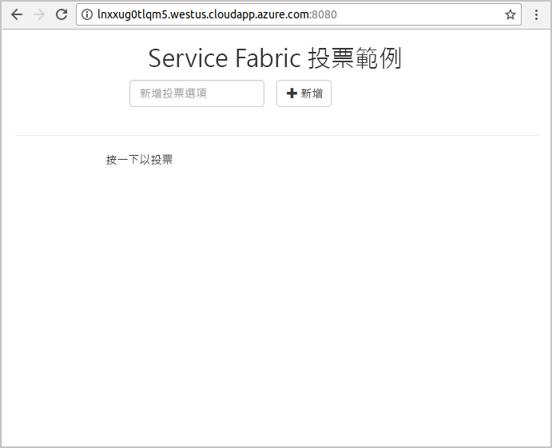
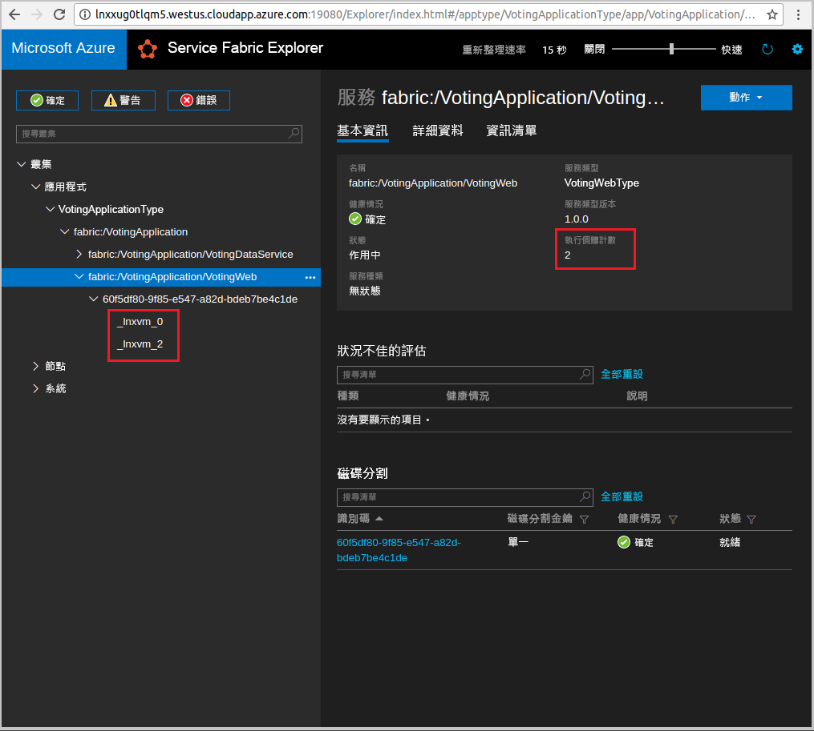

# <a name="quickstart-deploy-a-java-reliable-services-application-to-service-fabric"></a>快速入門：將 Java 可靠服務應用程式部署至 Service Fabric

Azure Service Fabric 是一個分散式系統平台，可讓您部署及管理微服務與容器。

本快速入門示範如何使用 Linux 開發人員機器上的 Eclipse IDE，將第一個 Java 應用程式部署到 Service Fabric。 當您完成時，您會有一個投票應用程式，其 Java Web 前端會將投票結果儲存在叢集中具狀態的後端服務。



在此快速入門中，您可了解如何：

* 使用 Eclipse 作為 Service Fabric Java 應用程式的工具
* 將應用程式部署到本機叢集
* 將應用程式部署到 Azure 中的叢集
* 跨多個節點相應放大應用程式

## <a name="prerequisites"></a>必要條件

若要完成本快速入門：

1. [安裝 Service Fabric SDK 和 Service Fabric 命令列介面 (CLI)](https://docs.microsoft.com/azure/service-fabric/service-fabric-get-started-linux#installation-methods)
2. [安裝 Git](https://git-scm.com/)
3. [安裝 Eclipse](https://www.eclipse.org/downloads/)
4. [設定 Java 環境](https://docs.microsoft.com/azure/service-fabric/service-fabric-get-started-linux#set-up-java-development)，務必遵循選擇性步驟來安裝 Eclipse 外掛程式

## <a name="download-the-sample"></a>下載範例

在命令視窗中執行下列命令，將範例應用程式存放庫複製到本機電腦。

```git
git clone https://github.com/Azure-Samples/service-fabric-java-quickstart.git
```

## <a name="run-the-application-locally"></a>在本機執行應用程式

1. 執行下列命令來啟動本機叢集：

    ```bash
    sudo /opt/microsoft/sdk/servicefabric/common/clustersetup/devclustersetup.sh
    ```
    啟動本機叢集需要一些時間。 若要確認該叢集完全啟動，請存取位於 **http://localhost:19080** 的 Service Fabric Explorer。 五個狀況良好的節點表示本機叢集已啟動並執行。

    

2. 開啟 Eclipse。
3. 按一下 [檔案] -> [匯入] -> [Gradle]-> [現有的 Gradle 專案]，然後依照精靈的指示操作。
4. 按一下目錄，然後在您從 Github 資料夾複製的 `service-fabric-java-quickstart` 資料夾中選擇 `Voting` 目錄。 按一下 [完成] (Finish)。 

    

5. 在 Eclipse 的 [封裝總管] 中現在有 `Voting` 專案。
6. 以滑鼠右鍵按一下專案，並選取 [Service Fabric] 下拉式清單下的 [發行應用程式...]。 選擇 **PublishProfiles/Local.json** 作為目標設定檔，並按一下 [發佈]。

    

7. 開啟您最愛的網頁瀏覽器，並存取 **http://localhost:8080** 以存取應用程式。

    

您現在可以新增一組投票選項，並開始進行投票。 應用程式會執行並將所有資料儲存在 Service Fabric 叢集中，而不需要個別資料庫。

## <a name="deploy-the-application-to-azure"></a>將應用程式部署至 Azure

### <a name="set-up-your-azure-service-fabric-cluster"></a>設定 Azure Service Fabric 叢集

若要將應用程式部署到 Azure 中的叢集，請建立您自己的叢集。

合作對象叢集是 Azure 上裝載的免費、限時 Service Fabric 叢集，由 Service Fabric 小組所執行。 您可以使用合作對象叢集來部署應用程式，並了解平台。 叢集會使用單一的自我簽署憑證，以確保節點對節點和用戶端對節點的安全性。

登入並加入 [Linux 叢集](http://aka.ms/tryservicefabric)。 藉由按一下 [PFX] 連結，將 PFX 憑證下載至您的電腦。 按一下**讀我檔案**連結以尋找憑證密碼，以及關於如何設定各種環境以使用憑證的指示。 請將 [歡迎] 頁面和 [讀我檔案] 頁面保持為開啟，您將在下列步驟使用其中的某些指示。

> [!Note]
> 每小時可用的合作對象叢集數目有限。 如果您在嘗試註冊合作對象叢集時收到錯誤，可以等候一段時間再重試，也可以依照[在 Azure 上建立 Service Fabric 叢集](service-fabric-tutorial-create-vnet-and-linux-cluster.md)中的步驟，在您的訂用帳戶中建立叢集。
>
> Spring Boot 服務設定為在連接埠 8080 上接聽傳入流量。 請確定您的叢集中已開啟該連接埠。 如果您使用合作對象叢集，此連接埠已開啟。
>

Service Fabric 提供了數項可用來管理叢集及其應用程式的工具：

* Service Fabric Explorer，此為以瀏覽器為基礎的工具。
* Service Fabric 命令列介面 (CLI)，此 CLI 會在 Azure CLI 之上執行。
* PowerShell 命令。

在此快速入門中，您會使用 Service Fabric CLI 和 Service Fabric Explorer。

若要使用 CLI，必須根據您所下載的 PFX 檔案建立 PEM 檔案。 若要轉換此檔案，請使用下列命令。 (對於合作對象叢集，您可以從 [讀我檔案] 頁面上的指示中，複製您的 PFX 檔案適用的特定命令。)

    ```bash
    openssl pkcs12 -in party-cluster-1486790479-client-cert.pfx -out party-cluster-1486790479-client-cert.pem -nodes -passin pass:1486790479
    ```

若要使用 Service Fabric Explorer，必須將您從合作對象叢集網站下載的憑證 PFX 檔案匯入至憑證存放區 (Windows 或 Mac) 或瀏覽器本身 (Ubuntu)。 您需要 PFX 私密金鑰密碼；此密碼可從 [讀我檔案] 頁面取得。

請使用您最熟悉的方法在您的系統上匯入憑證。 例如︰

* 在 Windows 上：按兩下 PFX 檔案，並依照提示在您的個人存放區中安裝憑證：`Certificates - Current User\Personal\Certificates`。 或者，您可以使用 **ReadMe** 指示中的 PowerShell 命令。
* 在 Mac 上：按兩下 PFX 檔案，並依照提示在您的 Keychain 中安裝憑證。
* 在 Ubuntu 上：Mozilla Firefox 是 Ubuntu 16.04 中的預設瀏覽器。 若要將憑證匯入 Firefox 中，請按一下瀏覽器右上角的功能表按鈕，然後按一下 [選項]。 在 [喜好設定] 頁面上，使用搜尋方塊搜尋「憑證」。 按一下 [檢視憑證]，選取 [您的憑證] 索引標籤上，按一下 [匯入]，並依照提示匯入憑證。

   

### <a name="add-certificate-information-to-your-application"></a>將憑證資訊新增至應用程式

您必須將憑證指紋新增至應用程式，因為應用程式使用的是 Service Fabric 程式設計模型。

1. 在安全的叢集上執行時，您需要 `Voting/VotingApplication/ApplicationManifest.xml` 檔案中的憑證指紋。 執行下列命令以擷取憑證的指紋。

    ```bash
    openssl x509 -in [CERTIFICATE_PEM_FILE] -fingerprint -noout
    ```

2. 在 `Voting/VotingApplication/ApplicationManifest.xml` 檔案的 **Secretscertificate** 標記下，新增下列程式碼片段。 **X509FindValue** 應該是上一個步驟的指紋 (沒有分號)。 

    ```xml
    <Certificates>
        <SecretsCertificate X509FindType="FindByThumbprint" X509FindValue="0A00AA0AAAA0AAA00A000000A0AA00A0AAAA00" />
    </Certificates>
    ```

### <a name="deploy-the-application-using-eclipse"></a>使用 Eclipse 部署應用程式

應用程式和叢集備妥後，即可直接從 Eclipse 將應用程式部署到叢集。

1. 開啟 **PublishProfiles** 目錄下的 **Cloud.json** 檔案，並妥善填入 `ConnectionIPOrURL` 和 `ConnectionPort` 欄位。 範例如下：

    ```bash
    {
         "ClusterConnectionParameters":
         {
            "ConnectionIPOrURL": "lnxxug0tlqm5.westus.cloudapp.azure.com",
            "ConnectionPort": "19080",
            "ClientKey": "[path_to_your_pem_file_on_local_machine]",
            "ClientCert": "[path_to_your_pem_file_on_local_machine]"
         }
    }
    ```

2. 以滑鼠右鍵按一下專案，並選取 [Service Fabric] 下拉式清單下的 [發行應用程式...]。 選擇 **PublishProfiles/Cloud.json** 作為目標設定檔，並按一下 [發佈]。

    

3. 開啟您的網頁瀏覽器，並存取 **http://\<ConnectionIPOrURL>:8080** 以存取應用程式。

    

## <a name="scale-applications-and-services-in-a-cluster"></a>調整叢集中的應用程式和服務

您可以在整個叢集內調整服務，以符合服務上的負載變更。 您可以藉由變更叢集中執行的執行個體數目來調整服務。 您可以透過多種方式調整服務；例如，您可以使用 Service Fabric CLI (sfctl) 中的指令碼或命令。 在下列步驟中，請使用 Service Fabric Explorer。

Service Fabric Explorer 會在所有 Service Fabric 叢集中執行，並可藉由瀏覽至叢集 HTTP 管理連接埠 (19080) 從瀏覽器存取，例如 `http://lnxxug0tlqm5.westus.cloudapp.azure.com:19080`。

若要調整 Web 前端服務，請執行下列動作：

1. 在您的叢集中開啟 Service Fabric Explorer，例如 `https://lnxxug0tlqm5.westus.cloudapp.azure.com:19080`。
2. 按一下樹狀檢視中 **fabric:/Voting/VotingWeb** 節點旁的省略符號 (三個點)，然後選擇 [調整服務]。

    ![Service Fabric Explorer 的 [調整服務]](./media/service-fabric-quickstart-java/scaleservicejavaquickstart.png)

    您現在可以選擇調整 Web 前端服務的執行個體數目。

3. 將數字變更為 **2**，然後按一下 [調整服務]。
4. 按一下樹狀檢視中的 **fabric:/Voting/VotingWeb** 節點，然後展開資料分割節點 (以 GUID 表示)。

    

    您現在會看到此服務具有兩個執行個體，而且在樹狀檢視中，您會看到執行個體執行所在的節點。

藉由這項簡單的管理工作，您已讓前端服務可用來處理使用者負載的資源倍增。 請務必了解，您不需要多個服務執行個體，就能讓服務確實可靠地執行。 如果服務失敗，Service Fabric 可確保會有新的服務執行個體在叢集中執行。

## <a name="next-steps"></a>後續步驟

在此快速入門中，您已了解如何：

* 使用 Eclipse 作為 Service Fabric Java 應用程式的工具
* 將 Java 應用程式部署到本機叢集
* 將 Java 應用程式部署到 Azure 中的叢集
* 跨多個節點相應放大應用程式

若要深入了解如何在 Service Fabric 中使用 Java 應用程式，請繼續進行教學課程以了解 Java 應用程式。

> [!div class="nextstepaction"]
> [部署 Java 應用程式](./service-fabric-tutorial-create-java-app.md)
