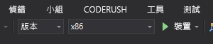

# 快速入門：在 C++/WinRT 和 DirectX 中使用 Azure Spatial Anchors 建立 HoloLens 應用程式

本快速入門將說明如何在 C++/WinRT 和 DirectX 中使用 [Azure Spatial Anchors](../overview.md) 建立 HoloLens 應用程式。 Azure Spatial Anchors 是一款跨平台開發人員服務，可讓您使用在一段時間之後仍跨裝置保持其位置的物件，建立混合實境體驗。 當您完成時，您將會有可儲存和回收空間錨點的 HoloLens 應用程式。

您將學習如何：

> [!div class="checklist"]
> * 建立 Spatial Anchors 帳戶
> * 設定 Spatial Anchors 帳戶識別碼和帳戶金鑰
> * 在 HoloLens 裝置上部署和執行

[!INCLUDE [quickstarts-free-trial-note](../../../includes/quickstarts-free-trial-note.md)]

## 必要條件

若要完成本快速入門，請確定您具備︰
- 已安裝 <a href="https://www.visualstudio.com/downloads/" target="_blank">Visual Studio 2019</a> 的 Windows 機器，並且具有**通用 Windows 平台開發**工作負載和 **Windows 10 SDK (10.0.18362.0 或更新版本)** 元件，以及 <a href="https://git-scm.com/download/win" target="_blank">Git for Windows</a>。
- 從 [Visual Studio Marketplace](https://marketplace.visualstudio.com/) 安裝 Visual Studio 的 [C++/WinRT Visual Studio 延伸模組 (VSIX)](https://aka.ms/cppwinrt/vsix)。
- 已啟用[開發人員模式](https://docs.microsoft.com/windows/mixed-reality/using-visual-studio)的 HoloLens 裝置。 本文需要具有 [Windows 10 2018 年 10 月更新](https://docs.microsoft.com/windows/mixed-reality/release-notes-october-2018 ) (也稱為 RS5) 的 HoloLens 裝置。 若要在 HoloLens 上更新至最新版本，請開啟**設定**應用程式，移至 [更新與安全性]  ，然後選取 [檢查更新]  按鈕。
- 您的應用程式必須在其 AppX 資訊清單中設定 **spatialPerception** 功能。

[!INCLUDE [Create Spatial Anchors resource](../../../includes/spatial-anchors-get-started-create-resource.md)]

## 開啟範例專案

[!INCLUDE [Clone Sample Repo](../../../includes/spatial-anchors-clone-sample-repository.md)]

在 Visual Studio 中開啟 `HoloLens\DirectX\SampleHoloLens.sln`。

## 設定帳戶識別碼和金鑰

下一個步驟是將應用程式設定為使用您的帳戶識別碼和帳戶金鑰。 在[設定空間錨點資源](#create-a-spatial-anchors-resource)時，將它們複製到文字編輯器中。

開啟 `HoloLens\DirectX\SampleHoloLens\ViewController.cpp`。

找出 `SpatialAnchorsAccountKey` 欄位，並將 `Set me` 取代為帳戶金鑰。

找出 `SpatialAnchorsAccountId` 欄位，並將 `Set me` 取代為帳戶識別碼。

## 將應用程式部署到您的 HoloLens

將 [方案設定]  變更為 [發行]  ，並將 [方案平台]  變更為 [x86]  ，然後從部署目標選項中選取 [裝置]  。

如果使用 HoloLens 2，請使用 **ARM** 作為**解決方案平台**，而非使用 **x86**。

將 HoloLens 裝置開機並登入，然後使用 USB 纜線將其連接到電腦。

選取 [偵錯]   > [開始偵錯]  來部署您的應用程式並開始偵錯。

依照應用程式中的指示放置及回收錨點。

在 Visual Studio 中，您可以選取 [停止偵錯]  或按下 **Shift + F5** 來停止應用程式。

[!INCLUDE [Clean-up section](../../../includes/clean-up-section-portal.md)]

[!INCLUDE [Next steps](../../../includes/spatial-anchors-quickstarts-nextsteps.md)]

> [!div class="nextstepaction"]
> [教學課程：跨裝置共用 Spatial Anchors](../tutorials/tutorial-share-anchors-across-devices.md)
