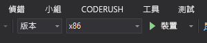

# 快速入門：建立使用 Azure Spatial Anchors 的 HoloLens Unity 應用程式

在本快速入門中，您將建立使用 [Azure Spatial Anchors](../overview.md) 的 HoloLens Unity 應用程式。 Spatial Anchors 是一款跨平台開發人員服務，可讓您使用在一段時間之後仍跨裝置保持其位置的物件，建立混合式實境體驗。 當您完成時，您將會有搭配 Unity 建置的 HoloLens 應用程式，並可儲存和回收空間錨點。

您將學習如何：

- 建立 Spatial Anchors 帳戶。
- 準備 Unity 組建設定。
- 設定 Spatial Anchors 帳戶識別碼和帳戶金鑰。
- 匯出 HoloLens Visual Studio 專案。
- 在 HoloLens 裝置上部署應用程式並加以執行。

[!INCLUDE [quickstarts-free-trial-note](../../../includes/quickstarts-free-trial-note.md)]

## 必要條件

若要完成本快速入門：

- 您需要一部上面安裝了 <a href="https://unity3d.com/get-unity/download" target="_blank">Unity 2018.3</a> 或更新版本和 <a href="https://www.visualstudio.com/downloads/" target="_blank">Visual Studio 2017</a> 或更新版本的 Windows 電腦。 您的 Visual Studio 安裝必須包含**通用 Windows 平台開發**工作負載。 您也必須安裝 <a href="https://git-scm.com/download/win" target="_blank">Git for Windows</a>。
- 您需要一個已啟用[開發人員模式](https://docs.microsoft.com/windows/mixed-reality/using-visual-studio)的 HoloLens 裝置。 [Windows 10 年 10 月 2018 Update](https://docs.microsoft.com/en-us/windows/mixed-reality/release-notes-october-2018) (也稱為 RS5) 安裝在裝置上。 若要在 HoloLens 上更新至最新版本，請開啟**設定**應用程式，移至 [更新與安全性]，然後選取 [檢查更新]。
- 在您的應用程式中，您必須啟用 **SpatialPerception** 功能。 此設定位於 [組建設定]  >  [播放器設定]  >  [發行設定]  >  [功能] 中。
- 在您的應用程式中，您必須以 [Windows Mixed Reality SDK] 啟用 [虛擬實境支援]。 此設定位於 [組建設定]  >  [播放器設定]  >  [XR設定] 中。

[!INCLUDE [Create Spatial Anchors resource](../../../includes/spatial-anchors-get-started-create-resource.md)]

## 在 Unity 中開啟範例專案

[!INCLUDE [Clone Sample Repo](../../../includes/spatial-anchors-clone-sample-repository.md)]

在 Unity 中，開啟 Unity 資料夾中的專案。

藉由選取 [檔案] > [組建設定] 來開啟 [組建設定]。

在 [平台] 區段中，選取 [通用 Windows 平台]。 將 [目標裝置] 變更為 [HoloLens]。

選取 [切換平台]，將平台變更為 [通用 Windows 平台]。 Unity 可能會提示您安裝 UWP 支援元件 (如果元件遺失的話)。

   

關閉 [組建設定] 視窗。

## 設定帳戶識別碼和金鑰

在 [專案] 窗格中，移至 `Assets/AzureSpatialAnchorsPlugin/Examples`，然後開啟 `AzureSpatialAnchorsBasicDemo.unity` 場景檔案。

[!INCLUDE [Configure Unity Scene](../../../includes/spatial-anchors-unity-configure-scene.md)]

選取 [檔案] > [儲存] 以儲存場景。

## 匯出 HoloLens Visual Studio 專案

[!INCLUDE [Export Unity Project](../../../includes/spatial-anchors-unity-export-project-snip.md)]

選取 [組建]。 在對話方塊中，選取要在其中匯出 HoloLens Visual Studio 專案的資料夾。

匯出完成時，會顯示含有匯出的 HoloLens 專案的資料夾。

## 部署 HoloLens 應用程式

在資料夾中，按兩下 [HelloAR U3D.sln]，以在 Visual Studio 中開啟專案。

將 [方案組態] 變更為 [發行]，並將 [方案平台] 變更為 [x86]，然後從部署目標選項中選取 [裝置]。

   

開啟 HoloLens 裝置並登入，然後使用 USB 纜線將該裝置連接到電腦。

選取 [偵錯] > [開始偵錯] 來部署您的應用程式並開始偵錯。

依照應用程式中的指示放置及回收錨點。

在 Visual Studio 中，透過選取 [停止偵錯] 或按下 Shift + F5 來停止應用程式。

[!INCLUDE [Clean-up section](../../../includes/clean-up-section-portal.md)]

[!INCLUDE [Next steps](../../../includes/spatial-anchors-quickstarts-nextsteps.md)]

> [!div class="nextstepaction"]
> [教學課程：跨裝置共用空間錨點](../tutorials/tutorial-share-anchors-across-devices.md)
