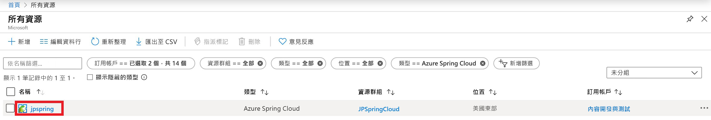
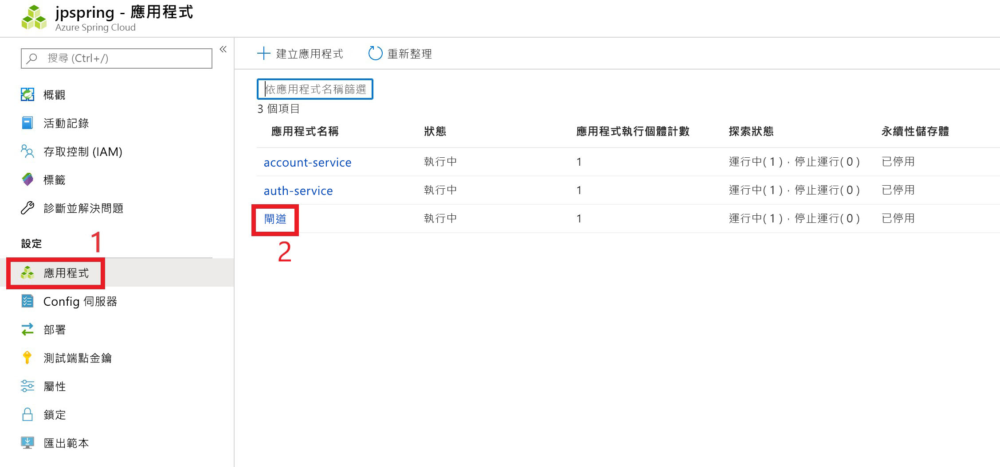
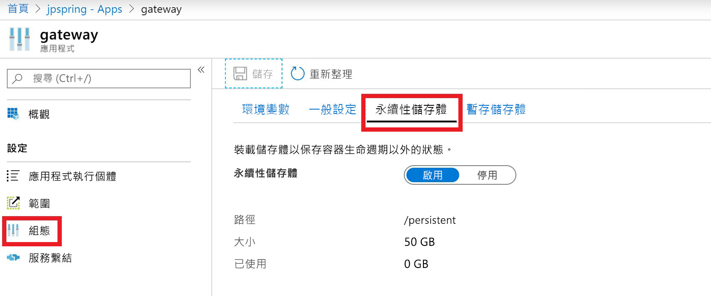

# <a name="how-to-use-persistent-storage-in-azure-spring-cloud"></a>如何在 Azure 春季雲端中使用持續性儲存體

Azure 春季雲端為您的應用程式提供兩種類型的儲存體：持續性和暫時。  Azure 春季雲端預設會針對每個應用程式實例啟用暫存儲存體。 暫存儲存體的預設掛接路徑限制為5GB： `/tmp`。

> [!WARNING]
> 重新開機應用程式實例將會永久刪除其相關聯的暫存儲存體。

持續性儲存體是由每個應用程式所配置的 Azure 所管理的檔案共用容器。 儲存在持續性儲存體中的資料會在應用程式的所有實例之間共用。 Azure 春季雲端服務實例最多可以有10個應用程式，且已啟用持續性磁片。 每個應用程式都會收到50GB 的持續性儲存體。 持續性儲存體的預設掛接路徑為 `/persistent`。

> [!WARNING]
> *停*用持續性儲存區將會解除配置該應用程式的儲存體。  該儲存體帳戶中的所有資料都將遺失。 

## <a name="enable-persistent-storage-using-the-azure-portal"></a>使用 Azure 入口網站啟用持續性儲存體

1. 從 Azure 入口網站的主畫面中，選取 [**所有資源**]。

     >![找出 [所有資源] 圖示](media/portal-all-resources.jpg)

1. 尋找並選取需要持續性儲存體的 Azure 春季雲端資源。  在此範例中，應用程式稱為*jpspring*。

    > 

1. 在 [**設定**] 標題下，選取 [**應用程式**]。

1. 您的春天雲端服務將會出現在資料表中。  選取您要新增持續性儲存體的服務。  在此範例中，我們將選取**閘道**服務。

    > 

1. 從服務的 [設定] 分頁，**選取 [** 設定]

1. 選取 [**持續性儲存體**] 索引標籤，並啟用持續性儲存體。

    > 

啟用持續性儲存體時，其大小和路徑會顯示在此頁面上。

## <a name="use-the-azure-cli-to-modify-persistent-storage"></a>使用 Azure CLI 來修改持續性儲存體

如有必要，請安裝適用于 Azure CLI 的春季雲端延伸模組：

```azurecli
az extension add --name spring-cloud
```

建立已啟用持續性磁片的應用程式：
 
```azurecli
az spring-cloud app create -n <app> -g <resource-group> -s <service-name> --enable-persistent-storage true
```

在現有的應用程式中啟用持續性儲存體：

```azurecli
az spring-cloud app update -n <app> -g <resource-group> -s <service-name> --enable-persistent-storage true
``` 

在現有的應用程式中停用持續性儲存體：

> [!WARNING]
> 停用持續性儲存區將會解除配置該應用程式的儲存體，永久遺失儲存在該處的任何資料。 

```azurecli
az spring-cloud app update -n <app> -g <resource-group> -s <service-name> --enable-persistent-storage false
```

## <a name="next-steps"></a>後續步驟

瞭解[應用程式和服務配額](spring-cloud-quotas.md)，或瞭解如何[手動調整您的應用程式](spring-cloud-tutorial-scale-manual.md)。