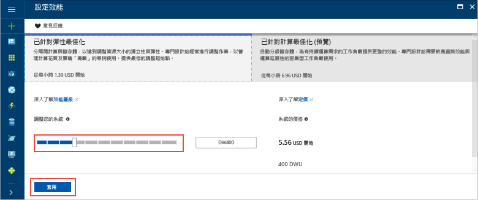

# <a name="tutorial-load-data-to-azure-sql-data-warehouse"></a>教學課程：將資料載入 Azure SQL 資料倉儲

本教學課程會使用 PolyBase 將 WideWorldImportersDW 資料倉儲從 Azure Blob 儲存體載入 Azure SQL 資料倉儲中。 本教學課程是使用 [Azure 入口網站](https://portal.azure.com)和 [SQL Server Management Studio](/sql/ssms/download-sql-server-management-studio-ssms) (SSMS)： 

> [!div class="checklist"]
> * 在 Azure 入口網站中建立資料倉儲
> * 在 Azure 入口網站中設定伺服器層級的防火牆規則
> * 使用 SSMS 連線到資料倉儲
> * 建立針對載入資料指定的使用者
> * 建立以 Azure Blob 作為資料來源的外部資料表
> * 使用 CTAS T-SQL 陳述式將資料載入資料倉儲
> * 在載入時，檢閱資料的進度
> * 在日期維度和銷售事實資料表中產生一年份的資料
> * 建立新載入資料的統計資料

如果您沒有 Azure 訂用帳戶，請在開始之前先[建立免費帳戶](https://azure.microsoft.com/free/)。

## <a name="before-you-begin"></a>開始之前

開始本教學課程之前，請下載並安裝最新版的 [SQL Server Management Studio](/sql/ssms/download-sql-server-management-studio-ssms) (SSMS)。


## <a name="log-in-to-the-azure-portal"></a>登入 Azure 入口網站

登入 [Azure 入口網站](https://portal.azure.com/)。

## <a name="create-a-blank-sql-data-warehouse"></a>建立空白的 SQL 資料倉儲

Azure SQL 資料倉儲會使用一組定義的[計算資源](memory-and-concurrency-limits.md)建立。 此資料庫建立於 [Azure 資源群組](../azure-resource-manager/resource-group-overview.md)和 [Azure SQL 邏輯伺服器](../sql-database/sql-database-features.md)內。 

遵循以下步驟來建立空白 SQL 資料倉儲。 

1. 按一下 Azure 入口網站左上角的 [建立資源]。

2. 從 [新增] 頁面中選取 [資料庫]，然後在 [新增] 頁面的 [精選] 下選取 [SQL 資料倉儲]。

    

3. 在 SQL 資料倉儲表單中填寫下列資訊︰   

   | 設定 | 建議的值 | 說明 | 
   | ------- | --------------- | ----------- | 
   | **資料庫名稱** | SampleDW | 如需有效的資料庫名稱，請參閱[資料庫識別碼](/sql/relational-databases/databases/database-identifiers)。 | 
   | **訂用帳戶** | 您的訂用帳戶  | 如需訂用帳戶的詳細資訊，請參閱[訂用帳戶](https://account.windowsazure.com/Subscriptions)。 |
   | **資源群組** | SampleRG | 如需有效的資源群組名稱，請參閱[命名規則和限制](https://docs.microsoft.com/azure/architecture/best-practices/naming-conventions)。 |
   | **選取來源** | 空白資料庫 | 指定以建立空白資料庫。 請注意，資料倉儲是一種資料庫。|

    

4. 按一下 [伺服器] 為您的新資料庫建立及設定新的伺服器。 在**新伺服器表單**表單中填寫下列資訊︰ 

    | 設定 | 建議的值 | 說明 | 
    | ------- | --------------- | ----------- |
    | **伺服器名稱** | 任何全域唯一名稱 | 如需有效的伺服器名稱，請參閱[命名規則和限制](https://docs.microsoft.com/azure/architecture/best-practices/naming-conventions)。 | 
    | **伺服器管理員登入** | 任何有效名稱 | 如需有效的登入名稱，請參閱[資料庫識別碼](https://docs.microsoft.com/sql/relational-databases/databases/database-identifiers)。|
    | **密碼** | 任何有效密碼 | 您的密碼至少要有 8 個字元，而且必須包含下列幾種字元的其中三種︰大寫字元、小寫字元、數字和非英數字元。 |
    | **位置** | 任何有效位置 | 如需區域的相關資訊，請參閱 [Azure 區域](https://azure.microsoft.com/regions/)。 |

    

5. 按一下 [選取] 。

6. 按一下 [效能層] 可指定資料倉儲是否針對彈性或計算最佳化，以及資料倉儲單位的數目。 

7. 此教學課程中，選取 [針對彈性最佳化] 服務層。 根據預設，滑桿會設定為 **DW400**。  請嘗試向上和向下移動以查看其運作方式。 

    

8. 按一下 [套用]。
9. 在 [SQL 資料倉儲] 頁面上，針對空白資料庫選取 [定序]。 本教學課程使用預設值。 如需定序的詳細資訊，請參閱[定序](/sql/t-sql/statements/collations)。

11. 您現在已完成 SQL Database 表單，請按一下 [建立] 來佈建資料庫。 佈建需要幾分鐘的時間。 

    ![按一下 [建立]](media/load-data-wideworldimportersdw/click-create.png)

12. 在工具列上，按一下 [通知] 以監視部署程序。
    
     

## <a name="create-a-server-level-firewall-rule"></a>建立伺服器層級防火牆規則

SQL 資料倉儲服務會在伺服器層級建立防火牆，防止外部應用程式和工具連線到伺服器或伺服器上的任何資料庫。 若要啟用連線，您可以新增防火牆規則以啟用特定 IP 位址之連線。  遵循以下步驟建立用戶端 IP 位址的[伺服器層級防火牆規則](../sql-database/sql-database-firewall-configure.md)。 

> [!NOTE]
> SQL 資料倉儲會透過連接埠 1433 通訊。 如果您嘗試從公司網路內進行連線，您網路的防火牆可能不允許透過連接埠 1433 的輸出流量。 若情況如此，除非 IT 部門開啟連接埠 1433，否則您無法連線至 Azure SQL Database 伺服器。
>

1. 部署完成之後，按一下左側功能表中的 [SQL Database]，然後按一下 [SQL Database] 頁面上的 [SampleDW]。 資料庫的概觀頁面隨即開啟，其中會顯示完整伺服器名稱 (例如 **sample-svr.database.windows.net**)，並提供進一步的組態選項。 

2. 在後續的快速入門中，請複製此完整伺服器名稱，才能用來連線到伺服器及其資料庫。 若要開啟伺服器設定，請按一下伺服器名稱。

     

3. 若要開啟伺服器設定，請按一下伺服器名稱。

     

5. 按一下 [顯示防火牆設定]。 SQL Database 伺服器的 [防火牆設定] 頁面隨即開啟。 

     

4.  若要將目前的 IP 位址新增至新的防火牆規則，按一下工具列上的 [新增用戶端 IP]。 防火牆規則可以針對單一 IP 位址或 IP 位址範圍開啟連接埠 1433。

5. 按一下 [檔案] 。 系統便會為目前的 IP 位址建立伺服器層級防火牆規則，以便在邏輯伺服器上開啟連接埠 1433。

6. 依序按一下 [確定]，然後關閉 [防火牆設定] 頁面。

您現在可以使用這個 IP 位址連線到 SQL Server 及其資料倉儲。 可從 SQL Server Management Studio 或您選擇的另一個工具來運作連線。 當您連線時，請使用先前建立的 serveradmin 帳戶。  

> [!IMPORTANT]
> 根據預設，已對所有 Azure 服務啟用透過 SQL Database 防火牆存取。 在此頁面上按一下 [關閉]，然後按一下 [儲存] 可停用所有 Azure 服務的防火牆。

## <a name="get-the-fully-qualified-server-name"></a>取得完整的伺服器名稱

請在 Azure 入口網站中取得 SQL 伺服器的完整伺服器名稱。 稍後您在連線到伺服器時，要使用完整伺服器名稱。

1. 登入 [Azure 入口網站](https://portal.azure.com/)。
2. 從左側功能表中選取 [SQL Database]，按一下 [SQL Database]頁面上您的資料庫。 
3. 在 Azure 入口網站中您資料庫的 [基本資訊] 窗格中，找到後複製 [伺服器名稱]。 在此範例中，完整的名稱是 mynewserver 20171113.database.windows.net。 

      

## <a name="connect-to-the-server-as-server-admin"></a>以伺服器系統管理員身分連線到伺服器

本節使用 [SQL Server Management Studio](/sql/ssms/download-sql-server-management-studio-ssms) (SSMS) 建立對 Azure SQL Server 的連線。

1. 開啟 SQL Server Management Studio。

2. 在 [連接到伺服器] 對話方塊中，輸入下列資訊：

    | 設定      | 建議的值 | 說明 | 
    | ------------ | --------------- | ----------- | 
    | 伺服器類型 | 資料庫引擎 | 這是必要值 |
    | 伺服器名稱 | 完整伺服器名稱 | 例如，**sample-svr.database.windows.net** 是完整的伺服器名稱。 |
    | 驗證 | SQL Server 驗證 | SQL 驗證是本教學課程中設定的唯一驗證類型。 |
    | 登入 | 伺服器管理帳戶 | 這是您在建立伺服器時所指定的帳戶。 |
    | 密碼 | 伺服器管理帳戶的密碼 | 這是您在建立伺服器時所指定的密碼。 |

    

4. 按一下 [ **連接**]。 [物件總管] 視窗隨即在 SSMS 中開啟。 

5. 在 [物件總管] 中，展開 [資料庫]。 然後展開 [系統資料庫] 和 [主要資料庫] 來檢視主要資料庫中的物件。  展開 [mySampleDatabase] 可檢視新資料庫中的物件。

     

## <a name="create-a-user-for-loading-data"></a>建立載入資料的使用者

伺服器系統管理員帳戶旨在執行管理作業，並不適合用於在使用者資料上執行查詢。 載入資料是需要大量記憶體的作業。 記憶體的最大值會依據您使用的 SQL 資料倉儲版本、[資料倉儲單位](what-is-a-data-warehouse-unit-dwu-cdwu.md)以及[資源類別](resource-classes-for-workload-management.md)而定。 

您最好建立載入資料專用的登入和使用者。 然後將載入使用者新增至可進行適當最大記憶體配置的[資源類別](resource-classes-for-workload-management.md)。

因為您目前以伺服器管理員的身分連線，就可以建立登入和使用者。 使用下列步驟來建立登入和名為 **LoaderRC60** 的使用者。 然後將使用者指派至 **staticrc60** 資源類別。 

1.  在 SSMS 中，以滑鼠右鍵按一下 [主要資料庫] 可顯示下拉式選單，然後選擇 [新增查詢]。 新的查詢視窗隨即開啟。

    

2. 在查詢視窗中，輸入這些 T-SQL 命令來建立登入和名為 LoaderRC60 的使用者，以取代您自己的 'a123STRONGpassword!' 密碼。 

    ```sql
    CREATE LOGIN LoaderRC60 WITH PASSWORD = 'a123STRONGpassword!';
    CREATE USER LoaderRC60 FOR LOGIN LoaderRC60;
    ```

3. 按一下 [Execute (執行)] 。

4. 以滑鼠右鍵按一下 [SampleDW]，然後選擇 [新增查詢]。 新的查詢視窗隨即開啟。  

    
 
5. 輸入下列 T-SQL 命令，針對 LoaderRC60 登入建立名為 LoaderRC60 的資料庫使用者。 第二行會在新的資料倉儲上授與新的使用者控制權限。  這些權限類似於讓使用者成為資料庫的擁有者。 第三行會將新的使用者新增為 staticrc60 [資源類別](resource-classes-for-workload-management.md)的成員。

    ```sql
    CREATE USER LoaderRC60 FOR LOGIN LoaderRC60;
    GRANT CONTROL ON DATABASE::[SampleDW] to LoaderRC60;
    EXEC sp_addrolemember 'staticrc60', 'LoaderRC60';
    ```

6. 按一下 [Execute (執行)] 。

## <a name="connect-to-the-server-as-the-loading-user"></a>以載入使用者身分連線到伺服器

載入資料的首要步驟是以 LoaderRC60 身分登入。  

1. 在 [物件總管] 中，按一下 [連線] 下拉功能表並選取 [資料庫引擎]。 [連線到伺服器] 對話方塊隨即出現。

    

2. 輸入完整伺服器名稱，以及輸入 **LoaderRC60** 作為登入。  輸入您 LoaderRC60 的密碼。

3. 按一下 [ **連接**]。

4. 您的連線就緒時，會在 [物件總管] 中看到兩個伺服器連線。 一個是以 ServerAdmin 連線，另一個是以 LoaderRC60 連線。

    

## <a name="create-external-tables-and-objects"></a>建立外部資料表和物件

您已準備好開始將資料載入新資料倉儲的程序。 如需日後參考，要了解如何將您的資料置於 Azure Blob 儲存體，或直接從您的來源將資料載入 SQL 資料倉儲，請參閱[載入概觀](sql-data-warehouse-overview-load.md)。

執行下列 SQL 指令碼可指定您要載入之資料的相關資訊。 這項資訊包括資料所在位置、資料內容的格式，以及資料的資料表定義。 此資料位於公用 Azure Blob。

1. 在上一節中，您以 LoaderRC60 身分登入您的資料倉儲。 在 SSMS 中，以滑鼠右鍵按一下 LoaderRC60 連線底下的 [SampleDW]，然後選取 [新增查詢]。  新的查詢視窗隨即開啟。 

    

2. 比較您的查詢視窗與上一個影像。  請確認您的 [新增查詢] 視窗是以 LoaderRC60 身分執行，並在 SampleDW 資料庫上執行查詢。 您可以使用這個查詢視窗來執行所有的載入步驟。

3. 建立 SampleDW 資料庫的主要金鑰。 您只需要為每個資料庫建立一次主要金鑰。 

    ```sql
    CREATE MASTER KEY;
    ```

4. 執行下列 [CREATE EXTERNAL DATA SOURCE](/sql/t-sql/statements/create-external-data-source-transact-sql) 陳述式來定義 Azure blob 的位置。 這是外部計程車資料的位置。  若要執行您已附加到查詢視窗中的命令，請反白顯示您需要執行的命令，然後按一下 [執行]。

    ```sql
    CREATE EXTERNAL DATA SOURCE WWIStorage
    WITH
    (
        TYPE = Hadoop,
        LOCATION = 'wasbs://wideworldimporters@sqldwholdata.blob.core.windows.net'
    );
    ```

5. 執行下列 [CREATE EXTERNAL FILE FORMAT](/sql/t-sql/statements/create-external-file-format-transact-sql) T-SQL 陳述式來指定格式的特性和外部資料檔案的選項。 這個陳述式會指定外部資料儲存為文字，並以管道 ('|') 字元來分隔值。  

    ```sql
    CREATE EXTERNAL FILE FORMAT TextFileFormat 
    WITH 
    (   
        FORMAT_TYPE = DELIMITEDTEXT,
        FORMAT_OPTIONS
        (   
            FIELD_TERMINATOR = '|',
            USE_TYPE_DEFAULT = FALSE 
        )
    );
    ```

6.  執行下列 [CREATE SCHEMA](/sql/t-sql/statements/create-schema-transact-sql) 陳述式可建立外部檔案格式的結構描述。 ext 結構描述會提供一種方式，讓您組織即將建立的外部資料表。 wwi 結構描述所組織的標準資料表則會包含資料。 

    ```sql
    CREATE SCHEMA ext;
    GO
    CREATE SCHEMA wwi;
    ```

7. 建立外部資料表。 資料表定義會儲存在 SQL 資料倉儲中，但資料表是參考儲存在 Azure blob 儲存體中的資料。 執行下列 T-SQL 命令來建立數個外部資料表，而這些資料表都指向您先前在外部資料來源中定義的 Azure blob。

    ```sql
    CREATE EXTERNAL TABLE [ext].[dimension_City](
        [City Key] [int] NOT NULL,
        [WWI City ID] [int] NOT NULL,
        [City] [nvarchar](50) NOT NULL,
        [State Province] [nvarchar](50) NOT NULL,
        [Country] [nvarchar](60) NOT NULL,
        [Continent] [nvarchar](30) NOT NULL,
        [Sales Territory] [nvarchar](50) NOT NULL,
        [Region] [nvarchar](30) NOT NULL,
        [Subregion] [nvarchar](30) NOT NULL,
        [Location] [nvarchar](76) NULL,
        [Latest Recorded Population] [bigint] NOT NULL,
        [Valid From] [datetime2](7) NOT NULL,
        [Valid To] [datetime2](7) NOT NULL,
        [Lineage Key] [int] NOT NULL
    )
    WITH (LOCATION='/v1/dimension_City/',   
        DATA_SOURCE = WWIStorage,  
        FILE_FORMAT = TextFileFormat,
        REJECT_TYPE = VALUE,
        REJECT_VALUE = 0
    );  
    CREATE EXTERNAL TABLE [ext].[dimension_Customer] (
        [Customer Key] [int] NOT NULL,
        [WWI Customer ID] [int] NOT NULL,
        [Customer] [nvarchar](100) NOT NULL,
        [Bill To Customer] [nvarchar](100) NOT NULL,
        [Category] [nvarchar](50) NOT NULL,
        [Buying Group] [nvarchar](50) NOT NULL,
        [Primary Contact] [nvarchar](50) NOT NULL,
        [Postal Code] [nvarchar](10) NOT NULL,
        [Valid From] [datetime2](7) NOT NULL,
        [Valid To] [datetime2](7) NOT NULL,
        [Lineage Key] [int] NOT NULL
    )
    WITH (LOCATION='/v1/dimension_Customer/',   
        DATA_SOURCE = WWIStorage,  
        FILE_FORMAT = TextFileFormat,
        REJECT_TYPE = VALUE,
        REJECT_VALUE = 0
    );  
    CREATE EXTERNAL TABLE [ext].[dimension_Employee] (
        [Employee Key] [int] NOT NULL,
        [WWI Employee ID] [int] NOT NULL,
        [Employee] [nvarchar](50) NOT NULL,
        [Preferred Name] [nvarchar](50) NOT NULL,
        [Is Salesperson] [bit] NOT NULL,
        [Photo] [varbinary](300) NULL,
        [Valid From] [datetime2](7) NOT NULL,
        [Valid To] [datetime2](7) NOT NULL,
        [Lineage Key] [int] NOT NULL
    )
    WITH ( LOCATION='/v1/dimension_Employee/',   
        DATA_SOURCE = WWIStorage,  
        FILE_FORMAT = TextFileFormat,
        REJECT_TYPE = VALUE,
        REJECT_VALUE = 0
    );
    CREATE EXTERNAL TABLE [ext].[dimension_PaymentMethod] (
        [Payment Method Key] [int] NOT NULL,
        [WWI Payment Method ID] [int] NOT NULL,
        [Payment Method] [nvarchar](50) NOT NULL,
        [Valid From] [datetime2](7) NOT NULL,
        [Valid To] [datetime2](7) NOT NULL,
        [Lineage Key] [int] NOT NULL
    )
    WITH ( LOCATION ='/v1/dimension_PaymentMethod/',   
        DATA_SOURCE = WWIStorage,  
        FILE_FORMAT = TextFileFormat,
        REJECT_TYPE = VALUE,
        REJECT_VALUE = 0
    );
    CREATE EXTERNAL TABLE [ext].[dimension_StockItem](
        [Stock Item Key] [int] NOT NULL,
        [WWI Stock Item ID] [int] NOT NULL,
        [Stock Item] [nvarchar](100) NOT NULL,
        [Color] [nvarchar](20) NOT NULL,
        [Selling Package] [nvarchar](50) NOT NULL,
        [Buying Package] [nvarchar](50) NOT NULL,
        [Brand] [nvarchar](50) NOT NULL,
        [Size] [nvarchar](20) NOT NULL,
        [Lead Time Days] [int] NOT NULL,
        [Quantity Per Outer] [int] NOT NULL,
        [Is Chiller Stock] [bit] NOT NULL,
        [Barcode] [nvarchar](50) NULL,
        [Tax Rate] [decimal](18, 3) NOT NULL,
        [Unit Price] [decimal](18, 2) NOT NULL,
        [Recommended Retail Price] [decimal](18, 2) NULL,
        [Typical Weight Per Unit] [decimal](18, 3) NOT NULL,
        [Photo] [varbinary](300) NULL,
        [Valid From] [datetime2](7) NOT NULL,
        [Valid To] [datetime2](7) NOT NULL,
        [Lineage Key] [int] NOT NULL
    )
    WITH ( LOCATION ='/v1/dimension_StockItem/',   
        DATA_SOURCE = WWIStorage,  
        FILE_FORMAT = TextFileFormat,
        REJECT_TYPE = VALUE,
        REJECT_VALUE = 0
    );
    CREATE EXTERNAL TABLE [ext].[dimension_Supplier](
        [Supplier Key] [int] NOT NULL,
        [WWI Supplier ID] [int] NOT NULL,
        [Supplier] [nvarchar](100) NOT NULL,
        [Category] [nvarchar](50) NOT NULL,
        [Primary Contact] [nvarchar](50) NOT NULL,
        [Supplier Reference] [nvarchar](20) NULL,
        [Payment Days] [int] NOT NULL,
        [Postal Code] [nvarchar](10) NOT NULL,
        [Valid From] [datetime2](7) NOT NULL,
        [Valid To] [datetime2](7) NOT NULL,
        [Lineage Key] [int] NOT NULL
    )
    WITH ( LOCATION ='/v1/dimension_Supplier/',   
        DATA_SOURCE = WWIStorage,  
        FILE_FORMAT = TextFileFormat,
        REJECT_TYPE = VALUE,
        REJECT_VALUE = 0
    );
    CREATE EXTERNAL TABLE [ext].[dimension_TransactionType](
        [Transaction Type Key] [int] NOT NULL,
        [WWI Transaction Type ID] [int] NOT NULL,
        [Transaction Type] [nvarchar](50) NOT NULL,
        [Valid From] [datetime2](7) NOT NULL,
        [Valid To] [datetime2](7) NOT NULL,
        [Lineage Key] [int] NOT NULL
    )    
    WITH ( LOCATION ='/v1/dimension_TransactionType/',   
        DATA_SOURCE = WWIStorage,  
        FILE_FORMAT = TextFileFormat,
        REJECT_TYPE = VALUE,
        REJECT_VALUE = 0
    );
    CREATE EXTERNAL TABLE [ext].[fact_Movement] (
        [Movement Key] [bigint] NOT NULL,
        [Date Key] [date] NOT NULL,
        [Stock Item Key] [int] NOT NULL,
        [Customer Key] [int] NULL,
        [Supplier Key] [int] NULL,
        [Transaction Type Key] [int] NOT NULL,
        [WWI Stock Item Transaction ID] [int] NOT NULL,
        [WWI Invoice ID] [int] NULL,
        [WWI Purchase Order ID] [int] NULL,
        [Quantity] [int] NOT NULL,
        [Lineage Key] [int] NOT NULL
    )
    WITH ( LOCATION ='/v1/fact_Movement/',   
        DATA_SOURCE = WWIStorage,  
        FILE_FORMAT = TextFileFormat,
        REJECT_TYPE = VALUE,
        REJECT_VALUE = 0
    );
    CREATE EXTERNAL TABLE [ext].[fact_Order] (
        [Order Key] [bigint] NOT NULL,
        [City Key] [int] NOT NULL,
        [Customer Key] [int] NOT NULL,
        [Stock Item Key] [int] NOT NULL,
        [Order Date Key] [date] NOT NULL,
        [Picked Date Key] [date] NULL,
        [Salesperson Key] [int] NOT NULL,
        [Picker Key] [int] NULL,
        [WWI Order ID] [int] NOT NULL,
        [WWI Backorder ID] [int] NULL,
        [Description] [nvarchar](100) NOT NULL,
        [Package] [nvarchar](50) NOT NULL,
        [Quantity] [int] NOT NULL,
        [Unit Price] [decimal](18, 2) NOT NULL,
        [Tax Rate] [decimal](18, 3) NOT NULL,
        [Total Excluding Tax] [decimal](18, 2) NOT NULL,
        [Tax Amount] [decimal](18, 2) NOT NULL,
        [Total Including Tax] [decimal](18, 2) NOT NULL,
        [Lineage Key] [int] NOT NULL
    )
    WITH ( LOCATION ='/v1/fact_Order/',   
        DATA_SOURCE = WWIStorage,  
        FILE_FORMAT = TextFileFormat,
        REJECT_TYPE = VALUE,
        REJECT_VALUE = 0
    );
    CREATE EXTERNAL TABLE [ext].[fact_Purchase] (
        [Purchase Key] [bigint] NOT NULL,
        [Date Key] [date] NOT NULL,
        [Supplier Key] [int] NOT NULL,
        [Stock Item Key] [int] NOT NULL,
        [WWI Purchase Order ID] [int] NULL,
        [Ordered Outers] [int] NOT NULL,
        [Ordered Quantity] [int] NOT NULL,
        [Received Outers] [int] NOT NULL,
        [Package] [nvarchar](50) NOT NULL,
        [Is Order Finalized] [bit] NOT NULL,
        [Lineage Key] [int] NOT NULL
    )
    WITH ( LOCATION ='/v1/fact_Purchase/',   
        DATA_SOURCE = WWIStorage,  
        FILE_FORMAT = TextFileFormat,
        REJECT_TYPE = VALUE,
        REJECT_VALUE = 0
    );
    CREATE EXTERNAL TABLE [ext].[fact_Sale] (
        [Sale Key] [bigint] NOT NULL,
        [City Key] [int] NOT NULL,
        [Customer Key] [int] NOT NULL,
        [Bill To Customer Key] [int] NOT NULL,
        [Stock Item Key] [int] NOT NULL,
        [Invoice Date Key] [date] NOT NULL,
        [Delivery Date Key] [date] NULL,
        [Salesperson Key] [int] NOT NULL,
        [WWI Invoice ID] [int] NOT NULL,
        [Description] [nvarchar](100) NOT NULL,
        [Package] [nvarchar](50) NOT NULL,
        [Quantity] [int] NOT NULL,
        [Unit Price] [decimal](18, 2) NOT NULL,
        [Tax Rate] [decimal](18, 3) NOT NULL,
        [Total Excluding Tax] [decimal](18, 2) NOT NULL,
        [Tax Amount] [decimal](18, 2) NOT NULL,
        [Profit] [decimal](18, 2) NOT NULL,
        [Total Including Tax] [decimal](18, 2) NOT NULL,
        [Total Dry Items] [int] NOT NULL,
        [Total Chiller Items] [int] NOT NULL,
        [Lineage Key] [int] NOT NULL
    )
    WITH ( LOCATION ='/v1/fact_Sale/',   
        DATA_SOURCE = WWIStorage,  
        FILE_FORMAT = TextFileFormat,
        REJECT_TYPE = VALUE,
        REJECT_VALUE = 0
    );
    CREATE EXTERNAL TABLE [ext].[fact_StockHolding] (
        [Stock Holding Key] [bigint] NOT NULL,
        [Stock Item Key] [int] NOT NULL,
        [Quantity On Hand] [int] NOT NULL,
        [Bin Location] [nvarchar](20) NOT NULL,
        [Last Stocktake Quantity] [int] NOT NULL,
        [Last Cost Price] [decimal](18, 2) NOT NULL,
        [Reorder Level] [int] NOT NULL,
        [Target Stock Level] [int] NOT NULL,
        [Lineage Key] [int] NOT NULL
    )
    WITH ( LOCATION ='/v1/fact_StockHolding/',   
        DATA_SOURCE = WWIStorage,  
        FILE_FORMAT = TextFileFormat,
        REJECT_TYPE = VALUE,
        REJECT_VALUE = 0
    );
    CREATE EXTERNAL TABLE [ext].[fact_Transaction] (
        [Transaction Key] [bigint] NOT NULL,
        [Date Key] [date] NOT NULL,
        [Customer Key] [int] NULL,
        [Bill To Customer Key] [int] NULL,
        [Supplier Key] [int] NULL,
        [Transaction Type Key] [int] NOT NULL,
        [Payment Method Key] [int] NULL,
        [WWI Customer Transaction ID] [int] NULL,
        [WWI Supplier Transaction ID] [int] NULL,
        [WWI Invoice ID] [int] NULL,
        [WWI Purchase Order ID] [int] NULL,
        [Supplier Invoice Number] [nvarchar](20) NULL,
        [Total Excluding Tax] [decimal](18, 2) NOT NULL,
        [Tax Amount] [decimal](18, 2) NOT NULL,
        [Total Including Tax] [decimal](18, 2) NOT NULL,
        [Outstanding Balance] [decimal](18, 2) NOT NULL,
        [Is Finalized] [bit] NOT NULL,
        [Lineage Key] [int] NOT NULL
    )
    WITH ( LOCATION ='/v1/fact_Transaction/',   
        DATA_SOURCE = WWIStorage,  
        FILE_FORMAT = TextFileFormat,
        REJECT_TYPE = VALUE,
        REJECT_VALUE = 0
    );
    ```

8. 在 [物件總管] 中，展開 [SampleDW] 可查看您剛才建立的外部資料表清單。

    

## <a name="load-the-data-into-your-data-warehouse"></a>將資料載入資料倉儲

本節會使用您剛定義的外部資料表，將範例資料從 Azure Blob 載入 SQL 資料倉儲中。  

> [!NOTE]
> 本教學課程會將資料直接載入最終資料表。 在生產環境中，您通常會使用 CREATE TABLE AS SELECT 來載入暫存資料表。 當資料位於暫存資料表時，您可以執行任何必要的轉換。 若要將暫存資料表中的資料附加至生產資料表，您可以使用 INSERT...SELECT 陳述式。 如需詳細資訊，請參閱[將資料插入生產資料表中](guidance-for-loading-data.md#inserting-data-into-a-production-table)。
> 

指令碼會使用 [CREATE TABLE AS SELECT (CTAS)](/sql/t-sql/statements/create-table-as-select-azure-sql-data-warehouse) T-SQL 陳述式，將資料從 Azure 儲存體 Blob 載入資料倉儲中的新資料表。 CTAS 會以 select 陳述式的結果作為基礎，建立新的資料表。 新的資料表擁有和 select 陳述式結果相同的資料行和資料類型。 當 select 陳述式從外部資料表選取時，SQL 資料倉儲會將資料匯入資料倉儲中的關聯式資料表。 

此指令碼不會將資料載入到 wwi.dimension_Date 和 wwi.fact_Sales 資料表。 這些資料表會在稍後的步驟中產生，以便讓資料表擁有相當多的資料列。

1. 執行下列指令碼，將資料載入資料倉儲中的新資料表。

    ```sql
    CREATE TABLE [wwi].[dimension_City]
    WITH
    ( 
        DISTRIBUTION = REPLICATE,
        CLUSTERED COLUMNSTORE INDEX
    )
    AS
    SELECT * FROM [ext].[dimension_City]
    OPTION (LABEL = 'CTAS : Load [wwi].[dimension_City]')
    ;

    CREATE TABLE [wwi].[dimension_Customer]
    WITH
    ( 
        DISTRIBUTION = REPLICATE,
        CLUSTERED COLUMNSTORE INDEX
    )
    AS
    SELECT * FROM [ext].[dimension_Customer]
    OPTION (LABEL = 'CTAS : Load [wwi].[dimension_Customer]')
    ;

    CREATE TABLE [wwi].[dimension_Employee]
    WITH
    ( 
        DISTRIBUTION = REPLICATE,
        CLUSTERED COLUMNSTORE INDEX
    )
    AS
    SELECT * FROM [ext].[dimension_Employee]
    OPTION (LABEL = 'CTAS : Load [wwi].[dimension_Employee]')
    ;

    CREATE TABLE [wwi].[dimension_PaymentMethod]
    WITH
    ( 
        DISTRIBUTION = REPLICATE,
        CLUSTERED COLUMNSTORE INDEX
    )
    AS
    SELECT * FROM [ext].[dimension_PaymentMethod]
    OPTION (LABEL = 'CTAS : Load [wwi].[dimension_PaymentMethod]')
    ;

    CREATE TABLE [wwi].[dimension_StockItem]
    WITH
    ( 
        DISTRIBUTION = REPLICATE,
        CLUSTERED COLUMNSTORE INDEX
    )
    AS
    SELECT * FROM [ext].[dimension_StockItem]
    OPTION (LABEL = 'CTAS : Load [wwi].[dimension_StockItem]')
    ;

    CREATE TABLE [wwi].[dimension_Supplier]
    WITH
    ( 
        DISTRIBUTION = REPLICATE,
        CLUSTERED COLUMNSTORE INDEX
    )
    AS
    SELECT * FROM [ext].[dimension_Supplier]
    OPTION (LABEL = 'CTAS : Load [wwi].[dimension_Supplier]')
    ;

    CREATE TABLE [wwi].[dimension_TransactionType]
    WITH
    ( 
        DISTRIBUTION = REPLICATE,
        CLUSTERED COLUMNSTORE INDEX
    )
    AS
    SELECT * FROM [ext].[dimension_TransactionType]
    OPTION (LABEL = 'CTAS : Load [wwi].[dimension_TransactionType]')
    ;

    CREATE TABLE [wwi].[fact_Movement]
    WITH
    ( 
        DISTRIBUTION = HASH([Movement Key]),
        CLUSTERED COLUMNSTORE INDEX
    )
    AS
    SELECT * FROM [ext].[fact_Movement]
    OPTION (LABEL = 'CTAS : Load [wwi].[fact_Movement]')
    ;

    CREATE TABLE [wwi].[fact_Order]
    WITH
    ( 
        DISTRIBUTION = HASH([Order Key]),
        CLUSTERED COLUMNSTORE INDEX
    )
    AS
    SELECT * FROM [ext].[fact_Order]
    OPTION (LABEL = 'CTAS : Load [wwi].[fact_Order]')
    ;

    CREATE TABLE [wwi].[fact_Purchase]
    WITH
    ( 
        DISTRIBUTION = HASH([Purchase Key]),
        CLUSTERED COLUMNSTORE INDEX
    )
    AS
    SELECT * FROM [ext].[fact_Purchase]
    OPTION (LABEL = 'CTAS : Load [wwi].[fact_Purchase]')
    ;

    CREATE TABLE [wwi].[seed_Sale]
    WITH
    ( 
        DISTRIBUTION = HASH([WWI Invoice ID]),
        CLUSTERED COLUMNSTORE INDEX
    )
    AS
    SELECT * FROM [ext].[fact_Sale]
    OPTION (LABEL = 'CTAS : Load [wwi].[seed_Sale]')
    ;

    CREATE TABLE [wwi].[fact_StockHolding]
    WITH
    ( 
        DISTRIBUTION = HASH([Stock Holding Key]),
        CLUSTERED COLUMNSTORE INDEX
    )
    AS
    SELECT * FROM [ext].[fact_StockHolding]
    OPTION (LABEL = 'CTAS : Load [wwi].[fact_StockHolding]')
    ;

    CREATE TABLE [wwi].[fact_Transaction]
    WITH
    ( 
        DISTRIBUTION = HASH([Transaction Key]),
        CLUSTERED COLUMNSTORE INDEX
    )
    AS
    SELECT * FROM [ext].[fact_Transaction]
    OPTION (LABEL = 'CTAS : Load [wwi].[fact_Transaction]')
    ;
    ```

2. 檢視載入中的資料。 您會載入數 GB 的資料，並將其壓縮成高效能的叢集資料行存放區索引。 在 SampleDW 上開啟新的查詢視窗，然後執行下列查詢來顯示載入狀態。 啟動查詢之後，喝咖啡吃點心等候 SQL 資料倉儲進行一些繁重的工作。

    ```sql
    SELECT
        r.command,
        s.request_id,
        r.status,
        count(distinct input_name) as nbr_files,
        sum(s.bytes_processed)/1024/1024/1024 as gb_processed
    FROM 
        sys.dm_pdw_exec_requests r
        INNER JOIN sys.dm_pdw_dms_external_work s
        ON r.request_id = s.request_id
    WHERE
        r.[label] = 'CTAS : Load [wwi].[dimension_City]' OR
        r.[label] = 'CTAS : Load [wwi].[dimension_Customer]' OR
        r.[label] = 'CTAS : Load [wwi].[dimension_Employee]' OR
        r.[label] = 'CTAS : Load [wwi].[dimension_PaymentMethod]' OR
        r.[label] = 'CTAS : Load [wwi].[dimension_StockItem]' OR
        r.[label] = 'CTAS : Load [wwi].[dimension_Supplier]' OR
        r.[label] = 'CTAS : Load [wwi].[dimension_TransactionType]' OR
        r.[label] = 'CTAS : Load [wwi].[fact_Movement]' OR
        r.[label] = 'CTAS : Load [wwi].[fact_Order]' OR
        r.[label] = 'CTAS : Load [wwi].[fact_Purchase]' OR
        r.[label] = 'CTAS : Load [wwi].[fact_StockHolding]' OR
        r.[label] = 'CTAS : Load [wwi].[fact_Transaction]'
    GROUP BY
        r.command,
        s.request_id,
        r.status
    ORDER BY
        nbr_files desc, 
        gb_processed desc;
    ```

3. 檢視所有系統查詢。

    ```sql
    SELECT * FROM sys.dm_pdw_exec_requests;
    ```

4. 輕鬆看著資料順利載入資料倉儲中。

    

## <a name="create-tables-and-procedures-to-generate-the-date-and-sales-tables"></a>建立資料表和程序來產生日期和銷售資料表

本節會建立 wwi.dimension_Date 和 wwi.fact_Sales 資料表。 它也會建立可以在 wwi.dimension_Date 和 wwi.fact_Sales 資料表中產生數百萬個資料列的預存程序。

1. 建立 dimension_Date 和 fact_Sale 資料表。  

    ```sql
    CREATE TABLE [wwi].[dimension_Date]
    (
        [Date] [datetime] NOT NULL,
        [Day Number] [int] NOT NULL,
        [Day] [nvarchar](10) NOT NULL,
        [Month] [nvarchar](10) NOT NULL,
        [Short Month] [nvarchar](3) NOT NULL,
        [Calendar Month Number] [int] NOT NULL,
        [Calendar Month Label] [nvarchar](20) NOT NULL,
        [Calendar Year] [int] NOT NULL,
        [Calendar Year Label] [nvarchar](10) NOT NULL,
        [Fiscal Month Number] [int] NOT NULL,
        [Fiscal Month Label] [nvarchar](20) NOT NULL,
        [Fiscal Year] [int] NOT NULL,
        [Fiscal Year Label] [nvarchar](10) NOT NULL,
        [ISO Week Number] [int] NOT NULL
    )
    WITH 
    (
        DISTRIBUTION = REPLICATE,
        CLUSTERED INDEX ([Date])
    );
    CREATE TABLE [wwi].[fact_Sale]
    (
        [Sale Key] [bigint] IDENTITY(1,1) NOT NULL,
        [City Key] [int] NOT NULL,
        [Customer Key] [int] NOT NULL,
        [Bill To Customer Key] [int] NOT NULL,
        [Stock Item Key] [int] NOT NULL,
        [Invoice Date Key] [date] NOT NULL,
        [Delivery Date Key] [date] NULL,
        [Salesperson Key] [int] NOT NULL,
        [WWI Invoice ID] [int] NOT NULL,
        [Description] [nvarchar](100) NOT NULL,
        [Package] [nvarchar](50) NOT NULL,
        [Quantity] [int] NOT NULL,
        [Unit Price] [decimal](18, 2) NOT NULL,
        [Tax Rate] [decimal](18, 3) NOT NULL,
        [Total Excluding Tax] [decimal](18, 2) NOT NULL,
        [Tax Amount] [decimal](18, 2) NOT NULL,
        [Profit] [decimal](18, 2) NOT NULL,
        [Total Including Tax] [decimal](18, 2) NOT NULL,
        [Total Dry Items] [int] NOT NULL,
        [Total Chiller Items] [int] NOT NULL,
        [Lineage Key] [int] NOT NULL
    )
    WITH
    (
        DISTRIBUTION = HASH ( [WWI Invoice ID] ),
        CLUSTERED COLUMNSTORE INDEX
    )
    ```

2. 建立 [wwi].[InitialSalesDataPopulation] 以在 [wwi].[seed_Sale] 中增加八倍的資料列數目。 

    ```sql
    CREATE PROCEDURE [wwi].[InitialSalesDataPopulation] AS
    BEGIN
        INSERT INTO [wwi].[seed_Sale] (
            [Sale Key], [City Key], [Customer Key], [Bill To Customer Key], [Stock Item Key], [Invoice Date Key], [Delivery Date Key], [Salesperson Key], [WWI Invoice ID], [Description], [Package], [Quantity], [Unit Price], [Tax Rate], [Total Excluding Tax], [Tax Amount], [Profit], [Total Including Tax], [Total Dry Items], [Total Chiller Items], [Lineage Key]
        )
        SELECT
            [Sale Key], [City Key], [Customer Key], [Bill To Customer Key], [Stock Item Key], [Invoice Date Key], [Delivery Date Key], [Salesperson Key], [WWI Invoice ID], [Description], [Package], [Quantity], [Unit Price], [Tax Rate], [Total Excluding Tax], [Tax Amount], [Profit], [Total Including Tax], [Total Dry Items], [Total Chiller Items], [Lineage Key]
        FROM [wwi].[seed_Sale]

        INSERT INTO [wwi].[seed_Sale] (
            [Sale Key], [City Key], [Customer Key], [Bill To Customer Key], [Stock Item Key], [Invoice Date Key], [Delivery Date Key], [Salesperson Key], [WWI Invoice ID], [Description], [Package], [Quantity], [Unit Price], [Tax Rate], [Total Excluding Tax], [Tax Amount], [Profit], [Total Including Tax], [Total Dry Items], [Total Chiller Items], [Lineage Key]
        )
        SELECT
            [Sale Key], [City Key], [Customer Key], [Bill To Customer Key], [Stock Item Key], [Invoice Date Key], [Delivery Date Key], [Salesperson Key], [WWI Invoice ID], [Description], [Package], [Quantity], [Unit Price], [Tax Rate], [Total Excluding Tax], [Tax Amount], [Profit], [Total Including Tax], [Total Dry Items], [Total Chiller Items], [Lineage Key]
        FROM [wwi].[seed_Sale]

        INSERT INTO [wwi].[seed_Sale] (
            [Sale Key], [City Key], [Customer Key], [Bill To Customer Key], [Stock Item Key], [Invoice Date Key], [Delivery Date Key], [Salesperson Key], [WWI Invoice ID], [Description], [Package], [Quantity], [Unit Price], [Tax Rate], [Total Excluding Tax], [Tax Amount], [Profit], [Total Including Tax], [Total Dry Items], [Total Chiller Items], [Lineage Key]
        )
        SELECT
            [Sale Key], [City Key], [Customer Key], [Bill To Customer Key], [Stock Item Key], [Invoice Date Key], [Delivery Date Key], [Salesperson Key], [WWI Invoice ID], [Description], [Package], [Quantity], [Unit Price], [Tax Rate], [Total Excluding Tax], [Tax Amount], [Profit], [Total Including Tax], [Total Dry Items], [Total Chiller Items], [Lineage Key]
        FROM [wwi].[seed_Sale]
    END
    ```

3. 建立這個會將資料列填入 wwi.dimension_Date 的預存程序。

    ```sql
    CREATE PROCEDURE [wwi].[PopulateDateDimensionForYear] @Year [int] AS
    BEGIN
        IF OBJECT_ID('tempdb..#month', 'U') IS NOT NULL 
            DROP TABLE #month
        CREATE TABLE #month (
            monthnum int,
            numofdays int
        )
        WITH ( DISTRIBUTION = ROUND_ROBIN, heap )
        INSERT INTO #month
            SELECT 1, 31 UNION SELECT 2, CASE WHEN (@YEAR % 4 = 0 AND @YEAR % 100 <> 0) OR @YEAR % 400 = 0 THEN 29 ELSE 28 END UNION SELECT 3,31 UNION SELECT 4,30 UNION SELECT 5,31 UNION SELECT 6,30 UNION SELECT 7,31 UNION SELECT 8,31 UNION SELECT 9,30 UNION SELECT 10,31 UNION SELECT 11,30 UNION SELECT 12,31

        IF OBJECT_ID('tempdb..#days', 'U') IS NOT NULL 
            DROP TABLE #days
        CREATE TABLE #days (days int)
        WITH (DISTRIBUTION = ROUND_ROBIN, HEAP)

        INSERT INTO #days
            SELECT 1 UNION SELECT 2 UNION SELECT 3 UNION SELECT 4 UNION SELECT 5 UNION SELECT 6 UNION SELECT 7 UNION SELECT 8 UNION SELECT 9 UNION SELECT 10 UNION SELECT 11 UNION SELECT 12 UNION SELECT 13 UNION SELECT 14 UNION SELECT 15 UNION SELECT 16 UNION SELECT 17 UNION SELECT 18 UNION SELECT 19 UNION SELECT 20    UNION SELECT 21 UNION SELECT 22 UNION SELECT 23 UNION SELECT 24 UNION SELECT 25 UNION SELECT 26 UNION SELECT 27 UNION SELECT 28 UNION SELECT 29 UNION SELECT 30 UNION SELECT 31

        INSERT [wwi].[dimension_Date] (
            [Date], [Day Number], [Day], [Month], [Short Month], [Calendar Month Number], [Calendar Month Label], [Calendar Year], [Calendar Year Label], [Fiscal Month Number], [Fiscal Month Label], [Fiscal Year], [Fiscal Year Label], [ISO Week Number] 
        )
        SELECT
            CAST(CAST(monthnum AS VARCHAR(2)) + '/' + CAST([days] AS VARCHAR(3)) + '/' + CAST(@year AS CHAR(4)) AS DATE) AS [Date]
            ,DAY(CAST(CAST(monthnum AS VARCHAR(2)) + '/' + CAST([days] AS VARCHAR(3)) + '/' + CAST(@year AS CHAR(4)) AS DATE)) AS [Day Number]
            ,CAST(DATENAME(day, CAST(CAST(monthnum AS VARCHAR(2)) + '/' + CAST([days] AS VARCHAR(3)) + '/' + CAST(@year AS CHAR(4)) AS DATE)) AS NVARCHAR(10)) AS [Day]
            ,CAST(DATENAME(month, CAST(CAST(monthnum AS VARCHAR(2)) + '/' + CAST([days] AS VARCHAR(3)) + '/' + CAST(@year as char(4)) AS DATE)) AS nvarchar(10)) AS [Month]
            ,CAST(SUBSTRING(DATENAME(month, CAST(CAST(monthnum as varchar(2)) + '/' + CAST([days] as varchar(3)) + '/' + CAST(@year as char(4)) AS DATE)), 1, 3) AS nvarchar(3)) AS [Short Month]
            ,MONTH(CAST(CAST(monthnum as varchar(2)) + '/' + CAST([days] as varchar(3)) + '/' + CAST(@year as char(4)) AS DATE)) AS [Calendar Month Number]
            ,CAST(N'CY' + CAST(YEAR(CAST(CAST(monthnum as varchar(2)) + '/' + CAST([days] as varchar(3)) + '/' + CAST(@year as char(4)) AS DATE)) AS nvarchar(4)) + N'-' + SUBSTRING(DATENAME(month, CAST(CAST(monthnum as varchar(2)) + '/' + CAST([days] as varchar(3)) + '/' + CAST(@year as char(4)) AS DATE)), 1, 3) AS nvarchar(10)) AS [Calendar Month Label]
            ,YEAR(CAST(CAST(monthnum as varchar(2)) + '/' + CAST([days] as varchar(3)) + '/' + CAST(@year as char(4)) AS DATE)) AS [Calendar Year]
            ,CAST(N'CY' + CAST(YEAR(CAST(CAST(monthnum as varchar(2)) + '/' + CAST([days] as varchar(3)) + '/' + CAST(@year as char(4)) AS DATE)) AS nvarchar(4)) AS nvarchar(10)) AS [Calendar Year Label]
            ,CASE WHEN MONTH(CAST(CAST(monthnum as varchar(2)) + '/' + CAST([days] as varchar(3)) + '/' + CAST(@year as char(4)) AS DATE)) IN (11, 12)
            THEN MONTH(CAST(CAST(monthnum as varchar(2)) + '/' + CAST([days] as varchar(3)) + '/' + CAST(@year as char(4)) AS DATE)) - 10
            ELSE MONTH(CAST(CAST(monthnum as varchar(2)) + '/' + CAST([days] as varchar(3)) + '/' + CAST(@year as char(4)) AS DATE)) + 2 END AS [Fiscal Month Number]
            ,CAST(N'FY' + CAST(CASE WHEN MONTH(CAST(CAST(monthnum as varchar(2)) + '/' + CAST([days] as varchar(3)) + '/' + CAST(@year as char(4)) AS DATE)) IN (11, 12)
            THEN YEAR(CAST(CAST(monthnum as varchar(2)) + '/' + CAST([days] as varchar(3)) + '/' + CAST(@year as char(4)) AS DATE)) + 1
            ELSE YEAR(CAST(CAST(monthnum as varchar(2)) + '/' + CAST([days] as varchar(3)) + '/' + CAST(@year as char(4)) AS DATE)) END AS nvarchar(4)) + N'-' + SUBSTRING(DATENAME(month, CAST(CAST(monthnum as varchar(2)) + '/' + CAST([days] as varchar(3)) + '/' + CAST(@year as char(4)) AS DATE)), 1, 3) AS nvarchar(20)) AS [Fiscal Month Label]
            ,CASE WHEN MONTH(CAST(CAST(monthnum as varchar(2)) + '/' + CAST([days] as varchar(3)) + '/' + CAST(@year as char(4)) AS DATE)) IN (11, 12)
            THEN YEAR(CAST(CAST(monthnum as varchar(2)) + '/' + CAST([days] as varchar(3)) + '/' + CAST(@year as char(4)) AS DATE)) + 1
            ELSE YEAR(CAST(CAST(monthnum as varchar(2)) + '/' + CAST([days] as varchar(3)) + '/' + CAST(@year as char(4)) AS DATE)) END AS [Fiscal Year]
            ,CAST(N'FY' + CAST(CASE WHEN MONTH(CAST(CAST(monthnum as varchar(2)) + '/' + CAST([days] as varchar(3)) + '/' + CAST(@year as char(4)) AS DATE)) IN (11, 12)
            THEN YEAR(CAST(CAST(monthnum as varchar(2)) + '/' + CAST([days] as varchar(3)) + '/' + CAST(@year as char(4)) AS DATE)) + 1
            ELSE YEAR(CAST(CAST(monthnum as varchar(2)) + '/' + CAST([days] as varchar(3)) + '/' + CAST(@year as char(4)) AS DATE))END AS nvarchar(4)) AS nvarchar(10)) AS [Fiscal Year Label]
            , DATEPART(ISO_WEEK, CAST(CAST(monthnum as varchar(2)) + '/' + CAST([days] as varchar(3)) + '/' + CAST(@year as char(4)) AS DATE)) AS [ISO Week Number]
    FROM #month m
        CROSS JOIN #days d
    WHERE d.days <= m.numofdays

    DROP table #month;
    DROP table #days;
    END;
    ```
4. 建立這個會填入 wwi.dimension_Date 和 wwi.fact_Sales 資料表的預存程序。 它會呼叫 [wwi].[PopulateDateDimensionForYear] 來填入 wwi.dimension_Date。

    ```sql
    CREATE PROCEDURE [wwi].[Configuration_PopulateLargeSaleTable] @EstimatedRowsPerDay [bigint],@Year [int] AS
    BEGIN
        SET NOCOUNT ON;
        SET XACT_ABORT ON;

        EXEC [wwi].[PopulateDateDimensionForYear] @Year;

        DECLARE @OrderCounter bigint = 0;
        DECLARE @NumberOfSalesPerDay bigint = @EstimatedRowsPerDay;
        DECLARE @DateCounter date; 
        DECLARE @StartingSaleKey bigint;
        DECLARE @MaximumSaleKey bigint = (SELECT MAX([Sale Key]) FROM wwi.seed_Sale);
        DECLARE @MaxDate date;
        SET @MaxDate = (SELECT MAX([Invoice Date Key]) FROM wwi.fact_Sale)
        IF ( @MaxDate < CAST(@YEAR AS CHAR(4)) + '1231') AND (@MaxDate > CAST(@YEAR AS CHAR(4)) + '0101')
            SET @DateCounter = @MaxDate
        ELSE
            SET @DateCounter= CAST(@Year as char(4)) + '0101';

        PRINT 'Targeting ' + CAST(@NumberOfSalesPerDay AS varchar(20)) + ' sales per day.';

        DECLARE @OutputCounter varchar(20);
        DECLARE @variance DECIMAL(18,10);
        DECLARE @VariantNumberOfSalesPerDay BIGINT;

        WHILE @DateCounter < CAST(@YEAR AS CHAR(4)) + '1231'
        BEGIN
            SET @OutputCounter = CONVERT(varchar(20), @DateCounter, 112);
            RAISERROR(@OutputCounter, 0, 1);
            SET @variance = (SELECT RAND() * 10)*.01 + .95
            SET @VariantNumberOfSalesPerDay = FLOOR(@NumberOfSalesPerDay * @variance)

            SET @StartingSaleKey = @MaximumSaleKey - @VariantNumberOfSalesPerDay - FLOOR(RAND() * 20000);
            SET @OrderCounter = 0;

            INSERT [wwi].[fact_Sale] (
                [City Key], [Customer Key], [Bill To Customer Key], [Stock Item Key], [Invoice Date Key], [Delivery Date Key], [Salesperson Key], [WWI Invoice ID], [Description], Package, Quantity, [Unit Price], [Tax Rate], [Total Excluding Tax], [Tax Amount], Profit, [Total Including Tax], [Total Dry Items], [Total Chiller Items], [Lineage Key]
            )
            SELECT TOP(@VariantNumberOfSalesPerDay)
                [City Key], [Customer Key], [Bill To Customer Key], [Stock Item Key], @DateCounter, DATEADD(day, 1, @DateCounter), [Salesperson Key], [WWI Invoice ID], [Description], Package, Quantity, [Unit Price], [Tax Rate], [Total Excluding Tax], [Tax Amount], Profit, [Total Including Tax], [Total Dry Items], [Total Chiller Items], [Lineage Key]
            FROM [wwi].[seed_Sale]
            WHERE 
                 --[Sale Key] > @StartingSaleKey and /* IDENTITY DOES NOT WORK THE SAME IN SQLDW AND CAN'T USE THIS METHOD FOR VARIANT */
                [Invoice Date Key] >=cast(@YEAR AS CHAR(4)) + '-01-01'
            ORDER BY [Sale Key];

            SET @DateCounter = DATEADD(day, 1, @DateCounter);
        END;

    END;
    ```

## <a name="generate-millions-of-rows"></a>產生數百萬個資料列
使用您建立的預存程序在 wwi.fact_Sales 資料表中產生數百萬個資料列，並在 wwi.dimension_Date 資料表中產生對應資料。 


1. 執行此程序以在 [wwi].[seed_Sale] 植入更多資料列。

    ```sql    
    EXEC [wwi].[InitialSalesDataPopulation]
    ```

2. 執行此程序，針對西元 2000 年的每一天，為 wwi.fact_Sales 填入資料列 (每天 100,000 個)。

    ```sql
    EXEC [wwi].[Configuration_PopulateLargeSaleTable] 100000, 2000
    ```
3. 上一個步驟的資料產生作業可能需要一些時間，因為會歷經一整年的資料。  若要查看程序目前推進到哪一天，請開啟新的查詢，並執行下列 SQL 命令：

    ```sql
    SELECT MAX([Invoice Date Key]) FROM wwi.fact_Sale;
    ```

4. 執行下列命令，以查看已使用的空間。

    ```sql
    EXEC sp_spaceused N'wwi.fact_Sale';
    ```

## <a name="populate-the-replicated-table-cache"></a>填入複寫的資料表快取
SQL 資料倉儲會藉由將資料快取到每個計算節點來複寫資料表。 對資料表執行查詢時，就會在快取中填入資料。 因此，對複寫之資料表所執行的第一個查詢可能需要額外的時間來填入快取。 填入快取之後，針對複寫之資料表所執行的查詢會加快速度。

請執行下列 SQL 查詢，以在計算節點上填入複寫的資料表快取。 

    ```sql
    SELECT TOP 1 * FROM [wwi].[dimension_City];
    SELECT TOP 1 * FROM [wwi].[dimension_Customer];
    SELECT TOP 1 * FROM [wwi].[dimension_Date];
    SELECT TOP 1 * FROM [wwi].[dimension_Employee];
    SELECT TOP 1 * FROM [wwi].[dimension_PaymentMethod];
    SELECT TOP 1 * FROM [wwi].[dimension_StockItem];
    SELECT TOP 1 * FROM [wwi].[dimension_Supplier];
    SELECT TOP 1 * FROM [wwi].[dimension_TransactionType];
    ```

## <a name="create-statistics-on-newly-loaded-data"></a>建立新載入資料的統計資料

若要達到高查詢效能，請務必在第一次載入後，於每個資料表的每個資料行上建立統計資料。 另外，也請務必在大幅變更資料後更新統計資料。 

1. 建立這個會更新所有資料表之所有資料行上統計資料的預存程序。

    ```sql
    CREATE PROCEDURE    [dbo].[prc_sqldw_create_stats]
    (   @create_type    tinyint -- 1 default 2 Fullscan 3 Sample
    ,   @sample_pct     tinyint
    )
    AS

    IF @create_type IS NULL
    BEGIN
        SET @create_type = 1;
    END;

    IF @create_type NOT IN (1,2,3)
    BEGIN
        THROW 151000,'Invalid value for @stats_type parameter. Valid range 1 (default), 2 (fullscan) or 3 (sample).',1;
    END;

    IF @sample_pct IS NULL
    BEGIN;
        SET @sample_pct = 20;
    END;

    IF OBJECT_ID('tempdb..#stats_ddl') IS NOT NULL
    BEGIN;
        DROP TABLE #stats_ddl;
    END;
    
    CREATE TABLE #stats_ddl
    WITH    (   DISTRIBUTION    = HASH([seq_nmbr])
            ,   LOCATION        = USER_DB
            )
    AS
    WITH T
    AS
    (
    SELECT      t.[name]                        AS [table_name]
    ,           s.[name]                        AS [table_schema_name]
    ,           c.[name]                        AS [column_name]
    ,           c.[column_id]                   AS [column_id]
    ,           t.[object_id]                   AS [object_id]
    ,           ROW_NUMBER()
                OVER(ORDER BY (SELECT NULL))    AS [seq_nmbr]
    FROM        sys.[tables] t
    JOIN        sys.[schemas] s         ON  t.[schema_id]       = s.[schema_id]
    JOIN        sys.[columns] c         ON  t.[object_id]       = c.[object_id]
    LEFT JOIN   sys.[stats_columns] l   ON  l.[object_id]       = c.[object_id]
                                        AND l.[column_id]       = c.[column_id]
                                        AND l.[stats_column_id] = 1
    LEFT JOIN    sys.[external_tables] e    ON    e.[object_id]        = t.[object_id]
    WHERE       l.[object_id] IS NULL
    AND            e.[object_id] IS NULL -- not an external table
    )
    SELECT  [table_schema_name]
    ,       [table_name]
    ,       [column_name]
    ,       [column_id]
    ,       [object_id]
    ,       [seq_nmbr]
    ,       CASE @create_type
            WHEN 1
            THEN    CAST('CREATE STATISTICS '+QUOTENAME('stat_'+table_schema_name+ '_' + table_name + '_'+column_name)+' ON '+QUOTENAME(table_schema_name)+'.'+QUOTENAME(table_name)+'('+QUOTENAME(column_name)+')' AS VARCHAR(8000))
            WHEN 2
            THEN    CAST('CREATE STATISTICS '+QUOTENAME('stat_'+table_schema_name+ '_' + table_name + '_'+column_name)+' ON '+QUOTENAME(table_schema_name)+'.'+QUOTENAME(table_name)+'('+QUOTENAME(column_name)+') WITH FULLSCAN' AS VARCHAR(8000))
            WHEN 3
            THEN    CAST('CREATE STATISTICS '+QUOTENAME('stat_'+table_schema_name+ '_' + table_name + '_'+column_name)+' ON '+QUOTENAME(table_schema_name)+'.'+QUOTENAME(table_name)+'('+QUOTENAME(column_name)+') WITH SAMPLE '+CONVERT(varchar(4),@sample_pct)+' PERCENT' AS VARCHAR(8000))
            END AS create_stat_ddl
    FROM T
    ;

    DECLARE @i INT              = 1
    ,       @t INT              = (SELECT COUNT(*) FROM #stats_ddl)
    ,       @s NVARCHAR(4000)   = N''
    ;

    WHILE @i <= @t
    BEGIN
        SET @s=(SELECT create_stat_ddl FROM #stats_ddl WHERE seq_nmbr = @i);
        PRINT @s
        EXEC sp_executesql @s
        SET @i+=1;
    END

    DROP TABLE #stats_ddl;
    ```

2. 執行這個命令，在資料倉儲中所有資料表的所有資料行上建立統計資料。

    ```sql
    EXEC [dbo].[prc_sqldw_create_stats] 1, NULL;
    ```

## <a name="clean-up-resources"></a>清除資源

您需要支付計算資源和您載入資料倉儲之資料的費用。 這些會分開計費。  

遵循下列步驟，視需要清除資源。

1. 登入 [Azure 入口網站](https://portal.azure.com)，按一下您的資料倉儲。

    

2. 如果您需要將資料保留在儲存體中，可以在您不使用資料倉儲時暫停計算。 暫停計算時，您只需支付資料儲存體的費用，並在您準備好要使用資料時，隨時繼續計算。 若要暫停計算，請按一下 [暫停] 按鈕。 資料倉儲暫停時，您會看到 [啟動] 按鈕。  若要繼續計算，請按一下 [啟動]。

3. 如果您需要移除未來的費用，可以將資料倉儲刪除。 若要移除資料倉儲而不再支付運算或儲存體的費用，請按一下 [刪除]。

4. 若要移除您所建立的 SQL Server，請按一下先前映像中的 [sample-svr.database.windows.net]，然後按一下 [刪除]。  請謹慎使用這個，因為刪除伺服器會將所有指派給伺服器的資料庫刪除。

5. 若要移除此資源群組，請按一下 [SampleRG]，然後按一下 [刪除資源群組]。

## <a name="next-steps"></a>後續步驟 
在本教學課程中，您已了解如何建立資料倉儲，以及建立載入資料的使用者。 建立外部資料表來定義儲存在 Azure 儲存體 Blob 中的資料結構，然後使用 PolyBase CREATE TABLE AS SELECT 陳述式將資料載入資料倉儲。 

您進行了下列事項：
> [!div class="checklist"]
> * 在 Azure 入口網站中建立資料倉儲
> * 在 Azure 入口網站中設定伺服器層級的防火牆規則
> * 使用 SSMS 連線到資料倉儲
> * 建立針對載入資料指定的使用者
> * 在 Azure 儲存體 Blob 中建立資料的外部資料表
> * 使用 CTAS T-SQL 陳述式將資料載入資料倉儲
> * 在載入時，已檢閱資料的進度
> * 建立新載入資料的統計資料

前進到移轉概觀，以了解如何將現有的資料庫移轉至 SQL 資料倉儲。

> [!div class="nextstepaction"]
>[了解如何將現有的資料庫移轉至 SQL 資料倉儲](sql-data-warehouse-overview-migrate.md)
