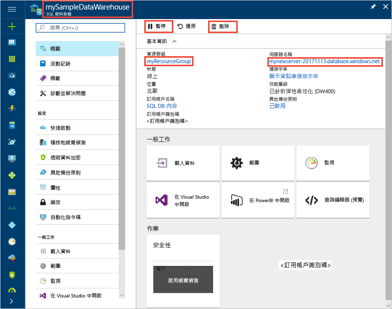

# 快速入門：在 Azure 入口網站中暫停與繼續 Azure SQL 資料倉儲的計算
使用 Azure 入口網站來暫停 Azure SQL 資料倉儲中的計算以節省成本。 在您準備好使用資料倉儲時[繼續計算](sql-data-warehouse-manage-compute-overview.md)。

如果您沒有 Azure 訂用帳戶，請在開始前建立[免費帳戶](https://azure.microsoft.com/free/)。

## 登入 Azure 入口網站

登入 [Azure 入口網站](https://portal.azure.com/)。

## 開始之前

使用[建立與連線 - 入口網站](create-data-warehouse-portal.md)來建立稱為 **mySampleDataWarehouse** 的資料倉儲。 

## 暫停計算
為了節省成本，您可以隨選暫停和繼續計算資源。 例如，如果您在夜間和週末不會使用資料庫，可以在這段時間暫停，並且在白天時繼續。 資料庫暫停時，系統將不會向您收取計算資源的費用。 不過，您仍需持續支付儲存體費用。 

遵循下列步驟來暫停 SQL 資料倉儲。

1. 在 Azure 入口網站的左側頁面中，按一下 [SQL 資料庫]。
2. 從 [SQL 資料庫] 頁面中，選取 [mySampleDataWarehouse]。 這會開啟資料倉儲。 
3. 在 [mySampleDataWarehouse] 頁面上，留意到 [狀態] 目前為 [上線]。

    

4. 若要暫停資料倉儲，請按一下 [暫停] 按鈕。 
5. 螢幕會出現詢問您是否要繼續的確認問題。 按一下 [是] 。
6. 請稍候片刻，並留意到 [狀態] 將變成 [正在暫停]。

    

7. 暫停作業完成後，狀態將會變成 [已暫停]，選項按鈕則會是 [啟動]。
8. 資料倉儲的計算資源功能現已離線。 在您繼續服務之前，將無需支付計算費用。

    

## 繼續計算
遵循下列步驟來繼續 SQL 資料倉儲。

1. 在 Azure 入口網站的左側頁面中，按一下 [SQL 資料庫]。
2. 從 [SQL 資料庫] 頁面中，選取 [mySampleDataWarehouse]。 這會開啟資料倉儲。 
3. 在 [mySampleDataWarehouse] 頁面上，留意到 [狀態] 目前為 [已暫停]。

    

4. 若要繼續資料倉儲，請按一下 [啟動]。 
5. 螢幕會出現詢問您是否要啟動的確認問題。 按一下 [是] 。
6. 留意到 [狀態] 將變成 [正在繼續]。

    

7. 資料倉儲再度上線時，狀態將會變成 [上線]，選項按鈕則會是 [暫停]。
8. 資料倉儲的計算資源現已上線，且您可以使用服務。 費用計算將繼續進行。

    

## 清除資源

您需為資料倉儲單位和儲存在資料倉儲中的資料付費。 這些計算和儲存體資源會分開計費。 

- 如果您想保留儲存體中的資料，請暫停計算。
- 如果您需要移除未來的費用，可以將資料倉儲刪除。 

遵循下列步驟，視需要清除資源。

1. 登入 [Azure 入口網站](https://portal.azure.com)，並按一下您的資料倉儲。

    

1. 若要暫停計算，請按一下 [暫停] 按鈕。 資料倉儲暫停時，您會看到 [啟動] 按鈕。  若要繼續計算，請按一下 [啟動]。

2. 若要移除資料倉儲，而不再支付計算或儲存體的費用，請按一下 [刪除]。

3. 若要移除您所建立的 SQL 伺服器，請按一下 [mynewserver 20171113.database.windows.net]，然後按一下 [刪除]。  請謹慎使用刪除，因為刪除伺服器也會刪除所有指派給伺服器的資料庫。

4. 若要移除此資源群組，請按一下 [myResourceGroup]，然後按一下 [刪除資源群組]。

## 後續步驟
您現已學會如何暫停與繼續資料倉儲的計算。 若要深入了解 Azure SQL 資料倉儲，請繼續進行載入資料的教學課程。

> [!div class="nextstepaction"]
>[將資料載入 SQL 資料倉儲](load-data-from-azure-blob-storage-using-polybase.md)
