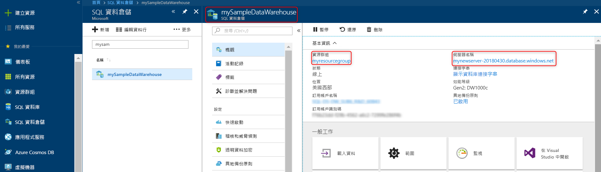

# <a name="quickstart-scale-compute-in-azure-sql-data-warehouse-in-powershell"></a>快速入門：在 PowerShell 中調整 Azure SQL 資料倉儲中的計算

在 PowerShell 中調整 Azure SQL 資料倉儲中的計算。 [相應放大計算](sql-data-warehouse-manage-compute-overview.md)以提升效能，或將計算調整回來以節省成本。

如果您沒有 Azure 訂用帳戶，請在開始前建立[免費帳戶](https://azure.microsoft.com/free/)。

本教學課程需要 Azure PowerShell 模組 5.1.1 版或更新版本。 執行 `Get-Module -ListAvailable AzureRM` 以尋找您目前擁有的版本。 如果您需要安裝或升級，請參閱[安裝 Azure PowerShell 模組](/powershell/azure/install-azurerm-ps.md)。

## <a name="before-you-begin"></a>開始之前

本快速入門假設您已有可調整的 SQL 資料倉儲。 若您需要建立 SQL 資料倉儲，請使用[建立與連線 - 入口網站](create-data-warehouse-portal.md)來建立稱為 **mySampleDataWarehouse** 的資料倉儲。

## <a name="log-in-to-azure"></a>登入 Azure

使用 [Connect-AzureRmAccount](/powershell/module/azurerm.profile/connect-azurermaccount) 命令登入 Azure 訂用帳戶並遵循畫面上的指示。

```powershell
Connect-AzureRmAccount
```

若要查看您正在使用的訂用帳戶，請執行 [Get AzureRmSubscription](/powershell/module/azurerm.profile/get-azurermsubscription)。

```powershell
Get-AzureRmSubscription
```

若要使用不同於預設值的訂用帳戶，請執行 [Select-AzureRmSubscription](/powershell/module/azurerm.profile/select-azurermsubscription)。

```powershell
Select-AzureRmSubscription -SubscriptionName "MySubscription"
```

## <a name="look-up-data-warehouse-information"></a>查詢資料倉儲資訊

找出您計畫暫停與繼續之資料倉儲的資料庫名稱、伺服器名稱和資源群組。

遵循下列步驟來尋找您資料倉儲的位置資訊。

1. 登入 [Azure 入口網站](https://portal.azure.com/)。
2. 在 Azure 入口網站的左側頁面中，按一下 [SQL 資料倉儲]。
3. 從 [SQL 資料倉儲] 頁面中，選取 [mySampleDataWarehouse]。 這會開啟資料倉儲。

    

4. 記下資料倉儲名稱，這將作為資料庫名稱使用。 請記住，資料倉儲是一種資料庫。 也請記下伺服器名稱與資源群組。 您將會在暫停與繼續命令中使用它們。
5. 如果您的伺服器是 foo.database.windows.net，請只在 PowerShell Cmdlet 中使用其第一個部分作為伺服器名稱。 在上述映像中，完整伺服器名稱是 newserver 20171113.database.windows.net。 我們會在 PowerShell Cmdlet 中使用 **newserver-20180430** 作為伺服器名稱。

## <a name="scale-compute"></a>調整計算

在 SQL 資料倉儲中，您可以藉由調整資料倉儲單位來增加或減少計算資源。 [建立與連線 - 入口網站](create-data-warehouse-portal.md)已建立 **mySampleDataWarehouse**，並以 400 DWU 加以初始化。 下列步驟會調整 **mySampleDataWarehouse** 的 DWU。

若要變更資料倉儲單位，請使用 [Set-AzureRmSqlDatabase](/powershell/module/azurerm.sql/set-azurermsqldatabase) PowerShell Cmdlet。 下列範例將資料庫 **mySampleDataWarehouse** 的資料倉儲單位設定為 DW300，此資料庫裝載於伺服器 **mynewserver-20180430** 上的資源群組 **myResourceGroup** 中。

```Powershell
Set-AzureRmSqlDatabase -ResourceGroupName "myResourceGroup" -DatabaseName "mySampleDataWarehouse" -ServerName "mynewserver-20171113" -RequestedServiceObjectiveName "DW300"
```

## <a name="check-data-warehouse-state"></a>檢查資料倉儲狀態

若要查看資料倉儲的目前狀態，請使用 [Get-AzureRmSqlDatabase](/powershell/module/azurerm.sql/get-azurermsqldatabase) PowerShell Cmdlet。 這會取得資源群組 **myResourceGroup** 和伺服器 **mynewserver-20180430.database.windows.net** 中 **mySampleDataWarehouse** 資料庫的狀態。

```powershell
$database = Get-AzureRmSqlDatabase -ResourceGroupName myResourceGroup -ServerName mynewserver-20171113 -DatabaseName mySampleDataWarehouse
$database
```

這會導致如以下的結果：

```powershell
ResourceGroupName             : myResourceGroup
ServerName                    : mynewserver-20171113
DatabaseName                  : mySampleDataWarehouse
Location                      : North Europe
DatabaseId                    : 34d2ffb8-b70a-40b2-b4f9-b0a39833c974
Edition                       : DataWarehouse
CollationName                 : SQL_Latin1_General_CP1_CI_AS
CatalogCollation              :
MaxSizeBytes                  : 263882790666240
Status                        : Online
CreationDate                  : 11/20/2017 9:18:12 PM
CurrentServiceObjectiveId     : 284f1aff-fee7-4d3b-a211-5b8ebdd28fea
CurrentServiceObjectiveName   : DW300
RequestedServiceObjectiveId   : 284f1aff-fee7-4d3b-a211-5b8ebdd28fea
RequestedServiceObjectiveName :
ElasticPoolName               :
EarliestRestoreDate           :
Tags                          :
ResourceId                    : /subscriptions/xxxxxxxx-xxxx-xxxx-xxxx-xxxxxxxxxxxx/
                                resourceGroups/myResourceGroup/providers/Microsoft.Sql/servers/mynewserver-20171113/databases/mySampleDataWarehouse
CreateMode                    :
ReadScale                     : Disabled
ZoneRedundant                 : False
```

您可以在輸出中查看資料庫的 **Status**。 在此情況下，您會看到此資料庫已上線。  當您執行此命令時，應該會收到下列其中一個 Status (狀態) 值：Online (上線)、Pausing (暫停中)、Resuming (正在恢復)、Scaling (正在調整) 或 Paused (已暫停)。

若要單獨查看狀態，請使用下列命令：

```powershell
$database | Select-Object DatabaseName,Status
```

## <a name="next-steps"></a>後續步驟
您現已了解如何調整資料倉儲的計算。 若要深入了解 Azure SQL 資料倉儲，請繼續進行載入資料的教學課程。

> [!div class="nextstepaction"]
>[將資料載入 SQL 資料倉儲](load-data-from-azure-blob-storage-using-polybase.md)
