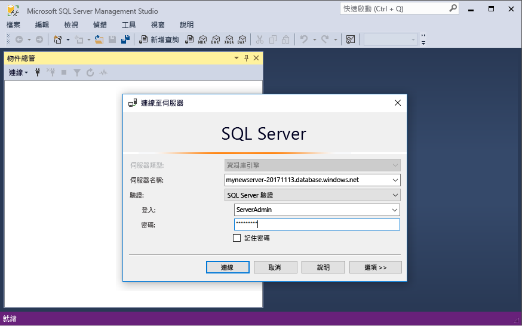
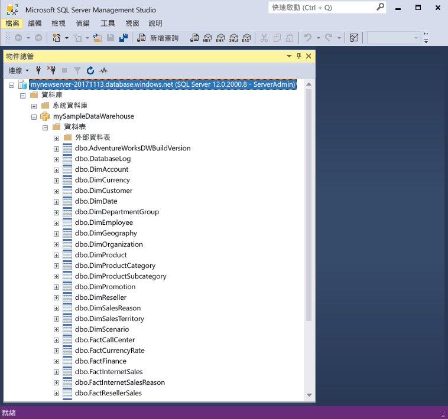

# <a name="quickstart-scale-compute-in-azure-sql-data-warehouse-using-t-sql"></a>快速入門：使用 T-SQL 調整 Azure SQL 資料倉儲中的計算

使用 T-SQL 和 SQL Server Management Studio (SSMS) 調整 Azure SQL 資料倉儲中的計算。 [相應放大計算](sql-data-warehouse-manage-compute-overview.md)以提升效能，或將計算調整回來以節省成本。 

如果您沒有 Azure 訂用帳戶，請在開始前建立[免費帳戶](https://azure.microsoft.com/free/) 。

## <a name="before-you-begin"></a>開始之前

下載並安裝最新版的 [SQL Server Management Studio](/sql/ssms/download-sql-server-management-studio-ssms.md) (SSMS)。

本文假設您已完成[快速入門：建立與連線 - 入口網站](create-data-warehouse-portal.md)。 完成「建立與連線」快速入門後，您就會知道如何連線至：建立名為 **mySampleDataWarehouse** 的資料倉儲，建立防火牆規則來允許用戶端存取已安裝的伺服器。
 
## <a name="create-a-data-warehouse"></a>建立資料倉儲

使用[快速入門：建立與連線 - 入口網站](create-data-warehouse-portal.md)來建立稱為 **mySampleDataWarehouse** 的資料倉儲。 完成快速入門以確定您擁有防火牆規則，並可從 SQL Server Management Studio 內連線到資料倉儲。

## <a name="connect-to-the-server-as-server-admin"></a>以伺服器系統管理員身分連線到伺服器

本節使用 [SQL Server Management Studio](/sql/ssms/download-sql-server-management-studio-ssms.md) (SSMS) 建立對 Azure SQL Server 的連線。

1. 開啟 SQL Server Management Studio。

2. 在 [連接到伺服器] 對話方塊中，輸入下列資訊：

   | 設定       | 建議的值 | 說明 | 
   | ------------ | ------------------ | ------------------------------------------------- | 
   | 伺服器類型 | 資料庫引擎 | 這是必要值 |
   | 伺服器名稱 | 完整伺服器名稱 | 範例如下：**mynewserver-20171113.database.windows.net**。 |
   | 驗證 | SQL Server 驗證 | SQL 驗證是本教學課程中設定的唯一驗證類型。 |
   | 登入 | 伺服器管理帳戶 | 這是您在建立伺服器時所指定的帳戶。 |
   | 密碼 | 伺服器管理帳戶的密碼 | 這是您在建立伺服器時所指定的密碼。 |

    

4. 按一下 [ **連接**]。 [物件總管] 視窗隨即在 SSMS 中開啟。 

5. 在 [物件總管] 中，展開 [資料庫]。 然後展開 [mySampleDatabase] 可檢視新資料庫中的物件。

     

## <a name="view-service-objective"></a>檢視服務目標
服務目標設定包含資料倉儲的資料倉儲單位數目。 

若要檢視資料倉儲目前的資料倉儲單位：

1. 在 **mynewserver-20171113.database.windows.net** 的連線下，展開 [系統資料庫]。
2. 以滑鼠右鍵按一下 [主要]，然後選取 [新增查詢]。 新的查詢視窗隨即開啟。
3. 執行下列查詢，以從 sys.database_service_objectives 動態管理檢視中選取。 

    ```sql
    SELECT
        db.name [Database]
    ,   ds.edition [Edition]
    ,   ds.service_objective [Service Objective]
    FROM
        sys.database_service_objectives ds
    JOIN
        sys.databases db ON ds.database_id = db.database_id
    WHERE 
        db.name = 'mySampleDataWarehouse'
    ```

4. 下列結果顯示 **mySampleDataWarehouse** 具有 DW400 的服務目標。 

    


## <a name="scale-compute"></a>調整計算
在 SQL 資料倉儲中，您可以藉由調整資料倉儲單位來增加或減少計算資源。 [建立與連線 - 入口網站](create-data-warehouse-portal.md)已建立 **mySampleDataWarehouse**，並以 400 DWU 加以初始化。 下列步驟會調整 **mySampleDataWarehouse** 的 DWU。

若要變更資料倉儲單位：

1. 以滑鼠右鍵按一下 [主要]，然後選取 [新增查詢]。
2. 使用 [ALTER DATABASE](/sql/t-sql/statements/alter-database-azure-sql-database) T-SQL 陳述式來修改服務目標。 執行下列查詢，將服務目標變更為 DW300。 

```Sql
ALTER DATABASE mySampleDataWarehouse
MODIFY (SERVICE_OBJECTIVE = 'DW300')
;
```

## <a name="check-data-warehouse-state"></a>檢查資料倉儲狀態

當資料倉儲暫停時，您無法使用 T-SQL 與其連線。 若要查看資料倉儲的目前狀態，您可以使用 PowerShell Cmdlet。 如需範例，請參閱[檢查資料倉儲狀態 - Powershell](quickstart-scale-compute-powershell.md#check-data-warehouse-state)。 

## <a name="check-operation-status"></a>檢查作業狀態

若要傳回針對 SQL 資料倉儲所進行之各種管理作業的相關資訊，請對 [sys.dm_operation_status](/sql/relational-databases/system-dynamic-management-views/sys-dm-operation-status-azure-sql-database) DMV 執行下列查詢。 例如，它會傳回作業和作業狀態 (會是 IN_PROGRESS 或 COMPLETED)。

```sql
SELECT *
FROM
    sys.dm_operation_status
WHERE
    resource_type_desc = 'Database'
AND 
    major_resource_id = 'MySQLDW'
```


## <a name="next-steps"></a>後續步驟
您現已了解如何調整資料倉儲的計算。 若要深入了解 Azure SQL 資料倉儲，請繼續進行載入資料的教學課程。

> [!div class="nextstepaction"]
>[將資料載入 SQL 資料倉儲](load-data-from-azure-blob-storage-using-polybase.md)
