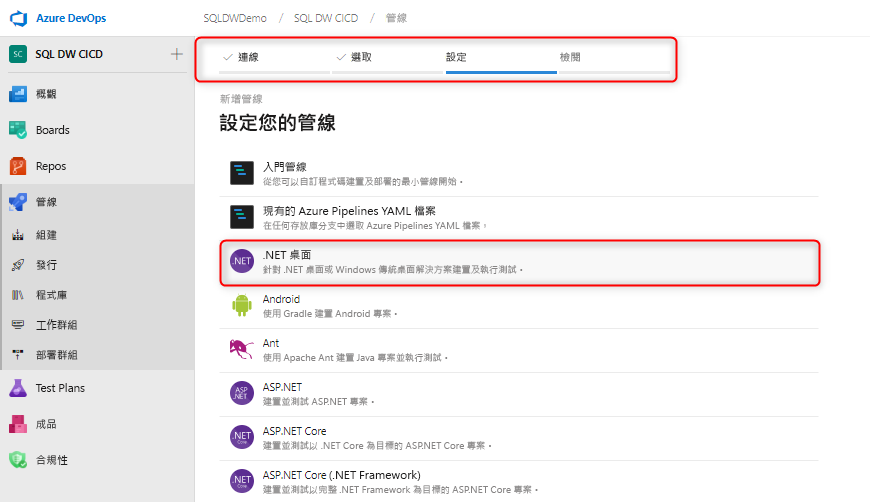
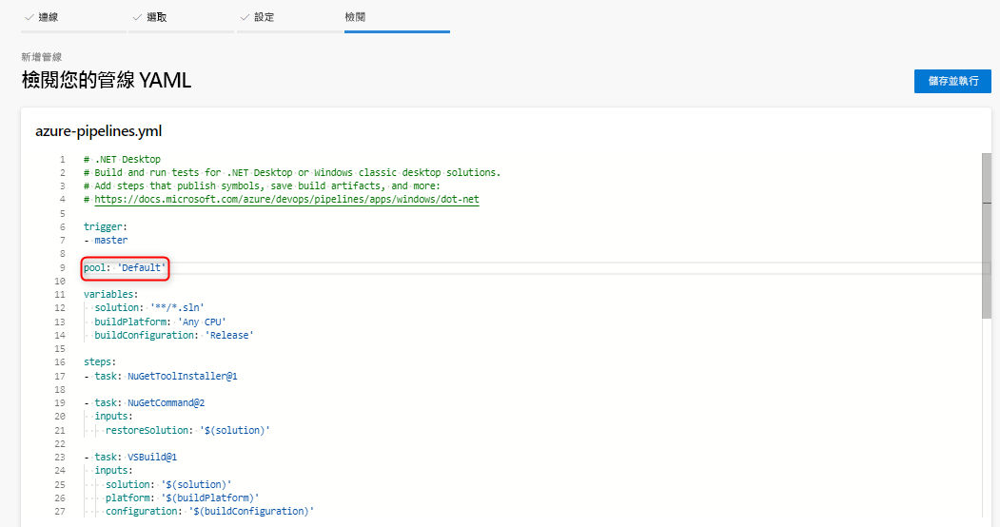
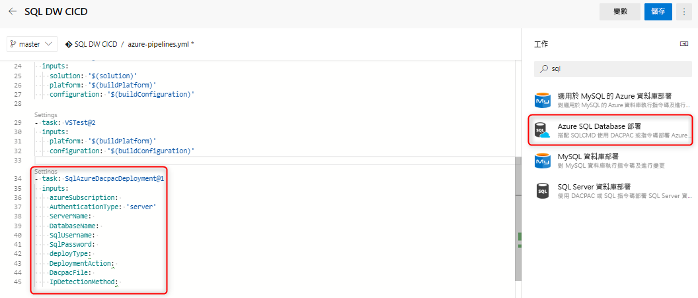
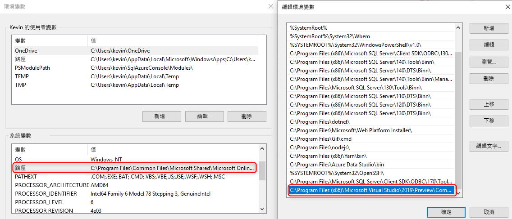

# 適用於 Azure SQL 資料倉儲的持續整合和部署

此簡易教學課程會概述如何將您的 SQL Server Data tools (SSDT) 資料庫專案與 Azure DevOps 整合，並運用 Azure Pipelines 來設定持續整合及部署。 本教學課程是使用 SQL 資料倉儲建立持續整合和部署管線的第二個步驟。 

## 開始之前

- 請檢閱[原始檔控制整合教學課程](https://docs.microsoft.com/azure/sql-data-warehouse/sql-data-warehouse-source-control-integration)

- 建立[自我裝載式代理程式](https://docs.microsoft.com/azure/devops/pipelines/agents/agents?view=azure-devops#install)，其中已安裝適用於 SQL 資料倉儲 (預覽版) 的 SSDT 預覽位元版 (16.3 preview 2 及更高版本)

- 設定及連線至 Azure DevOps

  > [!NOTE]
  > SSDT 目前為預覽狀態，因此您需要利用自我裝載式代理程式。 Microsoft 裝載的代理程式會在接下來的幾個月內更新。

## 與 Visual Studio 組建持續整合

1. 瀏覽至 Azure Pipelines 並建立新的建置管線

      

2. 選取您的原始程式碼存放庫 (Azure Repos Git)，然後選取 .NET 桌面應用程式範本

       

3. 編輯您的 YAML 檔案，以使用適當的代理程式集區。 YAML 檔案應該會看起來像這樣：

      

此時，您會有一個簡單的環境，而原始檔控制存放庫主要分支的任何簽入，都應該會在資料庫專案中觸發成功的 Visual Studio 組建。 若要驗證自動化是否以端對端的方式運作，您可以在本機資料庫專案中進行變更，並將該變更簽入至您的主要分支。

## 使用 Azure SQL Database 部署工作進行持續部署

1. 使用 [Azure SQL Database 部署工作](https://docs.microsoft.com/azure/devops/pipelines/tasks/deploy/sql-azure-dacpac-deployment?view=azure-devops)加入新的工作，並填寫必要欄位，即可連線到您的目標資料倉儲。 當此工作執行時，從先前建置程序產生的 DACPAC 就會部署到目標資料倉儲。

      

2. 使用自我裝載式代理程式時，請確定您已將環境變數設定為使用 SQL 資料倉儲適用的 SqlPackage.exe。 路徑應該會看起來像這樣：

      

   C:\Program Files (x86)\Microsoft Visual Studio\2019\Preview\Common7\IDE\Extensions\Microsoft\SQLDB\DAC\150  

   執行及驗證您的管線。 您可以在本機進行變更，並將變更簽入原始檔控制，以產生自動建置和部署。

## 後續步驟

- 探索 [Azure SQL 資料倉儲架構](/azure/sql-data-warehouse/massively-parallel-processing-mpp-architecture)
- 快速[建立 SQL 資料倉儲][create a SQL Data Warehouse]
- [載入範例資料][load sample data]。
- 探索[影片](/azure/sql-data-warehouse/sql-data-warehouse-videos)

<!--Image references-->

[1]: ./media/sql-data-warehouse-overview-what-is/dwarchitecture.png

<!--Article references-->
[Create a support ticket]: ./sql-data-warehouse-get-started-create-support-ticket.md
[load sample data]: ./sql-data-warehouse-load-sample-databases.md
[create a SQL Data Warehouse]: ./sql-data-warehouse-get-started-provision.md
[Migration documentation]: ./sql-data-warehouse-overview-migrate.md
[SQL Data Warehouse solution partners]: ./sql-data-warehouse-partner-business-intelligence.md
[Integrated tools overview]: ./sql-data-warehouse-overview-integrate.md
[Backup and restore overview]: ./sql-data-warehouse-restore-database-overview.md
[Azure glossary]: ../azure-glossary-cloud-terminology.md

<!--MSDN references-->

<!--Other Web references-->
[Blogs]: https://azure.microsoft.com/blog/tag/azure-sql-data-warehouse/
[Customer Advisory Team blogs]: https://blogs.msdn.microsoft.com/sqlcat/tag/sql-dw/
[Feature requests]: https://feedback.azure.com/forums/307516-sql-data-warehouse
[MSDN forum]: https://social.msdn.microsoft.com/Forums/azure/home?forum=AzureSQLDataWarehouse
[Stack Overflow forum]: https://stackoverflow.com/questions/tagged/azure-sqldw
[Twitter]: https://twitter.com/hashtag/SQLDW
[Videos]: https://azure.microsoft.com/documentation/videos/index/?services=sql-data-warehouse
[SLA for SQL Data Warehouse]: https://azure.microsoft.com/support/legal/sla/sql-data-warehouse/v1_0/
[Volume Licensing]: https://www.microsoftvolumelicensing.com/DocumentSearch.aspx?Mode=3&DocumentTypeId=37
[Service Level Agreements]: https://azure.microsoft.com/support/legal/sla/
