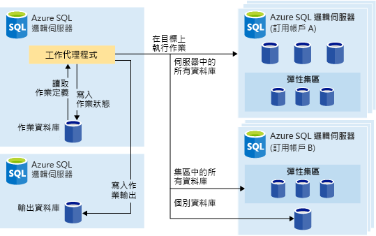
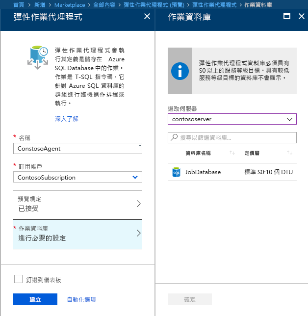
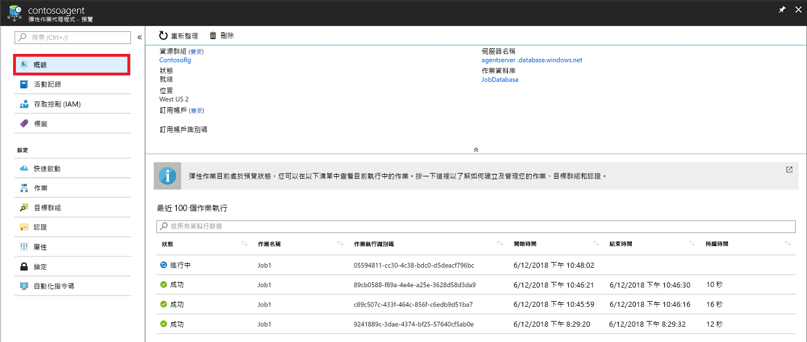

# <a name="manage-groups-of-databases-with-elastic-database-jobs"></a>使用彈性資料庫作業管理資料庫群組

**彈性資料庫作業**提供依照排程或需求，跨越大量資料庫平行執行一或多個 T-SQL 指令碼的功能。

**對任何資料庫組合執行作業**：一或多個個別的資料庫、伺服器上的所有資料庫、彈性集區中的所有資料庫，或 shardmap，具有額外彈性可納入或排除任何特定資料庫。 **作業可以跨越多部伺服器、多個集區執行，甚至可以針對不同訂用帳戶中的資料庫執行。** 伺服器和集區都會以動態方式列舉在執行階段，因此作業會針對在執行階段存在於目標群組的所有資料庫執行。

下圖顯示跨不同類型的目標群組執行作業的作業代理程式：




## <a name="why-use-elastic-jobs"></a>為何使用彈性作業？

### <a name="manage-many-databases"></a>管理許多資料庫

- 將系統管理作業排定為每個工作天、下班時間等執行。
- 部署結構描述變更、認證管理、效能資料收集或租用戶 (客戶) 遙測收集。 更新參考資料 (所有資料庫通用的資訊)。
- 重建索引以提升查詢效能。 將作業設定為以週期性基礎跨資料庫的集合執行，例如在離峰時段。
- 以持續執行的基礎從一組資料庫將查詢結果收集至中央資料表。 效能查詢可以持續執行，並設定為觸發要執行的其他作業。

### <a name="collect-data-for-reporting"></a>收集資料以供報告

- 將 Azure SQL 資料庫集合中的資料彙總到單一目的地資料表中。
- 跨大型資料庫集合執行較長的執行資料處理查詢，例如客戶遙測的集合。 結果會收集到單一目的地資料表做進一步的分析。

### <a name="reduce-overhead"></a>減少額外負荷

- 通常，您必須個別連接到每個資料庫，以執行 Transact-SQL 陳述式或執行其他管理工作。 工作會處理登入目標群組中每個資料庫的工作。 您也要定義、維護及保存要在 Azure SQL 資料庫群組中執行的 Transact-SQL 指令碼。

### <a name="accounting"></a>會計

- 作業會記錄每個資料庫的執行狀態。 失敗時也會自動重試。

### <a name="flexibility"></a>彈性

- 定義 Azure SQL 資料庫的自訂群組，並定義排程以執行作業。


## <a name="elastic-job-components"></a>彈性作業元件

|元件  | 描述 (其他詳細資料位於表格下方) |
|---------|---------|
|[**彈性作業代理程式**](#elastic-job-agent) |  您建立用來執行和管理作業的 Azure 資源。   |
|[**作業資料庫**](#job-database)    |    作業代理程式用來儲存作業相關資料、作業定義等的 Azure SQL Database。      |
|[**目標群組**](#target-group)      |  要執行作業的伺服器、集區、資料庫和分區對應集合。       |
|[**作業**](#job)  |  作業是組成一或多個[作業步驟](#job-step)的工作單位。 作業步驟可指定要執行的 T-SQL 指令碼，以及執行指令碼所需的其他詳細資料。  |


### <a name="elastic-job-agent"></a>彈性作業代理程式

彈性作業代理程式是用於建立、執行和管理作業的 Azure 資源。 彈性作業代理程式是您在入口網站中建立的 Azure 資源 (也支援 [PowerShell](elastic-jobs-powershell.md) 和 REST)。 

建立**彈性作業代理程式**時需要現有的 SQL 資料庫。 此代理程式會將這個現有資料庫設定為[作業資料庫](#job-database)。

彈性作業代理程式是免費的。 作業資料庫與任何 SQL 資料庫的費率相同。

### <a name="job-database"></a>作業資料庫

「作業資料庫」用於定義作業以及追蹤作業執行的狀態與歷程記錄。 *作業資料庫*也用來儲存代理程式中繼資料、記錄、結果、作業定義，也包含許多有用的預存程序和其他資料庫物件，以便使用 T-SQL 建立、執行和管理作業。

對於目前的預覽，需要現有的 Azure SQL Database (S0 或更高版本) 才能建立彈性作業代理程式。

「作業資料庫」不一定要是新的，但應該是乾淨、空白、 S0 或更高的服務層。 「作業資料庫」的建議服務層為 S1 或更高版本，但實際上取決於作業的效能需求：作業步驟數、作業的執行次數和頻率。 例如，若為每小時執行少量作業的作業代理程式，S0 資料庫可能就已足夠，但是每分鐘執行一項作業時效能不足，更高的服務層可能比較適合。


#### <a name="job-database-permissions"></a>作業資料庫權限

在作業代理程式建立期間，會在「作業資料庫」中建立結構描述、資料表，以及名為 jobs_reader 的角色。 此角色會具有下列權限，而且旨在賦予系統管理員更細微的存取控制以便監視作業：


|角色名稱  |'jobs' 結構描述權限  |'jobs_internal' 結構描述權限  |
|---------|---------|---------|
|**jobs_reader**     |    SELECT     |    None     |

> [!IMPORTANT]
> 在以資料庫管理員身分授與「作業資料庫」存取權之前，請考慮安全性含意。 有權建立或編輯作業的惡意使用者可以建立或編輯一項作業，該作業使用預存認證來連線到惡意使用者所掌控的資料庫，這可讓惡意使用者決定認證的密碼。


### <a name="target-group"></a>目標群組

「目標群組」可定義一組將會執行某個作業步驟的資料庫。 目標群組可以包含下列各項的任意組合：

- **Azure SQL Server** - 如果未指定伺服器，則在作業執行階段存在於伺服器中的所有資料庫都是群組的一部分。 必須提供 master 資料庫認證，才能在作業執行之前列舉並更新群組。
- **彈性集區** - 如果已指定彈性集區，則在作業執行階段彈性集區中的所有資料庫都是群組的一部分。 針對伺服器，必須提供 master 資料庫認證，才能在作業執行之前更新群組。
- **單一資料庫** - 將一或多個個別資料庫指定為群組的一部分。
- **Shardmap** - Shardmap 的資料庫。

> [!TIP]
> 在執行作業時，「動態列舉」會重新評估包含伺服器或集區的目標群組中的資料庫集合。 動態列舉可確保**作業會在執行階段跨越伺服器或集區中所有現有的資料庫執行**。 在執行階段重新評估資料庫清單特別適用於集區或伺服器成員資格經常變更的案例。

您可以將集區與單一資料庫指定為在群組中包含或排除。 這能夠建立含有任意資料庫組合的目標群組。 例如，您可以將伺服器新增至目標群組，但是在彈性集區中排除特定資料庫 (或排除整個集區)。

目標群組可以包含多個訂用帳戶中的資料庫，而且橫跨多個區域。 請注意，跨區域執行比在同區域內執行的延遲較高。

下列範例顯示當作業執行時，不同目標群組定義是如何以動態方式列舉的，進而決定作業將執行哪些資料庫：


**範例 1** 顯示由一系列個別資料庫組成的目標群組。 當使用這個目標群組來執行作業步驟時，作業步驟的動作將會在其中每一個資料庫中執行。<br>
**範例 2** 顯示包含以 Azure SQL Server 作為目標的目標群組。 當使用這個目標群組來執行作業步驟時，伺服器會以動態方式列舉，以決定目前在伺服器中的資料庫清單。 作業步驟的動作會在其中每個資料庫中執行。<br>
**範例 3** 顯示與*範例 2* 類似的目標群組，但特別排除個別資料庫。 作業步驟的動作「不會」在排除的資料庫中執行。<br>
**範例 4** 顯示包含以彈性集區作為目標的目標群組。 類似於*範例 2*，集區會在作業執行時間以動態方式列舉，以決定集區中的資料庫清單。
<br><br>


**範例 5** 和*範例 6* 顯示進階案例，其中 Azure SQL 伺服器、彈性集區和資料庫都可使用包含及排除規則來結合。<br>
**範例 7** 顯示分區對應中的分區也可在作業執行階段進行評估。

### <a name="job"></a>工作 (Job)

「作業」是依照排程執行的工作單位，或為一次性作業。 一項作業包含一或多個「作業步驟」。

#### <a name="job-step"></a>作業步驟

每個作業步驟都會指定要執行的 T-SQL 指令碼、要執行 T-SQL 指令碼的一或多個目標群組，以及作業代理程式連線到目標資料庫所需的認證。 每個作業步驟都有可自訂的逾時和重試原則，而且可以選擇性地指定輸出參數。

#### <a name="job-output"></a>作業輸出

每個目標資料庫上的作業步驟結果都會詳加記錄，而且可以將指令碼輸出擷取至指定的資料表。 您可以指定要儲存作業所傳回資料的資料庫。

#### <a name="job-history"></a>作業歷程記錄

作業執行歷程記錄會儲存在「作業資料庫」中。 系統清理作業會清除留存超過 45 天的執行歷程記錄。 若要移除留存少於 45 天的歷程記錄，請在「作業資料庫」中呼叫 **sp_purge_history** 預存程序。

## <a name="workflow-to-create-configure-and-manage-jobs"></a>用來建立、設定和管理作業的工作流程

### <a name="create-and-configure-the-agent"></a>建立和設定代理程式

1. 建立或識別空的 S0 或更高版本的 SQL 資料庫。 這會當作在彈性作業代理程式建立期間的「作業資料庫」使用。
2. 在[入口網站](https://portal.azure.com/#create/Microsoft.SQLElasticJobAgent)中，或使用 [PowerShell](elastic-jobs-powershell.md#create-the-elastic-job-agent) 建立彈性作業代理程式。

   

### <a name="create-run-and-manage-jobs"></a>建立、執行和管理作業

1. 使用 [PowerShell](elastic-jobs-powershell.md#create-job-credentials-so-that-jobs-can-execute-scripts-on-its-targets) 或 [T-SQL](elastic-jobs-tsql.md#create-a-credential-for-job-execution) 建立認證，以便在「作業資料庫」中執行作業。
2. 使用 [PowerShell](elastic-jobs-powershell.md#define-the-target-databases-you-want-to-run-the-job-against) 或 [T-SQL](elastic-jobs-tsql.md#create-a-target-group-servers) 定義目標群組 (您想要執行作業的資料庫)。
3. 在將要執行作業的每個資料庫中建立作業代理程式認證 [(將使用者 (或角色) 新增至群組中的每個資料庫)](https://docs.microsoft.com/azure/sql-database/sql-database-control-access)。 如需範例，請參閱 [PowerShell 教學課程](elastic-jobs-powershell.md#create-job-credentials-so-that-jobs-can-execute-scripts-on-its-targets)。
4. 使用 [PowerShell](elastic-jobs-powershell.md#create-a-job) 或 [T-SQL](elastic-jobs-tsql.md#deploy-new-schema-to-many-databases) 建立作業。
5. 使用 [PowerShell](elastic-jobs-powershell.md#create-a-job-step) 或 [T-SQL](elastic-jobs-tsql.md#deploy-new-schema-to-many-databases) 新增作業步驟。
6. 使用 [PowerShell](elastic-jobs-powershell.md#run-the-job) 或 [T-SQL](elastic-jobs-tsql.md#begin-ad-hoc-execution-of-a-job) 執行作業。
7. 使用入口網站、[PowerShell](elastic-jobs-powershell.md#monitor-status-of-job-executions) 或 [T-SQL](elastic-jobs-tsql.md#monitor-job-execution-status) 監視作業執行狀態。

   

## <a name="credentials-for-running-jobs"></a>用於執行作業的認證

作業會在執行時使用[資料庫範圍認證](/sql/t-sql/statements/create-database-scoped-credential-transact-sql)來連線到目標群組所指定的資料庫。 如果目標群組包含伺服器或集區，這些資料庫範圍認證可用來連線到 master 資料庫，進而列舉可用的資料庫。

設定適當的認證來執行作業，可能會有點混淆，因此請牢記下列要點：

- 必須在「作業資料庫」中建立資料庫範圍認證。
- **所有目標資料庫都必須具有登入，而且[足夠的權限](https://docs.microsoft.com/sql/relational-databases/security/permissions-database-engine)，才能順利完成作業** (下圖中的 jobuser)。
- 認證應重複使用於各項作業中，而認證密碼會經過加密並受到保護，以免具有作業物件唯讀權限的使用者使用。

下圖設計用來協助了解及設定適當的作業認證。 **請記得在每個需要執行作業的資料庫 (所有「目標使用者資料庫」) 中建立使用者**。


## <a name="security-best-practices"></a>安全性最佳作法

處理彈性作業有幾個最佳做法考量：

- 將 API 的使用限制為受信任的個人。
- 認證應該具有執行作業步驟所需的最低權限。 如需其他資訊，請參閱 [SQL Server 中的授權和權限](https://docs.microsoft.com/dotnet/framework/data/adonet/sql/authorization-and-permissions-in-sql-server)。
- 使用伺服器和/或集區目標群組的成員時，強烈建議建立個別的認證，而該認證具有 master 資料庫的權限，可在作業執行前檢視/列出用來擴充伺服器和/或集區的資料庫清單。


## <a name="agent-performance-capacity-and-limitations"></a>代理程式效能、容量和限制

彈性作業在等待長時間執行的作業完成時，會使用最少的運算資源。

視資料庫的目標群組大小和作業所需的執行時間 (並行背景工作數目) 而定，代理程式需要不同的計算量和「作業資料庫」效能 (目標愈多和作業數目較高，所需的計算量就愈高)。

預覽版本目前受限於 100 個並行作業。

### <a name="prevent-jobs-from-reducing-target-database-performance"></a>避免作業降低目標資料庫效能

若要確保在對 SQL 彈性集區中的資料庫執行作業時，資源不會負擔過重，則可以設定作業來限制作業可以同時執行的資料庫數目。

##  <a name="differences-between-elastic-jobs-and-sql-server-agent"></a>彈性作業與 SQL Server Agent 之間的差異

值得注意的是 SQL Server 代理程式 (可用於內部部署且作為 SQL Database 受控執行個體的一部分) 與 Azure SQL Database 彈性作業代理程式 (現在適用於 SQL Database 和 SQL 資料倉儲) 之間的差異。


|  |彈性作業  |SQL Server 代理程式 |
|---------|---------|---------|
|影響範圍     |  與作業代理程式位於相同 Azure 雲端中任何數目的 Azure SQL 資料庫和/或資料倉儲。 目標可以位於不同的邏輯伺服器、訂用帳戶和/或區域。 <br><br>目標群組可由個別資料庫或資料倉儲，或伺服器、集區或 shardmap 中的所有資料庫所組成 (在作業執行階段以動態方式列舉)。 | 與 SQL 代理程式位於相同 SQL Server 執行個體中的任何單一資料庫。 |
|支援的 API 和工具     |  入口網站、PowerShell、T-SQL、Azure Resource Manager      |   T-SQL、SQL Server Management Studio (SSMS)     |


## <a name="best-practices-for-creating-jobs"></a>建立作業的最佳做法

### <a name="idempotent-scripts"></a>等冪指令碼
作業的 T-SQL 指令碼必須[具有等冪性](https://en.wikipedia.org/wiki/Idempotence)。 **等冪**表示如果指令碼成功，而且再次執行，就會出現相同的結果。 指令碼可能會因為暫時性網路問題而失敗。 在此情況下，工作會自動重新執行指令碼，達到預設的次數才會停止。 即使等冪指令碼已成功執行兩次 (或更多次)，仍會有相同的結果。

簡單的策略是在建立物件之前，測試其是否存在。


```sql
IF NOT EXIST (some_object)
    -- Create the object
    -- If it exists, drop the object before recreating it.
```

同樣地，指令碼必須以邏輯方式測試並反駁它所找到的任何條件，才能夠順利執行。


## <a name="next-steps"></a>後續步驟

- [使用 PowerShell 建立及管理彈性作業](elastic-jobs-powershell.md)
- [使用 Transact-SQL (T-SQL) 來建立及管理彈性作業](elastic-jobs-tsql.md)