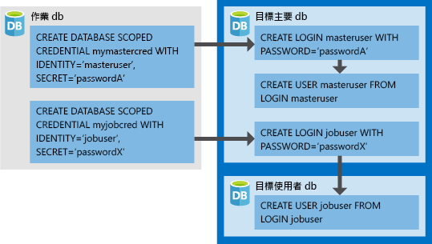

# <a name="create-an-elastic-job-agent-using-powershell"></a>使用 PowerShell 建立彈性作業代理程式

[彈性作業](elastic-jobs-overview.md)可讓您以平行方式跨多個資料庫執行一或多個 Transact-SQL (T-SQL) 指令碼。

在本教學課程中，您將了解跨多個資料庫執行查詢所需的步驟：

> [!div class="checklist"]
> * 建立彈性工作代理程式
> * 建立作業認證，讓作業可在其目標上執行指令碼
> * 定義您要對其執行作業的目標 (伺服器、彈性集區、資料庫、分區對應)
> * 在目標資料庫中建立資料庫範圍認證，讓代理程式可連接及執行作業
> * 建立工作
> * 將作業步驟新增至作業
> * 開始執行作業
> * 監視作業

## <a name="prerequisites"></a>必要條件

如果您還沒有 Azure 訂用帳戶，請在開始之前先[建立免費帳戶](https://azure.microsoft.com/free/)。

安裝 **AzureRM.Sql** 4.8.1 預覽模組，以取得最新的彈性作業 Cmdlet。 在 PowerShell 中以系統管理存取權執行下列命令。

```powershell
# Installs the latest PackageManagement powershell package which PowershellGet v1.6.5 is dependent on
Find-Package PackageManagement -RequiredVersion 1.1.7.2 | Install-Package -Force

# Installs the latest PowershellGet module which adds the -AllowPrerelease flag to Install-Module
Find-Package PowerShellGet -RequiredVersion 1.6.5 | Install-Package -Force

# Restart your powershell session with administrative access

# Places AzureRM.Sql preview cmdlets side by side with existing AzureRM.Sql version
Install-Module -Name AzureRM.Sql -AllowPrerelease -RequiredVersion 4.8.1-preview -Force

# Import the AzureRM.Sql 4.8.1 module
Import-Module AzureRM.Sql -RequiredVersion 4.8.1

# Confirm if module successfully imported - if the imported version is 4.8.1, then continue
Get-Module AzureRM.Sql
```

## <a name="create-required-resources"></a>建立所需的資源

要建立彈性作業代理程式，必須要有作為[作業資料庫](elastic-jobs-overview.md#job-database)的資料庫 (S0 或更高版本)。 

*下列指令碼會建立新的資源群組、伺服器，以及作為作業資料庫的資料庫。下列指令碼也會建立含有 2 個空白資料庫的第二個伺服器，以對其執行作業。*

彈性作業沒有特定的命名需求，因此，您可以使用您所需的任何命名慣例，只要它們符合 [Azure 需求](https://docs.microsoft.com/azure/architecture/best-practices/naming-conventions)即可。

```powershell
# Sign in to your Azure account
Connect-AzureRmAccount

# Create a resource group
Write-Output "Creating a resource group..."
$ResourceGroupName = Read-Host "Please enter a resource group name"
$Location = Read-Host "Please enter an Azure Region"
$Rg = New-AzureRmResourceGroup -Name $ResourceGroupName -Location $Location
$Rg

# Create a server
Write-Output "Creating a server..."
$AgentServerName = Read-Host "Please enter an agent server name"
$AgentServerName = $AgentServerName + "-" + [guid]::NewGuid()
$AdminLogin = Read-Host "Please enter the server admin name"
$AdminPassword = Read-Host "Please enter the server admin password"
$AdminPasswordSecure = ConvertTo-SecureString -String $AdminPassword -AsPlainText -Force
$AdminCred = New-Object -TypeName "System.Management.Automation.PSCredential" -ArgumentList $AdminLogin, $AdminPasswordSecure
$AgentServer = New-AzureRmSqlServer -ResourceGroupName $ResourceGroupName -Location $Location -ServerName $AgentServerName -ServerVersion "12.0" -SqlAdministratorCredentials ($AdminCred)

# Set server firewall rules to allow all Azure IPs
Write-Output "Creating a server firewall rule..."
$AgentServer | New-AzureRmSqlServerFirewallRule -AllowAllAzureIPs
$AgentServer

# Create the job database
Write-Output "Creating a blank SQL database to be used as the Job Database..."
$JobDatabaseName = "JobDatabase"
$JobDatabase = New-AzureRmSqlDatabase -ResourceGroupName $ResourceGroupName -ServerName $AgentServerName -DatabaseName $JobDatabaseName -RequestedServiceObjectiveName "S0"
$JobDatabase
```

```powershell
# Create a target server and some sample databases - uses the same admin credential as the agent server just for simplicity
Write-Output "Creating target server..."
$TargetServerName = Read-Host "Please enter a target server name"
$TargetServerName = $TargetServerName + "-" + [guid]::NewGuid()
$TargetServer = New-AzureRmSqlServer -ResourceGroupName $ResourceGroupName -Location $Location -ServerName $TargetServerName -ServerVersion "12.0" -SqlAdministratorCredentials ($AdminCred)

# Set target server firewall rules to allow all Azure IPs
$TargetServer | New-AzureRmSqlServerFirewallRule -AllowAllAzureIPs
$TargetServer | New-AzureRmSqlServerFirewallRule -StartIpAddress 0.0.0.0 -EndIpAddress 255.255.255.255 -FirewallRuleName AllowAll
$TargetServer

# Create some sample databases to execute jobs against...
$Db1 = New-AzureRmSqlDatabase -ResourceGroupName $ResourceGroupName -ServerName $TargetServerName -DatabaseName "TargetDb1"
$Db1
$Db2 = New-AzureRmSqlDatabase -ResourceGroupName $ResourceGroupName -ServerName $TargetServerName -DatabaseName "TargetDb2"
$Db2
```

## <a name="enable-the-elastic-jobs-preview-for-your-subscription"></a>為您的訂用帳戶啟用彈性作業預覽版

若要使用彈性作業，請執行下列命令以在 Azure 訂用帳戶中註冊此功能 (此命令只需要在每個要使用彈性作業的訂用帳戶中執行一次即可)：

```powershell
Register-AzureRmProviderFeature -FeatureName sqldb-JobAccounts -ProviderNamespace Microsoft.Sql
```

## <a name="create-the-elastic-job-agent"></a>建立彈性作業代理程式

彈性作業代理程式是用來建立、執行和管理作業的 Azure 資源。 代理程式會根據排程來執行作業，或執行一次性的作業。

**New-AzureRmSqlElasticJobAgent** Cmdlet 會要求必須已有 Azure SQL 資料庫存在，因此 *ResourceGroupName*、*ServerName* 和 *DatabaseName* 參數全都必須指向現有的資源。

```powershell
Write-Output "Creating job agent..."
$AgentName = Read-Host "Please enter a name for your new Elastic Job agent"
$JobAgent = $JobDatabase | New-AzureRmSqlElasticJobAgent -Name $AgentName
$JobAgent
```

## <a name="create-job-credentials-so-that-jobs-can-execute-scripts-on-its-targets"></a>建立作業認證，讓作業可在其目標上執行指令碼

作業在執行時會使用資料庫範圍認證連線至目標群組所指定的目標資料庫。 這些資料庫範圍認證也可用來連線至主要資料庫，以在伺服器或彈性集區中的資料庫作為目標群組成員類型時，將這些資料庫全數列舉。

資料庫範圍認證必須建立在作業資料庫中。  
所有目標資料庫都必須以足夠的權限登入，作業才能順利完成。



除了影像中的認證以外，請留意在下列指令碼中新增的 *GRANT* 命令。 我們為此範例作業選擇的指令碼需要這些權限。 由於此範例會在目標資料庫中建立新的資料表，因此每個目標資料庫都必須具備適當的權限才能成功執行。

若要建立必要的作業認證 (在作業資料庫中)，請執行下列指令碼：

```powershell
# In the master database (target server)
# - Create the master user login
# - Create the master user from master user login
# - Create the job user login
$Params = @{
  'Database' = 'master'
  'ServerInstance' =  $TargetServer.ServerName + '.database.windows.net'
  'Username' = $AdminLogin
  'Password' = $AdminPassword
  'OutputSqlErrors' = $true
  'Query' = "CREATE LOGIN masteruser WITH PASSWORD='password!123'"
}
Invoke-SqlCmd @Params
$Params.Query = "CREATE USER masteruser FROM LOGIN masteruser"
Invoke-SqlCmd @Params
$Params.Query = "CREATE LOGIN jobuser WITH PASSWORD='password!123'"
Invoke-SqlCmd @Params

# For each of the target databases
# - Create the jobuser from jobuser login
# - Make sure they have the right permissions for successful script execution
$TargetDatabases = @( $Db1.DatabaseName, $Db2.DatabaseName )
$CreateJobUserScript =  "CREATE USER jobuser FROM LOGIN jobuser"
$GrantAlterSchemaScript = "GRANT ALTER ON SCHEMA::dbo TO jobuser"
$GrantCreateScript = "GRANT CREATE TABLE TO jobuser"

$TargetDatabases | % {
  $Params.Database = $_

  $Params.Query = $CreateJobUserScript
  Invoke-SqlCmd @Params

  $Params.Query = $GrantAlterSchemaScript
  Invoke-SqlCmd @Params

  $Params.Query = $GrantCreateScript
  Invoke-SqlCmd @Params
}

# Create job credential in Job database for master user
Write-Output "Creating job credentials..."
$LoginPasswordSecure = (ConvertTo-SecureString -String "password!123" -AsPlainText -Force)

$MasterCred = New-Object -TypeName "System.Management.Automation.PSCredential" -ArgumentList "masteruser", $LoginPasswordSecure
$MasterCred = $JobAgent | New-AzureRmSqlElasticJobCredential -Name "masteruser" -Credential $MasterCred

$JobCred = New-Object -TypeName "System.Management.Automation.PSCredential" -ArgumentList "jobuser", $LoginPasswordSecure
$JobCred = $JobAgent | New-AzureRmSqlElasticJobCredential -Name "jobuser" -Credential $JobCred
```

## <a name="define-the-target-databases-you-want-to-run-the-job-against"></a>定義您要對其執行作業的目標資料庫

[目標群組](elastic-jobs-overview.md#target-group)可定義一或多個將會執行作業步驟的資料庫。 

下列程式碼片段會建立兩個目標群組：*ServerGroup* 和 *ServerGroupExcludingDb2*。 *ServerGroup* 會以執行時存在於伺服器上的所有資料庫為目標，*ServerGroupExcludingDb2* 則會以伺服器上的所有資料庫為目標，但 *TargetDb2* 除外：

```powershell
Write-Output "Creating test target groups..."
# Create ServerGroup target group
$ServerGroup = $JobAgent | New-AzureRmSqlElasticJobTargetGroup -Name 'ServerGroup'
$ServerGroup | Add-AzureRmSqlElasticJobTarget -ServerName $TargetServerName -RefreshCredentialName $MasterCred.CredentialName

# Create ServerGroup with an exclusion of Db2
$ServerGroupExcludingDb2 = $JobAgent | New-AzureRmSqlElasticJobTargetGroup -Name 'ServerGroupExcludingDb2'
$ServerGroupExcludingDb2 | Add-AzureRmSqlElasticJobTarget -ServerName $TargetServerName -RefreshCredentialName $MasterCred.CredentialName
$ServerGroupExcludingDb2 | Add-AzureRmSqlElasticJobTarget -ServerName $TargetServerName -Database $Db2.DatabaseName -Exclude
```

## <a name="create-a-job"></a>建立工作

```powershell
Write-Output "Creating a new job"
$JobName = "Job1"
$Job = $JobAgent | New-AzureRmSqlElasticJob -Name $JobName -RunOnce
$Job
```

## <a name="create-a-job-step"></a>建立作業步驟

此範例會為要執行的作業定義兩個作業步驟。 第一個作業步驟 (*步驟 1*) 會在目標群組 *ServerGroup* 的每個資料庫中 建立新的資料表 (*Step1Table*)。 第二個作業步驟 (*步驟 2*) 會在每個資料庫中建立新的資料表 (*Step2Table*)，但 *TargetDb2* 除外，因為[先前定義的](#define-the-target-databases-you-want-to-run-the-job-against)目標群組指定要加以排除。

```powershell
Write-Output "Creating job steps"
$SqlText1 = "IF NOT EXISTS (SELECT * FROM sys.tables WHERE object_id = object_id('Step1Table')) CREATE TABLE [dbo].[Step1Table]([TestId] [int] NOT NULL);"
$SqlText2 = "IF NOT EXISTS (SELECT * FROM sys.tables WHERE object_id = object_id('Step2Table')) CREATE TABLE [dbo].[Step2Table]([TestId] [int] NOT NULL);"

$Job | Add-AzureRmSqlElasticJobStep -Name "step1" -TargetGroupName $ServerGroup.TargetGroupName -CredentialName $JobCred.CredentialName -CommandText $SqlText1
$Job | Add-AzureRmSqlElasticJobStep -Name "step2" -TargetGroupName $ServerGroupExcludingDb2.TargetGroupName -CredentialName $JobCred.CredentialName -CommandText $SqlText2
```


## <a name="run-the-job"></a>執行工作

若要立即啟動作業，請執行下列命令：

```powershell
Write-Output "Start a new execution of the job..."
$JobExecution = $Job | Start-AzureRmSqlElasticJob
$JobExecution
```

順利完成之後，您應該會在 TargetDb1 中看到兩個新的資料表，而 TargetDb2 中只有一個新的資料表：


   


## <a name="monitor-status-of-job-executions"></a>監視作業執行狀態

下列程式碼片段會取得作業執行詳細資料：

```powershell
# Get the latest 10 executions run
$JobAgent | Get-AzureRmSqlElasticJobExecution -Count 10

# Get the job step execution details
$JobExecution | Get-AzureRmSqlElasticJobStepExecution

# Get the job target execution details
$JobExecution | Get-AzureRmSqlElasticJobTargetExecution -Count 2
```

## <a name="schedule-the-job-to-run-later"></a>排程要稍後執行的作業

若要將作業排程在特定時間執行，請執行下列命令：

```powershell
# Run every hour starting from now
$Job | Set-AzureRmSqlElasticJob -IntervalType Hour -IntervalCount 1 -StartTime (Get-Date) -Enable
```

## <a name="clean-up-resources"></a>清除資源

您可以刪除資源群組，以刪除在本教學課程中建立的 Azure 資源。

> [!TIP]
> 如果您打算繼續使用這些作業，請勿清除在此本文中建立的資源。 如果您不打算繼續，請使用下列步驟來刪除在本文中建立的所有資源。
>

```powershell
Remove-AzureRmResourceGroup -ResourceGroupName $ResourceGroupName
```


## <a name="next-steps"></a>後續步驟

在本教學課程中，您已對一組資料庫執行 Transact-SQL 指令碼。  您已了解如何執行下列工作：

> [!div class="checklist"]
> * 建立彈性工作代理程式
> * 建立作業認證，讓作業可在其目標上執行指令碼
> * 定義您要對其執行作業的目標 (伺服器、彈性集區、資料庫、分區對應)
> * 在目標資料庫中建立資料庫範圍認證，讓代理程式可連接及執行作業
> * 建立工作
> * 將作業步驟新增至作業
> * 開始執行作業
> * 監視作業

> [!div class="nextstepaction"]
>[使用 Transact-SQL 管理彈性作業](elastic-jobs-tsql.md)