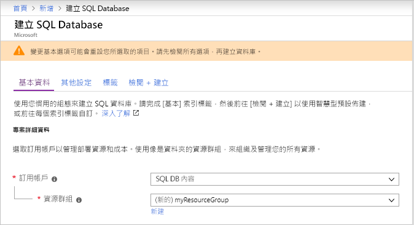
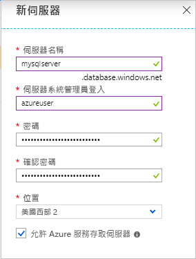
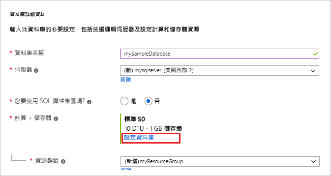
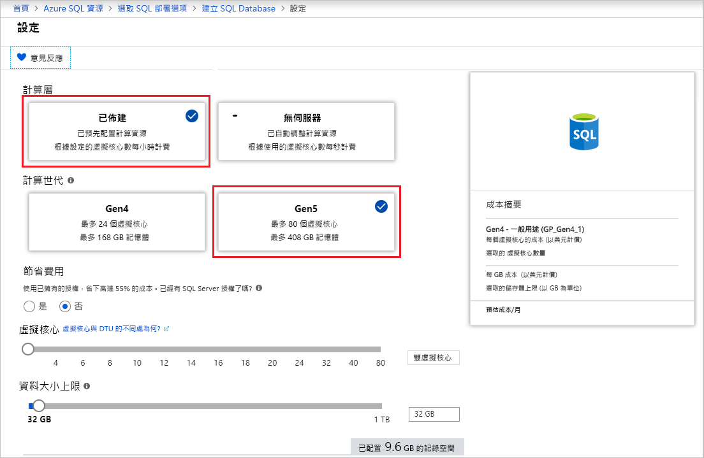
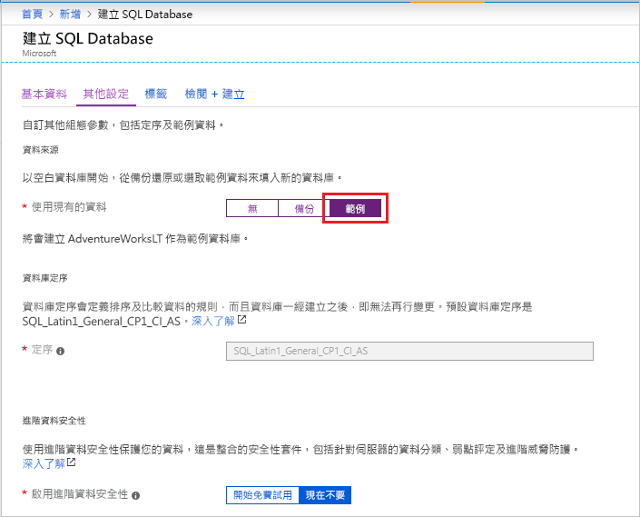

在此步驟中，您將建立 Azure SQL Database 單一資料庫。 

> [!IMPORTANT]
> 務必設定防火牆規則，以使用您用來完成本文的電腦公用 IP 位址。
>
> 如需資訊，請參閱[建立資料庫層級防火牆規則](/sql/relational-databases/system-stored-procedures/sp-set-database-firewall-rule-azure-sql-database)，或者，若要判斷對於電腦的伺服器層級防火牆規則所用的 IP 位址，請參閱[建立伺服器層級防火牆](../sql-database-server-level-firewall-rule.md)。  

# <a name="portaltabazure-portal"></a>[入口網站](#tab/azure-portal)

使用 Azure 入口網站建立您的資源群組和單一資料庫。

1. 在 Azure 入口網站的左側功能表中，選取 [Azure SQL]  。 如果 **Azure SQL** 不在清單中，請選取 [所有服務]  ，然後在搜尋方塊中輸入 Azure SQL  。
2. 選取 [+ 新增]  以開啟 [選取 SQL 部署選項]  頁面。 您可以選取 [資料庫]  圖格上的 [顯示詳細資料]  ，以查看不同資料庫的其他資訊。
3. 選取 [建立]  ：

   

3. 在 [基本資料]  索引標籤的 [專案詳細資料]  區段中，輸入或選取下列值：

   - 訂用帳戶  ：下拉並選取正確的訂用帳戶 (若未出現)。
   - **資源群組**：選取 [新建]  ，輸入 `myResourceGroup`，然後選取 [確定]  。

     

4. 在 [資料庫詳細資料]  區段中，輸入或選取下列值：

   - **資料庫名稱**：輸入 `mySampleDatabase` 。
   - **伺服器**：選取 [新建]  ，輸入下列值，然後選取 [選取]  。
       - **伺服器名稱**：`mysqlserver`類別；伴隨一些表示唯一性的數字。
       - **伺服器管理員登入**：輸入 `azureuser`。
       - **密碼**：輸入複雜密碼以符合密碼需求。
       - **位置**：從下拉式清單中選擇位置，例如 `West US 2`。

         

      > [!IMPORTANT]
      > 請記得記錄下伺服器管理員登入和密碼，以便在進行這個和其他快速入門時能夠登入伺服器和資料庫。 如果您忘記登入或密碼，您可以在 [SQL Server]  頁面上取得登入名稱或重設密碼。 若要開啟 [SQL Server]  頁面，請在資料庫建立後，選取資料庫 [概觀]  頁面上的伺服器名稱。

   - **您要使用 SQL 彈性集區嗎**：選取 [否]  選項。
   - **計算 + 儲存體**：選取 [設定資料庫]  。 

     

   - 選取 [已佈建]  和 [Gen5]  。

     

   - 檢閱 [虛擬核心數上限]  、[虛擬核心數下限]  、[自動暫停延遲]  和 [資料大小上限]  的設定。 視需要變更這些設定。
   - 接受預覽條款，然後按一下 [確定]  。
   - 選取 [套用]  。

5. 選取 [其他設定]  索引標籤。 
6. 在 [資料來源]  區段的 [使用現有資料]  下方，選取 `Sample`。

   

   > [!IMPORTANT]
   > 請務必選取 [範例 (AdventureWorksLT)]  資料，以便依照本快速入門和使用這項資料的其他 Azure SQL Database 快速入門的指示操作。

7. 將其餘的值保留為預設值，然後在表單底部選取 [檢閱 + 建立]  。
8. 檢閱最終設定，然後選取 [建立]  。

9. 在 [SQL Database]  表單中，選取 [建立]  以部署和佈建資源群組、伺服器和資料庫。

# <a name="powershelltabazure-powershell"></a>[PowerShell](#tab/azure-powershell)

[!INCLUDE [updated-for-az](../../../includes/updated-for-az.md)]

使用 PowerShell 建立您的資源群組和單一資料庫。

   ```powershell-interactive
   # Set variables for your server and database
   $subscriptionId = '<SubscriptionID>'
   $resourceGroupName = "myResourceGroup-$(Get-Random)"
   $location = "West US 2"
   $adminLogin = "azureuser"
   $password = "PWD27!"+(New-Guid).Guid
   $serverName = "mysqlserver-$(Get-Random)"
   $databaseName = "mySampleDatabase"

   # The ip address range that you want to allow to access your server 
   # (leaving at 0.0.0.0 will prevent outside-of-azure connections to your DB)
   $startIp = "0.0.0.0"
   $endIp = "0.0.0.0"

   # Show randomized variables
   Write-host "Resource group name is" $resourceGroupName 
   Write-host "Password is" $password  
   Write-host "Server name is" $serverName 

   # Connect to Azure
   Connect-AzAccount

   # Set subscription ID
   Set-AzContext -SubscriptionId $subscriptionId 

   # Create a resource group
   Write-host "Creating resource group..."
   $resourceGroup = New-AzResourceGroup -Name $resourceGroupName -Location $location -Tag @{Owner="SQLDB-Samples"}
   $resourceGroup

   # Create a server with a system wide unique server name
   Write-host "Creating primary logical server..."
   $server = New-AzSqlServer -ResourceGroupName $resourceGroupName `
      -ServerName $serverName `
      -Location $location `
      -SqlAdministratorCredentials $(New-Object -TypeName System.Management.Automation.PSCredential `
      -ArgumentList $adminLogin, $(ConvertTo-SecureString -String $password -AsPlainText -Force))
   $server

   # Create a server firewall rule that allows access from the specified IP range
   Write-host "Configuring firewall for primary logical server..."
   $serverFirewallRule = New-AzSqlServerFirewallRule -ResourceGroupName $resourceGroupName `
      -ServerName $serverName `
      -FirewallRuleName "AllowedIPs" -StartIpAddress $startIp -EndIpAddress $endIp
   $serverFirewallRule

   # Create General Purpose Gen4 database with 1 vCore
   Write-host "Creating a gen5 2 vCore database..."
   $database = New-AzSqlDatabase  -ResourceGroupName $resourceGroupName `
      -ServerName $serverName `
      -DatabaseName $databaseName `
      -Edition GeneralPurpose `
      -VCore 2 `
      -ComputeGeneration Gen5 `
      -MinimumCapacity 2 `
      -SampleName "AdventureWorksLT"
   $database
   ```

# <a name="azure-clitabazure-cli"></a>[Azure CLI](#tab/azure-cli)

使用 AZ CLI 建立您的資源群組和單一資料庫。

   ```azurecli-interactive
   #!/bin/bash
   # Set variables
   subscriptionID=<SubscriptionID>
   resourceGroupName=myResourceGroup-$RANDOM
   location=SouthCentralUS
   adminLogin=azureuser
   password="PWD27!"+`openssl rand -base64 18`
   serverName=mysqlserver-$RANDOM
   databaseName=mySampleDatabase
   drLocation=NorthEurope
   drServerName=mysqlsecondary-$RANDOM
   failoverGroupName=failovergrouptutorial-$RANDOM

   # The ip address range that you want to allow to access your DB. 
   # Leaving at 0.0.0.0 will prevent outside-of-azure connections to your DB
   startip=0.0.0.0
   endip=0.0.0.0
  
   # Connect to Azure
   az login

   # Set the subscription context for the Azure account
   az account set -s $subscriptionID

   # Create a resource group
   echo "Creating resource group..."
   az group create \
      --name $resourceGroupName \
      --location $location \
      --tags Owner[=SQLDB-Samples]

   # Create a logical server in the resource group
   echo "Creating primary logical server..."
   az sql server create \
      --name $serverName \
      --resource-group $resourceGroupName \
      --location $location  \
      --admin-user $adminLogin \
      --admin-password $password

   # Configure a firewall rule for the server
   echo "Configuring firewall..."
   az sql server firewall-rule create \
      --resource-group $resourceGroupName \
      --server $serverName \
      -n AllowYourIp \
      --start-ip-address $startip \
      --end-ip-address $endip

   # Create a gen5 1vCore database in the server 
   echo "Creating a gen5 2 vCore database..."
   az sql db create \
      --resource-group $resourceGroupName \
      --server $serverName \
      --name $databaseName \
      --sample-name AdventureWorksLT \
      --edition GeneralPurpose \
      --family Gen5 \
      --capacity 2
   ```

---
