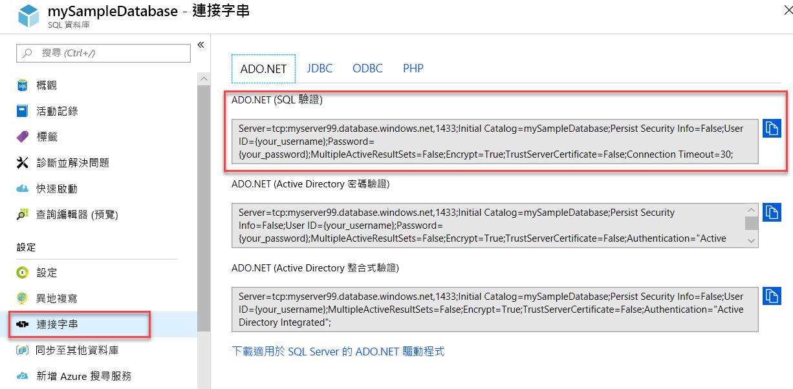

# <a name="quickstart-use-net-core-c-to-query-an-azure-sql-database"></a>快速入門：使用 .NET Core (C#) 查詢 Azure SQL 資料庫

在此快速入門中，您將使用 [.NET Core](https://www.microsoft.com/net/) 和 C# 程式碼來連線至 Azure SQL 資料庫。 然後，您將使用 Transact-SQL 陳述式來查詢資料。

## <a name="prerequisites"></a>必要條件

在本教學課程中，您需要：

[!INCLUDE [prerequisites-create-db](../../includes/sql-database-connect-query-prerequisites-create-db-includes.md)]

- 已安裝[適用於您作業系統的 .NET Core](https://www.microsoft.com/net/core)。 

> [!NOTE]
> 本快速入門會使用 *mySampleDatabase* 資料庫。 如果想要使用不同的資料庫，就必須變更資料庫參考，並使用 C# 程式碼修改 `SELECT` 查詢。


## <a name="get-sql-server-connection-information"></a>取得 SQL Server 連線資訊

[!INCLUDE [prerequisites-server-connection-info](../../includes/sql-database-connect-query-prerequisites-server-connection-info-includes.md)]

#### <a name="get-adonet-connection-information-optional"></a>取得 ADO.NET 連線資訊 (選擇性)

1. 瀏覽至 **mySampleDatabase** 頁面，然後在 [設定] 之下選取 [連接字串]。

2. 檢閱完整的 **ADO.NET** 連接字串。

    

3. 視需要複製 **ADO.NET** 連接字串。
  
## <a name="create-a-new-net-core-project"></a>建立新的 .NET Core 專案

1. 開啟命令提示字元，並建立名為 sqltest 的資料夾。 瀏覽至此資料夾並執行此命令。

    ```cmd
    dotnet new console
    ```
    此命令會建立新的應用程式專案檔案，包括最初的 C# 程式碼檔案 (**Program.cs**)、XML 組態檔 (**sqltest.csproj**)，以及所需的二進位檔。

2. 在文字編輯器中，開啟 **sqltest.csproj** 並在 `<Project>` 標記之間貼上以下 XML。 此 XML 會將 `System.Data.SqlClient` 新增為相依性。

    ```xml
    <ItemGroup>
        <PackageReference Include="System.Data.SqlClient" Version="4.6.0" />
    </ItemGroup>
    ```

## <a name="insert-code-to-query-sql-database"></a>插入程式碼以查詢 SQL 資料庫

1. 在文字編輯器中開啟 **Program.cs**。

2. 使用以下程式碼取代內容，並為您的伺服器、資料庫、使用者名稱和密碼新增適當的值。

> [!NOTE]
> 若要使用 ADO.NET 連接字串，請用下面這一行取代程式碼中設定伺服器、資料庫、使用者名稱和密碼的那 4 行。 在字串中設定您的使用者名稱和密碼。
>
>    `builder.ConnectionString="<your_ado_net_connection_string>";`

```csharp
using System;
using System.Data.SqlClient;
using System.Text;

namespace sqltest
{
    class Program
    {
        static void Main(string[] args)
        {
            try 
            { 
                SqlConnectionStringBuilder builder = new SqlConnectionStringBuilder();

                builder.DataSource = "<your_server.database.windows.net>"; 
                builder.UserID = "<your_username>";            
                builder.Password = "<your_password>";     
                builder.InitialCatalog = "<your_database>";
         
                using (SqlConnection connection = new SqlConnection(builder.ConnectionString))
                {
                    Console.WriteLine("\nQuery data example:");
                    Console.WriteLine("=========================================\n");
                    
                    connection.Open();       
                    StringBuilder sb = new StringBuilder();
                    sb.Append("SELECT TOP 20 pc.Name as CategoryName, p.name as ProductName ");
                    sb.Append("FROM [SalesLT].[ProductCategory] pc ");
                    sb.Append("JOIN [SalesLT].[Product] p ");
                    sb.Append("ON pc.productcategoryid = p.productcategoryid;");
                    String sql = sb.ToString();

                    using (SqlCommand command = new SqlCommand(sql, connection))
                    {
                        using (SqlDataReader reader = command.ExecuteReader())
                        {
                            while (reader.Read())
                            {
                                Console.WriteLine("{0} {1}", reader.GetString(0), reader.GetString(1));
                            }
                        }
                    }                    
                }
            }
            catch (SqlException e)
            {
                Console.WriteLine(e.ToString());
            }
            Console.WriteLine("\nDone. Press enter.");
            Console.ReadLine(); 
        }
    }
}
```

## <a name="run-the-code"></a>執行程式碼

1. 在命令提示字元中，執行以下命令。

   ```cmd
   dotnet restore
   dotnet run
   ```

2. 確認是否傳回前 20 個資料列。

   ```text
   Query data example:
   =========================================

   Road Frames HL Road Frame - Black, 58
   Road Frames HL Road Frame - Red, 58
   Helmets Sport-100 Helmet, Red
   Helmets Sport-100 Helmet, Black
   Socks Mountain Bike Socks, M
   Socks Mountain Bike Socks, L
   Helmets Sport-100 Helmet, Blue
   Caps AWC Logo Cap
   Jerseys Long-Sleeve Logo Jersey, S
   Jerseys Long-Sleeve Logo Jersey, M
   Jerseys Long-Sleeve Logo Jersey, L
   Jerseys Long-Sleeve Logo Jersey, XL
   Road Frames HL Road Frame - Red, 62
   Road Frames HL Road Frame - Red, 44
   Road Frames HL Road Frame - Red, 48
   Road Frames HL Road Frame - Red, 52
   Road Frames HL Road Frame - Red, 56
   Road Frames LL Road Frame - Black, 58
   Road Frames LL Road Frame - Black, 60
   Road Frames LL Road Frame - Black, 62

   Done. Press enter.
   ```
3. 選擇 **Enter** 關閉應用程式視窗。

## <a name="next-steps"></a>後續步驟

- [使用命令列以開始使用在 Windows/Linux/macOS 上的 .NET Core](/dotnet/core/tutorials/using-with-xplat-cli)。
- 了解如何[使用 .NET 架構和 Visual Studio 來連線及查詢 Azure SQL 資料庫](sql-database-connect-query-dotnet-visual-studio.md)。  
- 深入了解如何[使用 SSMS 設計您的第一個 Azure SQL 資料庫](sql-database-design-first-database.md)或[使用 C# 與 ADO.NET 設計 Azure SQL 資料庫](sql-database-design-first-database-csharp.md)。
- 如需 .NET 的詳細資訊，請參閱 [.NET 文件](https://docs.microsoft.com/dotnet/)。
