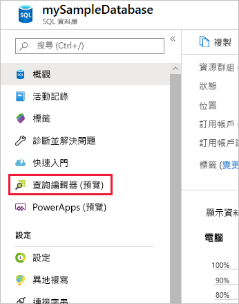
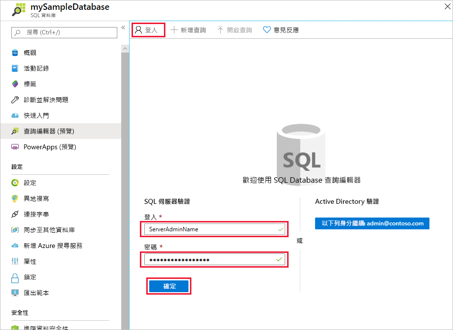
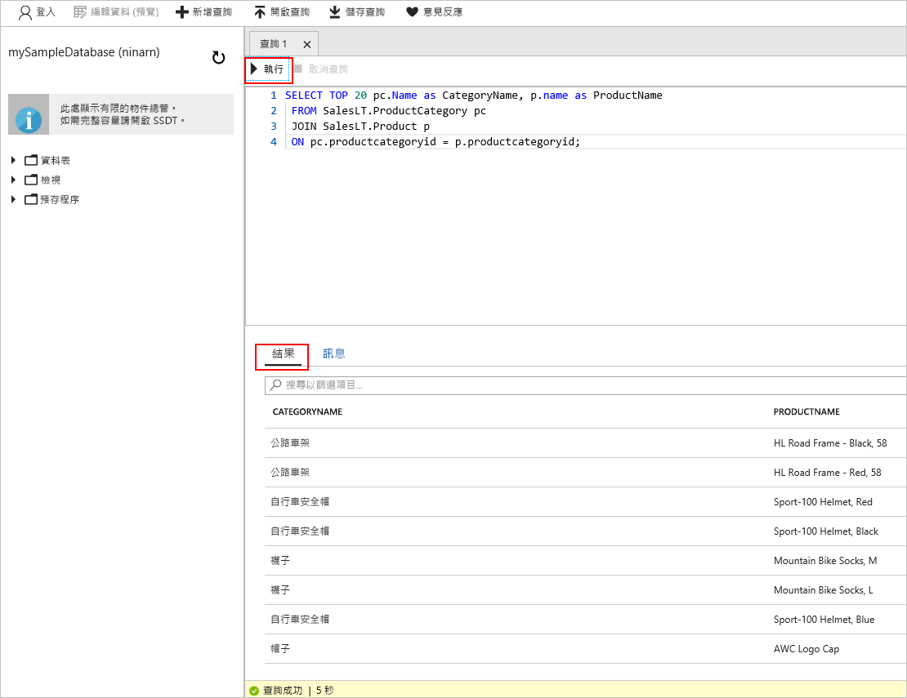

# <a name="quickstart-use-the-azure-portals-sql-query-editor-to-connect-and-query-data"></a>快速入門：使用 Azure 入口網站的 SQL 查詢編輯器進行連線並查詢資料

SQL 查詢編輯器是 Azure 入口網站瀏覽器工具，提供簡單的方法在您的 Azure SQL Database 或 Azure SQL 資料倉儲上執行 SQL 查詢。 在此快速入門中，您將使用查詢編輯器連線至 SQL 資料庫，然後使用 Transact-SQL 陳述式查詢、插入、更新及刪除資料。

## <a name="prerequisites"></a>必要條件

若要完成本教學課程，您需要：

[!INCLUDE [prerequisites-create-db](../../includes/sql-database-connect-query-prerequisites-create-db-includes.md)]

> [!NOTE]
> 在 SQL Server 防火牆設定中，確定 [允許存取 Azure 服務] 選項設為 [開啟]。 此選項會允許 SQL 查詢編輯器存取您的資料庫和資料倉儲。

## <a name="sign-in-the-azure-portal"></a>登入 Azure 入口網站

登入 [Azure 入口網站](https://portal.azure.com/)。

## <a name="connect-using-sql-authentication"></a>使用 SQL 驗證進行連線

1. 從左側功能表選取 [SQL Database]，然後選取 **mySampleDatabase**。

2. 在左側功能表中，尋找並選取 [查詢編輯器 (預覽)]。 此時會顯示 [登入] 頁面。

    

3. 從 [授權類型] 下拉式選單中，選取 [SQL Server 驗證] 並輸入建立資料庫時所用伺服器系統管理員帳戶的使用者識別碼和密碼。

     

4. 選取 [確定] 。


## <a name="connect-using-azure-active-directory"></a>使用 Azure Active Directory 連線

設定 Active Directory (AD) 系統管理員，可讓您使用單一識別身分登入 Azure 入口網站和您的 SQL 資料庫。 請遵循以下步驟設定您 SQL Server 的 AD 系統管理員。

> [!NOTE]
* AD 系統管理員尚未支援電子郵件帳戶 (例如 outlook.com、gmail.com、yahoo.com 等等)。 請務必選擇使用者在 Azure AD 中原生建立，或與 Azure AD 同盟的 AD 系統管理員。
* Azure AD 系統管理員登入無法搭配已啟用 2 雙因素驗證的帳戶使用。

1. 請從左側功能表選取 [所有資源]，然後選取您的 SQL Server。

2. 從您 SQL Server 的 [設定] 功能表，選取 [Active Directory 系統管理員]。

3. 從 AD 系統管理員頁面工具列，選取 [設定系統管理員] 並選擇使用者或群組做為您的 AD 系統管理員。

    

4. 從 AD 系統管理員頁面工具列，選取 [儲存]。

5. 瀏覽至 **mySampleDatabase** 資料庫，然後從左側功能表選取 [查詢編輯器 (預覽)]。 此時會顯示 [登入] 頁面。 如果您是 AD 系統管理員，右側 [Active Directory 單一登入] 底下就會顯示說明您已經登入的訊息。 
   
6. 選取 [確定] 。


## <a name="view-data"></a>檢視資料

1. 經過驗證後，在查詢編輯器中貼上以下 SQL，即可擷取到依類別分類的前 20 個產品。

   ```sql
    SELECT TOP 20 pc.Name as CategoryName, p.name as ProductName
    FROM SalesLT.ProductCategory pc
    JOIN SalesLT.Product p
    ON pc.productcategoryid = p.productcategoryid;
   ```

2. 在工具列上，選取 [執行]，然後檢閱 [結果] 窗格中的輸出結果。



## <a name="insert-data"></a>插入資料

執行以下 [INSERT](https://msdn.microsoft.com/library/ms174335.aspx) Transact-SQL 陳述式在 `SalesLT.Product` 資料表中加入新產品。

1. 使用此查詢取代先前的查詢。

   ```sql
   INSERT INTO [SalesLT].[Product]
           ( [Name]
           , [ProductNumber]
           , [Color]
           , [ProductCategoryID]
           , [StandardCost]
           , [ListPrice]
           , [SellStartDate]
           )
     VALUES
           ('myNewProduct'
           ,123456789
           ,'NewColor'
           ,1
           ,100
           ,100
           ,GETDATE() );
   ```


2. 選取 [執行] 以在 `Product` 資料表中插入新資料列。 [訊息] 窗格會顯示**成功的查詢：受影響的資料列：1**。


## <a name="update-data"></a>更新資料

執行以下 [UPDATE](https://msdn.microsoft.com/library/ms177523.aspx) Transact-SQL 陳述式修改您的新產品。

1. 使用此查詢取代先前的查詢。

   ```sql
   UPDATE [SalesLT].[Product]
   SET [ListPrice] = 125
   WHERE Name = 'myNewProduct';
   ```

2. 選取 [執行] 以在 `Product` 資料表中更新指定的資料列。 [訊息] 窗格會顯示**成功的查詢：受影響的資料列：1**。

## <a name="delete-data"></a>刪除資料

執行以下 [DELETE](https://msdn.microsoft.com/library/ms189835.aspx) Transact-SQL 陳述式移除您的新產品。

1. 使用此查詢取代先前的查詢：

   ```sql
   DELETE FROM [SalesLT].[Product]
   WHERE Name = 'myNewProduct';
   ```

2. 選取 [執行] 以在 `Product` 資料表中刪除指定的資料列。 [訊息] 窗格會顯示**成功的查詢：受影響的資料列：1**。


## <a name="query-editor-considerations"></a>查詢編輯器考量

使用查詢編輯器時，有一些使用事項須注意。

* 您無法在虛擬網路中使用查詢編輯器查詢 SQL Server 資料庫。

* 按下 F5 可重新整理查詢編輯器頁面，而且任何正在進行的查詢都會遺失。

* 查詢編輯器不支援連線到 `master` 資料庫。

* 查詢執行的逾時時間是 5 分鐘。

* 查詢編輯器僅支援地理資料類型的圓柱形投影。

* 不支援用於資料庫表格和檢視的 IntelliSense。 但編輯器支援已輸入名稱的自動完成功能。


## <a name="next-steps"></a>後續步驟

若要深入了解 Azure SQL 資料庫中支援的 Transact-SQL，請參閱[解析移轉至 SQL 資料庫時的 Transact-SQL 差異](sql-database-transact-sql-information.md)。
