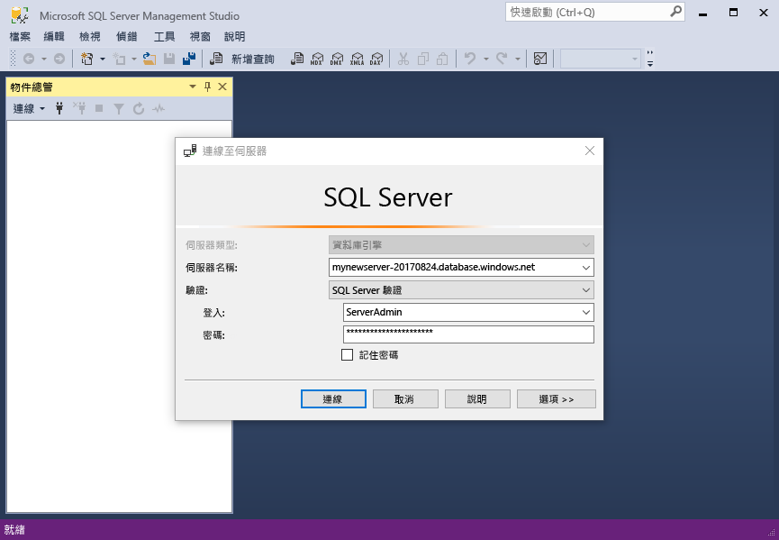
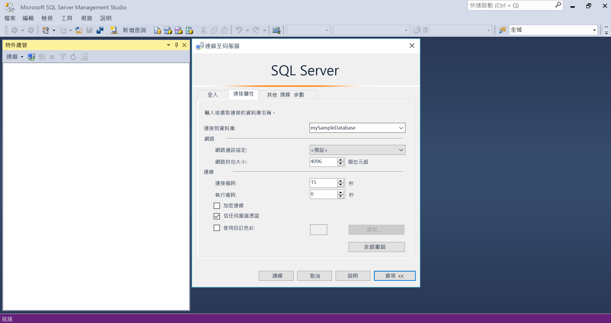
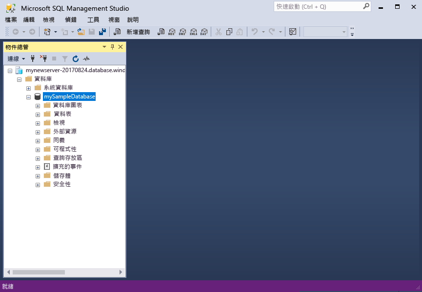
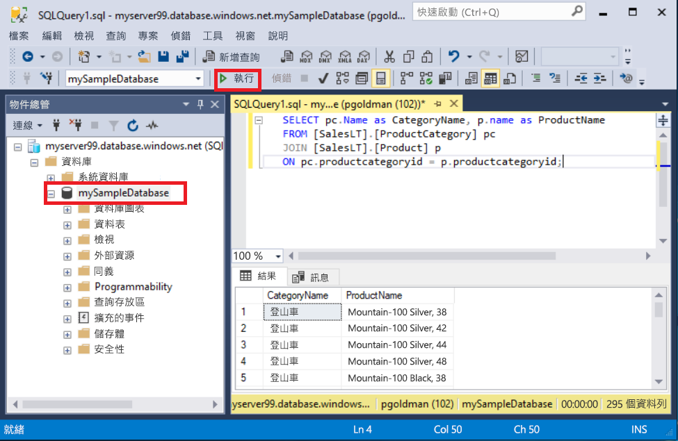
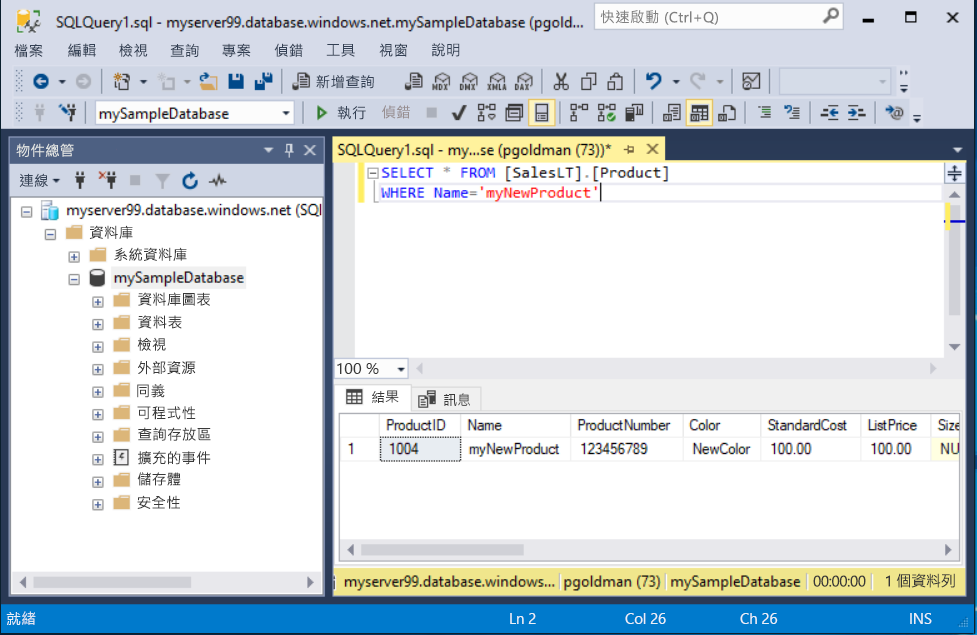

# <a name="quickstart-use-sql-server-management-studio-to-connect-and-query-an-azure-sql-database"></a>快速入門：使用 SQL Server Management Studio 連線和查詢 Azure SQL Database

在本快速入門中，您將使用 [SQL Server Management Studio][ssms-install-latest-84g] (SSMS) 來連線到 Azure SQL 資料庫。 接著，您將執行 Transact-SQL 陳述式來查詢、插入、更新和刪除資料。 您可以使用 SSMS 來管理任何 SQL 基礎結構，範圍從 Microsoft Windows 的 SQL Server 到 SQL Database。  

## <a name="prerequisites"></a>必要條件

若要完成本教學課程，您需要：

[!INCLUDE [prerequisites-create-db](../../includes/sql-database-connect-query-prerequisites-create-db-includes.md)]

* 設定伺服器層級防火牆規則。 如需詳細資訊，請參閱[建立伺服器層級防火牆規則](sql-database-get-started-portal-firewall.md)。

## <a name="install-the-latest-ssms"></a>安裝最新的 SSMS

在開始之前，請確定您已安裝最新的 [SSMS][ssms-install-latest-84g]。 

## <a name="sql-server-connection-information"></a>SQL Server 連線資訊

[!INCLUDE [prerequisites-server-connection-info](../../includes/sql-database-connect-query-prerequisites-server-connection-info-includes.md)]

## <a name="connect-to-your-database"></a>連接到您的資料庫

在 SMSS 中，連線到您的 Azure SQL Database 資料庫。 

> [!IMPORTANT]
> Azure SQL Database 伺服器會接聽連接埠 1433。 若要連線到公司防火牆後方的 SQL Database 伺服器，該防火牆必須開啟此連接埠。
>

1. 開啟 SSMS。 [連線到伺服器] 對話方塊隨即出現。

2. 輸入以下資訊：

   | 設定      | 建議的值    | 說明 | 
   | ------------ | ------------------ | ----------- | 
   | **伺服器類型** | 資料庫引擎 | 必要值。 |
   | **伺服器名稱** | 完整伺服器名稱 | 應該類似這樣︰**mynewserver20170313.database.windows.net**。 |
   | **驗證** | SQL Server 驗證 | 本教學課程使用 SQL 驗證。 |
   | **登入** | 伺服器管理帳戶使用者識別碼 | 建立伺服器時所使用伺服器系統管理員帳戶的使用者識別碼。 |
   | **密碼** | 伺服器系統管理員帳戶密碼 | 建立伺服器時所使用伺服器系統管理員帳戶的密碼。 |
   ||||

     

3. 選取 [連線到伺服器] 對話方塊中的 [選項]。 在 [連線到伺服器] 下拉式功能表中，選取 **mySampleDatabase**。

     

4. 選取 [ **連接**]。 此時會開啟 [物件總管] 視窗。 

5. 若要檢視資料庫的物件，請展開 [資料庫]，然後展開 **mySampleDatabase**。

     

## <a name="query-data"></a>查詢資料

執行此 [SELECT](https://msdn.microsoft.com/library/ms189499.aspx) Transact-SQL 程式碼，依照類別查詢前 20 項產品。

1. 在 [物件總管] 中，於 **mySampleDatabase** 上按一下滑鼠右鍵，然後選取 [新增查詢]。 連線到您資料庫的新查詢視窗將會開啟。

2. 在查詢視窗中，貼上此 SQL 查詢。

   ```sql
   SELECT pc.Name as CategoryName, p.name as ProductName
   FROM [SalesLT].[ProductCategory] pc
   JOIN [SalesLT].[Product] p
   ON pc.productcategoryid = p.productcategoryid;
   ```

3. 在工具列上，選取 [執行] 以擷取 `Product` 和 `ProductCategory` 資料表中的資料。

    

## <a name="insert-data"></a>插入資料

執行此 [INSERT](https://msdn.microsoft.com/library/ms174335.aspx) Transact-SQL 程式碼，以在 `SalesLT.Product` 資料表中建立新產品。

1. 使用此查詢取代先前的查詢。

   ```sql
   INSERT INTO [SalesLT].[Product]
           ( [Name]
           , [ProductNumber]
           , [Color]
           , [ProductCategoryID]
           , [StandardCost]
           , [ListPrice]
           , [SellStartDate] )
     VALUES
           ('myNewProduct'
           ,123456789
           ,'NewColor'
           ,1
           ,100
           ,100
           ,GETDATE() );
   ```

2. 選取 [執行] 以在 `Product` 資料表中插入新資料列。 [訊息] 窗格會顯示 [(1 個資料列受影響)]。

## <a name="view-the-result"></a>檢視結果

1. 使用此查詢取代先前的查詢。

   ```sql
   SELECT * FROM [SalesLT].[Product] 
   WHERE Name='myNewProduct' 

2. Select **Execute**. The following result appears. 

   

 
## Update data

Run this [UPDATE](https://msdn.microsoft.com/library/ms177523.aspx) Transact-SQL code to modify your new product.

1. Replace the previous query with this one.

   ```sql
   UPDATE [SalesLT].[Product]
   SET [ListPrice] = 125
   WHERE Name = 'myNewProduct';
   ```

2. 選取 [執行] 以在 `Product` 資料表中更新指定的資料列。 [訊息] 窗格會顯示 [(1 個資料列受影響)]。

## <a name="delete-data"></a>刪除資料

執行此 [DELETE](https://msdn.microsoft.com/library/ms189835.aspx) Transact-SQL 程式碼以移除新產品。

1. 使用此查詢取代先前的查詢。

   ```sql
   DELETE FROM [SalesLT].[Product]
   WHERE Name = 'myNewProduct';
   ```

2. 選取 [執行] 以在 `Product` 資料表中刪除指定的資料列。 [訊息] 窗格會顯示 [(1 個資料列受影響)]。

## <a name="next-steps"></a>後續步驟

- 如需有關 SSMS 的資訊，請參閱 [SQL Server Management Studio](https://msdn.microsoft.com/library/ms174173.aspx)。
- 若要使用 Azure 入口網站連線及查詢，請參閱[使用 Azure 入口網站 SQL 查詢編輯器連線和查詢](sql-database-connect-query-portal.md)。
- 若要使用 Visual Studio Code 進行連線和查詢，請參閱[使用 Visual Studio Code 進行連線和查詢](sql-database-connect-query-vscode.md)。
- 若要使用 .NET 進行連線和查詢，請參閱[使用 .NET 進行連線和查詢](sql-database-connect-query-dotnet.md)。
- 若要使用 PHP 進行連線和查詢，請參閱[使用 PHP 進行連線和查詢](sql-database-connect-query-php.md)。
- 若要使用 Node.js 進行連線和查詢，請參閱[使用 Node.js 進行連線和查詢](sql-database-connect-query-nodejs.md)。
- 若要使用 Java 進行連線和查詢，請參閱[使用 Java 進行連線和查詢](sql-database-connect-query-java.md)。
- 若要使用 Python 進行連線和查詢，請參閱[使用 Python 進行連線和查詢](sql-database-connect-query-python.md)。
- 若要使用 Ruby 進行連線和查詢，請參閱[使用 Ruby 進行連線和查詢](sql-database-connect-query-ruby.md)。


<!-- Article link references. -->

[ssms-install-latest-84g]: https://docs.microsoft.com/sql/ssms/sql-server-management-studio-ssms

