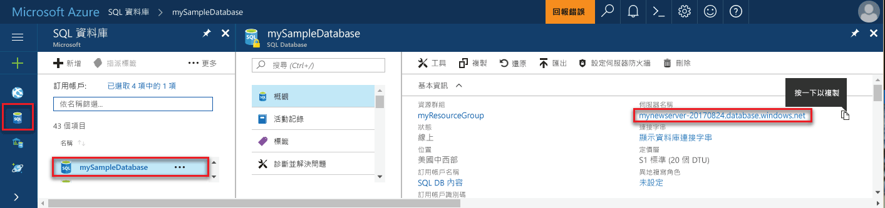

# 使用 Azure 入口網站建立 SQL Database 的伺服器層級防火牆規則

本快速入門逐步解說如何建立 Azure SQL Database 的伺服器層級防火牆規則，以便您可以從內部部署資源對其進行連線。

## 必要條件

此快速入門可作為在下列快速入門中所建立之資源的起點︰[在 Azure 入口網站中建立 Azure SQL Database](sql-database-get-started-portal.md)

## 登入 Azure 入口網站

登入 [Azure 入口網站](https://portal.azure.com/)。

## 建立伺服器層級防火牆規則

SQL Database 服務會在伺服器層級建立防火牆，防止應用程式和工具連線到伺服器或伺服器上的任何資料庫，除非建立防火牆規則來開啟防火牆。 若要從 Azure 外部的 IP 位址連線，請針對特定 IP 位址或某位址範圍建立防火牆規則。 請遵循下列步驟來為您用戶端的 IP 位址建立 [SQL Database 伺服器層級防火牆規則](sql-database-firewall-configure.md)，並讓外部連線僅能夠穿過您 IP 位址的 SQL Database 防火牆。

> [!NOTE]
> SQL Database 會透過連接埠 1433 通訊。 如果您嘗試從公司網路進行連線，您網路的防火牆可能不允許透過連接埠 1433 的輸出流量。 若情況如此，除非 IT 部門開啟連接埠 1433，否則您無法連線至 Azure SQL Database 伺服器。
>

1. 部署完成之後，按一下左側功能表中的 [SQL Database]，然後按一下 [SQL Database] 頁面上的 [mySampleDatabase]。 資料庫的概觀頁面隨即開啟，其中會顯示完整伺服器名稱 (例如 **mynewserver-20170824.database.windows.net**)，並提供進一步的組態選項。

2. 在後續的快速入門中，請複製此完整伺服器名稱，才能用來連線到伺服器及其資料庫。

   

3. 如先前映像所示，按一下工具列上的 [設定伺服器防火牆]。 SQL Database 伺服器的 [防火牆設定] 頁面隨即開啟。

   

4. 按一下工具列上的 [新增用戶端 IP]，將目前的 IP 位址新增至新的防火牆規則。 防火牆規則可以針對單一 IP 位址或 IP 位址範圍開啟連接埠 1433。

5. 按一下 [檔案] 。 系統便會為目前的 IP 位址建立伺服器層級防火牆規則，以便在邏輯伺服器上開啟連接埠 1433。

6. 依序按一下 [確定]，然後關閉 [防火牆設定] 頁面。

您現在可以利用 SQL Server Management Studio 或選擇的其他工具，使用先前建立的伺服器管理帳戶從這個 IP 位址連線至 SQL Database 伺服器及其資料庫。

> [!IMPORTANT]
> 根據預設，已對所有 Azure 服務啟用透過 SQL Database 防火牆存取。 按一下此頁面上的 [關閉] 即可對所有 Azure 服務停用。
>

## 清除資源

如果您想移至[後續步驟](#next-steps)並了解如何使用各種不同方法來連線及查詢您的資料庫，請儲存這些資源。 不過，如果您要刪除在此快速入門中建立的資源，請使用下列步驟。

1. 從 Azure 入口網站的左側功能表中，依序按一下 [資源群組] 和 [myResourceGroup]。
2. 在資源群組頁面上，按一下 [刪除]，在文字方塊中輸入 **myResourceGroup**，然後按一下 [刪除]。

## 後續步驟

- 您現在具有資料庫，您可使用任何一個慣用工具或語言進行[連線和查詢](sql-database-connect-query.md)，包括
  - [使用 SQL Server Management Studio 進行連線和查詢](sql-database-connect-query-ssms.md)
  - [使用 Azure Data Studio 進行連線及查詢](https://docs.microsoft.com/sql/azure-data-studio/quickstart-sql-database?toc=/azure/sql-database/toc.json)
- 若要了解如何設計您的第一個資料庫、建立資料表及插入資料，請參閱下列其中一個教學課程：
 - [使用 SSMS 設計您的第一個 Azure SQL 資料庫](sql-database-design-first-database.md)
 - [設計 Azure SQL Database 並連接 C# 和 ADO.NET](sql-database-design-first-database-csharp.md)
