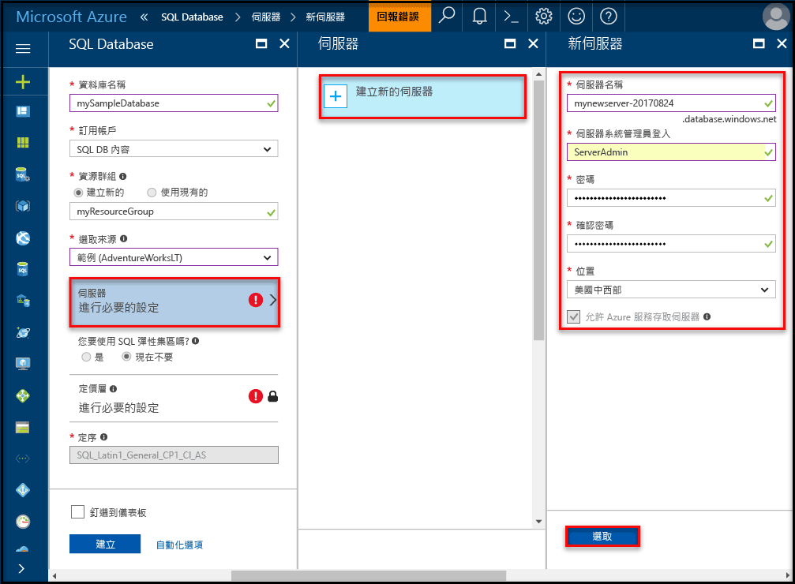
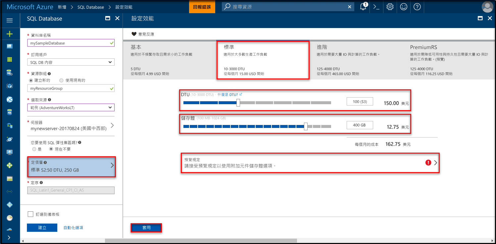
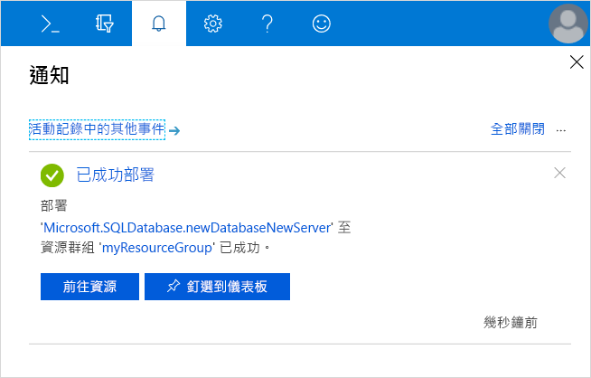
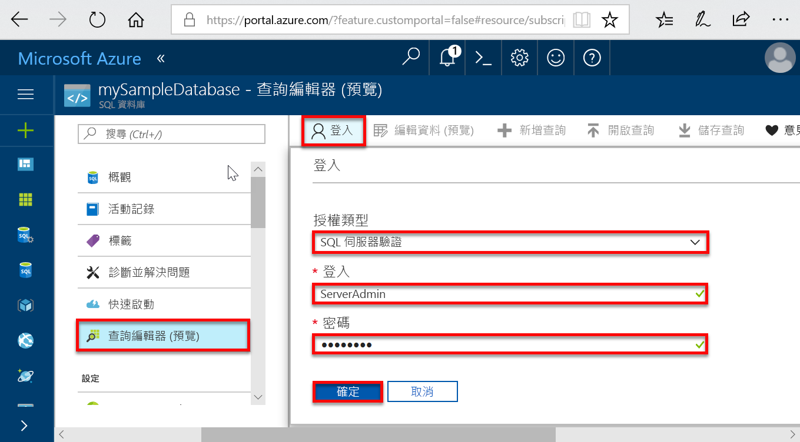
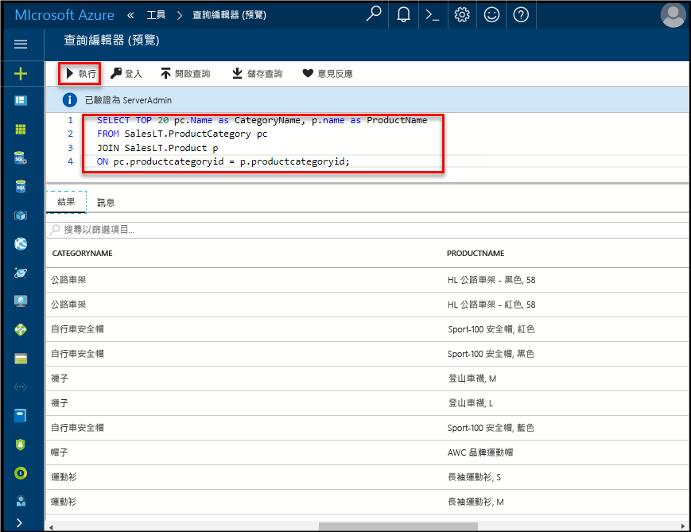

# <a name="create-an-azure-sql-database-in-the-azure-portal"></a>在 Azure 入口網站中建立 Azure SQL Database

本快速入門將逐步解說如何使用[以 DTU 為基礎的購買模型](sql-database-service-tiers-dtu.md)在 Azure 中建立 SQL 資料庫。 Azure SQL Database 是可讓您在雲端中執行及調整高可用性 SQL Server 資料庫的「資料庫即服務」供應項目。 此快速入門說明如何開始使用 Azure 入口網站建立 SQL 資料庫並進行查詢。

如果您沒有 Azure 訂用帳戶，請在開始前建立[免費帳戶](https://azure.microsoft.com/free/)。

  >[!NOTE]
  >本教學課程使用 DTU 型購買模型，但是[虛擬核心型購買模型](sql-database-service-tiers-vcore.md)也可供使用。

## <a name="log-in-to-the-azure-portal"></a>登入 Azure 入口網站

登入 [Azure 入口網站](https://portal.azure.com/)。

## <a name="create-a-sql-database"></a>建立 SQL 資料庫

Azure SQL Database 會使用一組定義的[計算和儲存體資源](sql-database-service-tiers-dtu.md)建立。 此資料庫建立於 [Azure 資源群組](../azure-resource-manager/resource-group-overview.md)和 [Azure SQL Database 邏輯伺服器](sql-database-features.md)內。

請遵循下列步驟來建立包含 Adventure Works LT 範例資料的 SQL Database。

1. 按一下 Azure 入口網站左上角的 [建立資源]。

2. 從 [新增] 頁面中選取 [資料庫]，然後在 [新增] 頁面的 [SQL Database] 下選取 [建立]。

   

3. 使用下列資訊填寫 SQL Database 表單，如上圖所示︰   

   | 設定       | 建議的值 | 說明 |
   | ------------ | ------------------ | ------------------------------------------------- |
   | **資料庫名稱** | mySampleDatabase | 如需有效的資料庫名稱，請參閱[資料庫識別碼](https://docs.microsoft.com/sql/relational-databases/databases/database-identifiers)。 |
   | **訂用帳戶** | 您的訂用帳戶  | 如需訂用帳戶的詳細資訊，請參閱[訂用帳戶](https://account.windowsazure.com/Subscriptions)。 |
   | **資源群組**  | myResourceGroup | 如需有效的資源群組名稱，請參閱[命名規則和限制](https://docs.microsoft.com/azure/architecture/best-practices/naming-conventions)。 |
   | **選取來源** | 範例 (AdventureWorksLT) | 將 AdventureWorksLT 結構描述和資料載入至新的資料庫 |

   > [!IMPORTANT]
   > 您必須在此表單上選取範例資料庫，因為它會用於此快速入門的其餘部分。
   >

4. 在 [伺服器] 之下，按一下 [進行必要設定]，並使用下列資訊填妥 SQL Server (邏輯伺服器) 表單，如下圖所示︰   

   | 設定       | 建議的值 | 說明 |
   | ------------ | ------------------ | ------------------------------------------------- |
   | **伺服器名稱** | 任何全域唯一名稱 | 如需有效的伺服器名稱，請參閱[命名規則和限制](https://docs.microsoft.com/azure/architecture/best-practices/naming-conventions)。 |
   | **伺服器管理員登入** | 任何有效名稱 | 如需有效的登入名稱，請參閱[資料庫識別碼](https://docs.microsoft.com/sql/relational-databases/databases/database-identifiers)。 |
   | **密碼** | 任何有效密碼 | 您的密碼至少要有 8 個字元，而且必須包含下列幾種字元的其中三種︰大寫字元、小寫字元、數字和非英數字元。 |
   | **訂用帳戶** | 您的訂用帳戶 | 如需訂用帳戶的詳細資訊，請參閱[訂用帳戶](https://account.windowsazure.com/Subscriptions)。 |
   | **資源群組** | myResourceGroup | 如需有效的資源群組名稱，請參閱[命名規則和限制](https://docs.microsoft.com/azure/architecture/best-practices/naming-conventions)。 |
   | **位置** | 任何有效位置 | 如需區域的相關資訊，請參閱 [Azure 區域](https://azure.microsoft.com/regions/)。 |

   > [!IMPORTANT]
   > 必須要有您在此處指定的伺服器系統管理員登入和密碼，稍後在本快速入門中才能登入伺服器及其資料庫。 請記住或記錄此資訊，以供稍後使用。
   >  

   

5. 完成表單後，按一下 [選取]。

6. 按一下 [定價層] 可指定服務層、DTU 數目和儲存體數量。 瀏覽 DTU 數量的選項，以及可供您每個服務層使用的儲存體。

   > [!IMPORTANT]
   > 所有區域目前均可取得進階層中超過 1 TB 的儲存體，下列區域除外：英國北部、美國中西部、英國南部2、中國東部、USDoDCentral、德國中部、USDoDEast、US Gov (西南部)、US Gov (中南部)、德國東北部、中國北部、US Gov (東部)。 在其他區域，進階層中的儲存空間上限為 1 TB。 請參閱 [P11-P15 目前限制]( sql-database-dtu-resource-limits-single-databases.md#single-database-limitations-of-p11-and-p15-when-the-maximum-size-greater-than-1-tb)。  

7. 在此快速入門中，選取 [標準] 服務層，然後使用滑桿選取 **10 DTU (S0)** 和 **1** GB 的儲存體。

   

8. 若要使用 [附加元件儲存體] 選項，請接受預覽條款。

   > [!IMPORTANT]
   > 所有區域目前均可取得進階層中超過 1 TB 的儲存體，下列區域除外：美國中西部、中國東部、USDoDCentral、US Gov (愛荷華州)、德國中部、USDoDEast、US Gov (西南部)、US Gov (中南部)、德國東北部、中國北部。 在其他區域，進階層中的儲存空間上限為 1 TB。 請參閱 [P11-P15 目前限制]( sql-database-dtu-resource-limits-single-databases.md#single-database-limitations-of-p11-and-p15-when-the-maximum-size-greater-than-1-tb)。  

9. 在選取伺服器層、DTU 數目和儲存體數量之後，按一下 [套用]。  

10. 您現在已完成 SQL Database 表單，請按一下 [建立] 來佈建資料庫。 佈建需要幾分鐘的時間。

11. 在工具列上，按一下 [通知] 以監視部署程序。

     

## <a name="query-the-sql-database"></a>查詢 SQL Database

您現在已在 Azure 中建立範例資料庫，讓我們使用 Azure 入口網站內建的查詢工具來確認您可以連線到資料庫並查詢資料。

1. 在資料庫的 [SQL Database] 頁面上，按一下左側功能表中的 [查詢編輯器 (預覽)]，然後按一下 [登入] 。

   

2. 選取 SQL Server 驗證、提供必要的登入資訊，然後按一下 [確定] 進行登入。

3. 以 **ServerAdmin** 身分進行驗證後，在查詢編輯器窗格中輸入下列查詢。

   ```sql
   SELECT TOP 20 pc.Name as CategoryName, p.name as ProductName
   FROM SalesLT.ProductCategory pc
   JOIN SalesLT.Product p
   ON pc.productcategoryid = p.productcategoryid;
   ```

4. 按一下 [執行]，然後在 [結果] 窗格中檢閱查詢結果。

   

5. 關閉 [查詢編輯器] 頁面，按一下 [確定] 以捨棄未儲存的編輯。

## <a name="clean-up-resources"></a>清除資源

如果您想移至[後續步驟](#next-steps)並了解如何使用各種不同方法來連線及查詢您的資料庫，請儲存這些資源。 不過，如果您要刪除在此快速入門中建立的資源，請使用下列步驟。


1. 從 Azure 入口網站的左側功能表中，依序按一下 [資源群組] 和 [myResourceGroup]。
2. 在資源群組頁面上，按一下 [刪除]，在文字方塊中輸入 **myResourceGroup**，然後按一下 [刪除]。

## <a name="next-steps"></a>後續步驟

- 現在，您已經有一個資料庫，您需要建立伺服器層級的防火牆規則，以從您內部部署工具連線到此資料庫。 請參閱[建立伺服器層級防火牆規則](sql-database-get-started-portal-firewall.md)
- 如果要建立伺服器層級的防火牆規則，您可以使用其中一種慣用的工具或語言來進行[連線及查詢](sql-database-connect-query.md)，例如：
  - [使用 SQL Server Management Studio 進行連線和查詢](sql-database-connect-query-ssms.md)
  - [使用 Azure Data Studio 進行連線及查詢](https://docs.microsoft.com/sql/azure-data-studio/quickstart-sql-database?toc=/azure/sql-database/toc.json)
- 若要使用 Azure CLI 建立資料庫，請參閱 [Azure CLI 範例](sql-database-cli-samples.md)
- 若要使用 Azure PowerShell 建立資料庫，請參閱 [Azure PowerShell 範例](sql-database-powershell-samples.md)