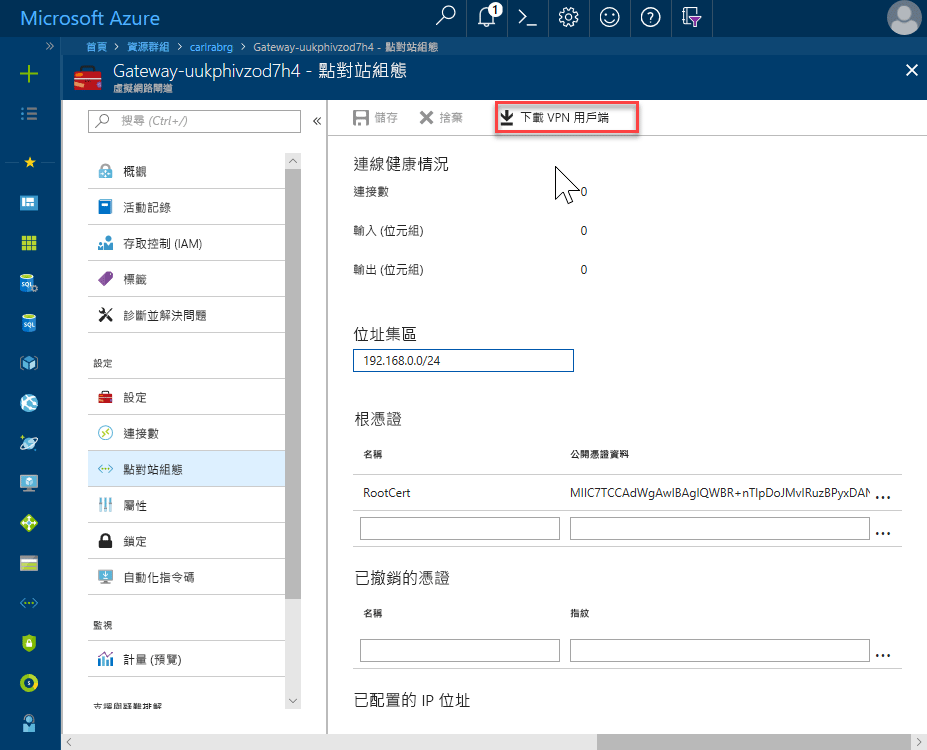
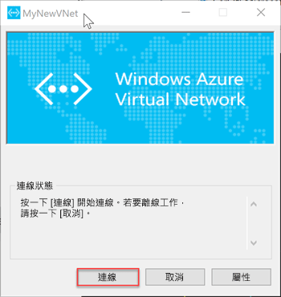

# <a name="quickstart-configure-a-point-to-site-connection-to-an-azure-sql-database-managed-instance-from-on-premises"></a>快速入門：設定從內部部署連線至 Azure SQL Database 受控執行個體的點對站連線

此快速入門示範如何使用 [SQL Server Management Studio](https://docs.microsoft.com/sql/ssms/sql-server-management-studio-ssms) (SSMS)，利用點對站連線從內部部署用戶端電腦連線到 Azure SQL Database 受控執行個體。 如需點對站連線的詳細資訊，請參閱[關於點對站 VPN](../vpn-gateway/point-to-site-about.md)

## <a name="prerequisites"></a>必要條件

此快速入門：

- 使用在[建立受控執行個體](sql-database-managed-instance-get-started.md)中建立的資源作為起點。
- 本地客户端计算机需要 PowerShell 5.1 和 AZ PowerShell 1.4.0 或更高版本。 如有需要，請參閱[安裝 Azure PowerShell 模組](https://docs.microsoft.com/powershell/azure/install-az-ps#install-the-azure-powershell-module)的指示。
- 您的內部部署用戶端電腦上需要最新版 [SQL Server Management Studio](https://docs.microsoft.com/sql/ssms/sql-server-management-studio-ssms) (SSMS)。

## <a name="attach-a-vpn-gateway-to-your-managed-instance-virtual-network"></a>將 VPN 閘道連結到您的受控執行個體虛擬網路

1. 在本地客户端计算机上打开 PowerShell。

2. 複製此 PowerShell 指令碼。 此指令碼會將 VPN 閘道連結到您在[建立受控執行個體](sql-database-managed-instance-get-started.md)快速入門中所建立的受控執行個體虛擬網路。 此指令碼會執行下列動作︰

   - 在用戶端電腦上建立並安裝憑證
   - 計算未來的 VPN 閘道子網路 IP 範圍
   - 建立 GatewaySubnet
   - 部署 Azure Resource Manager 範本，該範本會將 VPN 閘道連結到 VPN 子網路

     ```powershell
     $scriptUrlBase = 'https://raw.githubusercontent.com/Microsoft/sql-server-samples/master/samples/manage/azure-sql-db-managed-instance/attach-vpn-gateway'

     $parameters = @{
       subscriptionId = '<subscriptionId>'
       resourceGroupName = '<resourceGroupName>'
       virtualNetworkName = '<virtualNetworkName>'
       certificateNamePrefix  = '<certificateNamePrefix>'
       }

     Invoke-Command -ScriptBlock ([Scriptblock]::Create((iwr ($scriptUrlBase+'/attachVPNGatewayAz.ps1?t='+ [DateTime]::Now.Ticks)).Content)) -ArgumentList $parameters, $scriptUrlBase
     ```

     > [!IMPORTANT]
     > 若要使用 Azure PowerShell 资源管理器模块而不是 Az 模块，请使用 `attachVPNGateway.ps1` cmdlet 而不是 `attachVPNGatewayAz.ps1` cmdlet。

3. 在 PowerShell 視窗中貼上指令碼，並提供必要的參數。 `<subscriptionId>`、`<resourceGroup>` 和 `<virtualNetworkName>` 的值應符合在[建立受控執行個體](sql-database-managed-instance-get-started.md)快速入門中所用的值。 `<certificateNamePrefix>` 的值可以是您自己選擇的字串。

4. 執行 PowerShell 指令碼。

> [!IMPORTANT]
> 在 PowerShell 脚本完成前，请勿继续操作。

## <a name="create-a-vpn-connection-to-your-managed-instance"></a>建立受控執行個體的 VPN 連線

1. 登入 [Azure 入口網站](https://portal.azure.com/)。
2. 開啟您在虛擬網路閘道中所建立的資源群組，然後開啟虛擬網路閘道資源。
3. 選取 [點對站設定]，然後選取 [下載 VPN 用戶端]。

      
4. 在本地客户端计算机上，从 zip 文件中提取文件，然后打开包含已提取文件的文件夹。
5. 打开 **WindowsAmd64** 文件夹，然后打开 **VpnClientSetupAmd64.exe** 文件。
6. 如果您收到 [Windows 已保護您的電腦] 訊息，請按一下 [其他資訊]，然後按一下 [仍要執行]。

    \
7. 在“用户帐户控制”对话框中单击“是”，继续下一步。
8. 在引用虚拟网络的对话框中选择“是”，为虚拟网络安装 VPN 客户端。

## <a name="connect-to-the-vpn-connection"></a>連線到 VPN 連線

1. 在本地客户端计算机上的“网络和 Internet”中转到“VPN”，选择“托管实例”虚拟网络，以便建立到此 VNet 的连接。 在下圖中，VNet 的名稱為 **MyNewVNet**。

      
2. 選取 [ **連接**]。
3. 在對話方塊中，選取 [連線]。

      
4. 出現連線管理員需要提高的權限以更新路由表的提示時，請選擇 [繼續]。
5. 在 [使用者帳戶控制] 對話方塊中，按選取 [是] 以繼續。

   您已建立對受控執行個體 VNet 的 VPN 連線。

      

## <a name="use-ssms-to-connect-to-the-managed-instance"></a>使用 SSMS 連線到受控執行個體

1. 在內部部署用戶端電腦上，開啟 SQL Server Management Studio (SSMS)。
2. 在 [連接到伺服器] 對話方塊方塊中，於 [伺服器名稱] 方塊中輸入受控執行個體的完整 [主機名稱]。
3. 選取 [SQL Server 驗證]，提供您的使用者名稱和密碼，然後選取 [連線]。

      

連線之後，您可以檢視 [資料庫] 節點中的系統和使用者資料庫。 您也可以檢視 [安全性]、[伺服器物件]、[複寫]、[管理]、[SQL Server 代理程式] 和 [XEvent Profiler] 節點中的各種物件。

## <a name="next-steps"></a>後續步驟

- 如需如何從 Azure 虛擬機器連線的快速入門，請參閱[設定點對站連線](sql-database-managed-instance-configure-p2s.md)。
- 如需有關應用程式連線選項的概觀，請參閱[將您的應用程式連線至受控執行個體](sql-database-managed-instance-connect-app.md)。
- 若要將現有 SQL Server 資料庫從內部部署還原到受控執行個體，您可以使用 [Azure 資料庫移轉服務 (DMS) 來進行移轉](../dms/tutorial-sql-server-to-managed-instance.md)，或使用 [T-SQL RESTORE 命令](sql-database-managed-instance-get-started-restore.md)從資料庫備份檔案還原。
