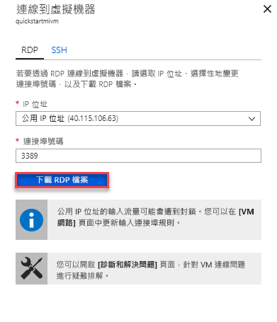

# 設定 Azure VM 以連線到 Azure SQL Database 受控執行個體

此快速入門示範如何設定 Azure 虛擬機器以使用 SQL Server Management Studio (SSMS) 連線到 Azure SQL Database 受控執行個體。 如需如何使用點對站連線從內部部署用戶端電腦進行連線的快速入門，請參閱[設定點對站連線](sql-database-managed-instance-configure-p2s.md) 

## 必要條件

此快速入門可作為在下列快速入門中所建立之資源的起點︰[建立受控執行個體](sql-database-managed-instance-get-started.md)。

## 登入 Azure 入口網站

登入 [Azure 入口網站](https://portal.azure.com/)。

## 在受控執行個體 VNet 中建立新的子網路

下列步驟可在受控執行個體 VNet 中建立新的子網路，以便 Azure 虛擬機器可以連線到受控執行個體。 受控執行個體子網路專門供受控執行個體使用，您無法在該子網路中建立任何其他資源 (例如 Azure 虛擬機器)。 

1. 開啟您在[建立受控執行個體](sql-database-managed-instance-get-started.md)快速入門中建立之受控執行個體的資源群組，並按一下受控執行個體的虛擬網路，然後按一下 [子網路]。

   

2. 按一下 [子網路] 旁的 **+** 符號以建立新的子網路。

   

3. 使用下表中的資訊，填妥表單中所要求的資訊：

   | 設定| 建議的值 | 說明 |
   | ---------------- | ----------------- | ----------- | 
   | **名稱** | 任何有效名稱|如需有效的名稱，請參閱[命名規則和限制](https://docs.microsoft.com/azure/architecture/best-practices/naming-conventions)。|
   | **位址範圍 (CIDR 區塊)** | 有效範圍 | 針對此快速入門，使用預設值即可。|
   | **網路安全性群組** | 無 | 針對此快速入門，使用預設值即可。|
   | **路由表** | 無 | 針對此快速入門，使用預設值即可。|
   | **服務端點 ** | 已選取 0 | 針對此快速入門，使用預設值即可。|
   | **子網路委派** | 無 | 針對此快速入門，使用預設值即可。|
 
   

4. 按一下 [確定] 以在受控執行個體 VNet 中建立這個額外的子網路。

## 在 VNet 的新子網路中建立虛擬機器

下列步驟顯示如何在建立受控執行個體的相同 VNet 中建立虛擬機器。 

## 準備 Azure 虛擬機器

由於 SQL 受控執行個體是放置在您的私人虛擬網路中，因此您必須使用已安裝的 SQL 用戶端工具 (例如 SQL Server Management Studio 或 Azure Data Studio) 建立 Azure VM，以連線到受控執行個體並執行查詢。 此快速入門使用 SQL Server Management Studio。

要使用所有的必要工具建立用戶端虛擬機器，最簡單的方式是使用 Azure Resource Manager 範本。

1. 按一下下列按鈕以建立用戶端虛擬機器，並安裝 SQL Server Management Studio (確定您已在另一個瀏覽器索引標籤中登入 Azure 入口網站)：

    

2. 使用下表中的資訊，填妥表單中所要求的資訊：

   | 設定| 建議的值 | 說明 |
   | ---------------- | ----------------- | ----------- |
   | **訂用帳戶** | 有效的訂用帳戶 | 必須是您有權限在其中建立新資源的訂用帳戶 |
   | **資源群組** |您在[建立受控執行個體](sql-database-managed-instance-get-started.md)快速入門中指定的資源群組。|這必須是 VNet 所在的資源群組。|
   | **位置** | 資源群組的位置 | 將根據選取的資源群組填入此值 | 
   | **虛擬機器名稱**  | 任何有效名稱 | 如需有效的名稱，請參閱[命名規則和限制](https://docs.microsoft.com/azure/architecture/best-practices/naming-conventions)。|
   |**系統管理員使用者名稱**|任何有效的使用者名稱|如需有效的名稱，請參閱[命名規則和限制](https://docs.microsoft.com/azure/architecture/best-practices/naming-conventions)。 請勿使用 "serveradmin"，因為這是保留的伺服器層級角色。| 
   |**密碼**|任何有效密碼|密碼長度至少必須有 12 個字元，而且符合[定義的複雜度需求](../virtual-machines/windows/faq.md#what-are-the-password-requirements-when-creating-a-vm)。|
   | **虛擬機器大小** | 任何有效大小 | 針對此快速入門，使用此範本中的預設值 **Standard_B2s 就已足夠。 |
   | **位置**|[resourceGroup().location]。| 請勿變更此值 |
   | **虛擬網路名稱**|您先前選取的位置|如需區域的相關資訊，請參閱 [Azure 區域](https://azure.microsoft.com/regions/)。|
   | **子網路名稱**|您在上一個程序中建立的子網路名稱| 請勿選擇您在其中建立受控執行個體的子網路|
   | **構件位置** | [deployment().properties.templateLink.uri]  請勿變更此值 |
   | **構件位置 SAS 權杖** | 保留空白 | 請勿變更此值 |

   

   如果您使用[建立受控執行個體](sql-database-managed-instance-get-started.md)中建議的 VNet 名稱與預設子網路，則不需要變更最後兩個參數。 否則，您應該將這些值變更為您在設定網路環境時輸入的值。

3. 選取 [我同意上方所述的條款及條件] 核取方塊。
4. 按一下 [購買] 以在您的網路中部署 Azure VM。
5. 按一下 [通知] 圖示以檢視部署的狀態。
   
   建立 Azure 虛擬機器之前，請勿繼續。 

## 連線至虛擬機器

下列步驟顯示如何使用遠端桌面連線來連線到新建立的虛擬機器。

1. 部署完成之後，請移至虛擬機器資源。

      

2. 按一下 [連線]。 
   
   將顯示遠端桌面通訊協定檔案 (.rdp 檔案) 表單，其中包含虛擬機器的公用 IP 位址與連接埠號碼。 

     

3. 按一下 [下載 RDP 檔案]。
 
   > [!NOTE]
   > 您也可以使用 SSH 來連線到您的 VM。

4. 關閉**連線至虛擬機器**表單。
5. 若要連線至您的 VM，請開啟下載的 RDP 檔案。 
6. 出現提示時，按一下 [連線]。 在 Mac 上，您需要 RDP 用戶端，例如來自 Mac App Store 的[遠端桌面用戶端](https://itunes.apple.com/us/app/microsoft-remote-desktop/id715768417?mt=12)。

6. 輸入在建立虛擬機器時指定的使用者名稱和密碼，然後按一下 [確定]。

7. 您可能會在登入過程中收到憑證警告。 按一下 [是] 或 [繼續] 以繼續進行連線。

您已連線到 [伺服器管理員] 儀表板中的虛擬機器。

## 使用 SSMS 連線到受控執行個體

1. 在虛擬機器中，開啟 SQL Server Management Studio (SSMS)。
 
   由於這是第一次啟動 SSMS，因此需要一些時間才能完成其設定。
2. 在 [連線到伺服器] 對話方塊中，於 [伺服器名稱] 方塊中輸入您受控執行個體的完整 [主機名稱]，選取 [SQL Server 驗證] 並提供您的登入和密碼，然後按一下 [連線]。

      

連線之後，您可以檢視 [資料庫] 節點中的系統和使用者資料庫，以及 [安全性]、[伺服器物件]、[複寫]、[管理]、[SQL Server 代理程式] 和 [XEvent Profiler] 節點中的各種物件。

## 後續步驟

- 如需如何使用點對站連線從內部部署用戶端電腦進行連線的快速入門，請參閱[設定點對站連線](sql-database-managed-instance-configure-p2s.md)。
- 如需應用程式連線選項的概觀，請參閱[將您的應用程式連線至受控執行個體](sql-database-managed-instance-connect-app.md)。
- 若要將現有 SQL Server 資料庫從內部部署還原到受控執行個體，您可以使用 [Azure 資料庫移轉服務 (DMS) 來進行移轉](../dms/tutorial-sql-server-to-managed-instance.md)以從資料庫備份檔案還原，或使用 [T-SQL RESTORE 命令](sql-database-managed-instance-get-started-restore.md)以從資料庫備份檔案還原。
