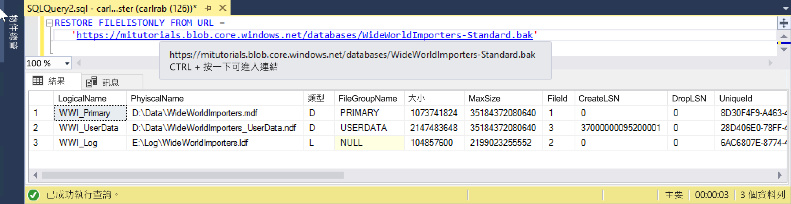

# <a name="restore-a-database-backup-to-an-azure-sql-database-managed-instance"></a>將資料庫備份還原至 Azure SQL Database 受控執行個體

本快速入門將示範如何使用 Wide World Importers - 標準備份檔案，將 Azure Blob 儲存體中儲存的資料庫備份還原至受控執行個體。 此方法需要一些停機時間。 

> [!VIDEO https://www.youtube.com/embed/RxWYojo_Y3Q]

如需使用 Azure 資料庫移轉服務 (DMS) 進行移轉的教學課程，請參閱[使用 DMS 的受控執行個體移轉](../dms/tutorial-sql-server-to-managed-instance.md)。 如需各種移轉方法的討論，請參閱[將 SQL Server 移轉至 Azure SQL Database 受控執行個體](sql-database-managed-instance-migrate.md)。

## <a name="prerequisites"></a>必要條件

此快速入門：
- 使用[建立受控執行個體](sql-database-managed-instance-get-started.md)這個快速入門中所建立的資源作為起點。
- 您的內部部署用戶端電腦上需要最新版 [SQL Server Management Studio](https://docs.microsoft.com/sql/ssms/sql-server-management-studio-ssms)
- 使用 SQL Server Management Studio 要求連線到您的受控執行個體。 請參閱這些連線選項的快速入門：
  - [從 Azure VM 連線到 Azure SQL Database 受控執行個體](sql-database-managed-instance-configure-vm.md)
  - [使用點對站連線從內部部署連線到 Azure SQL Database 受控執行個體](sql-database-managed-instance-configure-p2s.md)。
- 使用包含 Wide World Importers 且預先設定的 Azure Blob 儲存體帳戶 - 標準備份檔案 (從 https://github.com/Microsoft/sql-server-samples/releases/download/wide-world-importers-v1.0/WideWorldImporters-Standard.bak) 下載)。

> [!NOTE]
> 如需有關使用 Azure Blob 儲存體和共用存取簽章 (SAS) 來備份和還原 SQL Server 資料庫的詳細資訊，請參閱 [SQL Server 備份到 URL](sql-database-managed-instance-get-started-restore.md)。

## <a name="restore-the-wide-world-importers-database-from-a-backup-file"></a>從備份檔案還原 Wide World Importers 資料庫

透過 SSMS，使用下列步驟將 Wide World Importers 資料庫從備份檔案還原到您的受控執行個體。

1. 開啟 SQL Server Management Studio (SSMS) 並連線到您的受控執行個體。
2. 在 SSMS 中，開啟新的查詢視窗。
3. 使用下列指令碼和預先設定的儲存體帳戶與 SAS 金鑰，在受控執行個體中建立認證。

   ```sql
   CREATE CREDENTIAL [https://mitutorials.blob.core.windows.net/databases] 
   WITH IDENTITY = 'SHARED ACCESS SIGNATURE'
   , SECRET = 'sv=2017-11-09&ss=bfqt&srt=sco&sp=rwdlacup&se=2028-09-06T02:52:55Z&st=2018-09-04T18:52:55Z&spr=https&sig=WOTiM%2FS4GVF%2FEEs9DGQR9Im0W%2BwndxW2CQ7%2B5fHd7Is%3D' 
   ```

    

    > [!NOTE]
    > 一律從產生的 SAS 金鑰中移除置於開頭的 **?** 。
  
3. 使用下列指令碼來檢查 SAS 認證和備份有效性 - 提供含有備份檔案的容器 URL：

   ```sql
   RESTORE FILELISTONLY FROM URL = 
      'https://mitutorials.blob.core.windows.net/databases/WideWorldImporters-Standard.bak'
   ```

    

4. 使用下列指令碼從備份檔案還原 Wide World Importers 資料庫 - 提供含有備份檔案容器的 URL：

   ```sql
   RESTORE DATABASE [Wide World Importers] FROM URL =
     'https://mitutorials.blob.core.windows.net/databases/WideWorldImporters-Standard.bak'
   ```

    

5. 若要追蹤還原的狀態，請在新的查詢工作階段中執行下列查詢：

   ```sql
   SELECT session_id as SPID, command, a.text AS Query, start_time, percent_complete
      , dateadd(second,estimated_completion_time/1000, getdate()) as estimated_completion_time 
   FROM sys.dm_exec_requests r 
   CROSS APPLY sys.dm_exec_sql_text(r.sql_handle) a 
   WHERE r.command in ('BACKUP DATABASE','RESTORE DATABASE')`
   ```

6. 當還原完成時，請在 [物件總管] 加以檢視。 

## <a name="next-steps"></a>後續步驟

- 若要對備份至 URL 進行移難排解，請參閱 [SQL Server 備份至 URL 的最佳做法和疑難排解](https://docs.microsoft.com/sql/relational-databases/backup-restore/sql-server-backup-to-url-best-practices-and-troubleshooting)。
- 如需有關應用程式連線選項的概觀，請參閱[將您的應用程式連線至受控執行個體](sql-database-managed-instance-connect-app.md)。
- 若要使用任何一個慣用工具或語言進行查詢，請參閱[連線和查詢](sql-database-connect-query.md)。
