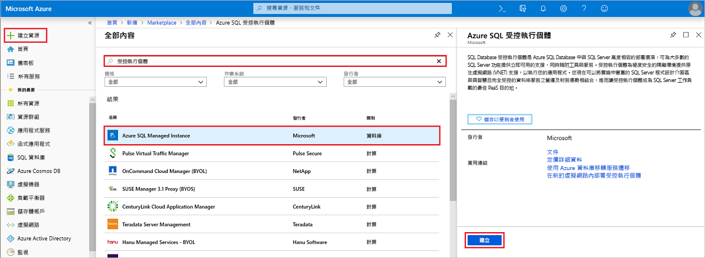
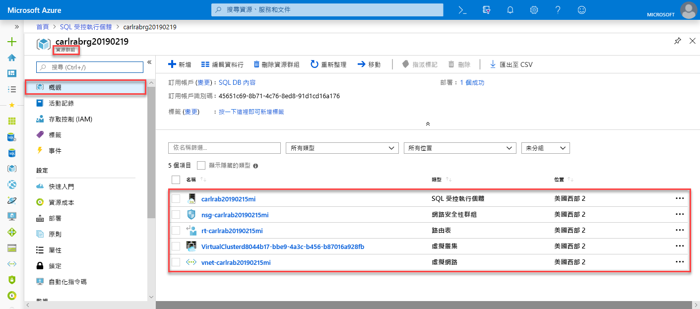
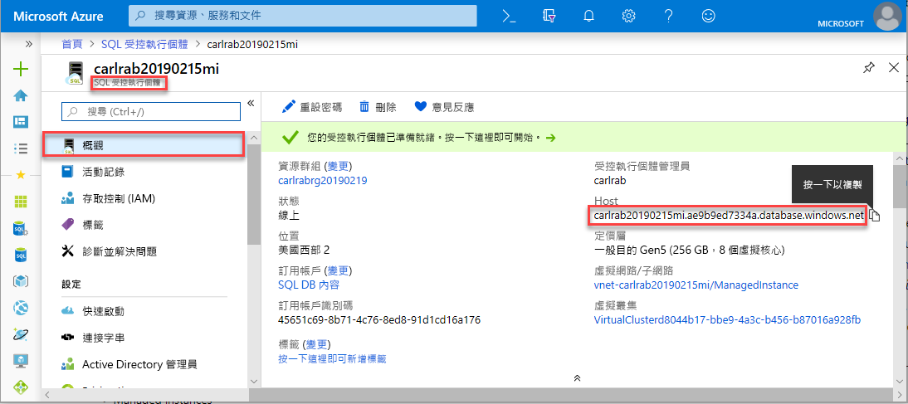

# 建立 Azure SQL Database 受控執行個體

本快速入門逐步解說如何在 Azure 入口網站中建立 Azure SQL Database [受控執行個體](sql-database-managed-instance.md)。 

如果您沒有 Azure 訂用帳戶，請在開始前建立[免費帳戶](https://azure.microsoft.com/free/)。

## 登入 Azure 入口網站

登入 [Azure 入口網站](https://portal.azure.com/)。

## 建立受控執行個體

下列步驟說明如何建立受控執行個體。

1. 按一下 Azure 入口網站左上角的 [建立資源]。
2. 找出 [受控執行個體]，然後選取 [Azure SQL 受控執行個體]。
3. 按一下頁面底部的 [新增] 。

   

4. 使用下表中的資訊，填妥受控執行個體表單中所要求的資訊：

   | 設定| 建議的值 | 說明 |
   | ------ | --------------- | ----------- |
   | **訂用帳戶** | 您的訂用帳戶 | 您有權限在其中建立新資源的訂用帳戶 |
   |**受控執行個體名稱**|任何有效名稱|如需有效的名稱，請參閱[命名規則和限制](https://docs.microsoft.com/azure/architecture/best-practices/naming-conventions)。|
   |**受控執行個體系統管理員登入**|任何有效的使用者名稱|如需有效的名稱，請參閱[命名規則和限制](https://docs.microsoft.com/azure/architecture/best-practices/naming-conventions)。 請勿使用 "serveradmin"，因為這是保留的伺服器層級角色。| 
   |**密碼**|任何有效密碼|密碼長度至少必須有 16 個字元，而且符合[定義的複雜度需求](../virtual-machines/windows/faq.md#what-are-the-password-requirements-when-creating-a-vm)。|
   |**資源群組**|新的或現有的資源群組|如需有效的資源群組名稱，請參閱[命名規則和限制](https://docs.microsoft.com/azure/architecture/best-practices/naming-conventions)。|
   |**位置**|要在其中建立受控執行個體的位置|如需區域的相關資訊，請參閱 [Azure 區域](https://azure.microsoft.com/regions/)。|
   |**虛擬網路**|選取 [建立新的虛擬網路] 或您先前在此表單中所提供、先前於資源群組中建立的虛擬網路| 若要使用自訂設定來設定受控執行個體的虛擬網路，請參閱 Github 中的[設定 SQL 受控執行個體虛擬網路環境範本](https://github.com/Azure/azure-quickstart-templates/tree/master/101-sql-managed-instance-azure-environment)。 如需關於設定受控執行個體網路環境的需求資訊，請參閱[設定 Azure SQL Database 受控執行個體的 VNet](sql-database-managed-instance-vnet-configuration.md) |

   

5. 按一下 [定價層] 來調整計算和儲存體資源的大小，以及檢閱定價層選項。 預設值為一般用途定價層，其具也 32 GB 記憶體和 16 個虛擬核心。
6. 使用滑桿或文字方塊來指定儲存體數量和虛擬核心數目。 
7. 完成時，按一下 [套用] 以儲存您的選取項目。  
8. 按一下 [建立] 以部署受控執行個體。
9. 按一下 [通知] 圖示以檢視部署的狀態。

    

10. 按一下 [部署正在進行中] 來開啟受控執行個體視窗，以進一步監視部署進度。 

> [!IMPORTANT]
> 如果是子網路中的第一個執行個體，部署時間通常遠超過後續執行個體的部署時間。 請勿取消部署作業，因為它持續的時間超過您的預期。 在子網路中建立第二個受控執行個體只需要幾分鐘的時間。

## 檢閱資源並擷取完整伺服器名稱

順利完成部署後，請檢閱所建立的資源，並擷取完整伺服器名稱以供稍後的快速入門使用。

1. 開啟受控執行個體的資源群組，並檢視其在[建立受控執行個體](sql-database-managed-instance-get-started.md)快速入門中為您所建立的資源。

   在 Azure 入口網站中開啟受控執行個體資源。

2. 按一下受控執行個體。
3. 在 [概觀] 索引標籤上，找出 [主機] 屬性並複製受控執行個體的完整主機位址。

   

   此名稱類似於：**your_machine_name.neu15011648751ff.database.windows.net**。

## 後續步驟

- 若要了解如何連線至受控執行個體，請參閱：
  - 如需有關應用程式連線選項的概觀，請參閱[將您的應用程式連線至受控執行個體](sql-database-managed-instance-connect-app.md)。
  - 如需說明如何從 Azure 虛擬機器連線至受控執行個體的快速入門，請參閱[設定 Azure 虛擬機器連線](sql-database-managed-instance-configure-vm.md)。
  - 如需說明如何使用點對站連線從內部部署用戶端電腦連線至受控執行個體的快速入門，請參閱[設定點對站連線](sql-database-managed-instance-configure-p2s.md)。
- 若要將現有 SQL Server 資料庫從內部部署還原到受控執行個體，您可以使用 [Azure 資料庫移轉服務 (DMS) 來進行移轉](../dms/tutorial-sql-server-to-managed-instance.md)以從資料庫備份檔案還原，或使用 [T-SQL RESTORE 命令](sql-database-managed-instance-get-started-restore.md)以從資料庫備份檔案還原。
